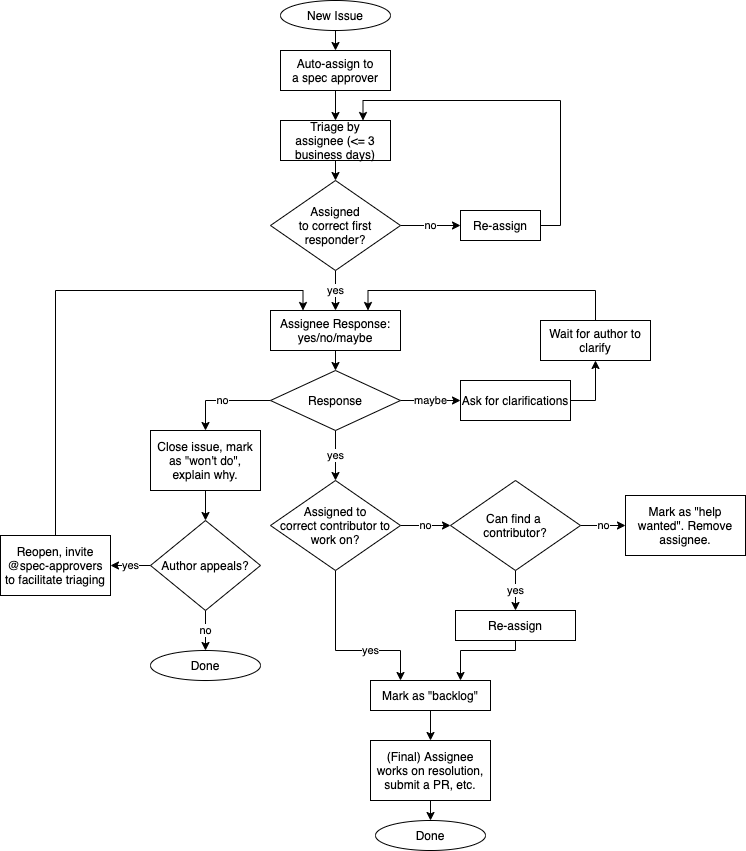

# Contributing

Welcome to OpenTelemetry specifications repository!

Before you start - see OpenTelemetry general
[contributing](https://github.com/open-telemetry/community/blob/main/CONTRIBUTING.md)
requirements and recommendations.

## Sign the CLA

Before you can contribute, you will need to sign the [Contributor License
Agreement](https://identity.linuxfoundation.org/projects/cncf).

## Proposing a change

Significant changes should go through the [OpenTelemetry Enhancement
Proposal](https://github.com/open-telemetry/oteps) process.

Smaller changes can follow a shorter process:

- [Create an issue](https://github.com/open-telemetry/opentelemetry-specification/issues/new/choose)
  in this repo and describe the proposed change.
- Follow the [issue workflow](#issue-triaging) and make sure the issue is accepted with
  a "Yes" response. If the response to the issue is not "Yes" then do not create a PR
  that implements the change since it will be rejected.
- If a Pull Request would be beneficial to illustrate the idea better and to show its effect on the specification, a
  [Draft PR](https://docs.github.com/en/pull-requests/collaborating-with-pull-requests/proposing-changes-to-your-work-with-pull-requests/about-pull-requests#draft-pull-requests)
  may be opened and linked to the issue even before the proposed idea is accepted there.
- Once the issue is accepted the assignee can work on it and create a PR that implements
  the change described in the issue.
- In the PR description, provide links to the prototypes. Depending on the scope
  of the change, prototyping in multiple programming languages might be required
  by the [specification
  approvers](https://github.com/open-telemetry/community/blob/main/community-members.md#specifications-and-proto).

Trivial changes, such as clarifications, wording changes, spelling/grammar
corrections, etc. can be made directly via pull requests and do not require an associated
issue.

Supplementary guidance around a specification should be placed in a [directory alongside
the signal.](https://github.com/open-telemetry/opentelemetry-specification/issues/3587)

## Writing specs

Specification is written in markdown format. Please make sure files are rendered
correctly on GitHub.

Be sure to clearly define the specification requirements using appropriate
keywords as defined in [Notation Conventions and
Compliance](./specification/README.md#notation-conventions-and-compliance),
while making sure to heed the guidance laid out in
[RFC2119](https://tools.ietf.org/html/rfc2119) about the sparing use of
imperatives:

> Imperatives of the type defined in this memo must be used with care
> and sparingly.  In particular, they MUST only be used where it is
> actually required for interoperation or to limit behavior which has
> potential for causing harm (e.g., limiting retransmissions)  For
> example, they must not be used to try to impose a particular method
> on implementors where the method is not required for
> interoperability.

It is important to build a specification that is clear and useful, not
one that is needlessly restrictive and complex.

### Consistency Checks

The Specification has a number of tools it uses to check things like style,
spelling and link validity. Before using the tools:

- Install the latest LTS release of **[Node](https://nodejs.org/)**.
For example, using **[nvm][]** under Linux run:

  ```bash
  nvm install --lts
  ```

- Install tooling packages:

  ```bash
  npm install
  ```

You can perform all checks locally using this command:

```bash
make check
```

Note: This can take a long time as it checks all links. You should use this
prior to submitting a PR to ensure validity.  However, you can run individual
checks directly.

See:

- [MarkdownStyle](#markdown-style)
- [Misspell Check](#misspell-check)
- Markdown link checking (docs TODO)

### Autoformatting

The Specification has some autogenerated components and additionally can do
automatic style/spell correction. You can run all of this via:

```bash
make fix
```

You can also run these fixes individually.

See:

- [Misspell Correction](#misspell-check)
- Table Generation (docs TODO)

### Markdown style

Markdown files should be properly formatted before a pull request is sent out.
In this repository we follow the
[markdownlint rules](https://github.com/DavidAnson/markdownlint#rules--aliases)
with some customizations. See [markdownlint](.markdownlint.yaml) or
[settings](.vscode/settings.json) for details.

We highly encourage to use line breaks in markdown files at `80` characters
wide. There are tools that can do it for you effectively. Please submit proposal
to include your editor settings required to enable this behavior so the out of
the box settings for this repository will be consistent.

To check for style violations, run:

```bash
make markdownlint
```

To fix style violations, follow the
[instruction](https://github.com/DavidAnson/markdownlint#optionsresultversion)
with the Node version of markdownlint. If you are using Visual Studio Code,
you can also use the `fixAll` command of the
[vscode markdownlint extension](https://github.com/DavidAnson/vscode-markdownlint).

### Misspell check

In addition, please make sure to clean up typos before you submit the change.

To check for typos, run the following command:

```bash
make misspell
```

> **NOTE**: The `misspell` make target will also fetch and build the tool if
> necessary. You'll need [Go](https://go.dev) to build the spellchecker.

To quickly fix typos, use

```bash
make misspell-correction
```

## Issue Triaging

The following diagram shows the initial triaging of new issues.



- Newly created issues are automatically assigned to a spec approver
  (round-robin). The assignee has 3 business days for the first response.
- The assignee checks if they are the right person to handle the first response
  and if not re-assigns to a more appropriate person (typically based on the
  [areas of interest](https://github.com/open-telemetry/community/blob/main/areas-of-interest.md)).
- The assignee makes a decision about the first response. It should be one of
  the 3 responses:
  - Yes, this is a good issue and we want to work on it.
  - Maybe, this issue needs to be clarified and/or others have to be pulled in
    before we can make a decision. More information may be requested from the
    issue author or others.
  - No, this issue should not be accepted. This can happen when the issue is a
    duplicate, was discussed and rejected in the past, is out of the project
    scope, etc. The assignee labels the issue "won't do", closes it and provides
    the reason for closing. The issue author has the choice to appeal the
    decision, in which case the issue is reopened and the assignee asks other
    spec approvers to help triage and facilitate the discussion.
  - As a result of triaging one of the 3 labels must be applied to the issue:
    `triaged-accepted`, `triaged-needmoreinfo`, `triaged-rejected`. Absence
    of the label indicates that the issue still needs the first response.
- If the first response is Yes, the assignee decides if they are the right
  person to work on the issue long-term. If not, they will look for another
  contributor who can work on the issue and re-assign to them, label the issue
  as "backlog". If no-one is available to work on the issue the issue is labeled
  as "help wanted" and unassigned.
- Any other spec approver can take over the issue before the original assignee's
  first response if they prefer to drive it themselves. In this case the other
  spec approver must re-assign the issue to themselves, if necessary first
  ensuring that no-one else is already working on the issue.

## Pull Requests

### How to create a PR

Everyone is welcome to contribute to the OpenTelemetry specification via GitHub
pull requests (PRs).

To [create a new
PR](https://docs.github.com/en/github/collaborating-with-issues-and-pull-requests/creating-a-pull-request),
fork the project in GitHub and clone the upstream repo:

```sh
git clone https://github.com/open-telemetry/opentelemetry-specification.git
```

Add your fork as a remote:

```sh
git remote add fork https://github.com/YOUR_GITHUB_USERNAME/opentelemetry-specification.git
```

Check out a new branch, make modifications and push the branch to your fork:

```sh
$ git checkout -b feature
# edit files
$ git commit
$ git push fork feature
```

Open a pull request against the main `opentelemetry-specification` repo.

If the PR is not ready for review, please mark it as
[`draft`](https://github.blog/2019-02-14-introducing-draft-pull-requests/).

For non-trivial changes, please update the [CHANGELOG](./CHANGELOG.md).

Please make sure CLA is signed and CI is clear. We don't expect people to review
and comment on a PR that doesn't have CLA signed.

### How to get your PR merged

A PR is considered to be **ready to merge** when:

* It has received more than two approvals from the [code
  owners](./.github/CODEOWNERS) (if approvals are from only one company, they
  won't count).
* There is no `request changes` from the [code owners](./.github/CODEOWNERS).
* It has been at least two working days since the last modification (except for
  the trivial updates, such like typo, cosmetic, rebase, etc.). This gives
  people reasonable time to review.
* Trivial changes (typos, cosmetic changes, CI improvements, etc.) don't have to
  wait for two days.

Any [spec
maintainer](https://github.com/open-telemetry/community/blob/main/community-members.md#specifications-and-proto) can
merge the PR once it is **ready to merge**.

If a PR has been stuck (e.g. there are lots of debates and people couldn't agree
on each other), the owner should try to get people aligned by:

* Consolidating the perspectives and putting a summary in the PR. It is
  recommended to add a link into the PR description, which points to a comment
  with a summary in the PR conversation.
* Tagging subdomain experts (by looking at the change history) in the PR asking
  for suggestion.
* Reaching out to more people on the [CNCF OpenTelemetry Slack channel](https://cloud-native.slack.com/archives/C01N7PP1THC). If you are new, you can create a CNCF Slack account [here](http://slack.cncf.io/).
* Stepping back to see if it makes sense to narrow down the scope of the PR or
  split it up.

If none of the above worked and the PR has been stuck for more than 2 weeks, the
owner should bring it to the [OpenTelemetry Specification SIG
meeting](https://github.com/open-telemetry/community#cross-language-specification).

[nvm]: https://github.com/nvm-sh/nvm/blob/master/README.md#installing-and-updating

## Releasing

Release Procedure:

1. Prepare a [draft release here](https://github.com/open-telemetry/opentelemetry-specification/releases).
   Don't publish it yet.
2. Create a PR with updated [CHANGELOG.md](CHANGELOG.md). The CHANGELOG.md must have a
   heading with the new version number. Ensure that no CHANGELOG entries are missing or
   ended up in the wrong section (e.g., in the last released version rather than Unreleased).
   The PR will fail the `schemas-check` Github action (all other actions must pass).
   This is expected and will be fixed in the next steps. Have this PR reviewed and approved
   and ready to be merged. While it is being reviewed you can work on step 3-4 in parallel.
3. Prepare the schema file for the upcoming release. The schema file should be placed
   in the `schemas` directory. If no changes to semantic conventions happened
   since the last release which require a corresponding section in the schema file then
   simply copy the previous schema file, rename it to the new version and add a section
   with the new version number to the file. See for example the schema file for [1.9.0](
   https://github.com/open-telemetry/opentelemetry-specification/blob/main/schemas/1.9.0)
   that has no changes from 1.8.0.
   The schema file may already exist if there were changes done to semantic conventions
   and the schema file was created with corresponding changes.
4. Create and merge the PR with the new schema file. Note the commit hash after merging.
   If the schema file for the new release version previously existed then no new PR is
   necessary, just note that latest commit hash of this repository.
5. Once CHANGELOG.md PR is approved and ready to be merged we are ready to make the release.
   Update the [opentelemetry.io](https://github.com/open-telemetry/opentelemetry.io)
   repository: the [opentelemetry-specification](
   https://github.com/open-telemetry/opentelemetry.io/tree/main/content-modules)
   submodule points to this repository. Create a PR and update the submodule to point to
   the commit hash from step 4. Merge this PR. This should update the
   [https://opentelemetry.io/](https://opentelemetry.io/) website and the new schema file
   should be downloadable at `https://opentelemetry.io/schemas/<version>`.
6. Re-trigger the `schema-checks` Github action on the PR that updates the CHANGELOG.md.
   The action should pass now. Merge the PR.
7. Add the changelog entries from `CHANGELOG.md` to the description of the previously
   created [draft release here](
   https://github.com/open-telemetry/opentelemetry-specification/releases) and publish it.
