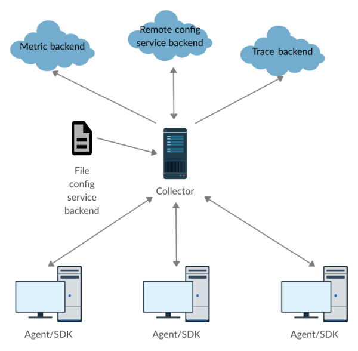

# Metric Configuration Service

- [Metric Configuration Service](#metric-configuration-service)
  * [Overview](#overview)
  * [Service Protocol](#service-protocol)
    + [Metric Config Request](#metric-config-request)
    + [Metric Config Response](#metric-config-response)
      - [Schedules](#schedules)
      - [Fingerprint](#fingerprint)
      - [Wait Time](#wait-time)
    + [Push vs Pull Metric Model](#push-vs-pull-metric-model)
  * [Implementation Details](#implementation-details)
    + [Collection Periods](#collection-periods)
    + [Go SDK](#go-sdk)
    + [Collector Extension](#collector-extension)
      - [Local File](#local-file)
        * [Matching Behavior](#matching-behavior)
        * [Fingerprint Hashing](#fingerprint-hashing)
      - [Remote Backend](#remote-backend)

<small><i><a href='http://ecotrust-canada.github.io/markdown-toc/'>Table of contents generated with markdown-toc</a></i></small>

## Overview

The OpenTelemetry Metric Configuration Service adds the ability to dynamically
and remotely configure metric collection schedules. A user may specify
collection periods at runtime, and propagate these changes to instrumented
applications without interrupting their execution. Furthermore, collection
periods are keyed on a per-metric basis: different metrics within the same
application may have different collection periods.

The configuration data itself is communicated from a configuration service
backend. This setup opens the possibility for third-party integrations. If a
third-party metric provider has an existing metric configuration service (or
would like to implement one in the future), and if it communicates using this
protocol, it may speak directly with our instrumented applications.

## Service Protocol

Configuration data is communicated between an SDK and a backend (either directly
or indirectly through a Collector) using the following protocol specification.
The SDK is assumed to be the client, and makes the metric config requests. The
configuration backend is therefore the server, and serves the metric config
responses. For more details on this arrangement, see
[below](#push-vs-pull-metric-model).

### Metric Config Request

A request consists of two fields: `resource` and an optional
`last_known_fingerprint`.

`resource` is an OpenTelemetry
[Resource](../../specification/overview.md#resources)
that describes a source of telemetry data. All requests SHOULD have a nonempty
`resource` field.

`last_known_fingerprint` is a sequence of bytes that correspond to the last set
of schedules received. It is intended primarily as an optimization. When
receiving a new set of schedules, the SDK and backend may simply compare the
fingerprint of the new schedules and the `last_known_fingerprint`, reducing the
overhead required to manually check differences in schedules upon every request.
A request MAY have a `last_known_fingerprint`, but its use is entirely optional.
If unspecified, the configuration backend will send the full schedules with each
request.

### Metric Config Response

A response consists of three fields `schedules`, `fingerprint`, and
`suggested_wait_time_sec`.

#### Schedules

`schedules` is a list of metric schedules. Each schedule consists of three
components: `exclusion_patterns`, `inclusion_patterns`, and `period_sec`.

The exclusion and inclusion patterns are rules that match a set of metrics. A
pattern itself is a string that either equals a metric name exactly, or equals
its prefix. `exclusion_patterns` and `inclusion_patterns` consist of one or more
such patterns. A metric whose name matches an inclusion pattern is targeted by
the schedule. A metric whose name matches an exclusion pattern is not targeted
by the schedule, even if it matches an inclusion pattern. In this sense,
`exclusion_patterns` has higher precedence over `inclusion_patterns`.

`period_sec` describes the period with which the metric should be collected (in
seconds). For optimization purposes, all schedules in the response SHOULD have
periods that are divisible by the smallest period (see
[below](#collection-periods)). A period of 0 means that the metric should not be
collected

#### Fingerprint

`fingerprint` is a sequence of bytes that corresponds to the set of schedules
being sent. There are two requirements on computing fingerprints:

1. Different schedules MUST map to different fingerprints
2. A fingerprint must be deterministically determined by the configurations

A response MAY have a `fingerprint`, but its use is entirely optional. If
unspecified, the SDK will apply the full schedules. If the current fingerprint
is the same as the response’s `last_known_fingerprint`, then all other fields in
the response are optional.

#### Wait Time

`suggested_wait_time_sec` is a duration (in seconds) that the SDK should wait
before sending the next metric config request. A response MAY have a
`suggested_wait_time_sec`, but its use is optional, and the SDK need not obey
it. As the name implies, it is simply a suggestion.

### Push vs Pull Metric Model

Note that the configuration service assumes a “push” model of metric export --
that is, metrics are pushed from the SDK to a receiving backend. The backend
serves incoming requests that contain metric data. This is in contrast to the
“pull” model in backends like Prometheus, in which metrics are pulled from the
SDK into a client backend. Here, the SDK serves incoming requests for metrics.

Naturally, a pull-based backend may decide the frequency with which it wants
metrics, and the need for our configuration service is less relevant. We
therefore assume that all systems using the configuration service deliver
metrics on a push-based model.

## Implementation Details

Because this specification is in Development, and may imply substantial changes to
the existing system, we provide additional details on the example prototype
implementations available on the
[contrib collector](https://github.com/vmingchen/opentelemetry-collector-contrib) and
[contrib Go SDK](https://github.com/vmingchen/opentelemetry-go-contrib). The
actual implementation in an SDK will likely differ. We offer these details not
as formal specification, but as an example of how this system might look.

### Collection Periods

Though the protocol does not enforce specific collection periods, the SDK MAY
assume that all larger collection periods will be divisible by the smallest
period in a set of schedules, for the sake of optimization. Indeed, it is
recommended that the SDK and all backends use the following periods:

* 1 second
* 5 seconds
* 10 seconds
* 30 seconds
* 1 minute
* 5 minutes
* 10 minutes
* 30 minutes
* 1 hour
* 2 hours
* 4 hours
* 12 hours
* 1 day
* 7 days

However, the SDK MUST still be able to handle periods of any nonzero integer
duration, even if they violate the divisibility suggestion.

### Go SDK

A prototype implementation of metric configuration is available for the Go SDK,
currently hosted on the [contrib repository](https://github.com/vmingchen/opentelemetry-go-contrib). It provides an
alternative push controller component with the ability to configure collection
periods on a per-metric basis. When used in conjunction with the Collector
extension (see below), the controller exports metrics based on configuration
information it receives from the backend.

The per-metric implementation is achieved by using a modified `Accumulator`
implementation. Rather than exporting every metric upon calling `Collect()`, the
new `Accumulator` accepts a rule that determines which metrics should be
collected, and which are ignored. Together with the new push controller, these
components form a complete system implementing dynamically configurable
per-metric scheduling. A user needs only to import our version of the push
controller, in place of OpenTelemetry’s version, to be able to have access to
this feature.

### Collector Extension

An example configuration backend is implemented as an extension for the
Collector, currently hosted on the [contrib repository](https://github.com/vmingchen/opentelemetry-collector-contrib). When this extension is enabled, the Collector
functions as a potential endpoint for Agent/SDKs to retrieve configuration data.
The following schematic illustrates the Collector’s position in the overall
architecture, as well as how the configuration information flows.



Requests from the SDK, represented at the bottom, flow upwards to the Collector,
which functions as our configuration backend. The Collector then references
either a local file or a separate remote backend for configuration data, and
sends it back to the SDK. This process happens in parallel with the metric data
exports.

The configuration data itself may be specified using one of two sources: a local
file or a connection to a remote backend.

#### Local File

Configuration data can be specified in the form of a local file that the
collector monitors. Changes to the file are immediately reflected in the
Collector’s in-memory representation of the data, so there is no need to restart
the Collector upon updating the configurations. An example of a file might look
like:

```yaml
ConfigBlocks:
    - Resource:
        - “pod-name:rainy-day-watcher”
        - “namespace:weather”

      Schedules:
          - InclusionPatterns:
              - StartsWith: "thunder/light/"
            ExclusionPatterns:
              - Equals: "rain/heavy"
              - Equals: "hail/light"
            Period: "MIN_5"

          - InclusionPatterns:
                - Equals: "rain/heavy/night"
            Period: "DAY_7"

    - Resource:
        - "etc:etc"
```

The following rules govern the file-based configurations:

* There MUST be 1 ConfigBlock or more in a ConfigBlocks list
* Each ConfigBlock MAY have a field Resource
* Resource MAY have one or more strings, each a string-representation of an attribute in a resource. If no strings are specified, then this ConfigBlock matches with any request
* Each ConfigBlock MUST have a field Schedules, consisting of one or more Schedule types
* Each Schedule MAY have a field InclusionPatterns and/or a field ExclusionPatterns, consisting of one or more Pattern types
* Each Pattern type MUST be either “StartsWith” or “Equals,” corresponding to the type of matching performed
* Each Schedule MUST have a field Period, corresponding to the collection period of the metrics matched by this Schedule

##### Matching Behavior

An incoming request specifies a resource for which configuration data should be
returned. A ConfigBlock matches a resource if all strings listed under
ConfigBlock::Resource are exactly equal to attributes in the resource. In the
event that multiple ConfigBlocks match a resource, then the schedules from these
ConfigBlocks are concatenated into a single set. Conflicts between these
schedules are resolved by the SDK -- i.e. by taking the shortest period in case
multiple are specified for a single metric.

In this way, a user may specify more generic ConfigBlocks with perhaps fewer
resource attributes, as a means of specifying configs that should apply broadly
across telemetry sources, unless superseded by a more specific ConfigBlock that
asks for a shorter period.

##### Fingerprint Hashing

Fingerprints are generated using an FNVa 64 bit hashing scheme. The hash is
uniquely determined by the contents of a ConfigBlock. The order of patterns and
the order of schedules do not impact the resulting hash.

#### Remote Backend

Alternatively, instead of using a local file, the Collector may use another
configuration service backend. This remote backend could be another Collector,
or it could be a third party that implements the configuration service. In the
future, there are plans to translate arbitrary configuration protocols within
the Collector as part of a formal pipeline, similar to how custom receivers may
read trace and metric data in third party formats. Third party backends may then
communicate directly with this configuration system without first needing to
implement our specific protocol.

When an Agent/SDK requests configuration from the Collector, the Collector in
turn requests configuration from upstream. After receiving the response, the
Collector then ferries this response without modification to the Agent/SDK.

This method may be crude, but functions well for a prototype. Future
implementations may decide to add further sophistication. One potential avenue
may be pinging the upstream configuration service when opportune, and caching
the results for use when the Agent/SDK requires it.
