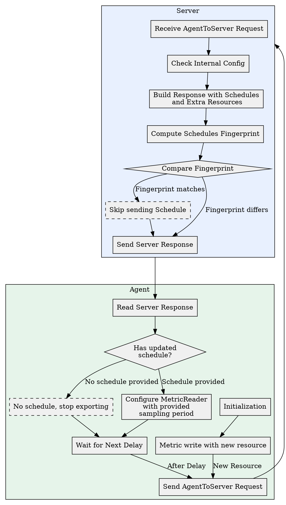

# Enhancing OpenTelemetry for Large-Scale Metric Management

[TOC]

## Summary

This proposal outlines an enhancement to OpenTelemetry's OpAmp control plane to
address the challenges of large-scale metric management in push-based telemetry
systems. It suggests extending OpAmp to include a standardized protocol for
server-driven metric configuration, allowing backends to define sampling periods
and routing instructions based on metric name and resource. This would enable
proactive management of telemetry flow, reducing operational costs and improving
efficiency, similar to capabilities found in pull-based systems like Prometheus,
but without requiring server-side polling and registration. The proposal details
specific protobuf extensions for ScheduleInfoRequest and ScheduleInfoResponse
and describes a state machine for how agents and servers would interact to
implement this dynamic metric scheduling.

## Motivation

The core motivation for this proposal stems from a fundamental principle of
operating at scale: the cheapest RPC is the one that is never sent. Push-based
telemetry systems like OpenTelemetry currently lack a standardized,
server-driven mechanism to manage the volume and frequency of data sent by
clients. Unlike pull-based systems such as Prometheus, which inherently control
data load through client-side polling, push-based architectures risk
overwhelming ingestion systems as deployments grow. Without a way for the
backend to provide instructions on data transmission, we are left reacting to
data floods rather than preventing them proactively.

By extending the OpenTelemetry OpAmp control plane, we can introduce a
standardized protocol for metric configuration. This enhancement would provide a
common, interoperable language for the backend to instruct clients on how to
batch, sample, and transmit telemetry data. While OpAmp's existing custom
capabilities offer a path for vendor-specific solutions, a standardized
mechanism is essential for the broad adoption and interoperability that
OpenTelemetry champions. This new capability would enable proactive,
server-driven management of telemetry flow, leading to significantly improved
efficiency, reduced data ingestion and storage costs, and more resilient
monitoring infrastructure in large-scale environments.

This protocol extension would unlock several powerful use cases for dynamically
managing telemetry data at the source.

*   **Dynamic Sampling and Throttling:** The backend could instruct a client to
    change the collection period for a specific metric on a particular resource.
    For instance, it could reduce the reporting frequency for a stable,
    high-volume metric or increase it during a critical incident investigation.

*   **Intelligent Data Routing:** The protocol could convey dynamic routing
    information, allowing clients to send specific types of telemetry directly
    to the most efficient storage or processing backend. A client could be
    instructed to send high-cardinality metrics to a time-series database
    optimized for that workload, while sending critical health check metrics to
    a high-availability alerting system. This optimizes data write paths and
    improves overall system performance.

Initially, this proposal focuses on metrics, but the framework could easily be
extended to manage other signals like traces and logs in the future.

## Explanation

As an OpenTelemetry user, you now have a more efficient way to manage your
metrics, especially in large-scale systems. The OpAmp control plane has been
enhanced to allow your backend systems to dynamically configure how your
telemetry data is collected.

Here's how it works:

*   **Server-Driven Configuration:** Instead of relying on client-side polling,
    your backend can now define sampling periods and routing instructions for
    your metrics. This means your backend can tell your OpenTelemetry agents
    exactly how often to send specific metric data and where to send it, based
    on the metric name and the resource being monitored.
*   **Reduced Operational Costs:** By proactively managing telemetry flow, you
    can avoid overwhelming your ingestion systems. This leads to reduced
    operational costs and improved efficiency, similar to what's possible with
    pull-based systems like Prometheus, but without the need for client-side
    polling.
*   **Dynamic Metric Scheduling:** The system uses a state machine to manage the
    interaction between your agents and servers. When a new metric with a new
    resource is written, your agent sends a request to the OpAmp server for
    scheduling information. The server then provides the sampling periods and
    other configuration parameters.
*   **Flexible Sampling:** You can have different sampling rates for different
    metrics and resources. For example, critical metrics like RPC status, which
    are used for alerting, can be collected at a high frequency (e.g., every few
    seconds), while less critical metrics like machine addresses can be
    collected much more slowly (e.g., every few hours). This allows you to
    tailor data collection to the specific needs of your systems.
*   **Collector Integration:** If you use an OpenTelemetry collector, it can act
    as a proxy for the original requests, potentially with caching capabilities,
    or even take on the role of an agent or server itself, providing further
    flexibility in your metric management setup.

In essence, this enhancement gives you more granular control over your telemetry
data, allowing you to optimize data collection for performance and cost
efficiency.

## Internal details

In this example, let's assume that we have a new metric reader and exporter:

*   The `ControlledExporter` is an exporter that uses OpAmp to control its
    export, similar to other configurations retrieved from the management
    protocol.
*   The `MultiPeriodicExportingMetricReader` is a reader that pushes metrics
    similarly to the `PeriodicExportingMetricReader`, except it permits multiple
    sampling periods per metric, and accepts a `ControlledExporter` as input.

During initialization, the `ControlledExporter` contacts the OpAmp server,
informing it that it requires the server to provide the sampling periods per
metric and resource, based on its policies. The server will inform if it has
that capability, otherwise either provide a default sampling period or, if not,
the exporter will fall back to a default sampling period.

The `MultiPeriodicExportingMetricReader` will then interface with the
ControlledExporter and, for each new metric, it will request the sampling period
and other configuration parameters from the exporter, which will need to support
an agreed-upon interface to communicate with the reader, an extension of the
regular MetricExporter interface.

### Extensions to OpAmp

For metrics we could extend the current `ScheduleInfoRequest` from
`AgentToServer` in a way that agents could use to request the sampling period
plus metadata like storage keys that would be completely opaque / arbitrary to
them, and that they could use later to optimize data routing and storage,
something like:

```
import "opentelemetry/proto/common/v1/resource.proto";

package opentelemetry.proto.metrics.v1;

message ScheduleInfoRequest {
  // Identifies the entity to read schedules for from its resources.
  opentelemetry.proto.resource.v1.Resource resource = 1;

  // Last known fingerprint of the server response. Optional. If provided,
  // the server MAY drop responses in case the fingerprint is unchanged.
  int64 response_fingerprint = 2 [default = -1];

  // List of metrics the server wants to obtain schedule information. If
  // unset, all metrics matching the resource will be evaluated.
  repeated string metric_name = 3;

  // Last known information mapped from these resources. The server
  // can use this information to avoid sending unnecessary data. Multiple
  // entries imply sending the same request as multiple resources, one
  // for each entry below.
  message Metadata {
    // The most recent list of additional resources to be passed by
    // the agent received from the server. Helps the server deduplicate
    // requests on their side.
    opentelemetry.proto.resource.v1.Resource extra_resource = 1;

    // Last known fingerprint reported by the server. The server
    // MAY avoid sending data if nothing has changed on their side,
    // which is possible.
    fixed64 schedules_fingerprint = 3;
  }

  repeated Metadata metadata = 4;

  // List of custom capabilities implemented by the agent and which the
  // server might be able to provide information about it, similar to
  // the main "custom_capabilities" feature in OpAmp. If unset, the
  // server will not report these back.
  repeated string custom_scheduling_capabilities = 5;
}
```

Then, in the
[ServerToAgent](https://opentelemetry.io/docs/specs/opamp/#servertoagent-message)
message we would add the response message, as follows:

```
import "opentelemetry/proto/common/v1/resource.proto";

message ScheduleInfoResponse {
  // Fingerprint of the response, provided by the server. If the same
  // sent by the request, indicates the server provided the same answer
  // as it has done before, and the client should just ignore this reply,
  // even if it comes with the other fields filled up.
  int64 response_fingerprint = 1 [default = -1];

  // Last known information mapped from these resources. The server
  // can use this information to avoid sending unnecessary data. Multiple
  // entries imply sending the same request as multiple resources, one
  // for each entry below.
  repeated Metadata metadata = 2;

  message Metadata {
    // Additional resources to be passed by requests dispatching
    // this set of resources.
    opentelemetry.proto.resource.v1.Resource extra_resource = 1;

    // Schedules fingerprint given by the server, the client SHOULD
    // send it back the last known fingerprint and extra resource pair
    // to the server so the server can avoid sending information back
    // unnecessarily.
    fixed64 schedules_fingerprint = 3;

    // Schedules which apply to this set of extra resources, or empty
    // if the fingerprints match and the server decided to not send them.
    message Schedule {
      // The sampling period at which to send points.
      google.protobuf.Duration sampling_period = 1;

      // Set of patterns to be applied to metrics, matching by prefix if
      // it ends with /, or exact match otherwise. A schedule applies
      // to a given metric if the metric can be found in the inclusion
      // pattern and NOT be found in the exclusion pattern
      repeated string metric_inclusion_pattern = 2;
      repeated string metric_exclusion_pattern = 3;

      // Any addition information supporting a particular custom
      // capability supported by the server and requested by the client.
      // It is up to the client and the server to agree on a common
      // protocol in this scenario.
      message CustomSchedulingMessage {
        // same syntax as the regular CustomMesssage used by regular
        // custom capabilities.
        string capability = 1;
        string type = 2;
        bytes data = 3;
      }
      repeated CustomSchedulingMessage custom_scheduling_message = 4;
    }
    repeated Schedule schedule = 4;
  }
  // Delay for next time the agent will request a schedule for the
  // metrics in question, as suggested by the server. Clients SHOULD not
  // send a similar request before this delay unless there is a crash
  // or some other special circumstances.
  google.protobuf.Duration next_delay = 3;
}
```

### State machine

These extensions would enable the proposed reader and exporter, together with
OpAmp, to implement the following state machine:

1.  Whenever a metric with a new resource is written, the SDK (through the
    reader and exporter described above) sends an `AgentToServer` message to the
    OpAmp endpoint, asking for the scheduling.
2.  The server will check its internal configuration, and construct an answer
    for the client. For each scheduled request, it will also compute a
    `schedules_fingerprint` that summarizes the schedule. If the fingerprint
    matches the one sent by the client for that schedule, the server will skip
    that change and not send it in the response.
3.  The client reads the response and stores it in its internal memory.
    1.  If no schedule is provided, the client will assume the metric is not
        expected to be collected by the server, and just not configure any
        exporter. This saves resources on both the client that doesn't have to
        create RPCs for the metric and on the server that doesn't have to do any
        processing for a metric that will not be retained.
    2.  Otherwise, the sampling period provided will then be used to configure
        the push metric period **instead of using one set in the code**. Clients
        are expected to spread writes over time to avoid overloading a server.
        1.  If multiple entries are provided, the client is expected to perform
            separate collections, once for each sampling period provided. This
            enables cases where the same metric should be retained at different
            frequencies at the discretion of the server. For example, the server
            could collect a metric at higher frequency and keep it in memory yet
            have a separate, lower frequency that is immediately stored in disk,
            or forwarded to a separate system that does some form of analytics.
        2.  Each request should have its resource description extended by the
            extra_resources provided by the server. 
4.  Once the client receives the response, it should wait for `next_delay` and
    then send a new `AgentToServer` request to the server, sending any previous
    fingerprint it received from the server.
    1.  In case changes are reported, the client is expected to update the
        sampling periods accordingly.

These can be seen in the diagram below



### Adding an OTel collector to the protocol

In case a collector is present, the collector would be expected to act in one of
the following modes:

*   If the collector is not doing any major data transformations, it could be
    seen purely as a proxy for the original request from the agent to OpAmp,
    perhaps with some caching capabilities to avoid sending too many requests to
    the original storage system, but retaining the ability of the central system
    to configure sampling periods for all collected metrics.
    *   Note that it is also possible that the agents contact the OpAmp server
        directly even though a collector is used in the collection path.
*   Otherwise, the collector can assume either the role of the agent or the
    server, or even both. Let's say that a collector has a rule where, for a
    given metric, it should always collect 10 samples and report the highest
    value out of the 10 samples during an interval. The collector could first
    request the sampling period from the configuration system to determine
    whether the metric has an active schedule and at what frequency, allowing it
    to apply its custom collection rule within the server-defined interval.

## Trade-offs and mitigations

Since the sampling period is now computed by the server and overrides the one
configured in the agent, as described earlier, a misconfiguration on the server
would prevent an agent from sending data to the server and cause telemetry loss.
This is no different from a Prometheus server not sending the collection
requests or an OTel server rejecting an RPC because it has no information on how
to store a given metric, so it is important to assure the server configuration
is configured correctly in the server and the server is capable to reply to
OpAmp requests when prompted.

One mitigation for this scenario is to add instructions on the agents with a
default fallback sampling period if none is provided and the OpAmp server can't
be contacted, so the agent could keep sending data even in cases the server is
misconfigured. This unfortunately has the side effect of creating additional
cost for the server to send the RPC even if the server intends to not collect
them, but for some systems and metrics it might be preferable to have them
written over not having any data at all.

## Prior art and alternatives

There are a few examples of control planes built on top of OpAmp,
[ControlTheory](https://www.controltheory.com/use-case/cut-observability-costs/)
and [BindPlane](https://cloud.google.com/stackdriver/bindplane) being two
systems that use OpAmp to monitor the health of the collectors plus manage its
configuration.

Prometheus is a system that allows per-metric sampling periods configuration,
but its pull-based nature means the client library doesn't need to contact the
control plane, only the Prometheus server need to access the configuration to
determine its pull intervals, which is different from the proposal presented
above where the target is to have the agents and collectors retrieve the
relevant configuration and avoid pushing data faster than they are expected by
the server without requiring a pull mechanism.

For traces, a similar concept has been implemented by Jaeger through its
[remote sampling configuration](https://www.jaegertracing.io/docs/1.27/architecture/sampling/),
with the sampling period being controlled by a central repository.

## Prototypes

While no external prototype is available, the mechanism described above is the
one used internally in Google to collect telemetry data across all jobs and have
them available at Monarch, as the instrumentation library mentioned in
https://www.vldb.org/pvldb/vol13/p3181-adams.pdf, section 4.1.

## Future possibilities

The same principles could be adopted for logs and tracing, for example by adding
sampling and batching periods from the server that instructs agents how often to
sample a trace and how to batch them, which could lead to additional cost
savings by dispatching multiple writes in a single call and/or providing more
opportunities for protocols like gRPC to compress requests with repeated
information.
