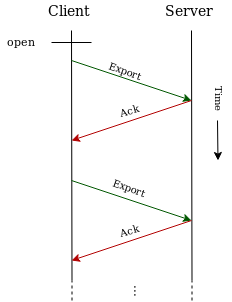
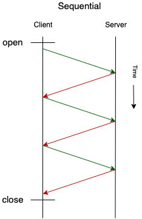
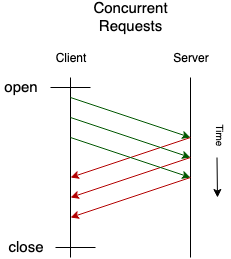
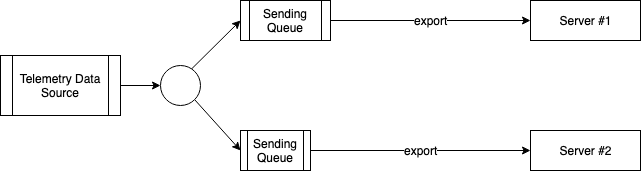

# OpenTelemetry Protocol Specification

**Author**: Tigran Najaryan, Omnition Inc.

OpenTelemetry Protocol (OTLP) specification describes the encoding, transport and delivery mechanism of telemetry data between telemetry sources, intermediate nodes such as collectors and telemetry backends.

## Table of Contents

- [Motivation](#motivation)
- [Protocol Details](#protocol-details)
  - [Export Request and Response](#export-request-and-response)
    - [OTLP over gRPC](#otlp-over-grpc)
    - [Export Response](#export-response)
    - [Throttling](#throttling)
    - [gRPC Service Definition](#grpc-service-definition)
  - [Other Transports](#other-transports)
- [Implementation Recommendations](#implementation-recommendations)
  - [Multi-Destination Exporting](#multi-destination-exporting)
- [Trade-offs and mitigations](#trade-offs-and-mitigations)
  - [Request Acknowledgements](#request-acknowledgements)
    - [Duplicate Data](#duplicate-data)
  - [Partial Success](#partial-success)
- [Future Versions and Interoperability](#future-versions-and-interoperability)
- [Prior Art, Alternatives and Future Possibilities](#prior-art-alternatives-and-future-possibilities)
- [Open Questions](#open-questions)
- [Appendix A - Protocol Buffer Definitions](#appendix-a---protocol-buffer-definitions)
- [Appendix B - Performance Benchmarks](#appendix-b---performance-benchmarks)
  - [Throughput - Sequential vs Concurrent](#throughput---sequential-vs-concurrent)
  - [CPU Usage - gRPC vs WebSocket/Experimental](#cpu-usage---grpc-vs-websocketexperimental)
  - [Benchmarking Raw Results](#benchmarking-raw-results)
- [Glossary](#glossary)
- [Acknowledgements](#acknowledgements)

## Motivation

OTLP is a general-purpose telemetry data delivery protocol designed in the scope of OpenTelemetry project. It is an incremental improvement of OpenCensus protocol. Compared to OpenCensus protocol OTLP has the following improvements:

- Ensures high reliability of data delivery and clear visibility when the data cannot be delivered. OTLP uses acknowledgements to implement reliable delivery.

- It is friendly to Level 7 Load Balancers and allows them to correctly map imbalanced incoming traffic to a balanced outgoing traffic. This allows to efficiently operate large networks of nodes where telemetry data generation rates change over time.

- Allows backpressure signalling from telemetry data destinations to sources. This is important for implementing reliable multi-hop telemetry data delivery all the way from the source to the destination via intermediate nodes, each having different processing capacity and thus requiring different data transfer rates.

## Protocol Details

OTLP defines the encoding of telemetry data and the protocol used to exchange data between the client and the server.

This specification defines how OTLP is implemented over [gRPC](https://grpc.io/) and specifies corresponding [Protocol Buffers](https://protobuf.dev/overview/) schema. Future extensions to OTLP may define implementations over other transports. For details of gRPC service definition see section [gRPC Transport](#grpc-service-definition).

OTLP is a request/response style protocols: the clients send requests, the server replies with corresponding responses. This document defines one requests and response type: `Export`.

### Export Request and Response

After establishing the underlying transport the client starts sending telemetry data using `Export` requests.  The client continuously sends a sequence of `Export` requests to the server and expects to receive a response to each request:



_Note: this protocol is concerned with reliability of delivery between one pair of client/server nodes and aims to ensure that no data is lost in-transit between the client and the server. Many telemetry collection systems have intermediary nodes that the data must travel across until reaching the final destination (e.g. application -> agent -> collector -> backend). End-to-end delivery guarantees in such systems is outside of the scope of OTLP. The acknowledgements described in this protocol happen between a single client/server pair and do not span intermediary nodes in multi-hop delivery paths._

#### OTLP over gRPC

For gRPC transport OTLP uses Unary RPC to send export requests and receives responses.

After sending the request the client MAY wait until the response is received from the server. In that case there will be at most only one request in flight that is not yet acknowledged by the server.



Sequential operation is recommended when simplicity of implementation is desirable and when the client and the server are connected via very low-latency network, such as for example when the client is an instrumented application and the server is a OpenTelemetry Service running as a local daemon.

The implementations that need to achieve high throughput SHOULD support concurrent Unary calls to achieve higher throughput. The client SHOULD send new requests without waiting for the response to the earlier sent requests, essentially creating a pipeline of requests that are currently in flight that are not acknowledged.



The number of concurrent requests SHOULD be configurable.

The maximum achievable throughput is `max_concurrent_requests * max_request_size / (network_latency + server_response_time)`. For example if the request can contain at most 100 spans, network roundtrip latency is 200ms and server response time is 300 ms, then the maximum achievable throughput with one concurrent request is `100 spans / (200ms+300ms)` or 200 spans per second. It is easy to see that in high latency networks or when the server response time is high to achieve good throughput the requests need to be very big or a lot concurrent requests must be done.

If the client is shutting down (e.g. when the containing process wants to exit) the client will optionally wait until all pending acknowledgements are received or until an implementation specific timeout expires. This ensures reliable delivery of telemetry data. The client implementation SHOULD expose an option to turn on and off the waiting during shutdown.

If the client is unable to deliver a certain request (e.g. a timer expired while waiting for acknowledgements) the client SHOULD record the fact that the data was not delivered.

#### Export Response

The server may respond with either a success or an error to export requests.

The success response indicates telemetry data is successfully processed by the server. If the server receives an empty request (a request that does not carry any telemetry data) the server SHOULD respond with success.

When using gRPC transport, success response is returned via `ExportResponse` message.

When an error is returned by the server it falls into 2 broad categories: retryable and not-retryable:

- Retryable errors indicate that processing of telemetry data failed and the client SHOULD record the error and may retry exporting the same data. This can happen when the server is temporarily unable to process the data.

- Not-retryable errors indicate that processing of telemetry data failed and the client MUST NOT retry sending the same telemetry data. The telemetry data MUST be dropped. This can happen, for example, when the request contains bad data and cannot be deserialized or otherwise processed by the server. The client SHOULD maintain a counter of such dropped data.

When using gRPC transport the server SHOULD indicate retryable errors using code [Unavailable](https://pkg.go.dev/google.golang.org/grpc/codes) and MAY supply additional [details via status](https://pkg.go.dev/google.golang.org/grpc/status#Status) using [RetryInfo](https://github.com/googleapis/googleapis/blob/6a8c7914d1b79bd832b5157a09a9332e8cbd16d4/google/rpc/error_details.proto#L40) containing 0 value of RetryDelay. Here is a sample Go code to illustrate:

```go
  // Do this on server side.
  st, err := status.New(codes.Unavailable, "Server is unavailable").
    WithDetails(&errdetails.RetryInfo{RetryDelay: &duration.Duration{Seconds: 0}})
  if err != nil {
    log.Fatal(err)
  }

  return st.Err()
```

To indicate not-retryable errors the server is recommended to use code [InvalidArgument](https://pkg.go.dev/google.golang.org/grpc/codes) and MAY supply additional [details via status](https://pkg.go.dev/google.golang.org/grpc/status#Status) using [BadRequest](https://github.com/googleapis/googleapis/blob/6a8c7914d1b79bd832b5157a09a9332e8cbd16d4/google/rpc/error_details.proto#L119). Other gRPC status code may be used if it is more appropriate. Here is a sample Go code to illustrate:

```go
  // Do this on server side.
  st, err := status.New(codes.InvalidArgument, "Invalid Argument").
    WithDetails(&errdetails.BadRequest{})
  if err != nil {
    log.Fatal(err)
  }

  return st.Err()
```

The server MAY use other gRPC codes to indicate retryable and not-retryable errors if those other gRPC codes are more appropriate for a particular erroneous situation. The client SHOULD interpret gRPC status codes as retryable or not-retryable according to the following table:

|gRPC Code|Retryable?|
|---------|----------|
|CANCELLED|Yes|
|UNKNOWN|No|
|INVALID_ARGUMENT|No|
|DEADLINE_EXCEEDED|Yes|
|NOT_FOUND|No|
|ALREADY_EXISTS|No|
|PERMISSION_DENIED|No|
|UNAUTHENTICATED|No|
|RESOURCE_EXHAUSTED|Yes|
|FAILED_PRECONDITION|No|
|ABORTED|Yes|
|OUT_OF_RANGE|Yes|
|UNIMPLEMENTED|No|
|INTERNAL|No|
|UNAVAILABLE|Yes|
|DATA_LOSS|Yes|

When retrying, the client SHOULD implement a backoff strategy. An exception to this is the Throttling case explained below, which provides explicit instructions about retrying interval.

#### Throttling

OTLP allows backpressure signalling.

If the server is unable to keep up with the pace of data it receives from the client then it SHOULD signal that fact to the client. The client MUST then throttle itself to avoid overwhelming the server.

To signal backpressure when using gRPC transport, the server SHOULD return an error with code [Unavailable](https://pkg.go.dev/google.golang.org/grpc/codes) and MAY supply additional [details via status](https://pkg.go.dev/google.golang.org/grpc/status#Status) using [RetryInfo](https://github.com/googleapis/googleapis/blob/6a8c7914d1b79bd832b5157a09a9332e8cbd16d4/google/rpc/error_details.proto#L40). Here is a sample Go code to illustrate:

```go
  // Do this on server side.
  st, err := status.New(codes.Unavailable, "Server is unavailable").
    WithDetails(&errdetails.RetryInfo{RetryDelay: &duration.Duration{Seconds: 30}})
  if err != nil {
    log.Fatal(err)
  }

  return st.Err()
  
  ...

  // Do this on client side.
  st := status.Convert(err)
  for _, detail := range st.Details() {
    switch t := detail.(type) {
    case *errdetails.RetryInfo:
      if t.RetryDelay.Seconds > 0 || t.RetryDelay.Nanos > 0 {
        // Wait before retrying.
      }
    }
  }
```

When the client receives this signal it SHOULD follow the recommendations outlined in documentation for `RetryInfo`:

```
// Describes when the clients can retry a failed request. Clients could ignore
// the recommendation here or retry when this information is missing from error
// responses.
//
// It's always recommended that clients should use exponential backoff when
// retrying.
//
// Clients should wait until `retry_delay` amount of time has passed since
// receiving the error response before retrying.  If retrying requests also
// fail, clients should use an exponential backoff scheme to gradually increase
// the delay between retries based on `retry_delay`, until either a maximum
// number of retires have been reached or a maximum retry delay cap has been
// reached.
```

The value of `retry_delay` is determined by the server and is implementation dependant. The server SHOULD choose a `retry_delay` value that is big enough to give the server time to recover, yet is not too big to cause the client to drop data while it is throttled.

#### gRPC Service Definition

`Export` requests and responses are delivered using unary gRPC calls.

This is OTLP over gRPC Service definition:

```
service UnaryExporter {
  rpc ExportTraces(TraceExportRequest) returns (ExportResponse) {}
  rpc ExportMetrics(MetricExportRequest) returns (ExportResponse) {}
}
```

Appendix A contains Protocol Buffer definitions for `TraceExportRequest`, `MetricExportRequest` and `ExportResponse`.

### Other Transports

OTLP can work over any other transport that supports message request/response capabilities. Additional transports supported by OTLP can be specified in future RFCs that extend OTLP.

## Implementation Recommendations

### Multi-Destination Exporting

When the telemetry data from one client must be sent to more than one destination server there is an additional complication that must be accounted for. When one of the servers acknowledges the data and the other server does not (yet) acknowledges the client needs to make a decision about how to move forward.

In such situation the the client SHOULD implement queuing, acknowledgement handling and retrying logic per destination. This ensures that servers do not block each other. The queues SHOULD reference shared, immutable data to be sent, thus minimizing the memory overhead caused by having multiple queues.



This ensures that all destination servers receive the data regardless of their speed of reception (within the available limits imposed by the size of the client-side queue).

## Trade-offs and mitigations

### Request Acknowledgements

#### Duplicate Data

In edge cases (e.g. on reconnections, network interruptions, etc) the client has no way of knowing if recently sent data was delivered if no acknowledgement was received yet. The client will typically choose to re-send such data to guarantee delivery, which may result in duplicate data on the server side. This is a deliberate choice and is considered to be the right tradeoff for telemetry data.

### Partial Success

The protocol does not attempt to communicate partial reception success from the server to the client (i.e. when part of the data can be received by the server and part of it cannot). Attempting to do so would complicate the protocol and implementations significantly and is left out as a possible future area of work.

## Future Versions and Interoperability

OTLP will evolve and change over time. Future versions of OTLP must be designed and implemented in a way that ensures that clients and servers that implement different versions of OTLP can interoperate and exchange telemetry data. Old clients must be able to talk to new servers and vice versa. If new versions of OTLP introduce new functionality that cannot be understood and supported by nodes implementing the old versions of OTLP the protocol must regress to the lowest common denominator from functional perspective.

When possible the interoperability SHOULD be ensured between all versions of OTLP that are not declared obsolete.

OTLP does not use explicit protocol version numbering. OTLP's interoperability of clients and servers of different versions is based on the following concepts:

1. OTLP (current and future versions) defines a set of capabilities, some of which are mandatory, others are optional. Clients and servers must implement mandatory capabilities and can choose implement only a subset of optional capabilities.

2. For minor changes to the protocol future versions and extension of OTLP are encouraged to use the ability of Protocol Buffers to evolve message schema in backwards compatible manner. Newer versions of OTLP may add new fields to messages that will be ignored by clients and servers that do not understand these fields. In many cases careful design of such schema changes and correct choice of default values for new fields is enough to ensure interoperability of different versions without nodes explicitly detecting that their peer node has different capabilities.

3. More significant changes must be explicitly defined as new optional capabilities in future RFCs. Such capabilities SHOULD be discovered by client and server implementations after establishing the underlying transport. The exact discovery mechanism SHOULD be described in future RFCs which define the new capabilities and typically can be implemented by making a discovery request/response message exchange from the client to server. The mandatory capabilities defined by this specification are implied and do not require a discovery. The implementation which supports a new, optional capability MUST adjust its behavior to match the expectation of a peer that does not support a particular capability.

The current version of OTLP is the initial version that describes mandatory capabilities only. Implementations of this specification SHOULD NOT attempt to detect the capabilities of their peers and should operate as defined in this document.

## Prior Art, Alternatives and Future Possibilities

We have considered using gRPC streaming instead of Unary RPC calls. This would require implementations to manually perform stream closing and opening periodically to be L7 Load Balancer friendly. Reference implementation using gRPC Streaming has shown that it results in significantly more complex and error prone code without significant benefits. Because of this Unary RPC was chosen.

OTLP is an evolution of OpenCensus protocol based on the research and testing of its modifications in production at Omnition. The modifications include changes to data formats (see RFC0059), use of Unary PRC and backpressure signaling capability.

OTLP uses Protocol Buffers for data encoding. Two other encodings were considered as alternative approaches: FlatBuffers and Capnproto. Both alternatives were rejected. FlatBuffers was rejected because it lacks required functionality in all languages except C++, particularly lack of verification of decoded data and inability to mutate in-memory data. Capnproto was rejected because it is not yet considered production ready, the API is not yet stable and like FlatBuffers it lacks ability mutate in-memory data.

Both FlatBuffers and Capnproto are worth to be re-evaluated for future versions of OpenTelemetry protocol if they overcome currently known limitations.

It is also worth researching transports other than gRPC. Other transports are not included in this RFC due to time limitations.

Experimental implementation of OTLP over WebSockets exists and was researched as an alternate. WebSockets were not chosen as the primary transport for OTLP due to lack or immaturity of certain capabilities (such as lack of universal support for [RFC 7692](https://datatracker.ietf.org/doc/html/rfc7692) message compression extension). Despite limitations the experimental implementation demonstrated good performance and WebSocket transport will be considered for inclusion in a future OTLP Extensions RFC.

## Open Questions

One of the goals for telemetry protocol is reducing CPU usage and memory pressure in garbage collected languages. These goals were not addressed as part of this RFC and remain open. One of the promising future ways to address this is finding a more CPU and memory efficient encoding mechanism.

Another goal for telemetry protocol is achieving high compression ratios for telemetry data while keeping CPU consumption low. OTLP uses compression provided by gRPC transport. No further improvements to compression were considered as part of this RFC and are a future area of work.

## Appendix A - Protocol Buffer Definitions

This is Protocol Buffers schema for `Export` request and response:

```
// A request from client to server containing trace data to export.
message TraceExportRequest {
    // Telemetry data. An array of ResourceSpans.
    repeated ResourceSpans resourceSpans = 2;
}

// A request from client to server containing metric data to export.
message MetricExportRequest {
    // Telemetry data. An array of ResourceMetrics.
    repeated ResourceMetrics resourceMetrics = 2;
}

// A response to ExportRequest.
message ExportResponse {
    // Response in an empty message.
}

// A list of spans from a Resource.
message ResourceSpans {
  Resource resource = 1;
  repeated Span spans = 2;
}

// A list of metrics from a Resource.
message ResourceMetrics {
  Resource resource = 1;
  repeated Metric metrics = 2;
}
```

`Span`, `Metric` and `Resource` schema definitions are defined in RFCNNNN (RFC number to be defined and linked from here).

## Appendix B - Performance Benchmarks

Benchmarking of OTLP vs other telemetry protocols was done using [reference implementation in Go](https://github.com/tigrannajaryan/exp-otelproto).

### Throughput - Sequential vs Concurrent

Using 20 concurrent requests shows the following throughput advantage in benchmarks compared to sequential for various values of network roundtrip latency:

```
+-----------+-----------------------+
+ Latency   | Concurrent/Sequential |
+           |   Throughput Factor   |
+-----------+-----------------------+
+   0.02 ms |          1.7          |
+   2 ms    |          2.1          |
+  20 ms    |          4.9          |
+ 200 ms    |          6.9          |
+-----------+-----------------------+
```

Benchmarking is done using Export requests each carrying 500 spans, each span containing 10 small attributes.

### CPU Usage - gRPC vs WebSocket/Experimental

Experimental implementation using WebSocket transport demonstrated about 30% less CPU usage on small batches compared to gRPC transport and about 7% less CPU usage on large batches.

This shows that exploring different transports with less overhead is a promising future direction.

### Benchmarking Raw Results

The following is the benchmarking result, running on on a system with i7 7500U processor, 16 GB RAM. (Note that the benchmarking script sets "performance" CPU governor during execution and sets nice value of the process for more consistent results).

```
====================================================================================
Legend:
GRPC/Stream/LBTimed/Sync    - GRPC, streaming, load balancer friendly, close stream every 30 sec, with ack
GRPC/Stream/LBTimed/Async/N - OTLP Streaming. GRPC, N streams, load balancer friendly, close stream every 30 sec, with async ack
GRPC/Unary                  - OTLP Unary. One request per batch, load balancer friendly, with ack
GRPC/Unary/Async            - GRPC, unary async request per batch, load balancer friendly, with ack
GRPC/OpenCensus             - OpenCensus protocol, streaming, not load balancer friendly, without ack
GRPC/OpenCensusWithAck      - OpenCensus-like protocol, streaming, not load balancer friendly, with ack
GRPC/Stream/NoLB            - GRPC, streaming, not load balancer friendly, with ack
GRPC/Stream/LBAlways/Sync   - GRPC, streaming, load balancer friendly, close stream after every batch, with ack
GRPC/Stream/LBSrv/Async     - OTLP Streaming. Load balancer friendly, server closes stream every 30 sec or 1000 batches, with async ack
WebSocket/Stream/Sync       - WebSocket, streaming, unknown load balancer friendliness, with sync ack
WebSocket/Stream/Async      - WebSocket, streaming, unknown load balancer friendliness, with async ack
WebSocket/Stream/Async/zlib - WebSocket, streaming, unknown load balancer friendliness, with async ack, zlib compression


8000 small batches, 100 spans per batch, 4 attrs per span
GRPC/Stream/LBTimed/Async/1   800000 spans, CPU time  12.4 sec, wall time   5.3 sec, 645.7 batches/cpusec, 1510.0 batches/wallsec
GRPC/Stream/LBTimed/Async/10  800000 spans, CPU time  12.3 sec, wall time   3.9 sec, 650.9 batches/cpusec, 2058.4 batches/wallsec
GRPC/Unary                    800000 spans, CPU time  15.3 sec, wall time   9.5 sec, 523.2 batches/cpusec, 840.0 batches/wallsec
GRPC/Unary/Async              800000 spans, CPU time  14.1 sec, wall time   4.0 sec, 565.8 batches/cpusec, 1986.3 batches/wallsec
GRPC/OpenCensus               800000 spans, CPU time  21.7 sec, wall time  10.6 sec, 368.7 batches/cpusec, 751.5 batches/wallsec
GRPC/OpenCensusWithAck        800000 spans, CPU time  23.4 sec, wall time  19.0 sec, 342.3 batches/cpusec, 420.8 batches/wallsec
GRPC/Stream/NoLB              800000 spans, CPU time  13.6 sec, wall time   9.4 sec, 588.2 batches/cpusec, 848.7 batches/wallsec
GRPC/Stream/LBAlways/Sync     800000 spans, CPU time  16.1 sec, wall time  10.0 sec, 495.7 batches/cpusec, 798.8 batches/wallsec
GRPC/Stream/LBTimed/Sync      800000 spans, CPU time  13.7 sec, wall time   9.5 sec, 585.7 batches/cpusec, 845.1 batches/wallsec
GRPC/Stream/LBSrv/Async       800000 spans, CPU time  12.7 sec, wall time  12.5 sec, 628.9 batches/cpusec, 639.8 batches/wallsec
WebSocket/Stream/Sync         800000 spans, CPU time   8.4 sec, wall time   8.3 sec, 949.0 batches/cpusec, 965.3 batches/wallsec
WebSocket/Stream/Async        800000 spans, CPU time   9.4 sec, wall time   5.4 sec, 852.0 batches/cpusec, 1492.0 batches/wallsec
WebSocket/Stream/Async/zlib   800000 spans, CPU time  23.3 sec, wall time  16.5 sec, 343.8 batches/cpusec, 484.0 batches/wallsec

800 large batches, 500 spans per batch, 10 attrs per span
GRPC/Stream/LBTimed/Async/1   400000 spans, CPU time  11.4 sec, wall time   7.1 sec, 70.2 batches/cpusec, 113.1 batches/wallsec
GRPC/Stream/LBTimed/Async/10  400000 spans, CPU time  12.2 sec, wall time   5.8 sec, 65.8 batches/cpusec, 138.4 batches/wallsec
GRPC/Unary                    400000 spans, CPU time  10.7 sec, wall time   9.6 sec, 74.7 batches/cpusec, 83.2 batches/wallsec
GRPC/Unary/Async              400000 spans, CPU time  11.9 sec, wall time   5.6 sec, 67.0 batches/cpusec, 141.8 batches/wallsec
GRPC/OpenCensus               400000 spans, CPU time  23.9 sec, wall time  14.1 sec, 33.5 batches/cpusec, 56.8 batches/wallsec
GRPC/OpenCensusWithAck        400000 spans, CPU time  22.0 sec, wall time  21.1 sec, 36.4 batches/cpusec, 38.0 batches/wallsec
GRPC/Stream/NoLB              400000 spans, CPU time  10.7 sec, wall time   9.8 sec, 74.9 batches/cpusec, 81.8 batches/wallsec
GRPC/Stream/LBAlways/Sync     400000 spans, CPU time  11.5 sec, wall time  10.2 sec, 69.9 batches/cpusec, 78.2 batches/wallsec
GRPC/Stream/LBTimed/Sync      400000 spans, CPU time  11.1 sec, wall time  10.2 sec, 71.9 batches/cpusec, 78.4 batches/wallsec
GRPC/Stream/LBSrv/Async       400000 spans, CPU time  11.3 sec, wall time   7.0 sec, 70.5 batches/cpusec, 113.6 batches/wallsec
WebSocket/Stream/Sync         400000 spans, CPU time  10.3 sec, wall time  10.1 sec, 78.0 batches/cpusec, 79.4 batches/wallsec
WebSocket/Stream/Async        400000 spans, CPU time  10.5 sec, wall time   7.2 sec, 76.2 batches/cpusec, 111.2 batches/wallsec
WebSocket/Stream/Async/zlib   400000 spans, CPU time  29.0 sec, wall time  22.1 sec, 27.6 batches/cpusec, 36.1 batches/wallsec

2ms network roundtrip latency
800 large batches, 500 spans per batch, 10 attrs per span
GRPC/Stream/LBTimed/Async/1   400000 spans, CPU time  11.1 sec, wall time   7.0 sec, 71.9 batches/cpusec, 114.9 batches/wallsec
GRPC/Stream/LBTimed/Async/10  400000 spans, CPU time  11.4 sec, wall time   5.4 sec, 70.5 batches/cpusec, 148.0 batches/wallsec
GRPC/Unary                    400000 spans, CPU time  11.5 sec, wall time  11.8 sec, 69.5 batches/cpusec, 68.1 batches/wallsec
GRPC/Unary/Async              400000 spans, CPU time  11.3 sec, wall time   5.3 sec, 70.5 batches/cpusec, 150.4 batches/wallsec
GRPC/OpenCensus               400000 spans, CPU time  23.1 sec, wall time  13.6 sec, 34.6 batches/cpusec, 58.7 batches/wallsec
GRPC/OpenCensusWithAck        400000 spans, CPU time  21.9 sec, wall time  22.6 sec, 36.6 batches/cpusec, 35.4 batches/wallsec
GRPC/Stream/NoLB              400000 spans, CPU time  11.1 sec, wall time  11.6 sec, 72.3 batches/cpusec, 69.2 batches/wallsec
GRPC/Stream/LBAlways/Sync     400000 spans, CPU time  11.5 sec, wall time  11.6 sec, 69.8 batches/cpusec, 68.9 batches/wallsec
GRPC/Stream/LBTimed/Sync      400000 spans, CPU time  11.3 sec, wall time  11.7 sec, 71.0 batches/cpusec, 68.2 batches/wallsec
GRPC/Stream/LBSrv/Async       400000 spans, CPU time  11.1 sec, wall time   6.9 sec, 72.0 batches/cpusec, 115.1 batches/wallsec
WebSocket/Stream/Sync         400000 spans, CPU time  10.8 sec, wall time  12.0 sec, 74.1 batches/cpusec, 66.5 batches/wallsec
WebSocket/Stream/Async        400000 spans, CPU time  10.6 sec, wall time   7.2 sec, 75.5 batches/cpusec, 111.8 batches/wallsec
WebSocket/Stream/Async/zlib   400000 spans, CPU time  28.6 sec, wall time  21.9 sec, 27.9 batches/cpusec, 36.6 batches/wallsec

20ms network roundtrip latency
400 large batches, 500 spans per batch, 10 attrs per span
GRPC/Stream/LBTimed/Async/1   200000 spans, CPU time   6.2 sec, wall time   4.1 sec, 64.9 batches/cpusec, 96.7 batches/wallsec
GRPC/Stream/LBTimed/Async/10  200000 spans, CPU time   6.2 sec, wall time   3.0 sec, 64.0 batches/cpusec, 132.9 batches/wallsec
GRPC/Unary                    200000 spans, CPU time   6.2 sec, wall time  13.5 sec, 64.3 batches/cpusec, 29.6 batches/wallsec
GRPC/Unary/Async              200000 spans, CPU time   5.9 sec, wall time   3.0 sec, 68.0 batches/cpusec, 132.9 batches/wallsec
GRPC/OpenCensus               200000 spans, CPU time  12.6 sec, wall time   7.5 sec, 31.8 batches/cpusec, 53.3 batches/wallsec
GRPC/OpenCensusWithAck        200000 spans, CPU time  12.0 sec, wall time  19.5 sec, 33.4 batches/cpusec, 20.5 batches/wallsec
GRPC/Stream/NoLB              200000 spans, CPU time   5.9 sec, wall time  13.3 sec, 68.3 batches/cpusec, 30.0 batches/wallsec
GRPC/Stream/LBAlways/Sync     200000 spans, CPU time   5.9 sec, wall time  13.3 sec, 68.0 batches/cpusec, 30.2 batches/wallsec
GRPC/Stream/LBTimed/Sync      200000 spans, CPU time   5.8 sec, wall time  13.3 sec, 69.3 batches/cpusec, 30.1 batches/wallsec
GRPC/Stream/LBSrv/Async       200000 spans, CPU time   5.5 sec, wall time   3.7 sec, 73.4 batches/cpusec, 107.3 batches/wallsec
WebSocket/Stream/Sync         200000 spans, CPU time   5.8 sec, wall time  14.6 sec, 69.4 batches/cpusec, 27.4 batches/wallsec
WebSocket/Stream/Async        200000 spans, CPU time   5.5 sec, wall time   3.9 sec, 72.3 batches/cpusec, 102.1 batches/wallsec
WebSocket/Stream/Async/zlib   200000 spans, CPU time  14.7 sec, wall time  11.2 sec, 27.3 batches/cpusec, 35.7 batches/wallsec

200ms network roundtrip latency
40 large batches, 500 spans per batch, 10 attrs per span
GRPC/Stream/LBTimed/Async/1    20000 spans, CPU time   0.5 sec, wall time   3.1 sec, 74.1 batches/cpusec, 12.7 batches/wallsec
GRPC/Stream/LBTimed/Async/10   20000 spans, CPU time   0.7 sec, wall time   3.1 sec, 61.5 batches/cpusec, 12.8 batches/wallsec
GRPC/Unary                     20000 spans, CPU time   0.6 sec, wall time   9.9 sec, 65.6 batches/cpusec,  4.0 batches/wallsec
GRPC/Unary/Async               20000 spans, CPU time   0.6 sec, wall time   3.6 sec, 65.6 batches/cpusec, 11.1 batches/wallsec
GRPC/OpenCensus                20000 spans, CPU time   1.1 sec, wall time   3.5 sec, 35.1 batches/cpusec, 11.3 batches/wallsec
GRPC/OpenCensusWithAck         20000 spans, CPU time   1.2 sec, wall time  10.2 sec, 32.8 batches/cpusec,  3.9 batches/wallsec
GRPC/Stream/NoLB               20000 spans, CPU time   0.6 sec, wall time   9.5 sec, 67.8 batches/cpusec,  4.2 batches/wallsec
GRPC/Stream/LBAlways/Sync      20000 spans, CPU time   0.6 sec, wall time   9.5 sec, 63.5 batches/cpusec,  4.2 batches/wallsec
GRPC/Stream/LBTimed/Sync       20000 spans, CPU time   0.6 sec, wall time   9.5 sec, 66.7 batches/cpusec,  4.2 batches/wallsec
GRPC/Stream/LBSrv/Async        20000 spans, CPU time   0.5 sec, wall time   3.3 sec, 74.1 batches/cpusec, 12.0 batches/wallsec
WebSocket/Stream/Sync          20000 spans, CPU time   0.6 sec, wall time  13.5 sec, 69.0 batches/cpusec,  3.0 batches/wallsec
WebSocket/Stream/Async         20000 spans, CPU time   0.5 sec, wall time   6.1 sec, 74.1 batches/cpusec,  6.5 batches/wallsec
WebSocket/Stream/Async/zlib    20000 spans, CPU time   1.5 sec, wall time   2.0 sec, 26.3 batches/cpusec, 19.8 batches/wallsec


400 large batches, 500 spans per batch, 10 attrs per span
200ms network roundtrip latency
GRPC/OpenCensus               200000 spans, CPU time  11.9 sec, wall time  10.1 sec, 33.6 batches/cpusec, 39.6 batches/wallsec
GRPC/Stream/LBTimed/Async/1   200000 spans, CPU time   5.3 sec, wall time   9.5 sec, 76.0 batches/cpusec, 41.9 batches/wallsec
GRPC/Stream/LBTimed/Async/10  200000 spans, CPU time   6.4 sec, wall time   8.9 sec, 62.3 batches/cpusec, 44.7 batches/wallsec
GRPC/Unary/Async              200000 spans, CPU time   5.8 sec, wall time  12.0 sec, 68.6 batches/cpusec, 33.3 batches/wallsec
WebSocket/Stream/Async        200000 spans, CPU time   5.3 sec, wall time  11.2 sec, 75.3 batches/cpusec, 35.7 batches/wallsec
WebSocket/Stream/Async/zlib   200000 spans, CPU time  15.1 sec, wall time  12.0 sec, 26.5 batches/cpusec, 33.4 batches/wallsec
====================================================================================
```

## Glossary

There are 2 parties involved in telemetry data exchange. In this document the party that is the source of telemetry data is called the `Client`, the party that is the destination of telemetry data is called the `Server`.


Examples of a Client are instrumented applications or sending side of telemetry collectors, examples of Servers are telemetry backends or receiving side of telemetry collectors (so a Collector is typically both a Client and a Server depending on which side you look from).

Both the Client and the Server are also a `Node`. This term is used in the document when referring to either one.

## Acknowledgements

Special thanks to Owais Lone who helped to conduct experiments with Load Balancers, to Paulo Janotti, Bogdan Drutu and Yuri Shkuro for thoughtful discussions around the protocol.
