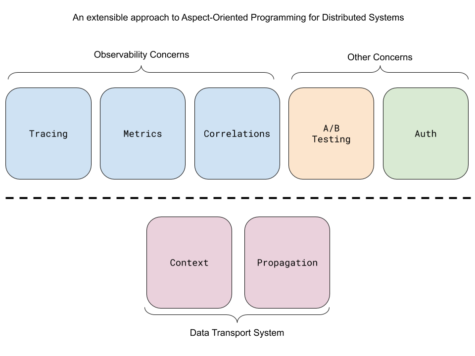
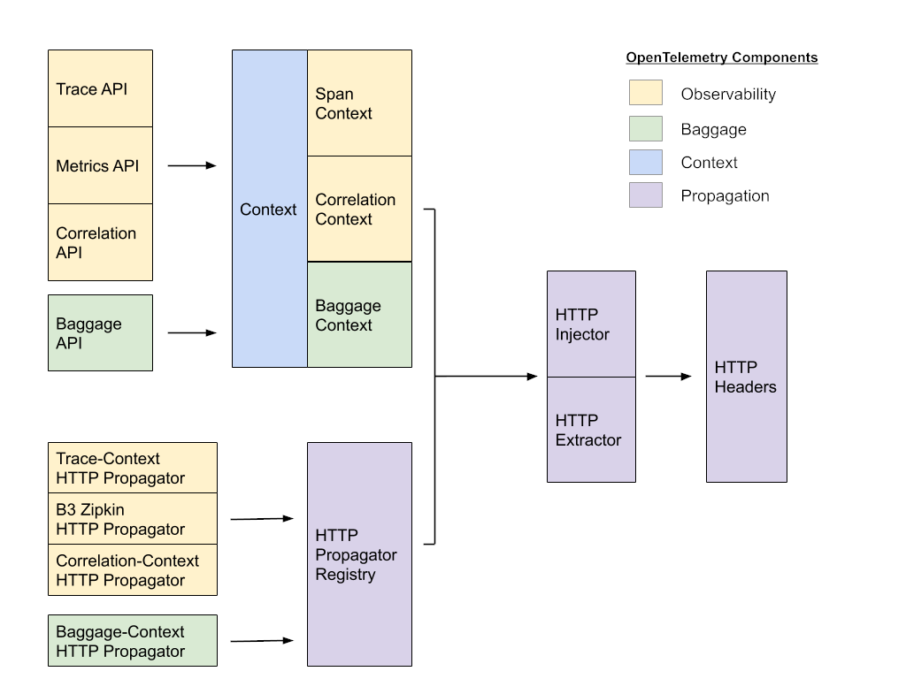

# Context Propagation: A Layered Approach 

* [Motivation](#Motivation)
* [OpenTelemetry layered architecture](#OpenTelemetry-layered-architecture)
  * [Cross-Cutting Concerns](#Cross-Cutting-Concerns)
    * [Observability API](#Observability-API)
    * [Correlations API](#Correlations-API)
  * [Context Propagation](#Context-Propagation)
    * [Context API](#Context-API)
    * [Propagation API](#Propagation-API)
* [Prototypes](#Prototypes)
* [Examples](#Examples)
  * [Global initialization](#Global-initialization)
  * [Extracting and injecting from HTTP headers](#Extracting-and-injecting-from-HTTP-headers)
  * [Simplify the API with automated context propagation](#Simplify-the-API-with-automated-context-propagation)
  * [Implementing a propagator](#Implementing-a-propagator)
  * [Implementing a concern](#Implementing-a-concern)
  * [The scope of current context](#The-scope-of-current-context)
  * [Referencing multiple contexts](#Referencing-multiple-contexts)
  * [Falling back to explicit contexts](#Falling-back-to-explicit-contexts)
* [Internal details](#Internal-details)
* [FAQ](#faq)



A proposal to refactor OpenTelemetry into a set of separate cross-cutting concerns which 
operate on a shared context propagation mechanism.

# Motivation

This RFC addresses the following topics:

**Separation of concerns**  
* Cleaner package layout results in an easier to learn system. It is possible to
  understand Context Propagation without needing to understand Observability.
* Allow for multiple types of context propagation, each self contained with 
  different rules. For example, TraceContext may be sampled, while 
  CorrelationContext never is.
* Allow the Observability and Context Propagation to have different defaults. 
  The Observability systems ships with a no-op implementation and a pluggable SDK, 
  the context propagation system ships with a canonical, working implementation.

**Extensibility**
* A clean separation allows the context propagation mechanisms to be used on 
  their own, so they may be consumed by other systems which do not want to 
  depend on an observability tool for their non-observability concerns.
* Allow developers to create new applications for context propagation. For 
  example: A/B testing, authentication, and network switching.


# OpenTelemetry layered architecture

The design of OpenTelemetry is based on the principles of [aspect-oriented 
programming](https://en.wikipedia.org/wiki/Aspect-oriented_programming), 
adopted to the needs of distributed systems. 

Some concerns "cut across" multiple abstractions in a program. Logging 
exemplifies aspect orientation because a logging strategy necessarily affects 
every logged part of the system. Logging thereby "cross-cuts" across all logged 
classes and methods. Distributed tracing takes this strategy to the next level, 
and cross-cuts across all classes and methods in all services in the entire 
transaction. This requires a distributed form of the same aspect-oriented 
programming principles in order to be implemented cleanly.

OpenTelemetry approaches this by separating it's design into two layers. The top 
layer contains a set of independent **cross-cutting concerns**, which intertwine 
with a program's application logic and cannot be cleanly encapsulated. All 
concerns share an underlying distributed **context propagation** layer, for 
storing state and accessing data across the lifespan of a distributed 
transaction.


# Cross-Cutting Concerns

## Observability API
Distributed tracing is one example of a cross-cutting concern. Tracing code is 
interleaved with regular code, and ties together independent code modules which 
would otherwise remain encapsulated. Tracing is also distributed, and requires 
transaction-level context propagation in order to execute correctly.

The various observability APIs are not described here directly. However, in this new 
design, all observability APIs would be modified to make use of the generalized 
context propagation mechanism described below, rather than the tracing-specific 
propagation system it uses today.

Note that OpenTelemetry APIs calls should *always* be given access to the entire 
context object, and never just a subset of the context, such as the value in a 
single key. This allows the SDK to make improvements and leverage additional 
data that may be available, without changes to all of the call sites.

The following are notes on the API, and not meant as final.

**`StartSpan(context, options) -> context`**
When a span is started, a new context is returned, with the new span set as the 
current span. 

**`GetSpanPropagator() -> (HTTP_Extractor, HTTP_Injector)`**  
When a span is extracted, the extracted value is stored in the context seprately 
from the current span.


## Correlations API

In addition to trace propagation, OpenTelemetry provides a simple mechanism for 
propagating indexes, called the Correlations API. Correlations are 
intended for indexing observability events in one service with attributes 
provided by a prior service in the same transaction. This helps to establish a 
causal relationship between these events. For example, determining that a 
particular browser version is associated with a failure in an image processing 
service.

The Correlations API is based on the [W3C Correlation-Context specification](https://w3c.github.io/correlation-context/), 
and implements the protocol as it is defined in that working group. There are 
few details provided here as it is outside the scope of this OTEP to finalize 
this API.

While Correlations can be used to prototype other cross-cutting concerns, this 
mechanism is primarily intended to convey values for the OpenTelemetry 
observability systems. 

For backwards compatibility, OpenTracing Baggage is propagated as Correlations 
when using the OpenTracing bridge. New concerns with different criteria should 
be modeled separately, using the same underlying context propagation layer as 
building blocks.

The following is an example API, and not meant as final.

**`GetCorrelation(context, key) -> value`**  
To access the value for a label set by a prior event, the Correlations API 
provides a function which takes a context and a key as input, and returns a 
value.

**`SetCorrelation(context, key, value) -> context`**  
To record the value for a label, the Correlations API provides a function which 
takes a context, a key, and a value as input, and returns an updated context 
which contains the new value.

**`RemoveCorrelation(context, key) -> context`**  
To delete a label, the Correlations API provides a function 
which takes a context and a key as input, and returns an updated context which 
no longer contains the selected key-value pair.

**`ClearCorrelations(context) -> context`**  
To avoid sending any labels to an untrusted process, the Correlation API 
provides a function to remove all Correlations from a context.

**`GetCorrelationPropagator() -> (HTTP_Extractor, HTTP_Injector)`**  
To deserialize the previous labels set by prior processes, and to serialize the 
current total set of labels and send them to the next process, the Correlations 
API provides a function which returns a Correlation-specific implementation of 
the `HTTPExtract` and `HTTPInject` functions found in the Propagation API.

# Context Propagation

## Context API

Cross-cutting concerns access data in-process using the same, shared context 
object. Each concern uses its own namespaced set of keys in the context, 
containing all of the data for that cross-cutting concern.

The following is an example API, and not meant as final.

**`CreateKey(name) -> key`**
To allow concerns to control access to their data, the Context API uses keys 
which cannot be guessed by third parties which have not been explicitly handed 
the key. It is recommended that concerns mediate data access via an API, rather 
than provide direct public access to their keys.

**`GetValue(context, key) -> value`**  
To access the local state of an concern, the Context API provides a function 
which takes a context and a key as input, and returns a value.

**`SetValue(context, key, value) -> context`**  
To record the local state of a cross-cutting concern, the Context API provides a 
function which takes a context, a key, and a value as input, and returns a 
new context which contains the new value. Note that the new value is not present 
in the old context.

**`RemoveValue(context, key) -> context`**
RemoveValue returns a new context with the key cleared. Note that the removed 
value still remains present in the old context.


### Optional: Automated Context Management
When possible, the OpenTelemetry context should automatically be associated 
with the program execution context. Note that some languages do not provide any 
facility for setting and getting a current context. In these cases, the user is 
responsible for managing the current context.  

**`GetCurrent() -> context`**  
To access the context associated with program execution, the Context API 
provides a function which takes no arguments and returns a Context.

**`SetCurrent(context)`**  
To associate a context with program execution, the Context API provides a 
function which takes a Context.

## Propagation API

Cross-cutting concerns send their state to the next process via propagators: 
functions which read and write context into RPC requests. Each concern creates a 
set of propagators for every type of supported medium - currently only HTTP 
requests.

The following is an example API, and not meant as final.

**`Extract(context, []http_extractor, headers) -> context`**  
In order to continue transmitting data injected earlier in the transaction, 
the Propagation API provides a function which takes a context, a set of 
HTTP_Extractors, and a set of HTTP headers, and returns a new context which 
includes the state sent from the prior process.

**`Inject(context, []http_injector, headers) -> headers`**  
To send the data for all concerns to the next process in the transaction, the 
Propagation API provides a function which takes a context, a set of 
HTTP_Injectors, and adds the contents of the context in to HTTP headers to 
include an HTTP Header representation of the context.

**`HTTP_Extractor(context, headers) -> context`**  
Each concern must implement an HTTP_Extractor, which can locate the headers 
containing the http-formatted data, and then translate the contents into an 
in-memory representation, set within the returned context object. 

**`HTTP_Injector(context, headers) -> headers`**  
Each concern must implement an HTTP_Injector, which can take the in-memory 
representation of its data from the given context object, and add it to an 
existing set of HTTP headers.

### Optional: Global Propagators
It may be convenient to create a list of propagators during program 
initialization, and then access these propagators later in the program. 
To facilitate this, global injectors and extractors are optionally available. 
However, there is no requirement to use this feature.

**`GetExtractors() -> []http_extractor`**  
To access the global extractor, the Propagation API provides a function which 
returns an extractor.

**`SetExtractors([]http_extractor)`**  
To update the global extractor, the Propagation API provides a function which 
takes an extractor.

**`GetInjectors() -> []http_injector`**  
To access the global injector, the Propagation API provides a function which 
returns an injector.

**`SetInjectors([]http_injector)`**  
To update the global injector, the Propagation API provides a function which 
takes an injector.

# Prototypes

**Erlang:** https://github.com/open-telemetry/opentelemetry-erlang-api/pull/4  
**Go:** https://github.com/open-telemetry/opentelemetry-go/pull/381  
**Java:** https://github.com/open-telemetry/opentelemetry-java/pull/655  
**Python:** https://github.com/open-telemetry/opentelemetry-python/pull/325  
**Ruby:** https://github.com/open-telemetry/opentelemetry-ruby/pull/147
**C#/.NET:** https://github.com/open-telemetry/opentelemetry-dotnet/pull/399

# Examples

It might be helpful to look at some examples, written in pseudocode. Note that 
the pseudocode only uses simple functions and immutable values. Most mutable, 
object-orient languages will use objects, such as a Span object, to encapsulate 
the context object and hide it from the user in most cases.

Let's describe 
a simple scenario, where `service A` responds to an HTTP request from a `client` 
with the result of a request to `service B`.

```
client -> service A -> service B
```

Now, let's assume the `client` in the above system is version 1.0. With version 
v2.0 of the `client`, `service A` must call `service C` instead of `service B` 
in order to return the correct data.

```
client -> service A -> service C
```

In this example, we would like `service A` to decide on which backend service 
to call, based on the client version. We would also like to trace the entire 
system, in order to understand if requests to `service C` are slower or faster 
than `service B`. What might `service A` look like?

## Global initialization 
First, during program initialization, `service A` configures correlation and tracing 
propagation, and include them in the global list of injectors and extractors. 
Let's assume this tracing system is configured to use B3, and has a specific 
propagator for that format. Initializing the propagators might look like this:

```php
func InitializeOpentelemetry() {
  // create the propagators for tracing and correlations.
  bagExtract, bagInject = Correlations::HTTPPropagator()
  traceExtract, traceInject = Tracer::B3Propagator()
  
  // add the propagators to the global list.
  Propagation::SetExtractors(bagExtract, traceExtract)
  Propagation::SetInjectors(bagInject, traceInject)
}
```

## Extracting and injecting from HTTP headers
These propagators can then be used in the request handler for `service A`. The 
tracing and correlations concerns use the context object to handle state without 
breaking the encapsulation of the functions they are embedded in.

```php
func ServeRequest(context, request, project) -> (context) {
  // Extract the context from the HTTP headers. Because the list of 
  // extractors includes a trace extractor and a correlations extractor, the 
  // contents for both systems are included in the  request headers into the 
  // returned context.
  extractors = Propagation::GetExtractors()
  context = Propagation::Extract(context, extractors, request.Headers)

  // Start a span, setting the parent to the span context received from 
  // the client process. The new span will then be in the returned context.
  context = Tracer::StartSpan(context, [span options])
  
  // Determine the version of the client, in order to handle the data 
  // migration and allow new clients access to a data source that older 
  // clients are unaware of.
  version = Correlations::GetCorrelation( context, "client-version")

  switch( version ){
    case "v1.0":
      data, context = FetchDataFromServiceB(context)
    case "v2.0":
      data, context = FetchDataFromServiceC(context)
  }

  context = request.Response(context, data)

  // End the current span
  Tracer::EndSpan(context)

  return context
}

func FetchDataFromServiceB(context) -> (context, data) {
  request = NewRequest([request options])
  
  // Inject the contexts to be propagated. Note that there is no direct 
  // reference to tracing or correlations.
  injectors = Propagation::GetInjectors()
  request.Headers = Propagation::Inject(context, injectors, request.Headers)

  // make an http request
  data = request.Do()

  return data
}
```

## Simplify the API with automated context propagation
In this version of pseudocode above, we assume that the context object is 
explicit, and is pass and returned from every function as an ordinary parameter. 
This is cumbersome, and in many languages, a mechanism exists which allows 
context to be propagated automatically.

In this version of pseudocode, assume that the current context can be stored as 
a thread local, and is implicitly passed to and returned from every function.

```php
func ServeRequest(request, project) {
  extractors = Propagation::GetExtractors()
  Propagation::Extract(extractors, request.Headers)
  
  Tracer::StartSpan([span options])
  
  version = Correlations::GetCorrelation("client-version")
  
  switch( version ){
    case "v1.0":
      data = FetchDataFromServiceB()
    case "v2.0":
      data = FetchDataFromServiceC()
  }

  request.Response(data)
  
  Tracer::EndSpan()
}

func FetchDataFromServiceB() -> (data) {
  request = newRequest([request options])
  
  injectors = Propagation::GetInjectors()
  Propagation::Inject(request.Headers)
  
  data = request.Do()

  return data
}
```

## Implementing a propagator
Digging into the details of the tracing system, what might the internals of a 
span context propagator look like? Here is a crude example of extracting and 
injecting B3 headers, using an explicit context.

```php
  func B3Extractor(context, headers) -> (context) {
    context = Context::SetValue( context, 
                                 "trace.parentTraceID", 
                                 headers["X-B3-TraceId"])
    context = Context::SetValue( context,
                                "trace.parentSpanID", 
                                 headers["X-B3-SpanId"])
    return context
  }

  func B3Injector(context, headers) -> (headers) {
    headers["X-B3-TraceId"] = Context::GetValue( context, "trace.parentTraceID")
    headers["X-B3-SpanId"] = Context::GetValue( context, "trace.parentSpanID")

    return headers
  }
```

## Implementing a concern
Now, have a look at a crude example of how StartSpan might make use of the 
context. Note that this code must know the internal details about the context 
keys in which the propagators above store their data. For this pseudocode, let's 
assume again that the context is passed implicitly in a thread local.

```php
  func StartSpan(options) {
    spanData = newSpanData()
    
    spanData.parentTraceID = Context::GetValue( "trace.parentTraceID")
    spanData.parentSpanID = Context::GetValue( "trace.parentSpanID")
    
    spanData.traceID = newTraceID()
    spanData.spanID = newSpanID()
    
    Context::SetValue( "trace.parentTraceID", spanData.traceID)
    Context::SetValue( "trace.parentSpanID", spanData.spanID)
    
    // store the spanData object as well, for in-process propagation. Note that 
    // this key will not be propagated, it is for local use only.
    Context::SetValue( "trace.currentSpanData", spanData)

    return
  }
```

## The scope of current context
Let's look at a couple other scenarios related to automatic context propagation.

When are the values in the current context available? Scope management may be 
different in each language, but as long as the scope does not change (by 
switching threads, for example) the current context follows the execution of 
the program. This includes after a function returns. Note that the context 
objects themselves are immutable, so explicit handles to prior contexts will not 
be updated when the current context is changed.

```php
func Request() {
  emptyContext = Context::GetCurrent()
  
  Context::SetValue( "say-something", "foo") 
  secondContext = Context::GetCurrent()
  
  print(Context::GetValue("say-something")) // prints "foo"
  
  DoWork()
  
  thirdContext = Context::GetCurrent()
  
  print(Context::GetValue("say-something")) // prints "bar"

  print( emptyContext.GetValue("say-something") )  // prints ""
  print( secondContext.GetValue("say-something") ) // prints "foo"
  print( thirdContext.GetValue("say-something") )  // prints "bar"
}

func DoWork(){
  Context::SetValue( "say-something", "bar") 
}
```

## Referencing multiple contexts
If context propagation is automatic, does the user ever need to reference a 
context object directly? Sometimes. Even when automated context propagation is 
an available option, there is no restriction which says that concerns must only 
ever access the current context. 

For example, if a concern wanted to merge the data between two contexts, at 
least one of them will not be the current context.

```php
mergedContext = MergeCorrelations( Context::GetCurrent(), otherContext)
Context::SetCurrent(mergedContext)
```

## Falling back to explicit contexts
Sometimes, suppling an additional version of a function which uses explicit 
contexts is necessary, in order to handle edge cases. For example, in some cases 
an extracted context is not intended to be set as current context. An 
alternate extract method can be added to the API to handle this.

```php
// Most of the time, the extract function operates on the current context.
Extract(headers)

// When a context needs to be extracted without changing the current 
// context, fall back to the explicit API.
otherContext = ExtractWithContext(Context::GetCurrent(), headers)
```


# Internal details



## Example Package Layout
```
  Context
    ContextAPI
  Observability
    Correlations
      CorrelationAPI
      HttpInjector
      HttpExtractor
    Metrics
      MetricAPI
    Trace
      TracerAPI
      HttpInjector
      HttpExtractor
  Propagation
    Registry
    HttpInjectorInterface
    HttpExtractorInterface
```

## Edge Cases
There are some complications that can arise when managing a span context extracted off the wire and in-process spans for tracer operations that operate on an implicit parent. In order to ensure that a context key references an object of the expected type and that the proper implicit parent is used, the following conventions have been established:


### Extract
When extracting a remote context, the extracted span context MUST be stored separately from the current span. 

### Default Span Parentage
When a new span is created from a context, a default parent for the span can be assigned. The order is of assignment is as follows:

* The current span.
* The extracted span.
* The root span.

### Inject
When injecting a span to send over the wire, the default order is of 
assignment is as follows:

* The current span.
* The extracted span.

## Default HTTP headers
OpenTelemetry currently uses two standard header formats for context propagation. 
Their properties and requirements are integrated into the OpenTelemetry APIs.

**Span Context -** The OpenTelemetry Span API is modeled on the `traceparent` 
and `tracestate` headers defined in the [W3C Trace Context specification](https://www.w3.org/TR/trace-context/). 

**Correlation Context -** The OpenTelemetry Correlations API is modeled on the 
`Correlation-Context` headers defined in the [W3C Correlation Context specification](https://w3c.github.io/correlation-context/). 

## Context management and in-process propagation

In order for Context to function, it must always remain bound to the execution 
of code it represents. By default, this means that the programmer must pass a 
Context down the call stack as a function parameter. However, many languages 
provide automated context management facilities, such as thread locals. 
OpenTelemetry should leverage these facilities when available, in order to 
provide automatic context management.

## Pre-existing context implementations

In some languages, a single, widely used context implementation exists. In other 
languages, there many be too many implementations, or none at all. For example, 
Go has a the `context.Context` object, and widespread conventions for how to 
pass it down the call stack. Java has MDC, along with several other context 
implementations, but none are so widely used that their presence can be 
guaranteed or assumed.

In the cases where an extremely clear, pre-existing option is not available, 
OpenTelemetry should provide its own context implementation.


# FAQ

## What about complex propagation behavior?

Some OpenTelemetry proposals have called for more complex propagation behavior. 
For example, falling back to extracting B3 headers if W3C Trace-Context headers 
are not found. "Fallback propagators" and other complex behavior can be modeled as 
implementation details behind the Propagator interface. Therefore, the 
propagation system itself does not need to provide an mechanism for chaining 
together propagators or other additional facilities.

# Prior art and alternatives

Prior art:  
* OpenTelemetry distributed context
* OpenCensus propagators
* OpenTracing spans
* gRPC context

# Risks

The Correlations API is related to the [W3C Correlation-Context](https://w3c.github.io/correlation-context/) 
specification. Work on this specification has begun, but is not complete. While 
unlikely, it is possible that this W3C specification could diverge from the 
design or guarantees needed by the Correlations API.

# Future possibilities

Cleanly splitting OpenTelemetry into Aspects and Context Propagation layer may 
allow us to move the Context Propagation layer into its own, stand-alone 
project. This may facilitate adoption, by allowing us to share Context 
Propagation with gRPC and other projects.
