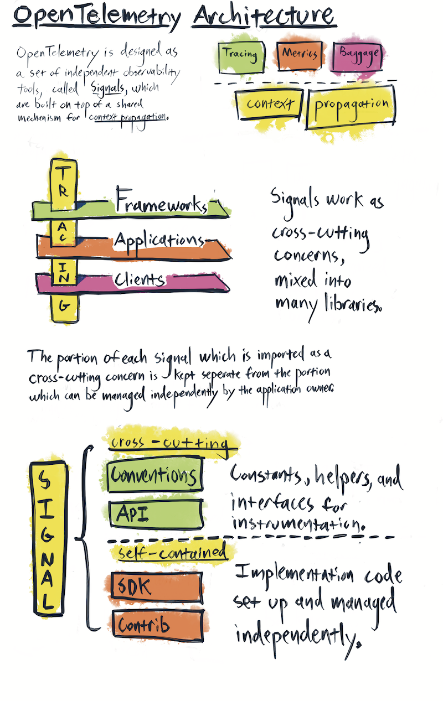

# Versioning and stability for OpenTelemetry clients

OpenTelemetry is a large project with strict compatibility requirements. This proposal defines the stability guarantees offered by the OpenTelemetry clients, along with a versioning and lifecycle proposal which defines how we meet those requirements.

Language implementations are expected to follow this proposal exactly, unless a language or package manager convention interferes significantly. Implementations must take this cross-language proposal, and produce a language-specific proposal which details how these requirements will be met.

Note: In this document, the term OpenTelemetry specifically refers to the OpenTelemetry clients. It does not refer to the specification or the Collector.

## Design goals

**Ensure that end users stay up to date with the latest release.**
We want all users to stay up to date with the latest version of OpenTelemetry. We do not want to create hard breaks in support, of any kind, which leave users stranded on older versions. It must always be possible to upgrade to the latest minor version of OpenTelemetry, without creating compilation or runtime errors.

**Never create a dependency conflict between packages which rely on different versions of OpenTelemetry. Avoid breaking all stable public APIs.**
Backwards compatibility is a strict requirement. Instrumentation APIs cannot create a version conflict, ever. Otherwise, OpenTelemetry cannot be embedded in widely shared libraries, such as web frameworks. Code written against older versions of the API must work with all newer versions of the API. Transitive dependencies of the API cannot create a version conflict. The OpenTelemetry API cannot depend on "foo" if there is any chance that any library or application may require a different, incompatible version of "foo." A library using OpenTelemetry should never become incompatible with other libraries due to a version conflict in one of OpenTelemetry's dependencies. Theoretically, APIs can be deprecated and eventually removed, but this is a process measured in years and we have no plans to do so.

**Allow for multiple levels of package stability within the same release.**
Provide maintainers a clear process for developing new, experimental APIs alongside stable APIs. DIfferent packages within the same release may have different levels of stability. This means that an implementation wishing to release stable tracing today must ensure that experimental metrics are factored out in such a way that breaking changes to metrics API do not destabilize the trace API packages.

## Relevant architecture

At the highest architectural level, OpenTelemetry is organized into signals. Each signal provides a specialized form of observability. For example, tracing, metrics, and baggage are three separate signals. Signals share a common subsystem – context propagation – but they function independently from each other.

Each signal provides a mechanism for software to describe itself. A codebase, such as an API handler or a database client, takes a dependency on various signals in order to describe itself. OpenTelemetry instrumentation code is then mixed into the other code within that codebase. This makes OpenTelemetry a **cross-cutting concern** - a piece of software which must be mixed into many other pieces of software in order to provide value. Cross-cutting concerns, by their very nature, violate a core design principle – separation of concerns. As a result, OpenTelemetry requires extra care and attention to avoid creating issues for the codebase which depend upon these cross-cutting APIs.

OpenTelemetry is designed to separate the portion of each signal which must be imported as cross-cutting concerns from the portions of OpenTelemetry which can be managed independently. OpenTelemetry is also designed to be an extensible framework. To accomplish this these goals, each signal consists of four types of packages:

**API -** API packages consist of the cross-cutting public interfaces used for instrumentation. Any portion of OpenTelemetry which 3rd-party libraries and application code depend upon is considered part of the API. To manage different levels of stability, every signal has its own, independent API package. These individual APIs may also be bundled up into a shared global API, for convenience.

**SDK -** The implementation of the API. The SDK is managed by the application owner. Note that the SDKs includes additional public interfaces which are not considered part of the API package, as they are not cross-cutting concerns. These public interfaces are defined as **constructors** and **plugin interfaces**. Examples of plugin interfaces include the SpanProcessor, Exporter, and Sampler interfaces. Examples of constructors include configuration objects, environment variables, and SDK builders. Application owners may interact with SDK constructors; plugin authors may interact with SDK plugin interfaces. Instrumentation authors must never directly reference any SDK package of any kind, only the API.

**Semantic Conventions -** A schema defining the attributes which describe common concepts and operations which the signal observes. Note that unlike the API or SDK, stable conventions for all signals may be placed in the same package, as they are often useful across different signals.

**Contrib –** plugins and instrumentation that make use of the API or SDK interfaces, but are not part of the core packages necessary for running OTel. The term "contrib" specifically refers to the plugins and instrumentation maintained by the OpenTelemetry organization outside of the SDK; it does not refer to third party plugins hosted elsewhere, or core plugins which are required to be part of the SDK release, such as OTLP Exporters and TraceContext Propagators. **API Contrib** refers to packages which depend solely upon the API; **SDK Contrib** refers to packages which also depend upon the SDK.

## Signal lifecycle

OpenTelemetry is structured around signals. Each signal represents a coherent, stand-alone set of functionality. Each signal follows a lifecycle.

### Lifecycle stages

**Experimental –** Breaking changes and performance issues may occur. Components may not be feature-complete. The experiment may be discarded.

**Stable –** Stability guarantees apply, based on component type (API, SDK, Conventions, and Contrib). Long term dependencies may now be taken against these packages.

**Deprecated –** this signal has been replaced but is still retains the same stability guarantees.

**Removed -** a deprecated signal is no longer supported, and is removed.

All signal components may become stable together, or one by one in the following order: API, Semantic Conventions, API Contrib, SDK, SDK Contrib.

When transitioning from experimental to stable to deprecated, packages **should not move or otherwise break how they are imported by users**. Do NOT use and "experimental" directory or package suffix.

Optionally, package **version numbers** MAY include a suffix, such as -alpha, -beta, -rc, or -experimental, to differentiate stable and experimental packages.

### Stability

Once a signal component is marked as stable, the following rules apply until the end of that signal’s existence.

**API Stability -**
No backward-incompatible changes to the API are allowed unless the major version number is incremented. All existing API calls must continue to compile and function against all future minor versions of the same major version. ABI compatibility for the API may be offered on a language by language basis.

**SDK Stability -**
Public portions of the SDK must remain backwards compatible. There are two categories: **plugin interfaces** and **constructors**. Examples of plugins include the SpanProcessor, Exporter, and Sampler interfaces. Examples of constructors include configuration objects, environment variables, and SDK builders.

ABI compatibility for SDK plugin interfaces and constructors may be offered on a language by language basis.

**Semantic Conventions Stability -**
Semantic Conventions may not be removed once they are stable. New conventions may be added to replace usage of older conventions, but the older conventions are never removed, they will only be marked as deprecated in favor of the newer ones.

**Contrib Stability -**
Plugins and instrumentation are kept up to date, and are released simultaneously (or shortly after) the latest release of the API. The goal is to ensure users can update to the latest version of OpenTelemetry, and not be held back by the plugins that they depend on.

Public portions of contrib packages (constructors, configuration, interfaces) must remain backwards compatible. ABI compatibility for contrib packages may be offered on a language by language basis.

Telemetry produced by contrib instrumentation must also remain stable and backwards compatible, to avoid breaking alerts and dashboards. This means that existing data may not be mutated or removed without a major version bump. Additional data may be added. This applies to spans, metrics, resources, attributes, events, and any other data types that OpenTelemetry emits.

### Deprecation

In theory, signals could be replaced. When this happens, they are marked as deprecated.

Code is only marked as deprecated when the replacement becomes stable. Deprecated code still abides by the same support guarantees as stable code. Deprecated APIs remain stable and backwards compatible.

### Removal

Packages are end-of-life’d by being removed from the release. The release then makes a major version bump.

We currently have no plans for deprecating signals or creating a major version past v1.0.

For clarity, it is still possible to create a new, backwards incompatible version of an existing type of signal without actually moving to v2.0 and breaking support. Allow me to explain.

Imagine we develop a new, better tracing API - let's call it AwesomeTrace. We will never mutate the current tracing API into AwesomeTrace. Instead, AwesomeTrace would be added as an entirely new signal which coexists and interoperates with the current tracing signal. This would make adding AwesomeTrace a minor version bump, *not* v2.0. v2.0 would mark the end of support for current tracing, not the addition of AwesomeTrace. And we don't want to ever end that support, if we can help it.

This is not actually a theoretical example. OpenTelemetry already supports two tracing APIs: OpenTelemetry and OpenTracing. We invented a new tracing API, but continue to support the old one.

## Version Numbers

OpenTelemetry follows [semver 2.0](https://semver.org/) conventions, with the following distinction.

OpenTelemetry clients have four components: API, Semantic Conventions, SDK, and Contrib.

For the purposes of versioning, all code within a component is treated as if it were part of a single package, and versioned with the same version number, except for Contrib, which may be a collection of packages versioned separately.

* All packages within the API share the same version number. API packages for all signals version together, across all signals. Signals do not have separate version numbers. There is one version number that applies to all signals that are included in the API release that is labeled with that particular version number.
* All packages within the SDK share the same version number. SDK packages for all signals version together, across all signals. There is one version number that applies to all signals that are included in the SDK release that is labeled with that particular version number.
* All Semantic Conventions are contained within a single package with a single version number.
* Each contrib package has it's own version.
* The API, SDK, Semantic Conventions, and contrib components are not required to share a version number. For example, the latest version of `opentelemetry-python-api` may be at v1.2.3, while the latest version of `opentelemetry-python-sdk` may be at v2.3.1.
* Different language implementations do not need to have matching version numbers. For example, it is fine to have `opentelemetry-python-api` at v1.2.8 when `opentelemetry-java-api` is at v1.3.2.
* Language implementations do not need to match the version of the specification they implement. For example, it is fine for v1.8.2 of `opentelemetry-python-api` to implement v1.1.1 of the specification.

**Exception:** in some languages, package managers may react poorly to experimental packages having a version higher than 0.X. In these cases, a language-specific workaround is required. Go, Ruby, and Javascript are examples.

**Major version bump**
Major version bumps only occur when there is a breaking change to a stable interface, or the removal of deprecated signals.

OpenTelemetry values long term support. The expectation is that we will version to v1.0 once the first set of packages are declared stable. OpenTelemetry will then remain at v1.0 for years. There are no plans for a v2.0 of OpenTelemetry at this time. Additional stable packages, such as metrics and logs, will be added as minor version bumps.

**Minor version bump**
Most changes to OpenTelemetry result in a minor version bump.

* New backward-compatible functionality added to any component.
* Breaking changes to internal SDK components.
* Breaking changes to experimental signals.
* New experimental packages are added.
* Experimental packages become stable.

**Patch version bump**
Patch versions make no changes which would require recompilation or potentially break application code. The following are examples of patch fixes.

* Bug fixes which don't require minor version bump per rules above.
* Security fixes.
* Documentation.

Currently, OpenTelemetry does NOT have plans to backport bug and security fixes to prior minor versions. Security and bug fixes are only applied to the latest minor version. We are committed to making it feasible for end users to stay up to date with the latest version of OpenTelemetry.

## Long Term Support

### API support

Major versions of the API will be supported for a minimum of **three years** after the release of the next major API version. Support covers the following areas.

API stability, as defined above, will be maintained.

A version of the SDK which supports the last major version of the API will continue to be maintained during this period. Bug and security fixes will be backported. Additional feature development is not guaranteed.

Contrib packages available when the API is versioned will continue to be maintained for the duration of this period. Bug and security fixes will be backported. Additional feature development is not guaranteed.

### SDK Support

SDK stability, as defined above, will be maintained for a minimum of **one year** after after the release of the next major SDK version.

### Contrib Support

Contrib stability, as defined above, will be maintained for a minimum of **one year** after after the release of the next major version of a contrib package.

## OpenTelemetry GA

The term “OpenTelemetry GA” refers to the point at which a stable version of both tracing and metrics has been released in at least three languages.
