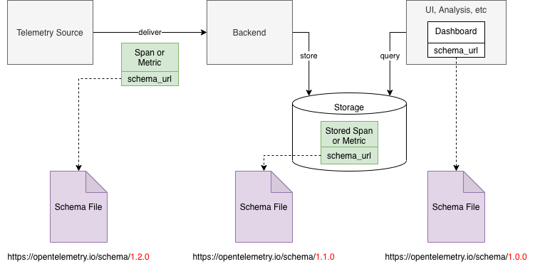
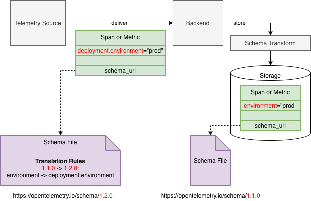
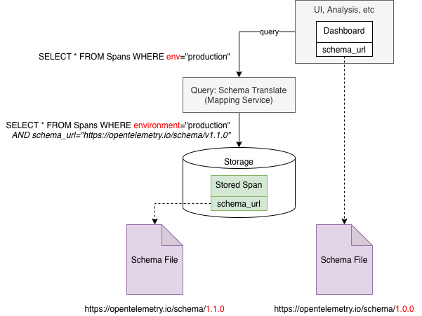
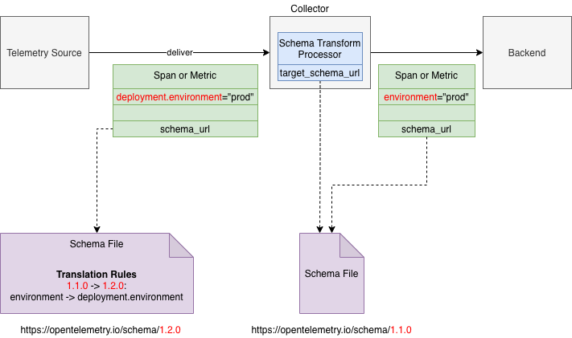

# Telemetry Schemas

* [Motivation](#motivation)
* [Solution Summary](#solution-summary)
* [What is Out of Scope](#what-is-out-of-scope)
* [Use Cases](#use-cases)
  * [Full Schema-Aware](#full-schema-aware)
  * [Collector-Assisted Schema Transformation](#collector-assisted-schema-transformation)
* [Schema URL](#schema-url)
* [Schema Version Number](#schema-version-number)
* [Schema File](#schema-file)
  * [all Section](#all-section)
  * [resources Section](#resources-section)
  * [spans Section](#spans-section)
    * [rename_attributes Transformation](#rename_attributes-transformation)
  * [span_events Section](#span_events-section)
    * [rename_events Transformation](#rename_events-transformation)
    * [rename_attributes Transformation](#rename_attributes-transformation-1)
  * [metrics Section](#metrics-section)
    * [rename_metrics Transformation](#rename_metrics-transformation)
    * [rename_attributes Transformation](#rename_attributes-transformation)
  * [logs Section](#logs-section)
    * [rename_attributes Transformation](#rename_attributes-transformation-2)
  * [Order of Transformations](#order-of-transformations)
  * [Schema File Format Number](#schema-file-format-number)
* [OTLP Changes](#otlp-changes)
* [API and SDK Changes](#api-and-sdk-changes)
* [OpenTelemetry Schema 1.0.0](#opentelemetry-schema-100)
* [Performance Impact](#performance-impact)
* [Open Questions](#open-questions)
* [Future Possibilities](#future-possibilities)
  * [Parent Schema](#parent-schema)
  * [Collector Processor](#collector-processor)
  * [Current State in Schema](#current-state-in-schema)
  * [Other Transformation Types](#other-transformation-types)
* [Alternates Considered](#alternates-considered)
  * [Name Aliases](#name-aliases)
  * [Schema Negotiation](#schema-negotiation)
* [Prior Art](#prior-art)
* [Appendix A. Example Schema File](#appendix-a-example-schema-file)

## Motivation

Telemetry sources such as instrumented applications and consumers of telemetry
such as observability backends sometimes make implicit assumptions about the
emitted telemetry. They assume that the telemetry will contain certain
attributes or otherwise have a certain shape and composition of data (this is
referred to as "telemetry schema" throughout this document).

This makes it difficult or impossible to change the composition of the emitted
telemetry data without breaking the consumers. For example changing the name of
an attribute of a span created by an instrumentation library can break the
backend if the backend expects to find that attribute by its name.

Semantic conventions are an important part of this problem. These conventions
define what names and values to use for span attributes, metric names and other
fields. If semantic conventions are changed the existing implementations
(telemetry source or consumers) need to be also changed correspondingly.
Furthermore, to make things worse, the implementations of telemetry sources and
implementations of telemetry consumers that work together and that depend on the
changed semantic convention need to be changed simultaneously, otherwise such
implementations will no longer work correctly together.

Essentially there is a coupling between 3 parties: 1) OpenTelemetry semantic
conventions, 2) telemetry sources and 3) telemetry consumers. The coupling
complicates the independent evolution of these 3 parties.

We recognize the following needs:

- OpenTelemetry semantic conventions need to evolve over time. When conventions
  are first defined, mistakes are possible and we may want to fix the mistakes
  over time. We may also want to change conventions to re-group the attributes
  into different namespaces as our understanding of the attribute taxonomy
  improves.

- Telemetry sources over time may want to change the schema of the telemetry
  they emit. This may be because for example the semantic conventions evolved
  and we want to make our telemetry match the newly introduced conventions.

- In an observability system there may simultaneously exist telemetry sources
  that produce data that conforms to different telemetry schemas because
  different sources evolve at a different pace and are implemented and
  controlled by different entities.

- Telemetry consumers have a need to understand what schema a particular piece
  of received telemetry confirms to. The consumers also need a way to be able to
  interpret the telemetry data that uses different telemetry schemas.

This document proposes a solution to these needs.

## Solution Summary

We believe that the 3 parties described above should be able to evolve
independently over time, while continuously retaining the ability to correctly
work together.

Telemetry Schemas are central to how we make this possible. Here is a summary of
the proposal:

- We introduce a file format for defining telemetry schemas.

- Telemetry schemas are versioned. Over time the schema may evolve and telemetry
  sources may emit data confirming to newer versions of the schema.

- Telemetry schemas explicitly define transformations that are necessary to
  convert telemetry data between different versions of the schema, provided that
  such conversions are possible. When conversions are not possible it
  constitutes a breaking change between versions.

- Telemetry schemas are identified by Schema URLs, that are unique for each
  schema version.

- Telemetry sources (e.g. instrumentation libraries) should include a schema URL
  in the emitted telemetry.

- Telemetry consumers should pay attention to the schema of the received
  telemetry. If necessary, telemetry consumers may transform the telemetry data
  from the received schema version to the target schema version as expected at
  the point of use (e.g. a dashboard may define which schema version it
  expects).

- OpenTelemetry will publish a telemetry schema as part of the specification.
  The schema will contain the list of transformations that semantic conventions
  undergo. The schema will be available to be referred and downloaded at well
  known URLs.

- OpenTelemetry instrumentation libraries will include the OpenTelemetry Schema
  URL in all emitted telemetry.

- OTLP will be modified to allow inclusion of a schema URL in the emitted
  telemetry.

- Third-party libraries, instrumentation or applications will be advised to
  define and publish their own telemetry schema if it is completely different
  from OpenTelemetry schema (or use OpenTelemetry schema) and include the schema
  URL in the emitted telemetry.

## What is Out of Scope

- The concept of schema defined in this proposal does not attempt to fully
  describe the shape of telemetry. The schema for example does not define all
  possible valid values for attributes or expected data types for metrics, etc.
  It is not a goal. Our goal is narrowly defined to solve the following problem
  only: to allow OpenTelemetry Semantic Conventions to evolve over time. For
  that reason this document is concerned with _changes_ to the schema as opposed
  to the _full state_ of the schema. We do not preclude this though: the schema
  file format is extensible and in the future may allow defining the full state
  of the schema, see [Current State in Schema](#current-state-in-schema) in
  Future Possibilities section).

- We intentionally limit the types of transformations of schemas to the bare
  minimum that is necessary to handle the most common changes that we believe
  OpenTelemetry Semantic Conventions will require in the near future. More types
  of transformations [may be proposed](#other-transformation-types) in the
  future. This proposal does not attempt to support a comprehensive set of
  possible transformation types that can handle all possible changes to schemas
  that we can imagine. That would be too complicated and very likely
  superfluous. Any new transformation types should be proposed and added in the
  future to the schema file format when there is an evidence that they are
  necessary for the evolution of OpenTelemetry.

## Use Cases

This section shows a couple interesting use-cases for the telemetry schemas
(other uses-cases are also possible, this is not an exhaustive list).

### Full Schema-Aware

Here is an example on a schema-aware observability system:



Let's have a closer look at what happens with the Telemetry Source and Backend
pair as the telemetry data is emitted, delivered and stored:



In this example the telemetry source produces spans that comply with version
1.2.0 of OpenTelemetry schema, where "deployment.environment" attribute is used
to record that the span is coming from production.

The telemetry consumer desires to store the telemetry in version 1.1.0 of
OpenTelemetry schema. The schema translator compares the schema_url in the
received span with the desired schema and sees that a version conversion is
needed. It then applies the change that is described in the schema file and
renames the attribute from "deployment.environment" to "environment" before
storing the span.

And here is for example how the schemas can be used to query stored data:



### Collector-Assisted Schema Transformation

Here is a somewhat different use case, where the backend is not aware of schemas
and we rely on OpenTelemetry Collector to translate the telemetry to a schema
that the backend expects to receive. The "Schema Translate Processor" is
configured, the target schema_url is specified and all telemetry data that
passes through the Collector is converted to that target schema:



## Schema URL

Schema URL is an identifier of a Schema. The URL specifies a location of a
[Schema File](#schema-file) that can be retrieved (so it is a URL and not just a
URI) using HTTP or HTTPS protocol.

Fetching the specified URL may return an HTTP redirect status code. The fetcher
MUST follow the HTTP standard and honour the redirect response and fetch the
file from the redirected URL.

The last part of the URL path is the version number of the schema.

```
http[s]://server[:port]/path/<version>
```

The part of the URL preceding the `<version>` is called Schema Family
identifier. All schemas in one Schema Family have identical Schema Family
identifiers.

To create a new version of the schema copy the schema file for the last version
in the schema family and add the definition of the new version. The schema file
that corresponds to the new version must be retrievable at a new URL.

Important: schema files are immutable once they are published. Once the schema
file is retrieved it is recommended to be cached permanently. Schema files may
be also packaged at build time with the software that anticipates it may need
the schema (e.g. the latest OpenTelemetry schema file can be packaged at build
time with OpenTelemetry Collector's schema translation processor).

## Schema Version Number

Version number follows the MAJOR.MINOR.PATCH format, similar to semver 2.0.

Version numbers use the [ordering rules](https://semver.org/#spec-item-11)
defined by semver 2.0 specification. See how ordering is used in the
[Order of Transformations](#order-of-transformations). Other than the ordering
rules the schema version numbers do not carry any other semantic meaning.

OpenTelemetry schema version numbers match OpenTelemetry specification version
numbers, see more details [here](#opentelemetry-schema).

## Schema File

A Schema File is a YAML file that describes the schema of a particular version.
It defines the transformations that can be used to convert the telemetry data
represented in any other older compatible version of the same schema family to
this schema version.

Here is the structure of the Schema File:

```yaml
# Defines the file format. MUST be set to 1.0.0.
file_format: 1.0.0

# The Schema URL that this file is published at. The version number in the URL
# MUST match the highest version number in the "versions" section below.
# Note: the schema version number in the URL is not related in any way to
# the file_format setting above.
schema_url: https://opentelemetry.io/schemas/1.2.0

# Definitions for each schema version in this family.
# Note: the ordering of versions is defined according to semver
# version number ordering rules.
versions:
  <version_number_last>:
    # definitions for this version. See details below.

  <version_number_previous>:
    # definitions for previous version
    ...
  <version_number_first>:
    # Defines the first version.
```

Each `<version_number>` section has the following structure:

```yaml
  <version_number>:
    all:
      changes:
        # sequence of transformations.

    resources:
      changes:
        # sequence of transformations.

    spans:
      changes:
        # sequence of transformations.

    span_events:
      changes:
        # sequence of transformations.

    metrics:
      changes:
        # sequence of transformations.

    logs:
      changes:
        # sequence of transformations.
```

There are 6 sub-sections under each version definition: "all", "resources",
"spans", "span_events", "metrics", "logs". The last 5 sub-sections in this list
contain definitions that apply only to the corresponding telemetry data type.
Section "all" contains definitions that apply to all types of telemetry data.

Below we describe each section in detail.

### all Section

"all" section in the schema file defines transformations. It must contain a
sub-section named "changes" that defines how attributes were renamed from the
previous version to this version.

The "changes" section is a sequence of transformations. Only one transformation
is supported for section "all": "rename_attributes" transformation.

"rename_attributes" transformation requires a map of key/value pairs, where the
key is the old name of the attribute used in the previous version, the value is
the new name of the attribute starting from this version. Here is the structure:

```yaml
    all:
      changes:
        - rename_attributes:
            attribute_map:
              # map of key/values.
```

The transformations in section "all" apply to the following telemetry data:
resource attributes, span attributes, span event attributes, log attributes,
metric attributes.

Important: when converting from the previous version to the current version the
transformation sequence in section "all" is performed first. After that the
transformations in the specific section ("resources", "spans", "span_events",
"metrics" or "logs") that correspond to the data type that is being converted
are applied.

Note that "rename_attributes" transformation in most cases is reversible. It is
possible to apply it backwards, so that telemetry data is converted from this
version to the previous version. The only exception is when 2 or more different
attributes in the previous version are renamed to the same attribute in the new
version. In that case the reverse transformation is not possible since it would
be ambiguous. When the reverse transformation is not possible it is considered
an incompatible change. In this case the MAJOR version number of the schema
SHOULD be increased in the new version.

### resources Section

"resources" section is very similar in its structure to "all". Like section
"all" the transformations in section "resources" may contain only
"rename_attributes" transformation.

The only difference from section "all" is that this transformation is only
applicable to Resource data type.

Here is the structure:

```yaml
    resources:
      changes:
        - rename_attributes:
            attribute_map:
              # map of key/values. The keys are the old attribute name used
              # the previous version, the values are the new attribute name
              # starting from this version.
```

### spans Section

"spans" section in the schema file defines transformations that are applicable
only to Span data type. It must contain a sub-section named "changes" that
defines a sequence of actions to be applied to convert Spans from the previous
version to this version.

One transformation is supported for section "span":  "rename_attributes".

#### rename_attributes Transformation

This is similar to the "rename_attributes" transformation supported in "all" and
"resource" sections. In addition it is also possible to optionally specify spans
that the transformation should apply to. Here is the structure:

```yaml
    spans:
      changes:
        - rename_attributes:
            attribute_map:
              # map of key/values. The keys are the old attribute name used
              # in the previous version, the values are the new attribute name
              # starting from this version.
```

### span_events Section

"spans_events" section in the schema file defines transformations that are
applicable only to Span's Event data type. It must contain a sub-section named
"changes" that defines a sequence of actions to be applied to convert events
from the previous version to this version.

Two transformations are supported for section "spans_events": "rename_events"
and "rename_attributes".

#### rename_events Transformation

This transformation allows to change event names. It is applied to all events or
only to events of spans that have the specified name. Here is the structure:

```yaml
    span_events:
      changes:
        - rename_events:
            name_map:
              # The keys are old event name used in the previous version, the
              # values are the new event name starting from this version.
```

#### rename_attributes Transformation

This is similar to the "rename_attributes" transformation supported in "all" and
"resource" sections. In addition it is also possible to optionally specify spans
and events that the transformation should apply to (both optional conditions
must match, if specified, for transformation to be applicable). Here is the
structure:

```yaml
    span_events:
      changes:
        - rename_attributes:
            attribute_map:
              # map of key/values. The keys are the old attribute name used
              # in the previous version, the values are the new attribute name
              # starting from this version.

            apply_to_spans:
              # Optional span names to apply to. If empty applies to all spans.

            apply_to_events:
              # Optional event names to apply to. If empty applies to all events.
```

### metrics Section

"metrics" section in the schema file defines transformations that are applicable
only to Metric data type. It must contain a sub-section named "changes" that
defines a sequence of actions to be applied to convert metrics from the previous
version to this version.

Two transformations are supported for section "metrics": "rename_metrics" and
"rename_attributes".

#### rename_metrics Transformation

This transformation allows to change metric names. It is applied to all metrics.
Here is the structure:

```yaml
    metrics:
      changes:
        - rename_metrics:
            # map of key/values. The keys are the old metric name used
            # in the previous version, the values are the new metric name
            # starting from this version.
```

#### rename_attributes Transformation

This is similar to the "rename_attributes" transformation supported in "span"
sections. Here is the structure:

```yaml
    metrics:
      changes:
        - rename_attributes:
            attribute_map:
              # map of key/values. The keys are the old attribute name used
              # in the previous version, the values are the new attribute name
              # starting from this version.

            apply_to_metrics:
              # Optional. If it is missing the transformation is applied
              # to all metrics. If it is present the transformation is applied
              # only to the metrics with the name that is found in the sequence
              # specified below.
```

### logs Section

"logs" section in the schema file defines transformations that are applicable
only to the Log Record data type. It must contain a sub-section named "changes"
that defines a sequence of actions to be applied to convert logs from the
previous version to this version.

One transformation is supported for section "logs": "rename_attributes".

#### rename_attributes Transformation

This is similar to the "rename_attributes" transformation supported in "spans"
section. Here is the structure:

```yaml
    logs:
      changes:
        - rename_attributes:
            attribute_map:
              # map of key/values. The keys are the old attribute name used
              # the previous version, the values are the new attribute name
              # starting from this version.
```

### Order of Transformations

When converting from older version X to newer version Y of the schema (both
belonging to the same schema family) the transformations specified in each
version in the range [X..Y] are applied one by one, i.e. first we convert from X
to X+1, then from X+1 to X+2, ..., Y-2 to Y-1, Y-1 to Y. (Note, version numbers
are not a continuum of integer numbers. The notion of adding a natural number 1
to the version number is a placeholder for the phrase "next newer version number
that is defined for this schema family".)

The transformations that are listed for a particular version X describe changes
that happened since the schema version that precedes version X and belongs to
the same schema family. These transformations are listed in 6 sections: "all",
"resources", "spans", "span_events", "metrics", "logs". Here is the order in
which the transformations are applied:

- Transformations in section "all" always are applied first, before any of the
  transformations in the other 5 sections.

- Transformations in section "spans" are applied before transformations in
  section "span_events".

- The order in which the transformations in remaining sections ("resources",
  "metrics", logs") are applied relative to each other or relative to "spans"
  section is undefined (since there are not-interdependencies, the order does
  not matter).

In the "changes" subsection of each particular one of these 6 sections the
sequence of transformations is applied in the order it is listed in the schema
file, from top to bottom.

When converting in the opposite direction, from newer version Y to older version
X the order of transformation listed above is exactly the reverse, with each
individual transformation also performing the reverse conversion.

### Schema File Format Number

The "file_format" setting in the schema file specifies the format version of the
file. The format version follows the MAJOR.MINOR.PATCH format, similar to semver
2.0.

The "file_format" setting is used by consumers of the file to know if they are
capable of interpreting the content of the file.

The current value for this setting is "1.0.0" and it will be published in
OpenTelemetry specification once this OTEP is accepted. Any change to this
number MUST follow the OTEP process and be published in the specification.

The current schema file format allows representing a limited set of
transformations of telemetry data. We anticipate that in the future more types
of transformations may be desirable to support or other, additional information
may be desirable to record in the schema file (see
[Future Possibilities](#future-possibilities)).

As the schema file format evolves over time the format version number SHOULD
change according to the following rules:

- PATCH number SHOULD be increased when the file format changes in a way that
  does not affect the existing consumers of the file. For example addition of a
  completely new section in the schema file that has no effect on existing
  sections and has no effect on any existing schema functionality may be done
  via incrementing the PATCH number only. This approach is only valid if the new
  setting in the file is completely and safely ignorable by all existing
  processing logic.

  For example adding a completely new section that describes the full state of
  the schema has no effect on existing consumers which only care about "changes"
  section (unless we explicitly define the semantics of the new section such
  that it _needs_ to be taken into account when processing schema changes). So,
  adding such a new section can be done using a PATCH number increase.

- MINOR number SHOULD be increased if a new setting is added to the file format
  in a backward compatible manner. "Backward compatible" in this context means
  that consumers that are aware of the new MINOR number can consume the file of
  a particular MINOR version number or of any MINOR version number lower than
  that, provided that MAJOR version numbers are the same. Typically, this means
  that the added setting in file format is optional and the default value of the
  setting matches the behavior of the previous file format version.

  Note: there is no "forward compatibility" based on MINOR version number.
  Consumers which support reading up to a particular MINOR version number SHOULD
  NOT attempt to consume files with higher MINOR version numbers.

- MAJOR number SHOULD be increased if the file format is changed in an
  incompatible way. For example adding a new transformation type in the
  "changes" section is an incompatible change because it cannot be ignored by
  existing schema conversion logic, so such a change will require a new MAJOR
  number.

Correspondingly:

- Consumers of the schema file SHOULD NOT attempt to interpret the schema file
  if the MAJOR version number is different (higher or lower) than what the
  consumer supports.

- Consumers of the schema file SHOULD NOT attempt to interpret the schema file
  if the MINOR version number is higher than what the consumer supports.

- Consumers MAY ignore the PATCH number.

To illustrate this with some examples:

<table>
  <tr>
   <td><strong>File Format Version</strong>
   </td>
   <td><strong>Consumer's Expected Version</strong>
   </td>
   <td><strong>Consumer Can Read?</strong>
   </td>
  </tr>
  <tr>
   <td>1.0.0
   </td>
   <td>1.0.0
   </td>
   <td>yes
   </td>
  </tr>
  <tr>
   <td>1.0.x
   </td>
   <td>1.0.y
   </td>
   <td>yes, for any x and y.
   </td>
  </tr>
  <tr>
   <td>1.a.x
   </td>
   <td>1.b.x
   </td>
   <td>if a&lt;b then yes, otherwise no.
   </td>
  </tr>
  <tr>
   <td>2.0.0
   </td>
   <td>1.x.y
   </td>
   <td>no
   </td>
  </tr>
</table>

## OTLP Changes

To allow carrying the Schema URL in emitted telemetry it is necessary to add a
schema_url field to OTLP messages.

We add schema_url fields to the following messages:

```protobuf
message ResourceSpans {
  ...
  // This schema_url applies to the "resource" field and to all spans and span events
  // in the "instrumentation_library_spans" except the spans and span events which
  // have a schema_url specified in the nested InstrumentationLibrarySpans message.
  string schema_url = 3;
}
message InstrumentationLibrarySpans {
  ...
  // This schema_url applies to all spans in the "spans" field regardless of the
  // value of the schema_url field in the outer ResourceSpans message.
  string schema_url = 3;
}

message ResourceMetrics {
  ...
  // This schema_url applies to the "resource" field and to all metrics in the
  // "instrumentation_library_metrics" except the metrics which have a schema_url
  // specified in the nested InstrumentationLibraryMetrics message.
  string schema_url = 3;
}
message InstrumentationLibraryMetrics {
  ...
  // This schema_url applies to all metrics in the "metrics" field regardless of the
  // value of the schema_url field in the outer ResourceMetrics message.
  string schema_url = 3;
}

message ResourceLogs {
  ...
  // This schema_url applies to the "resource" field and to all logs in the
  // "instrumentation_library_logs" except the logs which have a schema_url
  // specified in the nested InstrumentationLibraryLogs message.
  string schema_url = 3;
}
message InstrumentationLibraryLogs {
  ...
  // This schema_url applies to all logs in the "logs" field regardless of the
  // value of the schema_url field in the outer ResourceLogs message.
  string schema_url = 3;
}
```

The schema_url field in the ResourceSpans, ResourceMetrics, ResourceLogs
messages applies to the contained Resource, Span, SpanEvent, Metric, LogRecord
messages.

The schema_url field in the InstrumentationLibrarySpans message applies to the
contained Span and SpanEvent messages.

The schema_url field in the InstrumentationLibraryMetrics message applies to the
contained Metric messages.

The schema_url field in the InstrumentationLibraryLogs message applies to the
contained LogRecord messages.

If schema_url field is non-empty both in Resource message and in the contained
InstrumentationLibrary message then the value in InstrumentationLibrary
message takes the precedence.

## API and SDK Changes

### Instrumentation Library Schema URL

The OpenTelemetry API needs to be changed to allow getting a
Tracer/Meter/LogEmitter that is associated with a Schema URL (in addition to the
association with instrumentation library name and version that is already
supported).

This change needs to be done such that we do not break APIs that are already
declared stable (particularly the Get Tracer API).

Depending on the language the following approaches are possible:

- Add a third, optional parameter `schema_url` to Get Tracer/Get Meter/Get
  LogEmitter methods of corresponding providers. This may not be the right
  approach for languages where ABI stability is part of our guarantees since it
  likely breaks the ABI.

- Add a method overload that allows passing 3 parameters (instrumentation
  library name, version and schema url) to obtain a Tracer/Meter/LogEmitter.
  This is likely the preferred approach for languages where method overloads are
  possible.

- If neither of the above 2 approaches are possible to do in non-breaking manner
  then the API may introduce a `SetSchema(schema_url)` method to
  Tracer/Meter/LogEmitter instance. The method MUST be called only once and
  MUST be called before any telemetry is emitted using the instance.

There may be other ways to modify the API to allow the association with a Schema
URL. Language maintainers SHOULD choose the idiomatic way for their language.

The effect of associating a Schema URL with a Tracer/Meter/LogEmitter SHOULD be
that the schema_url in the InstrumentationLibrarySpans,
InstrumentationLibraryMetrics, InstrumentationLibraryLogs message for all the
telemetry emitted with the associated Tracer/Meter/LogEmitter is populated with
the provided Schema URL value.

If the Tracer/Meter/LogEmitter is not associated with a Schema URL then the
exporter MUST leave the schema_url field in OTLP messages unset, in which case
the application-wide Schema URL [will apply](#application-wide-schema-url).

Open Question: how to make it easy for instrumentation libraries to refer to a
particular OpenTelemetry schema version and also make sure any semantic
convention helpers the library uses (e.g. constants that define the semantic
conventions) match exactly that same schema version? One possible solution is to
introduce helper packages per schema version that the libraries can use, e.g.
constants that define the semantic conventions and the corresponding schema
version url. This should be likely the topic for a follow-up OTEP.

### Application-wide Schema URL

The SDK interface MUST provide a way for the user to optionally set an
application-wide Schema URL. This Schema URL will be populated in all
ResourceSpans, ResourceMetrics and ResourceLogs messages emitted by OTLP
Exporter.

If the user does not set an application-wide Schema URL then the current Schema
URL MUST be populated by OTLP Exporter in the messages, where "current" means
the version of OpenTelemetry Schema against which the SDK is coded.

Note that if there is a schema url associated with instrumentation library it
overrides the application-wide schema url as described [here](#otlp-changes).

## OpenTelemetry Schema

OpenTelemetry publishes it own schema at
`https://opentelemetry.io/schemas/<version>`. The version number of the schema
is the same as the specification version number which publishes the schema.
Every time a new specification version is released a corresponding new schema
MUST be released simultaneously. If the specification release did not introduce
any change the "changes" section of the corresponding version in the schema file
will be empty.

As of the time of this proposal the specification is at version 1.2.0 and the
corresponding schema file if it was published with the specification would look
like this:

```yaml
file_format: 1.0.0
schema_url: https://opentelemetry.io/schemas/1.2.0
versions:
  1.2.0:
```

Since 1.2.0 is the first published version of OpenTelemetry schema there are no
"changes" section and we omitted all previous versions from the file since there
is nothing to record for earlier versions.

This file SHOULD be available for retrieval at
[https://opentelemetry.io/schemas/1.2.0](https://opentelemetry.io/schemas/1.2.0)

All OpenTelemetry instrumentation solutions will follow this schema.

## Performance Impact

Performance impact of the changes to OTLP protocol are negligible provided that
schema conversion is not necessary. The cost of recording the schema_url by
telemetry sources and the cost of checking the schema_url field in telemetry
consumers is negligible compared to other costs. When the telemetry schema
matches the expected schema there is no additional work involved at all.

When the schema version does not match and it is necessary to perform conversion
the performance impact of the schema conversions depend on the volume and type
of transformations can be significant. We
[benchmarked](https://github.com/tigrannajaryan/telemetry-schema/blob/main/schema/perf_test.go)
one use-case where the telemetry schema conversion of spans and metrics from one
version to another is performed using a Go implementation.

The benchmark does the following:

- Compares the CPU time necessary for schema conversion to the time necessary
  for Protobuf decoding. This is a useful comparison because telemetry consumers
  have to perform Protobuf decoding so it is the minimum baseline work against
  which we can measure the impact of the additional conversion work.

- Uses a hypothetical schema version change where 20 attributes in semantic
  conventions were renamed.

- Uses data composed of batches of 100 spans each with 10 attributes or 100
  metric data points (Int64 Gauge type) with 2 attributes per data point. Each batch
  is associated with one resource that has 20 attributes.

Here are the benchmark results:

```
BenchmarkDecode/Trace/Attribs-8             6121            919271 ns/op
BenchmarkDecode/Metric/Int64-8              9516            635418 ns/op
BenchmarkDecodeAndConvertSchema/Trace/Attribs-8  5988       943158 ns/op
BenchmarkDecodeAndConvertSchema/Metric/Int64-8   8588       653266 ns/op
```

BenchmarkDecode is decoding time only. BenchmarkDecodeAndConvertSchema is
decoding plus schema conversion time. We see that the processing time to do the
conversion is about 3% of decoding time.

The benchmarking done is for illustration purposes only. Real-world results will
depend on the composition of the data, the volume of transformations done during
conversion, programming language used, etc. However, we feel that this one data
point is still useful for understanding that the potential impact is acceptable
(and likely will be a very small percentage of total processing most telemetry
consumers do).

## Open Questions

- Do we need to support a concept of "pre-release" semantic conventions that can
  be broken freely and are not part of strict schema checks? Supposedly, this is
  already possible simply by avoiding introducing a new schema version when such
  semantic conventions change.

- How to make it easy for instrumentation libraries to refer to a particular
  OpenTelemetry schema version and also make sure any semantic convention
  helpers the library uses (e.g. constants that define the semantic conventions)
  match exactly that same schema version? One possible solution is to introduce
  helper packages per schema version that the libraries can use, e.g. constants
  that define the semantic conventions and the corresponding schema version url.
  This should be likely the topic for a follow-up OTEP.

- Should we make it possible to include the entire Schema File in OTLP requests
  in addition to the Schema URL so that recipients of the OTLP request do not
  have to fetch the Schema File (which may potentially be impossible if there
  are network issues)?

## Future Possibilities

### Parent Schema

A schema can optionally have a _parent_ schema (so for example a custom schema
can be based on OpenTelemetry schema, which will be the parent in that case). A
schema that does not have a parent is called a _root_ schema (so OpenTelemetry
schema will be a root schema). We may have more than one root schema (which
opens up interesting possibilities, but this discussion is out of scope of this
proposal).

All schemas therefore form a set of rooted trees, where nodes represent schema
versions and pairs of nodes are connected via edges of two types: 1)
parent-child relationship, 2) consecutive versions in the same schema family.
Each edge in the tree represents a schema transformation.

Once we have the tree of schemas it is possible to then convert from a node in a
tree to another node in a tree given that the nodes are connected via a path
through edges.

Further research is needed in this area if we find that we need this concept of
parent schemas.

### Current State in Schema

The schema file in this OTEP describes changes from version to version. This is
very useful for performing conversions between versions but it does not capture
the current state of a particular version.

We can add an ability to specify the full current schema of each particular
version in the schema file (in addition to the "changes" section). This will
open up a few interesting possibilities:

- Automatic validation that emitted telemetry confirms to the declared schema.

- OpenTelemetry semantic conventions document can be automatically generated
  from this formal schema file. This will remove the need to have semantic
  conventions codified and generated from yaml files in the specification.

- Consumers of telemetry can use this information to interpret the received
  telemetry.

- It may be possible to auto-generate the "changes" section in schema files as a
  delta between full states of versions.

An example of what can be recorded as the "current state" is the encoding of the
Body of the Log Records. It was described as a concept in
[this earlier proposal](https://docs.google.com/document/d/1ZExye1lW43owwaxcbjOvl0P2qER-UaYd_MyxItc2h0k/edit#).
The suggestion was to record the encoding of the Body field of Log Records,
which can be also implemented as a new setting in the "current state" of the
"logs" section in the schema file.

### Other Transformation Types

This OTEP introduces a limited set of transformations, while deliberately
keeping the type of transformations to a minimum. It is easy to see that
telemetry can evolve in other, more sophisticated ways over time (see e.g.
[this list](https://github.com/open-telemetry/opentelemetry-specification/issues/1324)).

More transformation types can be added in the future when there is a need to
represent a particular change in the telemetry schema that is not possible with
the current set of transformations. However, care should be taken to avoid
introducing unnecessary or overly complicated transformation types, especially
ones that cannot be applied on a local portion of telemetry data and requires a
full state (e.g. transformations, such as aggregations, etc), since such
transformations can place significant implementation burden on telemetry sources
that wish to support the notion of telemetry schemas.

### Version Convertability

Depending on the changes that happened it may or may not be possible to convert
telemetry from one version to another in a lossless and unambiguous way. When
such conversion is possible we say that the schema is "convertible" from one
particular version to another.

Generally, given an set of possible transformations and a pair of versions X and
Y, it may be the converting telemetry from X to Y is possible, while the
opposite direction - converting from Y to X is not possible.

The transformations defined in this proposal make all conversions from older
schema versions to new versions possible. The opposite direction in some case
may not be possible (see for example the explanation about reversible
transformation [all Section](#all-section)).

In the future we may also want to add ability to explicitly declare schema
versions as non convertible. This may be necessary to express the fact that the
schema has changed in a way that makes it incompatible, but schema file
transformations alone are not expressive enough to describe that fact.

## Alternates Considered

### Freeze Schema

Instead of introducing formal schemas, schema files and version we can require
that the instrumentation once it is created never changes. Attributes are never
renamed, the emitted telemetry always remains the same, with the exception of
changes that cannot affect existing telemetry consumers.

This was considered but does not seem to be an acceptable proposal. Mistakes
happen, semantic conventions may need to be changed because they were
incorrectly defined, there may be bugs in instrumentation that need to be fixed,
etc. We believe that attempting to freeze the schema and only allow fully
backward compatible changes in emitted telemetry is too restrictive and very
difficult to follow long term.

### Name Aliases

This approach solves a smaller subset of schema evolution problems: change of
names of attributes, metrics, etc.

When such changes happen the telemetry sources can continue producing telemetry
using old attribute names, and also add attributes that have the new name and
exact same value as the old attribute. So, the telemetry data at the same time
has aliases of attributes recorded.

Because both old and new names are present in any emitted telemetry the
consumers of the telemetry can just continue assuming that the attributes they
are interested in are present. There is no formal schema management in this
approach. We simply publish the same telemetry data in a way that both old and
new consumers can find the bits they are looking for.

The benefit of this approach is that it is much simpler than proposed in this
document.

The downsides of this approach are:

- It can handle limited types of schema changes. It is easy to demonstrate that
  some changes that can be easily handled via more formal schemas concept will
  fail if we use the aliases approach (e.g. swapping of attribute names X and Y
  cannot be handled by aliases).

- Over time more and more data should be published increasing the volume of the
  published data. Depending on how exactly the aliases handled we may need to
  duplicate a lot (e.g. if metric name has change we may have to produce the
  entire same metric twice, essentially duplicating the traffic) or may require
  breaking changes in the OpenTelemetry API or protocol to allow aliases
  natively.

### Schema Negotiation

Instead of performing transformations of the schema let telemetry consumers
(backends) negotiate the version they expect to receive from the telemetry
source.

The benefit of this approach is that the backend can support just one schema,
there is no need to define transformation rules or do the transformations at
all.

The downsides are:

- Requires telemetry sources to be able to emit telemetry in multiple different
  schema versions, which is a significant burden on the telemetry sources. This
  is likely a dealbreaker.

- Requires a communication channel from telemetry consumers to telemetry sources
  which currently does not exist (all communication is currently
  one-directional, from sources to consumers).

## Prior Art

- [OpenTelemetry Log Data Model: Body Meta-Data](https://docs.google.com/document/d/1ZExye1lW43owwaxcbjOvl0P2qER-UaYd_MyxItc2h0k/edit#)
  by Christian Beedgen.

- [Generic event encoding schemas](https://docs.google.com/document/d/11ccT_zBbiCfwKyi6TMuy2sA3nUdElNQsDJOQ79icVKs/edit#)
  by Josh MacDonald.

- [Structured Logging Payloads](https://docs.google.com/document/d/1Xu2tCU5vjw8RNqzqFD6y9ZwBqNtg_RKW_HzB72bd4KQ/edit#)
  by David Poncelow.

- [Versioning of Attributes](https://github.com/cloudevents/spec/blob/v1.0/primer.md#versioning-of-attributes)
  and
  [dataschema](https://github.com/cloudevents/spec/blob/v1.0/spec.md#dataschema)
  field in CloudEvents specification.

- Splunk
  [sourcetype](https://docs.splunk.com/Documentation/Splunk/8.1.3/Data/Whysourcetypesmatter)
  field.

## Appendix A. Example Schema File

```yaml
# Defines the file format. MUST be set to 1.0.0.
file_format: 1.0.0

# The Schema URL that this file is published at. The version number in the URL
# MUST match the highest version number in the "versions" section below.
# Note: the schema version number in the URL is not related in any way to
# the file_format setting above.
schema_url: https://opentelemetry.io/schemas/1.1.0

# Definitions for each schema version in this family.
# Note: the ordering of versions is defined according to semver
# version number ordering rules.
versions:
  1.1.0:
    # Definitions for version 1.1.0.
    all:
      # Definitions that apply to all data types.
      changes:
        # Transformations to apply when converting from version 1.0.0 to 1.1.0.
        - rename_attributes:
            # map of key/values. The keys are the old attribute name used
            # the previous version, the values are the new attribute name
            # starting from this version.
            # Rename k8s.* to kubernetes.*
            k8s.cluster.name: kubernetes.cluster.name
            k8s.namespace.name: kubernetes.namespace.name
            k8s.node.name: kubernetes.node.name
            k8s.node.uid: kubernetes.node.uid
            k8s.pod.name: kubernetes.pod.name
            k8s.pod.uid: kubernetes.pod.uid
            k8s.container.name: kubernetes.container.name
            k8s.replicaset.name: kubernetes.replicaset.name
            k8s.replicaset.uid: kubernetes.replicaset.uid
            k8s.cronjob.name: kubernetes.cronjob.name
            k8s.cronjob.uid: kubernetes.cronjob.uid
            k8s.job.name: kubernetes.job.name
            k8s.job.uid: kubernetes.job.uid
            k8s.statefulset.name: kubernetes.statefulset.name
            k8s.statefulset.uid: kubernetes.statefulset.uid
            k8s.daemonset.name: kubernetes.daemonset.name
            k8s.daemonset.uid: kubernetes.daemonset.uid
            k8s.deployment.name: kubernetes.deployment.name
            k8s.deployment.uid: kubernetes.deployment.uid

    resources:
      # Definitions that apply to Resource data type.
      changes:
        - rename_attributes:
            telemetry.auto.version: telemetry.auto_instr.version

    spans:
      # Definitions that apply to Span data type.
      changes:
        - rename_attributes:
            attribute_map:
              # map of key/values. The keys are the old attribute name used
              # in the previous version, the values are the new attribute name
              # starting from this version.
              peer.service: peer.service.name

    span_events:
      # Definitions that apply to Span Event data type.
      changes:
        - rename_events:
            # The keys are old event name used in the previous version, the
            # values are the new event name starting from this version.
            name_map: {stacktrace: stack_trace}

        - rename_attributes:
            attribute_map:
              peer.service: peer.service.name
            apply_to_events:
              # Optional event names to apply to. If empty applies to all events.
              - exception.stack_trace

    metrics:
      # Definitions that apply to Metric data type.
      changes:
        - rename_metrics:
            # map of key/values. The keys are the old metric name used
            # in the previous version, the values are the new metric name
            # starting from this version.
            container.cpu.usage.total: cpu.usage.total
            container.memory.usage.max: memory.usage.max

        - rename_attributes:
            attribute_map:
              status: state
            apply_to_metrics:
              # Optional. If it is missing the transformation is applied
              # to all metrics. If it is present the transformation is applied
              # only to the metrics with the name that is found in the sequence
              # specified below.
              - system.cpu.utilization
              - system.memory.usage
              - system.memory.utilization
              - system.paging.usage

    logs:
      # Definitions that apply to LogRecord data type.
      changes:
        - rename_attributes:
            attribute_map:
              process.executable_name: process.executable.name

  1.0.0:
    # First version of this schema family.
```
