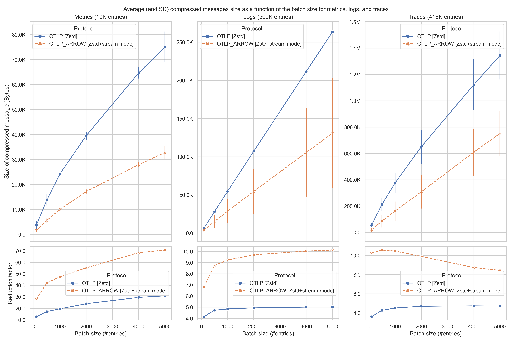
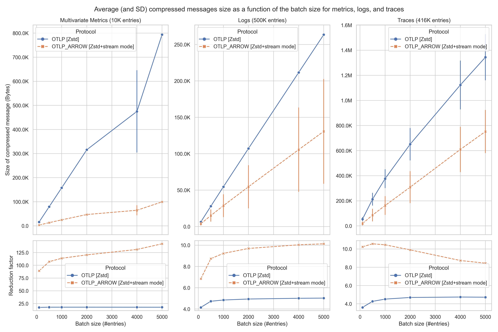
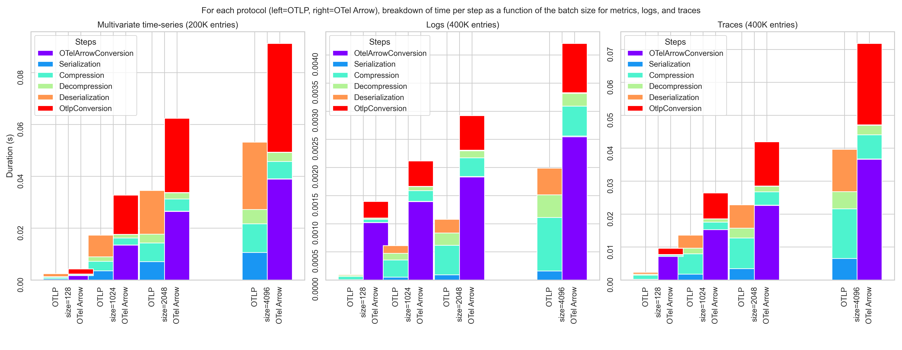
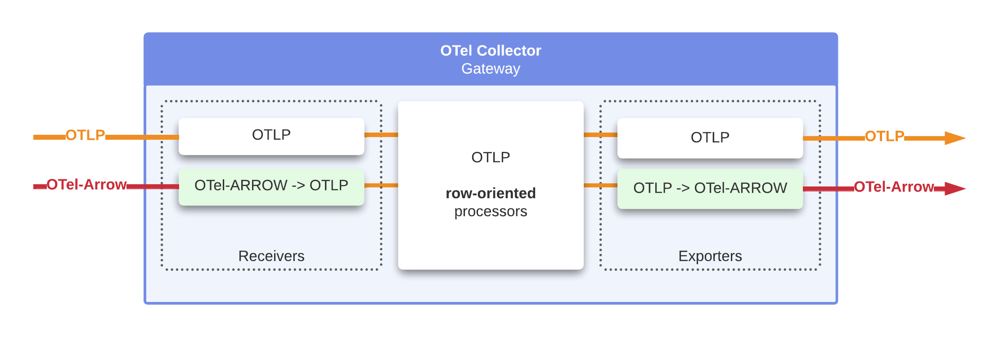
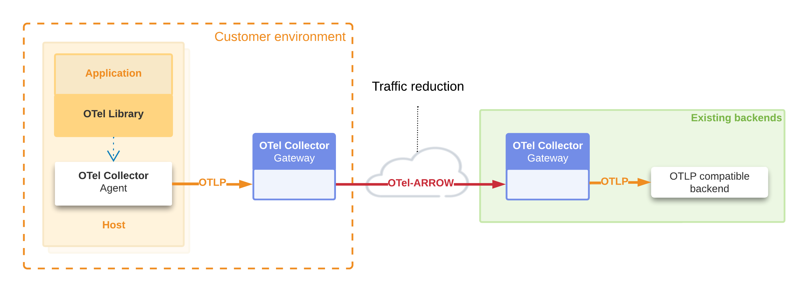
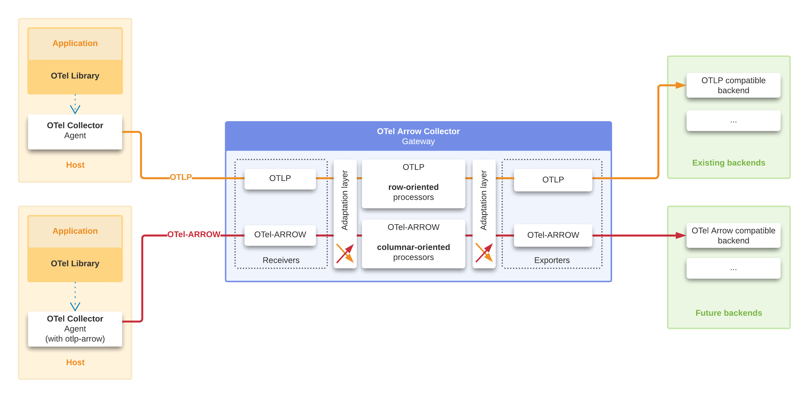
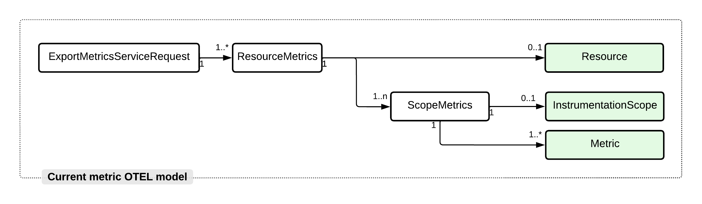
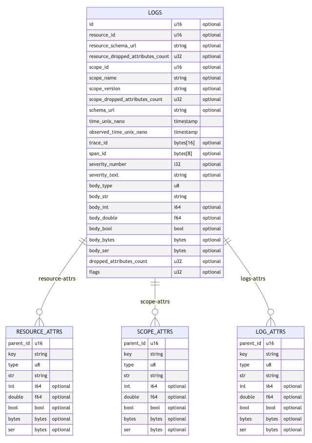
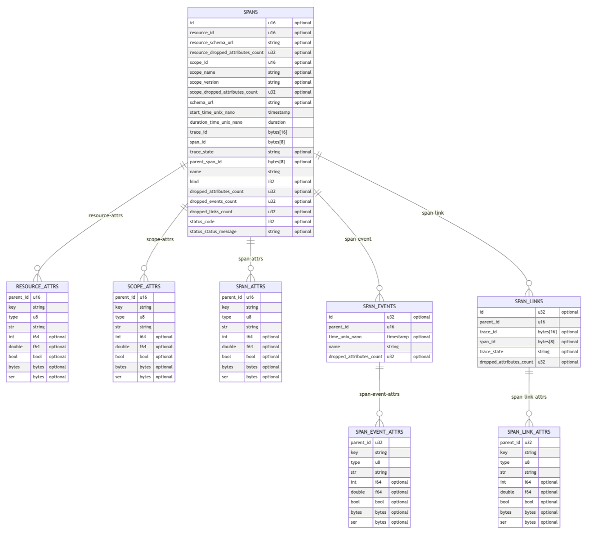
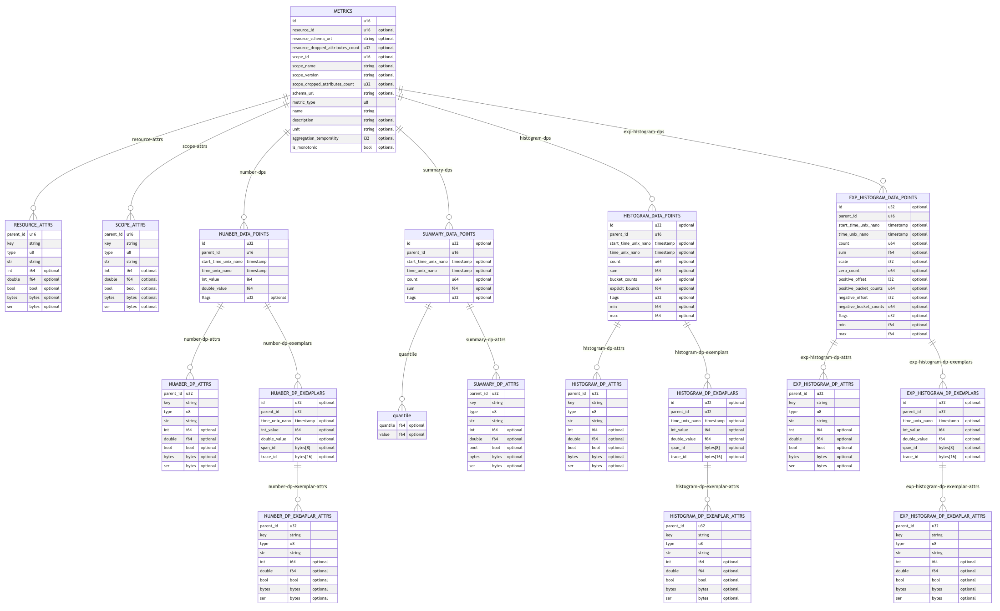

# OTel Arrow Protocol Specification

**Author**: Laurent Querel, F5 Inc.

**Keywords**: OTLP, Arrow Columnar Format, Bandwidth Reduction, Multivariate Time-series, Logs, Traces.

**Abstract**: This OTEP describes a new protocol, the OTelArrow protocol, which is based on a **generic columnar representation
for metrics, logs and traces**.  This protocol significantly improves efficiency in scenarios involving the transmission
of large batches of metrics, logs, traces. Moreover, it provides a better representation for [multivariate time-series](#multivariate-time-series).
The OTelArrow protocol also supports a fallback mechanism to the [OpenTelemetry protocol (OTEP 0035)](https://github.com/open-telemetry/oteps/blob/main/text/0035-opentelemetry-protocol.md)
in instances when one of the endpoints does not support the OTelArrow protocol.

**Reference implementation**: The [OTel Arrow Adapter](https://github.com/f5/otel-arrow-adapter) Go library specifies
the protobuf spec, and implements the OTel Arrow Encoder/Decoder (main contributor [Laurent Querel](https://github.com/lquerel)).
An [experimental OTel Collector](https://github.com/open-telemetry/experimental-arrow-collector) has been implemented to
expose the new gRPC endpoint and to provide OTel Arrow support via the previous library (main contributor [Joshua MacDonald](https://github.com/jmacd)).

## Table of contents

* [Introduction](#introduction)
  * [Motivation](#motivation)
  * [Validation](#validation)
  * [Why Apache Arrow and How to Use It?](#why-apache-arrow-and-how-to-use-it)
  * [Integration Strategy and Phasing](#integration-strategy-and-phasing)
* [Protocol Details](#protocol-details)
  * [ArrowStreamService](#arrowstreamservice)
  * [Mapping OTel Entities to Arrow Records](#mapping-otel-entities-to-arrow-records)
    * [Logs Arrow Mapping](#logs-arrow-mapping)
    * [Spans Arrow Mapping](#spans-arrow-mapping)
    * [Metrics Arrow Mapping](#metrics-arrow-mapping)
* [Implementation Recommendations](#implementation-recommendations)
  * [Protocol Extension and Fallback Mechanism](#protocol-extension-and-fallback-mechanism)
  * [Batch ID Generation](#batch-id-generation)
  * [Schema ID Generation](#schema-id-generation)
  * [Traffic Balancing Optimization](#traffic-balancing-optimization)
  * [Throttling](#throttling)
  * [Delivery Guarantee](#delivery-guarantee)
* [Risks and Mitigation](#risks-and-mitigations)
* [Trade-offs and Mitigations](#trade-offs-and-mitigations)
  * [Duplicate Data](#duplicate-data)
  * [Incompatible Backends](#incompatible-backends)
  * [Small Devices/Small Telemetry Data Stream](#small-devicessmall-telemetry-data-stream)
* [Future Versions and Interoperability](#future-versions-and-interoperability)
* [Prior Art and Alternatives](#prior-art-and-alternatives)
* [Open Questions](#open-questions)
* [Future Possibilities](#future-possibilities)
* [Appendix A - Protocol Buffer Definitions](#appendix-a---protocol-buffer-definitions)
* [Glossary](#glossary)
* [Acknowledgements](#acknowledgements)

## Introduction

### Motivation

As telemetry data becomes more widely available and volumes increase, new uses and needs are emerging for the OTLP
ecosystem: cost-effectiveness, advanced data processing, data minimization. This OTEP aims to improve the OTLP
protocol to better address them while maintaining compatibility with the existing ecosystem.

Currently, the OTLP protocol uses a "row-oriented" format to represent all the OTel entities. This representation works
well for small batches (<50 entries) but, as the analytical database industry has shown, a "column-oriented"
representation is more optimal for the transfer and processing of *large batches* of entities. The term "row-oriented"
is used when data is organized into a series of records, keeping all data associated with a record next to each other in
memory. A "column-oriented" system organizes data by fields, grouping all the data associated with a field next to each
other in memory. The main benefits of a columnar approach are:

* **better data compression rate** (arrays of similar data generally compress better),
* **faster data processing** (see diagram below),
* **faster serialization and deserialization** (few arrays vs many in-memory objects to serialize/deserialize),
* **better IO efficiency** (less data to transmit).


This OTEP proposes to improve the [OpenTelemetry protocol (OTEP 0035)](https://github.com/open-telemetry/oteps/blob/main/text/0035-opentelemetry-protocol.md)
with a **generic columnar representation for metrics, logs and traces based on Apache Arrow**. Compared to the existing
OpenTelemetry protocol this compatible extension has the following improvements:

* **Reduce the bandwidth requirements** of the protocol. The two main levers are: 1) a better representation of the
  telemetry data based on a columnar representation, 2) a stream-oriented gRPC endpoint that is more efficient to
  transmit batches of OTLP entities.
* **Provide a more optimal representation for multivariate time-series data**.
  Multivariate time-series are currently not well compressed in the existing protocol (multivariate = related metrics
  sharing the same attributes and timestamp). The OTel Arrow protocol provides a much better compression rate for this
  type of data by leveraging the columnar representation.
* **Provide more advanced and efficient telemetry data processing capabilities**. Increasing data volume, cost
  efficiency, and data minimization require additional data processing capabilities such as data projection,
  aggregation, and filtering.

These improvements not only address the aforementioned needs but also answer the [open questions](https://github.com/open-telemetry/oteps/blob/main/text/0035-opentelemetry-protocol.md#open-questions)
cited in OTEP 035 (i.e. cpu usage, memory pressure, compression optimization).

**It is important to understand that this proposal is complementary to the existing protocol. The row-oriented version
is still suitable for some scenarios. Telemetry sources that generate a small amount of telemetry data should continue
to use it. On the other side of the spectrum, sources and collectors generating or aggregating a large amount of
telemetry data will benefit from adopting this extension to optimize the resources involved in the transfer and
processing of this data. This adoption can be done incrementally.**

Before detailing the specifications of the OTel Arrow protocol, the following two sections present: 1) a validation of
the value of a columnar approach based on a set of benchmarks, 2) a discussion of the value of using Apache Arrow as a
basis for columnar support in OTLP.

### Validation

A series of tests were conducted to compare compression ratios between OTLP and a columnar version of OTLP called OTel
Arrow. The key results are:

* For univariate time series, OTel Arrow is **2 to 2.5 better in terms of bandwidth reduction while having an
  end-to-end speed (including conversion to/from OTLP) 1.5 to 2 times slower in phase 1**. In **phase 2** the conversion
  OTLP to/from Arrow is gone and the end-to-end speed is **3.1 to 11.2 times faster by our estimates**.
* For multivariate time series, OTel Arrow is **3 to 7 times better in terms of bandwidth reduction while having an
  end-to-end speed (including conversion to/from OTLP) similar to the univariate time series scenario phase 1**. Phase 2
  has been yet estimated but similar results are expected.
* For logs, OTel Arrow is **1.6 to 2 times better in terms of bandwidth reduction while having an end-to-end speed
  (including conversion to/from OTLP) 2.0 to 3.5 times slower in phase 1**. In **phase 2** the conversion
  OTLP to/from Arrow is gone and the end-to-end speed is **2.3 to 4.86 times faster** by our estimates.
* For traces, OTel Arrow is **1.7 to 2.8 times better in terms of bandwidth reduction while having an end-to-end speed
  (including conversion to/from OTLP) 1.5 to 2.1 times slower in phase 1**. In **phase 2** the conversion
  OTLP to/from Arrow is gone and the end-to-end speed is **3.37 to 6.16 times faster** by our estimates.

The following 3 columns charts show the results of the benchmarks for the univariate metrics, logs and traces. For both
protocols, the baseline is the size of the uncompressed OTLP messages. The reduction factor is the ratio between this
baseline and the compressed message size for each protocol. The compression algorithm used is ZSTD for OTLP and OTel
Arrow.



In the following 3-columns charts, the only difference with the previous ones is that the metrics are multivariate. The
benchmarks show that the compression ratio is much better for OTel Arrow than for OTLP. This is due to the fact that
OTel Arrow is able to leverage the columnar representation to compress the data more efficiently in a multivariate
scenario.



The following stacked bar graphs compare side-by-side the distribution of time spent for each step and for each
version of the protocol.


[Zoom on the chart](https://raw.githubusercontent.com/lquerel/oteps/main/text/img/0156_summary_time_spent.png)

> In conclusion, these benchmarks demonstrate the interest of integrating a column-oriented telemetry data protocol to
> optimize bandwidth and processing speed in a batch processing context.

### Why Apache Arrow and How to Use It?

[Apache Arrow](https://arrow.apache.org/) is a versatile columnar format for flat and hierarchical data, well
established in the industry. Arrow is optimized for:

* column-oriented data exchange based on an in-memory format common among implementations, regardless of the language.
The use of a serialization and deserialization mechanism is thus eliminated, allowing zero-copy.
* in-memory analytic operations using modern hardware optimizations (e.g. SIMD)
* integration with a large ecosystem (e.g. data pipelines, databases, stream processing, etc.)
* language-independent

All these properties make Arrow a great choice for a general-purpose telemetry protocol. Efficient implementations of
Apache Arrow exist for most of the languages (Java, Go, C++, Rust, ...). Connectors with Apache Arrow buffer exist for
well-known file format (e.g. Parquet) and for well-known backend (e.g. BigQuery).
By reusing this existing infrastructure (see [Arrow ecosystem](https://arrow.apache.org/powered_by/)), we are accelerating the development and
integration of the OpenTelemetry protocol while expanding its scope of application.

Adapting the OTLP data format to the Arrow world (see below) is only part of the problem this proposal aims to describe.
Many other design choices and trade-offs have been made, such as:

- the organization of the data (i.e. schema and sorting) and the selection of the compression algorithm to optimize the compression ratio.
- the way to serialize the Arrow data, the metadata, the dictionaries, and the selection of the transfer mode (reply/reply vs. bi-dir stream).
- optimization of many parameters introduced in the system.


### Integration Strategy and Phasing

This OTEP enhances the existing OTel eco-system with an additional representation of telemetry data in columnar form to
better support certain scenarios (e.g. cost-effectiveness to transmit large batch, multivariate time-series, advanced
data processing, data minimization). All existing components will continue to be compatible and operational.

A two-phase integration is proposed to allow incremental benefits.

#### Phase 1

This proposal is designed as a new protocol compatible with the OTLP protocol. As illustrated in the
following diagram, a new OTel Arrow receiver will be responsible for translating this new protocol to the
OTLP protocol. Similarly, a new exporter will be responsible for translating the OTLP messages into this new Arrow-based
format.



This first step is intended to address the specific use cases of **traffic reduction** and native support of
**multivariate time-series**. Based on community feedback, many companies want to reduce the cost of transferring
telemetry data over the Internet. By adding a collector that acts as a point of integration and traffic conversion at
the edge of a client environment, we can take advantage of the columnar format to eliminate redundant data and optimize
the compression ratio. This is illustrated in the following diagram.



> Note 1: A fallback mechanism can be used to handle the case where the new protocol is not supported by the target.
> More on this mechanism in this [section](#protocol-extension-and-fallback-mechanism).

#### Phase 2

Phase 2 aims to extend the support of Apache Arrow end-to-end and more specifically inside the collector to better
support the following scenarios: cost efficiency, advanced data processing, data minimization. New receivers, processors,
and exporters supporting Apache Arrow natively will be developed. A bidirectional adaptation layer OTLP / OTel Arrow
will be developed within the collector to continue supporting the existing ecosystem. The following diagram is an
overview of a collector supporting both OTLP and an end-to-end OTel Arrow pipeline.



Implementing an end-to-end column-oriented pipeline will provide many benefits such as:

- **Accelerate stream processing**,
- **Reduce CPU and Memory usage**,
- **Improve compression ratio end-to-end**,
- **Access to the Apache Arrow ecosystem** (query engine, parquet support, ...).

## Protocol Details

The protocol specifications are composed of two parts. The first section describes the new gRPC services supporting
column-oriented telemetry data. The second section presents the mapping between the OTLP entities and their Apache
Arrow counterpart.

### ArrowStreamService

OTel Arrow defines the columnar encoding of telemetry data and the gRPC-based protocol used to exchange data between
the client and the server. OTel Arrow is a bi-directional stream oriented protocol leveraging Apache Arrow for the
encoding of telemetry data.

OTLP and OTel Arrow protocols can be used together and can use the same TCP port. To do so, in addition to the 3
existing
services (`MetricsService`, `LogsService` and `TraceService`), we introduce the service `ArrowStreamService`
(see [this protobuf specification](#appendix-a---protocol-buffer-definitions) for more details) exposing a single API
endpoint named `ArrowStream`. This endpoint is based on a bidirectional streaming protocol. The client message is a
`BatchArrowRecords` stream encoding a batch of Apache Arrow buffers (more specifically [Arrow IPC format](#arrow-ipc-format)).
The server message side is a `BatchStatus` stream reporting asynchronously the status of each `BatchArrowRecords`
previously sent. In addition to this endpoint, the OTel Arrow protocol offers three additional services to facilitate
intricate load-balancing routing rules, tailored to the specific nature of the OTLP entities - namely Metrics, Logs,
and Traces.

After establishing the underlying transport, the client starts sending telemetry data using the `ArrowStream` service.
The client continuously sends `BatchArrowRecords`'s messages over the opened stream to the server and expects to receive
continuously `BatchStatus`'s messages from the server as illustrated by the following sequence diagram:


> Multiple streams can be simultaneously opened between a client and a server to increase the maximum achievable
throughput.

If the client is shutting down (e.g. when the containing process wants to exit) the client will wait until
all pending acknowledgements are received or until an implementation specific timeout expires. This ensures reliable
delivery of telemetry data.

The protobuf definition of this service is:

```protobuf
// Service that can be used to send `BatchArrowRecords` between one Application instrumented with OpenTelemetry and a
// collector, or between collectors.
service ArrowStreamService {
  // The ArrowStream endpoint is a bi-directional stream used to send batch of `BatchArrowRecords` from the exporter
  // to the collector. The collector returns `BatchStatus` messages to acknowledge the `BatchArrowRecords`
  // messages received.
  rpc ArrowStream(stream BatchArrowRecords) returns (stream BatchStatus) {}
}

// ArrowTracesService is a traces-only Arrow stream.
service ArrowTracesService {
  rpc ArrowTraces(stream BatchArrowRecords) returns (stream BatchStatus) {}
}

// ArrowTracesService is a logs-only Arrow stream.
service ArrowLogsService {
  rpc ArrowLogs(stream BatchArrowRecords) returns (stream BatchStatus) {}
}

// ArrowTracesService is a metrics-only Arrow stream.
service ArrowMetricsService {
  rpc ArrowMetrics(stream BatchArrowRecords) returns (stream BatchStatus) {}
}
```

> **Unary RPC vs Stream RPC**: We use a stream-oriented protocol **to get rid of the overhead of specifying the schema
> and dictionaries for each batch.** A state will be maintained receiver side to keep track of the schemas and
> dictionaries. The [Arrow IPC format](#arrow-ipc-format) has been designed to follow this pattern and also allows the
> dictionaries to be sent incrementally. Similarly, ZSTD dictionaries can also be transferred to the RPC stream to
> optimize the transfer of small batches. To mitigate the usual pitfalls of a stream-oriented protocol (e.g. unbalanced
> connections with load balancer deployment) please see this [paragraph](#traffic-balancing-optimization) in the
> implementation recommendations section.

A `BatchArrowRecords` message is composed of 3 attributes. The protobuf definition is:

```protobuf
// Enumeration of all the OTelArrow payload types currently supported by the OTel Arrow protocol.
// A message sent by an exporter to a collector containing a batch of Arrow
// records.
message BatchArrowRecords {
  // [mandatory] Batch ID. Must be unique in the context of the stream.
  int_64 batch_id = 1;

  // [mandatory] A collection of payloads containing the data of the batch.
  repeated ArrowPayload arrow_payloads = 2;

  // [optional] Headers associated with this batch, encoded using hpack.
  bytes headers = 3;
}
```

The `batch_id` attribute is a unique identifier for the batch inside the scope of the current stream. It is used to
uniquely identify the batch in the server message `BatchStatus` stream. See the [Batch Id generation](#batch-id-generation)
section for more information on the implementation of this identifier.

The `arrow_payloads` attribute is a list of `ArrowPayload` messages. Each `ArrowPayload` message represents
a table of data encoded in a columnar format (e.g. metrics, logs, traces, attributes, events, links, exemplars, ...).
Several correlated IPC Arrow messages of different nature and with different schemas can be sent in the same OTelArrow batch
identified by `batch_id` and thus be processed as one unit without complex logic in the collector or any other processing systems.
More details on the `ArrowPayload` columns in the section [Mapping OTel entities to Arrow records](#mapping-otel-entities-to-arrow-records).

The `headers` attribute is optional and used to send additional HTTP headers associated with the batch and encoded with
hpack.

More specifically, an `ArrowPayload` protobuf message is defined as:

```protobuf
// Enumeration of all the OTel Arrow payload types currently supported by the
// OTel Arrow protocol.
enum ArrowPayloadType {
  UNKNOWN = 0;

  // A payload representing a collection of resource attributes.
  RESOURCE_ATTRS = 1;
  // A payload representing a collection of scope attributes.
  SCOPE_ATTRS = 2;

  // A set of payloads representing a collection of metrics.
  METRICS = 10;                    // Main metric payload
  NUMBER_DATA_POINTS = 11;
  SUMMARY_DATA_POINTS = 12;
  HISTOGRAM_DATA_POINTS = 13;
  EXP_HISTOGRAM_DATA_POINTS = 14;
  NUMBER_DP_ATTRS = 15;
  SUMMARY_DP_ATTRS = 16;
  HISTOGRAM_DP_ATTRS = 17;
  EXP_HISTOGRAM_DP_ATTRS = 18;
  NUMBER_DP_EXEMPLARS = 19;
  HISTOGRAM_DP_EXEMPLARS = 20;
  EXP_HISTOGRAM_DP_EXEMPLARS = 21;
  NUMBER_DP_EXEMPLAR_ATTRS = 22;
  HISTOGRAM_DP_EXEMPLAR_ATTRS = 23;
  EXP_HISTOGRAM_DP_EXEMPLAR_ATTRS = 24;

  // A set of payloads representing a collection of logs.
  LOGS = 30;
  LOG_ATTRS = 31;

  // A set of payloads representing a collection of traces.
  SPANS = 40;
  SPAN_ATTRS = 41;
  SPAN_EVENTS = 42;
  SPAN_LINKS = 43;
  SPAN_EVENT_ATTRS = 44;
  SPAN_LINK_ATTRS = 45;
}

// Represents a batch of OTel Arrow entities.
message ArrowPayload {
  // [mandatory] A canonical ID representing the schema of the Arrow Record.
  // This ID is used on the consumer side to determine the IPC reader to use
  // for interpreting the corresponding record. For any NEW `schema_id`, the
  // consumer must:
  // 1) close the current IPC reader,
  // 2) create a new IPC reader in order to interpret the new schema,
  // dictionaries, and corresponding data.
  string schema_id = 1;

  // [mandatory] Type of the OTel Arrow payload.
  ArrowPayloadType type = 2;

  // [mandatory] Serialized Arrow Record Batch
  // For a description of the Arrow IPC format see:
  // https://arrow.apache.org/docs/format/Columnar.html#serialization-and-interprocess-communication-ipc
  bytes record = 3;
}

```

The `schema_id` attribute is a unique identifier representing the schema of the Arrow Record present in the
`ArrowPayload`. This id will be used receiver side to keep track of the schema and dictionaries for a
specific type of Arrow Records. See the [Schema Id generation](#schema-id-generation) section for more information
on the implementation of this identifier.

The `ArrowPayloadType` enum specifies the `type` of the payload.

The `record` attribute is a binary representation of the Arrow RecordBatch.

By storing Arrow buffers in a protobuf field of type 'bytes' we can leverage the zero-copy capability of some
protobuf implementations (e.g. C++, Java, Rust) in order to get the most out of Arrow (relying on zero-copy ser/deser
framework).

> Note: By default, ZSTD compression is enabled at the Arrow IPC level in order to benefit from the best compression
> ratio regardless of the collector configuration. However, this compression can be disabled to enable it at the global
> gRPC level if it makes more sense for a particular configuration.

On the server message stream, a `BatchStatus` message is a collection of `StatusMessage`. A `StatusMessage` is composed of 5
attributes. The protobuf definition is:

```protobuf
// A message sent by a Collector to the exporter that opened the data stream.
message BatchStatus {
  repeated StatusMessage statuses = 1;
}

message StatusMessage {
  int64 batch_id = 1;
  StatusCode status_code = 2;
  ErrorCode error_code = 3;
  string error_message = 4;
  RetryInfo retry_info = 5;
}

enum StatusCode {
  OK = 0;
  ERROR = 1;
}

enum ErrorCode {
  UNAVAILABLE = 0;
  INVALID_ARGUMENT = 1;
}

message RetryInfo {
  int64 retry_delay = 1;
}
```

The `BatchStatus` message definition is relatively simple and essentially self-explanatory.

The server may respond with either a success ('OK') or an error ('ERROR') status. Receiving an `OK` means that the
message received by the collector has been processed by the collector. If the server receives an empty `BatchEvent`
the server should respond with success.

When an error is returned by the server it falls into 2 broad categories: retryable and not-retryable:

* Retryable errors indicate that processing of telemetry data failed and the client should record the error and may
  retry exporting the same data. This can happen when the server is temporarily unable to process the data.
* Not-retryable errors indicate that processing of telemetry data failed and the client must not retry sending the same
  telemetry data. The telemetry data must be dropped. This can happen, for example, when the request contains bad data
  and
  cannot be deserialized or otherwise processed by the server. The client should maintain a counter of such dropped
  data.

The server should indicate retryable errors using code UNAVAILABLE and may supply additional details via `error_message`
and `retry_info`.

To indicate not-retryable errors the server is recommended to use code INVALID_ARGUMENT and may supply additional
details
via `error_message`.

> Note: [Appendix A](#appendix-a---protocol-buffer-definitions) contains the full protobuf definition.

### Mapping OTel Entities to Arrow Records

OTel entities are batched into multiple Apache Arrow `RecordBatch`. An Apache Arrow RecordBatch is a combination of two things:
a schema and a collection of Arrow Arrays. Individual Arrow Arrays or their nested children may be dictionary encoded,
in which case the Array that is dictionary encoded contains a reference to its dictionary. The Arrow IPC
implementations, in general, will recognize when one dictionary is referenced by multiple Arrays and only send it
across the wire once, allowing the receiving end to maintain the memory usage benefits of reusing a dictionary. In this
proposal dictionary encoded arrays are used to encode string (or binary) columns that have low cardinality. The
stream-oriented API is leveraged to amortize the schema and dictionary overheads across multiple batches.

An Apache Arrow schema can define columns of different [types](https://arrow.apache.org/docs/python/api/datatypes.html)
and with or without nullability property. For more details on the Arrow Memory Layout see this
[document](https://arrow.apache.org/docs/format/Columnar.html).

A set of specific and well-defined Arrow Schemas is used for each OTel entity type (metrics, logs, traces).

The current OTel metric model can be summarized by this UML diagram:



The leaf nodes (in green in this diagram) are where the data are actually defined as list of attributes and metrics.
Basically the relationship between the metric and resource nodes is a many-to-one relationship. Similarly, the
relationship between the metric and instrumentation scope nodes is also a many-to-one relationship.

The approach chosen for this proposal involves dividing the OTel entities into multiple Arrow RecordBatches. Each of
these RecordBatches will possess a specific schema and will be linked to other RecordBatches through a combination of
primary and foreign keys. This methodology offers an optimal balance between compression ratio, queryability, and ease
of integration with existing Arrow-based tools.

To maximize the benefits of this columnar representation, OTel Arrow sorts a subset of columns to enhance the locality
of identical data, thereby amplifying the compression ratio.

Finally, to mitigate the overhead of defining schemas and dictionaries, we use the Arrow IPC format. RecordBatches sharing the
same schema are grouped in a homogeneous stream. The first message sent contains in addition to the columns data,
the schema definition and the dictionaries. The following messages will not need to define the schema anymore.
The dictionaries will only be sent again when their content change. The following diagram illustrates this process.

> Note: The approach of using a single Arrow record per OTel entity, which employs list, struct, and union Arrow data
> types, was not adopted mainly due to the inability to sort each level of the OTel hierarchy independently. The mapping
> delineated in this document, on average, provides a superior compression ratio.


The next sections describe the schema of each type of `ArrowPayload`. The mapping of OTLP entities
to `ArrowPayload` has been designed to be reversible in order to be able to implement an OTel Arrow -> OTLP
receiver.

#### Logs Arrow Mapping

We begin with the logs payload as it is the most straightforward to map onto Arrow. The following Entity Relationship
Diagram succinctly describes the schemas of the four Arrow record utilized to represent a batch of OTLP logs.

The `LOGS` entity contains a flattened representation of the `LogRecord`, merged with `ResourceLogs` and `ScopeLogs`.
The `id` column functions as a primary key, linking the `LogRecord` with their corresponding attributes, which are
stored in the `LOG_ATTRS` entity. The `resource_id` column serves as a key, associating each `ResourceLogs` instance
with their respective attributes stored in the `RESOURCE_ATTRS` entity. Likewise, the `scope_id` column acts as a key
to link each `ScopeLogs` instance with their corresponding attributes found in the `SCOPE_ATTRS` entity.



Each of these Arrow records is sorted by specific columns to optimize the compression ratio. The `id`, `resource_id`,
and `scope_id` are stored with delta encoding to minimize their size post-compression. `parent_id` is also stored with a
variant of delta encoding, known as "delta group encoding" (more details will follow).

Attributes are represented as a triad of columns: `key`, `type`, and one of the following columns: `str`, `int`,
`double`, `bool`, `bytes`, `ser`. The `key` column is a string dictionary, the `type` column is an enum with six
variants, and the value column depends on the type of the attribute. The `ser` column is a binary column containing the
CBOR encoding of the attribute value when the attribute type is complex (e.g., map, or array). Unused value columns are
filled with null values.

The `body` is represented with the tuple `body_type` and one of the following columns: `body_str`, `body_int`,
`body_double`, `body_bool`, `body_bytes`, `body_ser`.

This representation offers several advantages:

- Each record can be sorted independently to better arrange the data for compression.
- Primary keys and foreign keys can be used to connect the different Arrow records, and they easily integrate with SQL
engines.
- The avoidance of complex Arrow data types (like union, list of struct) optimizes compatibility with the Arrow
ecosystem.

> Note: Complex attribute values could also be encoded in protobuf once the `pdata` library provides support for it.

#### Spans Arrow Mapping

The approach for OTLP traces is similar to that used for logs. The primary `SPANS` entity (i.e., Arrow record)
encompasses a flattened representation of `ResourceSpans`, `ScopeSpans`, and `Spans`. Beyond the standard set of
attributes (i.e., resource, scope, and span attributes), this mapping represents span events and span links as distinct
entities (`SPAN_EVENTS` and `SPAN_LINKS` respectively). These have a 1-to-many relationship with the `SPANS` entity.
Each of these entities is also associated with dedicated attribute entities (i.e. `SPAN_EVENT_ATTRS` and
`SPAN_LINK_ATTRS`).



Similarly, each of the Arrow records is sorted by specific columns to optimize the compression ratio.

The `end_time_unix_nano` is represented as a duration (`end_time_unix_nano` - `start_time_unix_nano`) to reduce the
number of bits required to represent the timestamp.

#### Metrics Arrow Mapping

The mapping for metrics, while being the most complex, fundamentally follows the same logic as applied to logs and
spans. The primary 'METRICS' entity encapsulates a flattened representation of `ResourceMetrics`, `ScopeMetrics`, and
`Metrics`. All common columns among the different metric types are consolidated in this main entity (i.e., `metric_type`,
`name`, `description`, `unit`, `aggregation_temporality`, and `is_monotonic`). Furthermore, a dedicated entity is
crafted to represent data points for each type of metrics, with their columns being specific to the respective metric
type. For instance, the `SUMMARY_DATA_POINTS` entity includes columns `id`, `parent_id`, `start_time_unix_nano`,
`time_unix_nano`, `count`, `sum`, and `flags`. Each of these "data points" entities is linked to:

- A set of data point attributes (following a one-to-many relationship).
- A set of data points exemplars (also adhering to a one-to-many relationship).

Exemplar entities, in turn, are connected to their dedicated set of attributes.

Technically speaking, the `quantile` entity isn't encoded as an independent entity but rather as a list of struct within
the `SUMMARY_DATA_POINTS entity`.



Gauge and Sum are identified by the `metric_type` column in the `METRICS` entity and they share the same Arrow record
for the data points, i.e. `NUMBER_DATA_POINTS`.

`span_id` and `trace_id` are represented as fixed size binary dictionaries by default but can evolve to non-dictionary
form when their cardinality exceeds a certain threshold (usually 2^16).

As usual, each of these Arrow records is sorted by specific columns to optimize the compression ratio. With this mapping
batch of metrics containing a large number of data points sharing the same attributes and timestamp will be highly
compressible (multivariate time-series scenario).

> Note: every OTLP timestamps are represented as Arrow timestamps as Epoch timestamps with nanosecond precision. This representation will
> simplify the integration with the rest of the Arrow ecosystem (numerous time/date functions are supported in
> DataFusion for example).
> Note: aggregation_temporality is represented as an Arrow dictionary with a dictionary index of type int8. This OTLP
> enum has currently 3 variants, and we don't expect to have in the future more than 2^8 variants.

## Implementation Recommendations

### Protocol Extension and Fallback Mechanism

The support of this new protocol can only be progressive, so implementers are advised to follow the following
implementation recommendations in phase 1:

* `OTelArrow Receiver`: Listen on a single TCP port for both OTLP and OTel Arrow protocols. The goal is to make the
  support of this protocol extension transparent and automatic. This can be achieved by adding the `ArrowStreamService`
  to the same gRPC listener. A configuration parameter will be added to the OTelArrow receiver to disable this default
  behavior to support specific uses.
* `OTelArrow Exporter`: By default the OTelArrow exporter should initiate a connection to the `ArrowStreamService`
  endpoint of the target receiver. If this connection fails because the `ArrowStreamService` is not implemented by the
  target, the exporter must automatically fall back on the behavior of the OTLP protocol. A configuration parameter
  could be added to disable this default behavior.

The implementation of these two rules should allow a seamless and
adaptive integration of OTel Arrow into the current ecosystem
generally.

For the prototype specifically, which is a fork of the OpenTelemetry
collector codebase, we have derived the OTelArrow exporter and
receiver as set of changes directly to the `receiver/otelarrowreceiver` and
`exporter/otelarrowexporter` components, with new `internal/arrow` packages
in both.  With every collector release we merge the OTel Arrow changes
with the mainline components to maintain this promise of
compatibility.

OTel Arrow supports conveying the gRPC metadata (i.e., http2 headers) using a dedicated `bytes` field.  Metadata is
encoded using [hpack](https://datatracker.ietf.org/doc/rfc7541/) like a typical unary gRPC request.

Specifically:

#### OTelArrow/gRPC Receiver

When Arrow is enabled, the OTelArrow receiver listens for both the standard unary gRPC service OTLP and OTel Arrow stream
services.  Each stream uses an instance of the OTel-Arrow-Adapter's
[Consumer](https://pkg.go.dev/github.com/f5/otel-arrow-adapter/pkg/otel/arrow_record#Consumer). Sets
`client.Metadata` in the Context.

#### OTelArrow/gRPC Exporter

When Arrow is enabled, the OTelArrow exporter starts a fixed number of streams and repeatedly sends one `plog.Logs`,
`ptrace.Traces`, or `pmetric.Metrics` item per stream request.  The `exporterhelper` callback first tries to get an
available stream, blocking when none are available (or until the connection is downgraded), and then falls back to the
standard unary gRPC path.  The stream-sending mechanism internally handles retries when failures are caused by streams
restarting, while honoring the caller's context deadline, to avoid delays introduced by allowing these retries to go
through the `exporterhelper` mechanism.

Each stream uses an instance of the OTel-Arrow-Adapter's
[Producer](https://pkg.go.dev/github.com/f5/otel-arrow-adapter/pkg/otel/arrow_record#Producer).

When a stream fails specifically because the server does not recognize the Arrow service, it will not restart.  When all
streams have failed in this manner, the connection downgrades by closing a channel, at which point the exporter behaves
exactly as the OTLP exporter.

The mechanism as described is vulnerable to partial failure scenarios.  When some of the streams are succeeding but some
have failed with Arrow unsupported, the collector performance will be degraded because callers are blocked waiting for
available streams.  The exact signal used to signal that Arrow and downgrade mechanism is seen as an area for future
development.  [See the prototype's test for whether to downgrade.](https://github.com/open-telemetry/experimental-arrow-collector/blob/30e0ffb230d3d2f1ad9645ec54a90bbb7b9878c2/exporter/otlpexporter/internal/arrow/stream.go#L152)

### Batch ID Generation

The `batch_id` attribute is used by the message delivery mechanism. Each `BatchArrowRecords` issued must be associated with a
unique `batch_id`. Uniqueness must be ensured in the scope of the stream opened by the call to the `ArrowStreamService`.
This `batch_id` will be used in the `BatchStatus` object to acknowledge receipt and processing of the corresponding
batch.
A numeric counter is used to implement this batch_id, the goal being to use the most concise id possible.

### Schema ID Generation

Within the collector, batching, filtering, exporting, ... operations require to group the Arrow Records having a
compatible schema. A synthetic identifier (or `schema_id`) must be computed for each `ArrowPayload` to perform this
grouping.

We recommend calculating the schema id in the following way:

* for each Arrow Schema create a list of triples (name, type, metadata) for each column.
* sort these triples according to a lexicographic order.
* concatenate the sorted triples with a separator and use these identifiers as `schema_id` (or a shorter version via
  an equivalence table).

### Traffic Balancing Optimization

To mitigate the usual pitfalls of a stream-oriented protocol, protocol implementers are advised to:

* client side: create several streams in parallel (e.g. create a new stream every 10 event types),
* server side: close streams that have been open for a long time (e.g. close stream every 1 hour).

These parameters must be exposed in a configuration file and be tuned according to the application.

### Throttling

OTel Arrow allows backpressure signaling. If the server is unable to keep up with the pace of data it receives from the
client then it should signal that fact to the client. The client must then throttle itself to avoid overwhelming the
server.

To signal backpressure when using OTel Arrow, the server should return an error with code UNAVAILABLE and may supply
additional details via the `retry_info` attribute.

When the client receives this signal it should follow the recommendations outlined in documentation for RetryInfo:

```
// Describes when the clients can retry a failed request. Clients could ignore
// the recommendation here or retry when this information is missing from error
// responses.
//
// It's always recommended that clients should use exponential backoff when
// retrying.
//
// Clients should wait until `retry_delay` amount of time has passed since
// receiving the error response before retrying. If retrying requests also
// fail, clients should use an exponential backoff scheme to gradually increase
// the delay between retries based on `retry_delay`, until either a maximum
// number of retires have been reached or a maximum retry delay cap has been
// reached.
```

The value of retry_delay is determined by the server and is implementation dependent. The server should choose a
retry_delay value that is big enough to give the server time to recover, yet is not too big to cause the client to drop
data while it is throttled.

Throttling is important for implementing reliable multi-hop telemetry data delivery all the way from the source to the
destination via intermediate nodes, each having different processing capacity and thus requiring different data transfer
rates.

### Delivery Guarantee

The OTel Arrow protocol adheres to the OpenTelemetry Protocol (OTLP) specification, particularly in terms of delivery guarantee.
The collector ensures that messages received will only receive a positive acknowledgement if they have been properly
processed by the various stages of the collector.

## Risks and Mitigations

An authentication mechanism is highly recommended to protect against malicious traffic. Without authentication, an OTel
Arrow receiver can be attacked in multiple ways ranging from DoS, traffic amplification to sending sensitive data. This
specification reuses the authentication mechanisms already in place in the collector.

## Trade-offs and Mitigations

### Duplicate Data

In edge cases (e.g. on reconnections, network interruptions, etc) the client has no way of knowing if recently sent data
was delivered if no acknowledgement was received yet. The client will typically choose to re-send such data to guarantee
delivery, which may result in duplicate data on the server side. This is a deliberate choice and is considered to be the
right tradeoff for telemetry data. This can be mitigated by using an idempotent insertion mechanism at the data backend
level.

### Incompatible Backends

Backends that don't support natively multivariate time-series can still automatically transform these events in multiple
univariate time-series and operate as usual.

### Small Devices/Small Telemetry Data Stream

A columnar-oriented protocol is not necessarily desirable for all scenarios (e.g. devices that do not have the resources
to accumulate data in batches). This protocol extension allows to better respond to these different scenarios by letting
the client select between OTLP or OTel Arrow protocol depending on the nature of its telemetry traffic.

## Future Versions and Interoperability

As far as protocol evolution and interoperability mechanisms are concerned, this extension follows the
[recommendations](https://github.com/open-telemetry/oteps/blob/main/text/0035-opentelemetry-protocol.md#future-versions-and-interoperability)
outlined in the OTLP spec.

## Prior Art and Alternatives

We considered using a purely protobuf-based columnar encoding for this protocol extension. The realization of a
prototype and its comparison with [Apache Arrow](https://arrow.apache.org/) dissuaded us to continue in this direction.

We also considered using [VNG](https://zed.brimdata.io/docs/formats/vng) from the Zed project as a columnar coding
technology. Although this format has interesting properties, this project has not yet reached a sufficient level of
maturity comparable to Apache Arrow.

Finally, we also considered the use of Parquet records encapsulated in protobuf messages (similar to the approach described
in this document). Although a Parquet representation offers some additional encoding modes that can improve the compression
ratio, Parquet is not designed as an in-memory format optimized for online data processing. Apache Arrow is optimized for
this type of scenario and offers the best trade-off of compression ratio, processing speed, and serialization/deserialization speed.

## Monitoring OTel-Arrow performance

[OpenTelemetry Collector users would benefit from standard ways to monitor the number of network bytes sent and received.](https://github.com/open-telemetry/opentelemetry-collector/issues/6638).  [We have proposed the use of dedicated `obsreport` metrics in the Collector.](https://github.com/open-telemetry/opentelemetry-collector/pull/6712).

In connection with these proposals, [we also propose corresponding improvements in the OpenTelemetry
Collector-Contrib's `testbed` framework](https://github.com/open-telemetry/opentelemetry-collector-contrib/pull/16835),
in order to include OTel-Arrow in standard regression testing of the Collector.

## Open Questions

### Extending into other parts of the Arrow ecosystem

A SQL support for telemetry data processing remains an open question in the current Go collector. The main OTelArrow query
engine [Datafusion](https://github.com/apache/arrow-datafusion) is implemented in Rust. Several solutions can be
considered: 1) create a Go wrapper on top of Datafusion, 2) implement a Rust collector dedicated to the end-to-end
support of OTel Arrow, 3) implement a SQL/Arrow engine in Go (big project). A proof of concept using Datafusion has been
implemented in Rust and has shown very good results.

We believe that because the Arrow IPC mechanism and data format is intended for zero-copy use, we believe it is possible
to use Arrow libraries written in other languages, for example within the Golang-based OpenTelemetry Collector.

### Choosing row-oriented transport when it is more efficient

The columnar representation is more efficient for transporting large homogeneous batches. The support of a mixed approach
combining automatically column-oriented and row-oriented batches would allow to cover all scenarios. The development of
a strategy to automatically select the best data representation mode is an open question.

### Unary gRPC OTel Arrow and HTTP OTel Arrow

The design currently calls for the use of gRPC streams to benefit from OTel Arrow transport.  We believe that some of
this benefit can be had even for unary gRPC and HTTP requests with large request batches to amortize sending of
dictionary and schema information.  This remains an area for study.

## Future possibilities

### Further-integrated compression techniques

ZSTD offers a training mode, which can be used to tune the algorithm for a selected type of data. The result of this
training is a dictionary that can be used to compress the data. Using this [dictionary](http://facebook.github.io/zstd/#small-data)
can dramatically improve the compression rate for small batches. This future development will build on both the gRPC
stream approach used in this proposal and the ability to send a ZSTD dictionary over the OTel Arrow stateful protocol,
allowing us to train the ZSTD algorithm on the first batches and then update the configuration of the ZSTD
encoder/decoder with an optimized dictionary.

More advanced lightweight compression algorithms on a per column basis could be integrated to the OTel Arrow
protocol (e.g. [delta delta encoding](https://www.vldb.org/pvldb/vol8/p1816-teller.pdf) for numerical columns)

## Appendix A - Protocol Buffer Definitions

Protobuf specification for an Arrow-based OpenTelemetry event.

```protobuf
// Copyright The OpenTelemetry Authors
//
// Licensed under the Apache License, Version 2.0 (the "License");
// you may not use this file except in compliance with the License.
// You may obtain a copy of the License at
//
//       http://www.apache.org/licenses/LICENSE-2.0
//
// Unless required by applicable law or agreed to in writing, software
// distributed under the License is distributed on an "AS IS" BASIS,
// WITHOUT WARRANTIES OR CONDITIONS OF ANY KIND, either express or implied.
// See the License for the specific language governing permissions and
// limitations under the License.

// This protocol specifies the services and messages utilized by the OTel Arrow
// Protocol. OTelArrow represents OTLP entities in a columnar manner using
// Apache Arrow. The primary objective of this new protocol is to optimize
// transport efficiency in terms of compression (phase 1), memory, and CPU usage
// (phase 2).
//
// Note: This protocol is still experimental and subject to change.

syntax = "proto3";

package opentelemetry.proto.experimental.arrow.v1;

option java_multiple_files = true;
option java_package = "io.opentelemetry.proto.experimental.arrow.v1";
option java_outer_classname = "ArrowServiceProto";

// Note the following is temporary
option go_package = "github.com/f5/otel-arrow-adapter/api/experimental/arrow/v1";

// This service can be utilized to transmit `BatchArrowRecords` either from an
// application instrumented with OpenTelemetry to a collector, or between
// multiple collectors.
//
// Note: If your deployment requires to load-balance the telemetry data based on
// the nature of the telemetry data (e.g. traces, metrics, logs), then you should
// use the `ArrowTracesService`, `ArrowMetricsService`, and `ArrowLogsService`.
service ArrowStreamService {
  // The ArrowStream endpoint is a bi-directional stream used to send batch of
  // `BatchArrowRecords` from the exporter to the collector. The collector
  // returns `BatchStatus` messages to acknowledge the `BatchArrowRecords`
  // messages received.
  rpc ArrowStream(stream BatchArrowRecords) returns (stream BatchStatus) {}
}

// ArrowTracesService is a traces-only Arrow stream.
service ArrowTracesService {
  rpc ArrowTraces(stream BatchArrowRecords) returns (stream BatchStatus) {}
}

// ArrowTracesService is a logs-only Arrow stream.
service ArrowLogsService {
  rpc ArrowLogs(stream BatchArrowRecords) returns (stream BatchStatus) {}
}

// ArrowTracesService is a metrics-only Arrow stream.
service ArrowMetricsService {
  rpc ArrowMetrics(stream BatchArrowRecords) returns (stream BatchStatus) {}
}

// A message sent by an exporter to a collector containing a batch of Arrow
// records.
message BatchArrowRecords {
  // [mandatory] Batch ID. Must be unique in the context of the stream.
  int64 batch_id = 1;

  // [mandatory] A collection of payloads containing the data of the batch.
  repeated ArrowPayload arrow_payloads = 2;

  // [optional] Headers associated with this batch, encoded using hpack.
  bytes headers = 3;
}

// Enumeration of all the OTel Arrow payload types currently supported by the
// OTel Arrow protocol.
enum ArrowPayloadType {
  UNKNOWN = 0;

  // A payload representing a collection of resource attributes.
  RESOURCE_ATTRS = 1;
  // A payload representing a collection of scope attributes.
  SCOPE_ATTRS = 2;

  // A set of payloads representing a collection of metrics.
  METRICS = 10;                    // Main metric payload
  NUMBER_DATA_POINTS = 11;
  SUMMARY_DATA_POINTS = 12;
  HISTOGRAM_DATA_POINTS = 13;
  EXP_HISTOGRAM_DATA_POINTS = 14;
  NUMBER_DP_ATTRS = 15;
  SUMMARY_DP_ATTRS = 16;
  HISTOGRAM_DP_ATTRS = 17;
  EXP_HISTOGRAM_DP_ATTRS = 18;
  NUMBER_DP_EXEMPLARS = 19;
  HISTOGRAM_DP_EXEMPLARS = 20;
  EXP_HISTOGRAM_DP_EXEMPLARS = 21;
  NUMBER_DP_EXEMPLAR_ATTRS = 22;
  HISTOGRAM_DP_EXEMPLAR_ATTRS = 23;
  EXP_HISTOGRAM_DP_EXEMPLAR_ATTRS = 24;

  // A set of payloads representing a collection of logs.
  LOGS = 30;
  LOG_ATTRS = 31;

  // A set of payloads representing a collection of traces.
  SPANS = 40;
  SPAN_ATTRS = 41;
  SPAN_EVENTS = 42;
  SPAN_LINKS = 43;
  SPAN_EVENT_ATTRS = 44;
  SPAN_LINK_ATTRS = 45;
}

// Represents a batch of OTel Arrow entities.
message ArrowPayload {
  // [mandatory] A canonical ID representing the schema of the Arrow Record.
  // This ID is used on the consumer side to determine the IPC reader to use
  // for interpreting the corresponding record. For any NEW `schema_id`, the
  // consumer must:
  // 1) close the current IPC reader,
  // 2) create a new IPC reader in order to interpret the new schema,
  // dictionaries, and corresponding data.
  string schema_id = 1;

  // [mandatory] Type of the OTel Arrow payload.
  ArrowPayloadType type = 2;

  // [mandatory] Serialized Arrow Record Batch
  // For a description of the Arrow IPC format see:
  // https://arrow.apache.org/docs/format/Columnar.html#serialization-and-interprocess-communication-ipc
  bytes record = 3;
}

// A message sent by a Collector to the exporter that opened the data stream.
message BatchStatus {
  repeated StatusMessage statuses = 1;
}

message StatusMessage {
  int_64 batch_id = 1;
  StatusCode status_code = 2;
  ErrorCode error_code = 3;
  string error_message = 4;
  RetryInfo retry_info = 5;
}

enum StatusCode {
  OK = 0;
  ERROR = 1;
}

enum ErrorCode {
  UNAVAILABLE = 0;
  INVALID_ARGUMENT = 1;
}

message RetryInfo {
  int64 retry_delay = 1;
}
```

## Glossary

### Arrow Dictionary

Apache Arrow allows to encode a text or binary column as a dictionary (numeric index -> text/binary buffer). When this
encoding is used, the column contains only the index values and the dictionary is attached to the schema for reference.
This type of encoding significantly reduce the space occupied by text or binary columns with low cardinalities
(usually less than 2^16 distinct values). See Apache Arrow [documentation](https://arrow.apache.org/docs/python/data.html#dictionary-arrays)
for more details.

### Arrow IPC Format

The [Arrow IPC format](https://arrow.apache.org/docs/python/ipc.html) is used to efficiently send homogenous record
batches in stream mode. The schema is only sent at the beginning of the stream. Dictionaries are only sent when they are
updated.

### Multivariate Time-series

A multivariate time series has more than one time-dependent variable. Each variable depends not only on
its past values but also has some dependency on other variables. A 3 axis accelerometer reporting 3 metrics
simultaneously; a mouse move that simultaneously reports the values of x and y, a meteorological weather station
reporting temperature, cloud cover, dew point, humidity and wind speed; an http transaction characterized by many
interrelated metrics sharing the same attributes are all common examples of multivariate time-series.

## Acknowledgements

Special thanks to [Joshua MacDonald](https://github.com/jmacd) for his contribution in integrating the reference
implementation into the OTel collector, to [Tigran Najaryan](https://github.com/tigrannajaryan) for helping to define
the integration strategy with the OTLP protocol, and to [Sébastien Soudan](https://github.com/ssoudan) for the
numerous exchanges and advice on the representation of the data charts.

Thanks to all reviewers who participated in the review and validation of this [PR](https://github.com/open-telemetry/oteps/pull/171).

Finally, many thanks to [F5](https://www.f5.com/) for supporting this effort.
