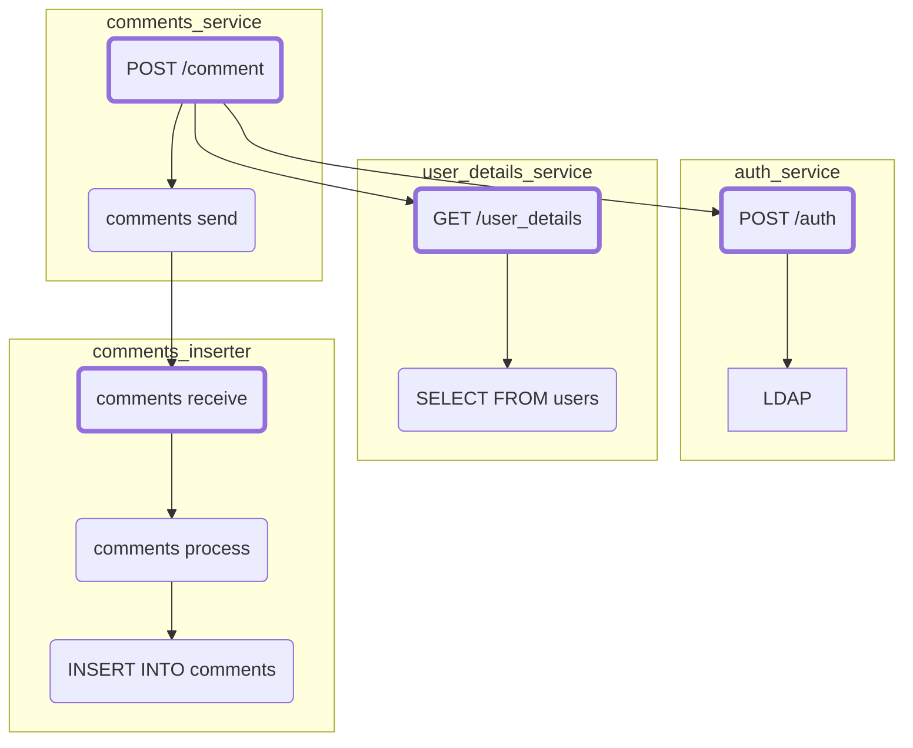

# Export SpanContext.IsRemote in OTLP

Update OTLP to indicate whether a span's parent is remote.

## Motivation

It is sometimes useful to post-process or visualise only entry-point spans: spans which either have no parent (trace roots), or which have a remote parent.
For example, the Elastic APM solution highlights entry-point spans (Elastic APM refers to these as "transactions") and surfaces these as top-level operations
in its user interface.

The goal is to identify the spans which represent a request that is entering a service, or originating within a service, without having to first assemble the
complete distributed trace as a DAG (Directed Acyclic Graph). It is trivially possible to identify trace roots, but it is not possible to identify spans with
remote parents.

Here is a contrived example distributed trace, with a border added to the entry-point spans:



## Explanation

The OTLP encoding for spans has a boolean `parent_span_is_remote` field for identifying whether a span's parent is remote or not.
All OpenTelemetry SDKs populate this field, and backends may use it to identify a span as being an entry-point span.
A span can be considered an entry-point span if it has no parent (`parent_span_id` is empty), or if `parent_span_is_remote` is true.

## Internal details

The first part would be to update the trace protobuf, adding a `boolean parent_span_is_remote` field to the
[`Span` message](https://github.com/open-telemetry/opentelemetry-proto/blob/b43e9b18b76abf3ee040164b55b9c355217151f3/opentelemetry/proto/trace/v1/trace.proto#L84).

[`SpanContext.IsRemote`](../specification/trace/api.md#isremote) identifies whether span context has been propagated from a remote parent.
The OTLP exporter in each SDK would need to be updated to record this in the new `parent_span_is_remote` field.

For backwards compatibility with older OTLP versions, the protobuf field should be `nullable` (`true`, `false`, or unspecified)
and the opentelemetry-collector protogen code should provide an API that enables backend exporters to identify whether the field is set.

```go
package pdata

// ParentSpanIsRemote indicates whether ms's parent span is remote, if known.
// If the parent span remoteness property is known then the "ok" result will be true,
// and false otherwise.
func (ms Span) ParentSpanIsRemote() (remote bool, ok bool)
```

## Trade-offs and mitigations

None identified.

## Prior art and alternatives

### Alternative 1: include entry-point span ID in other spans

As an alternative to identifying whether the parent span is remote, we could instead encode and propagate the ID of the entry-point span in all non entry-point spans.
Thus we can identify entry-point spans by lack of this field.

The entry-point span ID would be captured when starting a span with a remote parent, and propagated through `SpanContext`. We would introduce a new `entry_span_id` field to
the `Span` protobuf message definition, and set it in OTLP exporters.

This was originally [proposed in OpenCensus](https://github.com/census-instrumentation/opencensus-specs/issues/229) with no resolution.

The drawbacks of this alternative are:

- `SpanContext` would need to be extended to include the entry-point span ID; SDKs would need to be updated to capture and propagate it
- The additional protobuf field would be an additional 8 bytes, vs 1 byte for the boolean field

The main benefit of this approach is that it additionally enables backends to group spans by their process subgraph.

### Alternative 2: introduce a semantic convention attribute to identify entry-point spans

As an alternative to adding a new field to spans, a new semantic convention attribute could be added to only entry-point spans.

This approach would avoid increasing the memory footprint of all spans, but would have a greater memory footprint for entry-point spans.
The benefit of this approach would therefore depend on the ratio of entry-point to internal spans, and may even be more expensive.

### Alternative 3: extend SpanKind values

Another alternative is to extend the SpanKind values to unambiguously define when a CONSUMER span has a remote parent or a local parent (e.g. with the message polling use case).

For example, introducing a new SpanKind (e.g. `AMBIENT_CONSUMER`) that would have a clear `no` on the `Remote-Incoming` property of the SpanKind, and `REMOTE_CONSUMER` would have a clear `yes` on the `Remote-Incoming` property of the SpanKind. The downside of this approach is that it is a breaking on the semantics of `CONSUMER` spans.

## Open questions

### Relation between `parent_span_is_remote` and `SpanKind`

The specification for `SpanKind` describes the following:

```
The first property described by SpanKind reflects whether the Span is a "logical" remote child or parent ...
```

However, the specification stay ambiguous for the `CONSUMER` span kind with respect to the property of the "logical" remote parent.
Nevertheless, the proposed field `parent_span_is_remote` has some overlap with that `SpanKind` property.
The specification would require some clarification on the `SpanKind` and its relation to `parent_span_is_remote`.

## Future possibilities

No other future changes identified.
