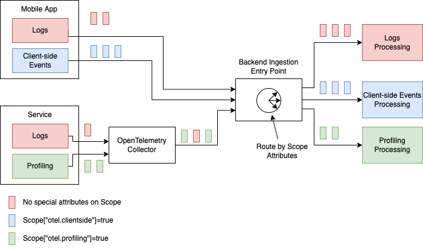

# Introduce Scope Attributes

This OTEP adds attributes to the Scope of a telemetry emitter (e.g. Tracer, Meter, LogEmitter).

## Motivation

There are a few reasons why adding Scope attributes is a good idea:

- There are 2 known use cases where Scope attributes can solve specific problems:
  - Add support for [Meter "short_name"](https://github.com/open-telemetry/opentelemetry-specification/pull/2422),
    represented as an attribute of Meter's Scope.
  - Add support for differentiating the type of data emitted from the scopes that belong
    to different data domains, e.g. profiling data emitted as log records or client-side
    data emitted as log records needs to be differentiated so that it can be easily
    routed and processed differently in the backends. We don't have a good way to handle
    this today. The type of the data can be recorded as an attribute Logger's Scope.
- It makes Scope consistent with the other primary data types: Resource, Span, Metric,
  LogRecord.

See additional [discussion here](https://github.com/open-telemetry/opentelemetry-specification/issues/2450).

## Summary

The following is the summary of proposed changes:

- We will extend OpenTelemetry API to allow specifying Scope attributes when obtaining a
  Tracer, Meter or LogEmitter. Scope attributes will be optional.
- We will add `attributes` field to the [InstrumentationScope](https://github.com/open-telemetry/opentelemetry-proto/blob/88faab1197a2a105c7da659951e94bc951d37ab9/opentelemetry/proto/common/v1/common.proto#L83)
  message of OTLP.
- We will specify that Telemetry emitted via a Scope-ed Tracer, Meter or LogEmitter will
  be associated with the Scope's attributes.
- We will specify that OTLP Exporter will record the attributes in the
  InstrumentationScope message.
- We will create a section for Scope attributes' semantic conventions in
  the specification.

## Internal details

### API Changes

#### Tracer

`Get a Tracer` API will be extended to add the following parameter:

```
- `attributes` (optional): Specifies the instrumentation scope attributes to associate
  with emitted telemetry.
```

Since the attributes are optional this is a backwards compatible change.

We will modify the following clause:

```
It is unspecified whether or under which conditions the same or different
`Tracer` instances are returned from this functions.
```

and replace it by:

```
The implementation MUST NOT return the same `Tracer` when called repeatedly with
different values of parameters. The only exception to this rule is no-op `Tracer`, the
implementation MAY return the same instance regardless of parameter values.

It is unspecified whether or under which conditions the same or different
`Tracer` instances are returned from this functions when the same 
(name,version,schema_url,attributes) parameters are used.
```

Since we are defining more precisely previously undefined behavior this is a
backwards compatible change.

#### Meter

`Get a Meter` API will be extended to add the following parameter:

```
- `attributes` (optional): Specifies the instrumentation scope attributes to associate
  with emitted telemetry.
```

We will modify the following clause:

```
It is unspecified whether or under which conditions the same or different
`Meter` instances are returned from this functions.
```

and replace it by:

```
The implementation MUST NOT return the same `Meter` when called repeatedly with
different values of parameters. The only exception to this rule is no-op `Meter`, the
implementation MAY return the same instance regardless of parameter values.

It is unspecified whether or under which conditions the same or different
`Meter` instances are returned from this functions when the same 
(name,version,schema_url,attributes) parameters are used.
```

#### LogEmitter

`Get LogEmitter` SDK call will be altered to the following:

```
Accepts the instrumentation scope name and optional version and attributes and
returns a LogEmitter associated with the instrumentation scope.

The implementation MUST NOT return the same `LogEmitter` when called repeatedly with
different values of parameters. The only exception to this rule is no-op `LogEmitter`, the
implementation MAY return the same instance regardless of parameter values.

It is unspecified whether or under which conditions the same or different
`LogEmitter` instances are returned from this functions when the same
(name,version,attributes) parameters are used.
```

### OTLP Changes

The InstrumentationScope message in OTLP will be modified to add 2 new fields:
attributes and dropped_attributes_count:

```protobuf
message InstrumentationScope {
  string name = 1;
  string version = 2;
  repeated KeyValue attributes = 3;
  uint32 dropped_attributes_count = 4;
}
```

This change is backwards compatible from OTLP's interoperability perspective. Recipients
of old OTLP versions will not see the Scope attributes and will ignore them, which we
consider acceptable from interoperability perspective. This is aligned with our general
stance on what happens when telemetry sources _add_ new data which old recipients
don't understand: we expect the new data to be safely ignored.

## Attribute Value Precedence

If the same attribute is specified both at the Span/Metric/LogRecord and at the Scope
then the attribute value at Span/Metric/LogRecord takes precedence.

This rule applies to non-OTLP exporters in SDKs, to conversions from OTLP to non-OTLP
formats in the Collector and to OTLP recipients of data that need to interpret the
attributes in the received data.

## Exporting to non-OTLP

SDK's non-OTLP Exporters and Collector's exporter to formats that don't have a concept
that is equivalent to the Scope will record the attributes at the most suitable place
in their corresponding format, typically at the Span, Metric or LogRecord equivalent.

## Prior art and alternatives

The [Meter "short_name" PR](https://github.com/open-telemetry/opentelemetry-specification/pull/2422)
had an alternate approach where the "short_name" was added as the only attribute to the
InstrumentationScope. This OTEP's proposal generalizes this and allows arbitrary
attributes which allows them to be used for use cases.

Differentiating the type of data emitted from the scopes that belong to different data
domains can be alternatively done by recording attributes on the Span, Metric or LogRecord.
However, this will be less efficient since it will require the same attributes to be
specified repeatedly on the wire. It will be also cumbersome to require the callers
to always specify such attributes when creating a Span, Metric or a LogRecord as
opposed to specifying them once when obtaining the Trace, Meter or LogEmitter.

## Examples

### Usage in Code

The following is an example usage where LogEmitter is used to emit client-side
log records (pseudocode follows):

```
// Obtain loggers once, at startup.
appLogger = LogEmitterProvider.GetLogEmitter("mylibrary", "1.0.0")
loggerForUserEvents = LogEmitterProvider.GetLogEmitter("mylibrary", "1.0.0", KeyValue("otel.clientside", true))

// Somewhere later in the code when the user clicks a UI element. This should
// export telemetry with otel.clientside=true Scope attribute set.
loggerForUserEvents.emit(LogRecord{Body:"click", Attributes:...})

// Somewhere else in the code, not related to user interactions. This should
// export telemetry without any Scope attributes.
appLogger.emit(LogRecord{Body:"Error occurred while processing the file", Attributes:...})
```

### LogRecord Multiplexing

Here is an example usage where LogRecords are used to represent profiling data,
client-side events and regular logs. The Scope attribute is used for multiplexing
and routing the LogRecords:



## Open questions

- Should we allow/encourage recording Span/Metric/LogRecord attributes at the Scope level?
  The alternate is to disallow this and have completely separate set of semantic
  conventions that are allowed for Scope attributes only.
- Can all existing APIs in all languages be safely modified to ensure the addition
  of the optional attributes is not a breaking change? (It should be safe, since we did
  a very similar change when we [introduced the Scope](https://github.com/open-telemetry/opentelemetry-specification/pull/2276))

## Future possibilities

If this OTEP is accepted we need to then introduce the relevant semantic conventions
that will make the 2 use cases [described earlier](#motivation) possible.
