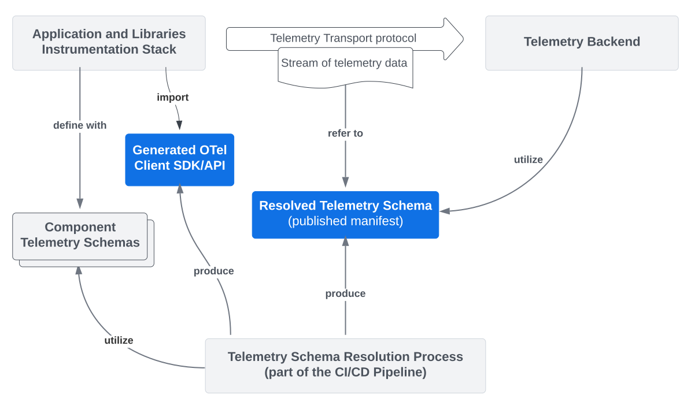
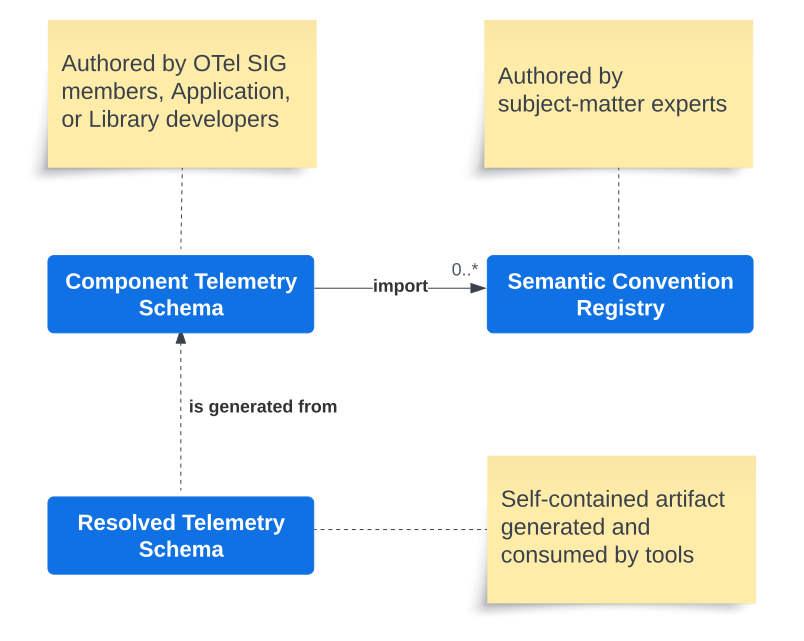
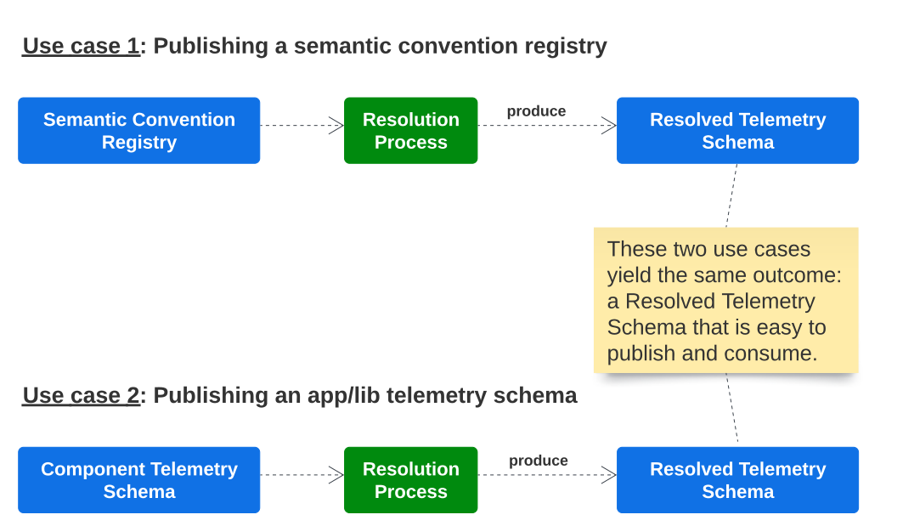
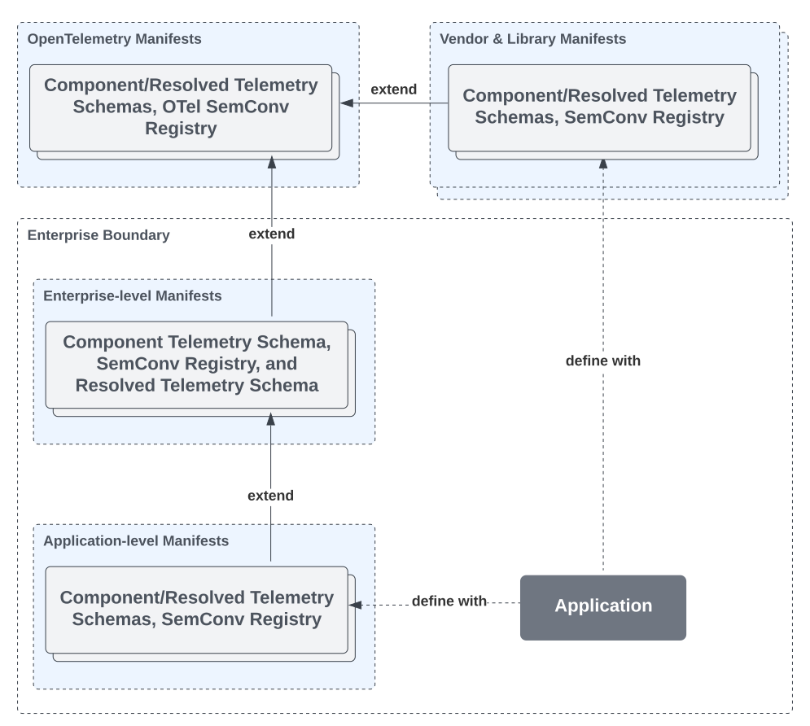
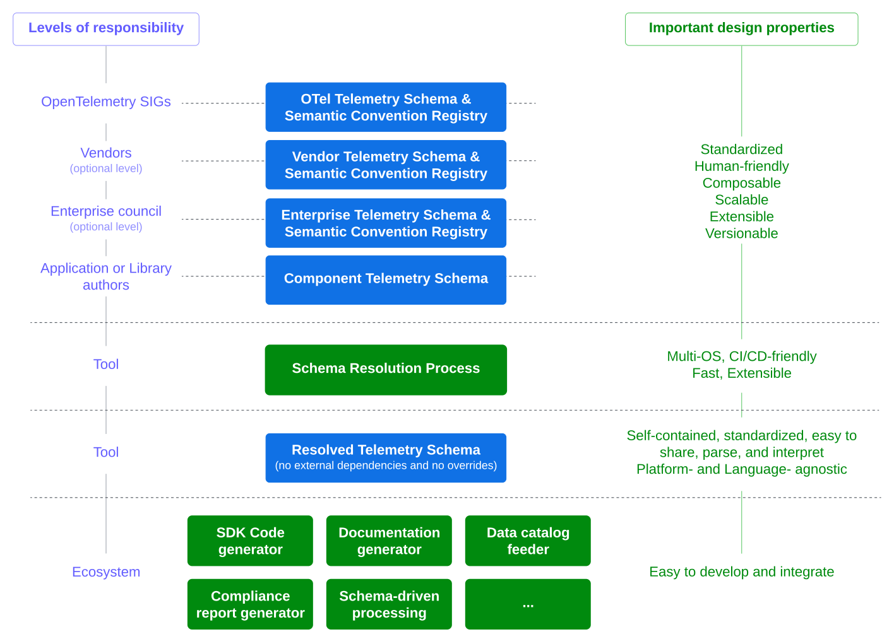
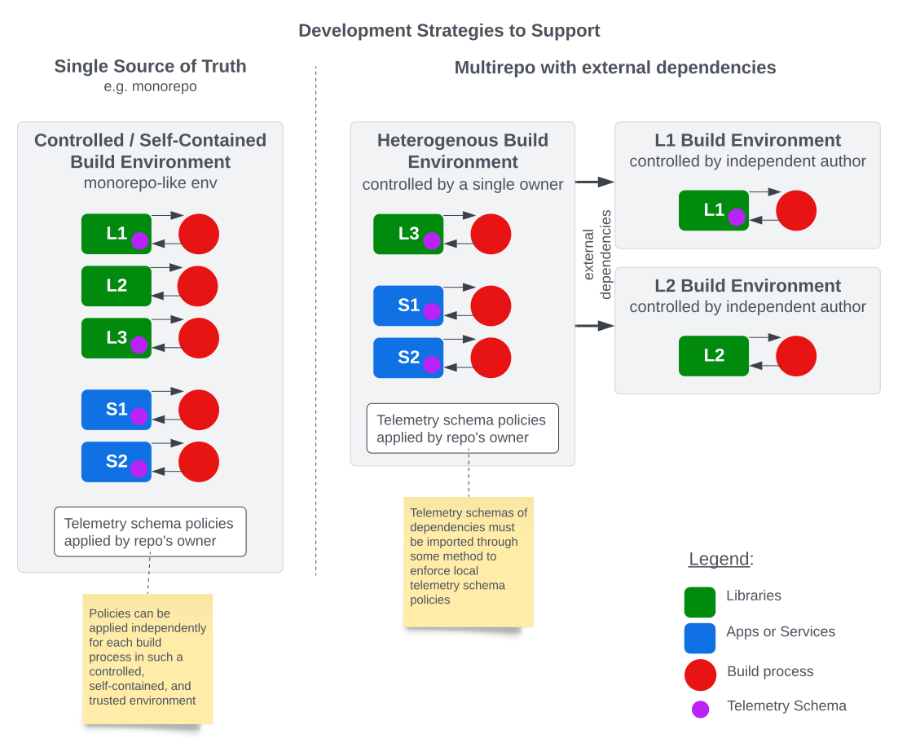

# Introducing Application Telemetry Schema in OpenTelemetry - Vision and Roadmap

----
**Author**: Laurent Querel, F5 Inc.

**Keywords**: Schema-First Approach, Telemetry Schema, Semantic Convention,
Discoverability, Interoperability, Type-Safe Client SDKs, Client SDKs Generation,
CI/CD Integration, Data Governance, Data Privacy.

**Related OTEPs**: [OTEP0152](0152-telemetry-schemas.md), [OTEP0202](0202-events-and-logs-api.md).

----
_Unlike the traditional data ecosystem (OLTP and OLAP), the world of telemetry
generally does not rely on the concept of a schema. Instrumentation is deeply
embedded in the code of applications and libraries, making it difficult to
discover all the possible telemetry signals an application can emit. This gap
prevents or limits the development of CI/CD tools for checking, reporting,
documenting, and generating artifacts from telemetry signals specific to an
application. This document presents a long-term vision aimed at enabling the
OpenTelemetry project to address this issue and extend its impact to a broader
ecosystem. It proposes extending the initiatives of Telemetry Schema and
Semantic Conventions to include logical concepts of Component Telemetry Schema
and Resolved Telemetry Schema. A series of OTEPs and Tools will be proposed in
this overarching document to detail each aspect of this vision._

## Current State Overview

Traditionally, the instrumentation of applications is deeply integrated into the
source code of the applications and their components. The current stack of
OpenTelemetry follows this approach and offers a unified mechanism that allows
this ecosystem to report telemetry data jointly via a generic client interface
and a common protocol through an SDK. Moreover, OpenTelemetry's semantic
conventions establish a vendor-agnostic and standardized vocabulary to ensure
more consistent instrumentation over time. This standardization facilitates the
analysis and utilization of these metadata data across the entire telemetry
pipeline.

But this approach is not without challenges:

* **Discoverability and Interoperability**: It is difficult to discover a priori
  and automatically what an application as a whole specifically generates in terms
  of telemetry and associated metadata. This makes it difficult to integrate with
  enterprise data catalogs, compliance procedures, or automated privacy
  enforcement in _CI/CD pipelines_.
* **User experience**: Although very flexible, generic clients do not offer the
  same benefits as a strongly typed dedicated API. A type-safe API is more
  ergonomic, more robust, and more easily maintainable. Modern IDEs are capable
  of providing smart autocompletion and contextual documentation based on the API.
  Compilers can automatically detect errors in case of refactoring or evolution
  of the telemetry schema.
* **Extensibility**: Adding metadata to the basic signal specification is
  essential for enabling use cases like data security, privacy enforcement,
  metadata-driven data transformation, and knowledge graph enrichment. Currently,
  there's no standard way to add metadata separate from an application's or
  library's development cycle. These metadata definitions should be distinct from
  the signal definitions and could be specified by teams other than development
  teams.
* **Performance overheads**: A significant downside of generic telemetry
  instrumentation is the various overheads it generally introduces due to inherent
  layers of abstraction. For example, the collection of attributes is typically
  represented as a list of key/value pairs or as hashmaps, resulting in memory
  overhead. A simple struct or a set of well-typed function arguments will be more
  efficient and less error-prone for representing this list of attributes. In the
  same way, it is possible to use a dictionary encoding for values whose domain is
  specified in the form of an enumeration in the schema definition.

Databases and RPC systems (e.g., Protobuf & gRPC) have already addressed some of
these issues with a schema-first approach. There is nothing to prevent adopting
a similar approach in the context of telemetry. **This document discusses how to
apply a schema-first approach in the OpenTelemetry project and its implications
for the existing Telemetry Schema and Semantic Conventions.**

## Possible/Desired Future State

The following diagram provides a conceptual overview of the relationships
between the various components, processes, and artifacts of what could be a
typical schema-driven end-to-end telemetry system in the future.

The Application Telemetry Schema concept is divided into two key logical parts: the
Component Telemetry Schema and the Resolved Telemetry Schema, as shown in the
previous diagram (more details on these two concepts in the proposal section).
These concepts are central to unlocking a variety of use cases.

Examples of use cases include:

* Automatic generation of Telemetry Client SDKs from telemetry schemas,
  improving user experience and performance.
* CI/CD pipelines using telemetry schemas to:
  * Check compatibility between different schema versions.
  * Ensure security and privacy compliance.
  * Integrate with enterprise data catalog systems.
  * And more.
* Telemetry backends capable of:
  * Automatically updating database schemas or dashboards.
  * Triggering schema-driven transformations or processing in stream processors.
  * And more.

This recent [paper](https://arxiv.org/pdf/2311.07509#:~:text=The%20results%20of%20the%20benchmark%20provide%20evidence%20that%20supports%20our,LLM%20without%20a%20Knowledge%20Graph)
from [data.world](https://data.world/home/), along with
the [MetricFlow framework](https://docs.getdbt.com/docs/build/about-metricflow)
which underpins the [dbt Semantic Layer](https://www.getdbt.com/product/semantic-layer),
highlights the significance of adopting a schema-first approach in data
modeling, especially for Generative AI-based question answering systems. Tools
like Observability Query Assistants (
e.g. [Elastic AI Assistant](https://www.elastic.co/fr/blog/introducing-elastic-ai-assistant)
and [Honeycomb Query Assistant](https://www.honeycomb.io/blog/introducing-query-assistant?utm_source=newswire&utm_medium=link&utm_campaign=query_assistant))
are likely to become increasingly prevalent and efficient in the near future,
thanks to the adoption of a schema-first approach.

> [!NOTE]
> The names and formats of these concepts are still under discussion. A
> detailed analysis of pros and cons will be covered later in the document. The
> final decision will be deferred to future dedicated OTEPs.

Another problem this proposal aims to address is the inherent complexity of the
ecosystem where OpenTelemetry is utilized but not fully addressed by existing
solutions. OpenTelemetry has been adopted by enterprises of all sizes. While
offering the possibility to inherit standardized semantic conventions is
beneficial, it often proves insufficient due to the need for customizations in
diverse contexts, such as overriding some properties (e.g., changing the
requirement level from recommended to required). Additionally, the presence of
vendor-specific attributes and metrics in the existing official OpenTelemetry
semantic convention registry does not align with the goal of offering a catalog
of attributes, metrics, and signals that are vendor-agnostic. **These issues are
indicative of a lack of standardized mechanisms for extending, customizing, and
developing an ecosystem of schemas and semantic convention registries.**

In response to these problems, a hierarchy of telemetry schemas can be defined,
ranging from the most general to one that is specifically refined for an
application. Each child schema inherits the properties of the parent schema and
can, if necessary, override these properties locally. Additionally, any
telemetry schema can import one or several semantic convention registries,
allowing for the definition of OpenTelemetry, vendor-specific, and
enterprise-level registries. These two enhancements make OpenTelemetry more
customizable, extensible, and ecosystem-friendly.

The following section will elaborate on the concepts of the Component Telemetry
Schema, Resolved Telemetry Schema, Semantic Convention Registries, and their
relationship with both the existing OpenTelemetry Schema v1.1 and the
OpenTelemetry Semantic Conventions.

## Proposal

### Overview

Conceptually, this proposal is based on three main concepts: **Component Telemetry
Schema**, **Semantic Convention Registry**, and **Resolved Telemetry Schema**.
The relationships between these entities are described in the following diagram.

The Component Telemetry Schemas are created by the OpenTelemetry SIG members,
application, or library authors. A Component Telemetry Schema may import any
number of Semantic Convention
Registries as needed. During the schema resolution process, a Resolved Telemetry
Schema is created from a Component Telemetry Schema. This **Resolved Telemetry
Schema is self-contained** and has no external references. Optionally, a Component
Telemetry Schema may extend an existing Telemetry Schema, whether component or
resolved (this aspect is still under discussion). Typically, the official
OpenTelemetry Telemetry Schema is inherited by a Component Telemetry Schema to
include the standard OpenTelemetry Semantic Convention registry. In complex
cases, large enterprises might create their own intermediary telemetry schemas
for custom definitions.

Each signal definition defined in the Component Telemetry Schema, where possible,
reuses the existing syntax and semantics defined by the semantic conventions.
Each signal definition is also identified by a unique name (or ID), making
schemas addressable, easy to traverse, validate, and diff.

The key design principles to be followed in the definition of the Resolved
Telemetry Schema are:

* **Self-contained**: No external references are allowed. This artifact contains
  everything required to determine what an application or a library produces in
  terms of telemetry.
* **Easy to exchange**: This artifact must be easily accessible to actors
  via a URI. This artifact must be small and avoid the repetition of
  definitions.
* **Easy to parse**: A widespread and well-defined format should be preferred.
  JSON is an example of such a format.
* **Easy to interpret**: The internal structure of this artifact must be
  straightforward to avoid any misinterpretation and must be efficient.
* **Platform- and Language-agnostic**: This artifact must be independent of any
  platform architectures and programming languages.

The following diagram describes two main use cases for the Resolved Telemetry
Schema. The key points to remember are: 1) both use cases result in a Resolved
Telemetry Schema, 2) Resolved Telemetry Schemas serve as the mechanism for
distributing Telemetry Schemas throughout the entire ecosystem, and 3) Resolved
Telemetry Schemas would replace/augment existing SchemaURL.

Note: The relationship between Telemetry Schema v1.1
([OTEP 0152](0152-telemetry-schemas.md))
and the Component and Resolved Telemetry Schema concepts is still being
discussed. This will be clarified in future OTEPs (refer to the last section).

The following diagram illustrates a possible instance of a complex hierarchy of
schemas and semantic convention registries. It involves several vendor and
enterprise artifacts, in addition to the standardized OpenTelemetry artifacts.
The schema resolution process will produce a self-contained Resolved Telemetry
Schema that can be easily consumed by various tools and applications, such as a
Client SDK generator, compatibility checker, compliance checker, data catalog
feeder, and more.

This hierarchy of telemetry schemas helps large organizations in
collaborating on the Component Telemetry Schema. It enables different
aspects of a Component Telemetry Schema to be managed by various teams.

For all the elements that make up the Component Telemetry Schema, a
general mechanism of annotation or tagging will be integrated in order to
attach additional traits, characteristics, or constraints, allowing vendors
and companies to extend the definition of concepts defined by OpenTelemetry.
This annotation mechanism will be included as part of the Component Telemetry
Schema definition.

Annotations and Tags can also be employed to modify schemas for
diverse audiences. For example, the public version of a schema can exclude all
signals or other metadata labeled as private. Similarly, elements can be
designated as exclusively available for beta testers. These annotations can
also identify attributes as PII (Personally Identifiable Information), and
privacy policy enforcement can be implemented at various levels (e.g., in the
generated client SDK or in a proxy).

For each important component, the following diagram defines the responsibilities
and key design properties that will be considered in future OTEPs defining the
Component and Resolved Telemetry Schemas.

This design enables the definition of semantic conventions in a distributed
manner. OpenTelemetry, vendors, and enterprises can define their own semantic
conventions in different registries simplifying the existing process.

> Although there is no direct lineage between these systems, a similar approach
> was designed and deployed by Facebook to address the same type of problem but in
> a proprietary context (refer to
> this [positional paper](https://research.facebook.com/publications/positional-paper-schema-first-application-telemetry/)
> for more information).

### Development Strategies

Two development strategies coexist and must be supported. The first strategy, a
monorepo type (single source of truth), has complete control over the
applications, their dependencies, and the associated telemetry schemas. The
second strategy is more heterogeneous, composed of multiple repositories, where
the build process of external dependencies is out of the control of the entity
owning the applications or services.

In the first model, each build process can independently apply telemetry schema
policies in parallel, knowing that the policies are shared and the entire
environment is controlled by the same entity.

In the second model, the application or service environment does not control the
telemetry schema policies of external dependencies. There is a need for a method
to retrieve telemetry schemas from these dependencies. The mechanism for
distributing these schemas is still being discussed (refer to the Open Questions
section). Ultimately, this will enable the CI/CD pipeline of the application or
service to apply its own local policies to these schemas from the dependencies.

## Open Questions

During the review of this document, several questions were raised, and some
remain unresolved. We've decided to postpone the answers to these open questions
to future OTEPs. This approach seems more practical as the resolution of these
questions is not critical at this stage and will likely become clearer as we
define and implement future OTEPs.

### Should we use a single Telemetry Schema or the combination of Component and Resolved Telemetry Schema?

The debate between adopting a single Telemetry Schema or separate Component and
Resolved Telemetry Schemas remains unresolved.

Advocates of a single-schema approach see it as a simplification in terms of
schema definition, implementation, and even cognitive overhead. They suggest
using the same schema but disallowing any external references for schemas
intended for publication and reuse by third parties. The schema resolution
process would then remove these references.

Proponents of a two-schema approach believe that each format is intended for
different users and use cases (app/lib developers vs telemetry tool developers),
and therefore, having two distinct structures and formats would make it easier
to optimize each for its specific use case (in multiple dimensions).
Furthermore, the group of developers using the Component Telemetry Schema will
most likely be much larger than the group of developers who need to understand
the details of the Resolved Telemetry Schema.

### What should be the schema(s) be named?

The naming of the schema(s) was also discussed but without consensus. The current proposals are as follows:

- Single schema approach: Retain the existing Telemetry Schema name, supporting
different formats depending on the use case (e.g., YAML for app and lib
developers, JSON + JSON schema for publication and tool consumption).
- Two schemas approach:
  - Component Telemetry Schema alternative names: Telemetry Schema, Weaver Schema.
  - Resolved Telemetry Schema alternative names: Compiled Telemetry Schema, Published Telemetry Schema, Weaver Schema.

### What distribution mechanism should be used for retrieving dependency schemas?

Currently, two main methods are being considered:

1) Establishing a public, centralized repository for resolved schemas, where
   library authors can register their resolved telemetry schemas as part of their
   build process.
2) Embedding the Resolved Telemetry Schema directly within the library artifact
   (such as binary libraries, jar files, crates, Go modules, etc.), ensuring
   automatic collection during the application's build process.

At present, the second option is preferred as it is fully decentralized and
eliminates the need for a global schema registry. A specific OTEP will be
developed to define this distribution mechanism.

## Roadmap

### OTEPs

To facilitate the review process and progressively deliver value to the
OpenTelemetry community, a series of OTEPs and tools are suggested.

* **Telemetry Schema(s) - Structure and Formats**: This OTEP will weigh the pros
  and cons of a single schema versus a dual-schema approach. It aims to identify
  the optimal solution and define the structures and formats for the two
  concepts introduced in this OTEP: the Component and Resolved Telemetry Schema.
  We plan several sub-OTEPs to progressively introduce and phase the concepts
  discussed in this document:
  * **Phase 1**: Introduce a registry section with a list of fully
  resolved attributes, metrics, and other telemetry signals from the existing
  semantic convention registry. Upon implementation, the OpenTelemetry project's
  telemetry schema will include a registry of all standardized attributes,
  metrics, and signals as defined by the semantic conventions.
  * **Phase 2**: Add sections for resource, instrumentation library,
  and schema sections to represent telemetry signals emitted by an application
  (and its dependencies) or a library. Initially, only metrics, logs, and spans
  definitions will be supported.
  * **Phase 3**: Enable application or library authors to
  override definitions inherited from a parent resolved schema.
  * **Phase 4**: Implement support for events in the schema
  section, pending the approval of events in OpenTelemetry.
  * **Phase 5**: Introduce support for multivariate metrics in
  the schema section, relevant only if the Client SDK Generator plans to support
  multivariate metrics.
* **Dependency Management and Telemetry Schema Distribution**: This OTEP will
outline the method for collecting resolved telemetry schemas from dependencies.

### Proof of Concept and Tools

A proof of concept, OTel Weaver, is under development to test the feasibility of
the proposed approach. It will support the following commands:

* `resolve registry`: Generates a Resolved Telemetry Schema from an
OpenTelemetry semantic convention registry.
* `resolve schema`: Creates a Resolved Telemetry Schema from a Component
Telemetry Schema.
* `search registry`: Offers search functionality within an OpenTelemetry
semantic convention registry.
* `search schema`: Provides search capabilities within a Component or Resolved
Telemetry Schema.
* `gen-client sdk`: Generates a Client SDK from a Component or Resolved
Telemetry Schema.
* `gen-client api`: Produces a Client API from a Component or Resolved
Telemetry Schema.

A Plugin System is planned to allow community contributions to the OTel Weaver
tool. Proposed plugins include:

* An example of plugin for gathering resolved telemetry schemas from external
dependencies.
* An example of compatibility checker plugin to ensure successive versions of
the same Telemetry Schema follow specified compatibility rules.

Additional plugins and tools are anticipated to be developed by the broader
community, leveraging the OTel Weaver Plugin System and the standardized format
of the Resolved Telemetry Schema.

## Links

- [Positional Paper: Schema-First Application Telemetry](https://research.facebook.com/publications/positional-paper-schema-first-application-telemetry/)
- [A benchmark to understand the role of knowledge graphs on Large Language Model's accuracy for question answering on enterprise sql databases](https://arxiv.org/pdf/2311.07509#:~:text=The%20results%20of%20the%20benchmark%20provide%20evidence%20that%20supports%20our,LLM%20without%20a%20Knowledge%20Graph)
- [MetricFlow framework](https://docs.getdbt.com/docs/build/about-metricflow)
