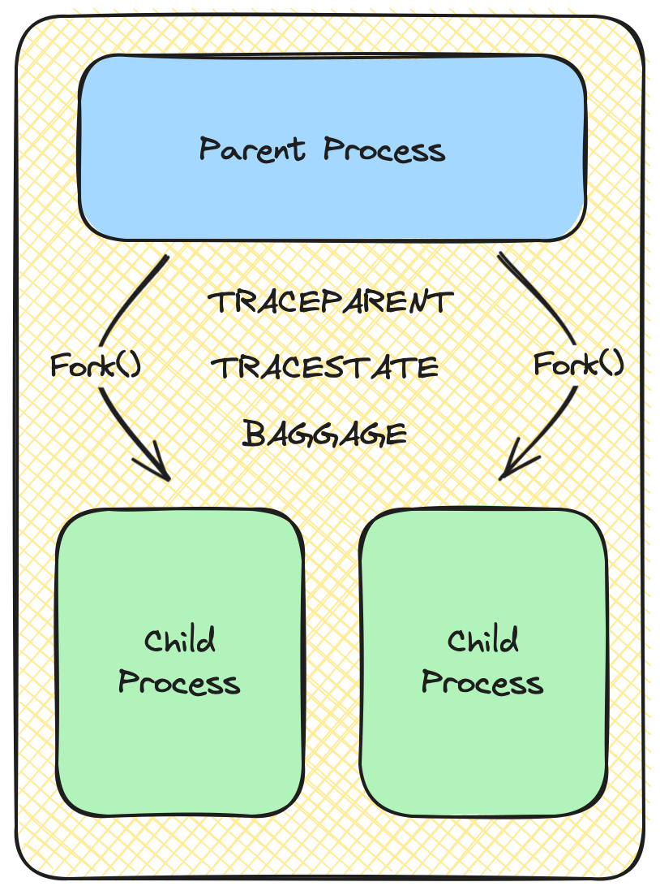
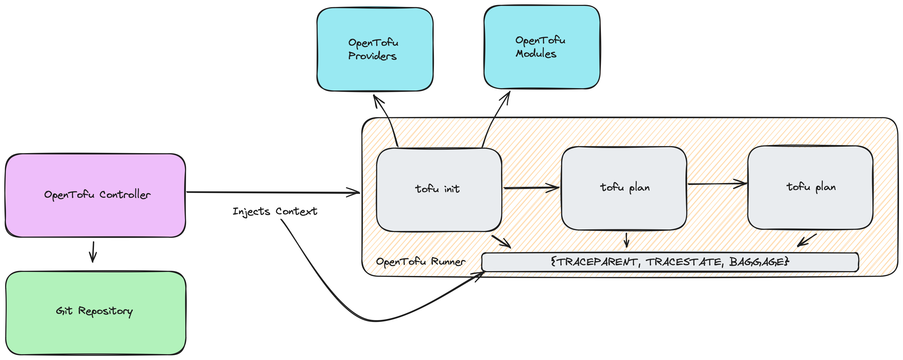
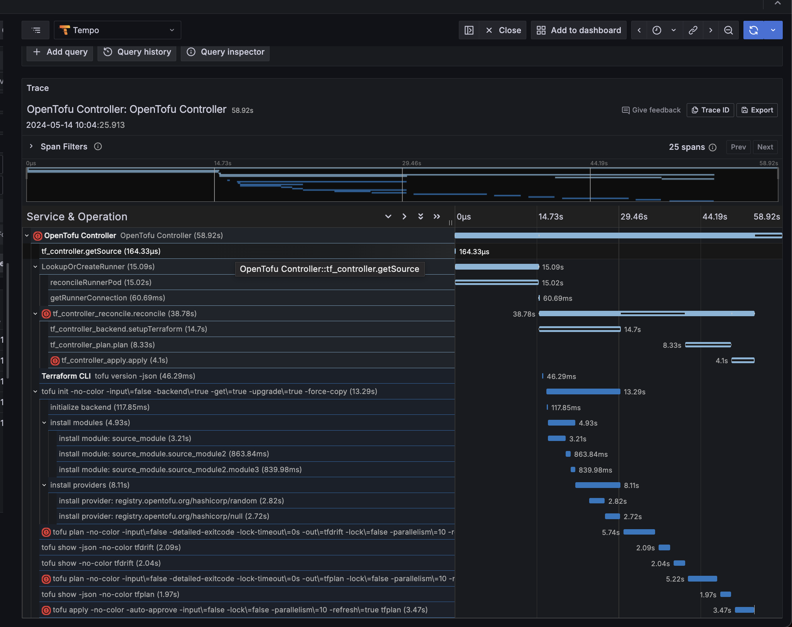

# Environment Variable Specification for Context and Baggage Propagation

This is a proposal to add Environment Variables to the OpenTelemetry
specification as carriers for context and baggage propagation between
processes.

## Table of Contents

* [Motivation](#motivation)
* [Design](#design)
  * [Example Context](#example-context)
    * [Distributed Tracing in OpenTofu Prototype Example](#distributed-tracing-in-opentofu-prototype-example)
* [Core Specification Changes](#core-specification-changes)
  * [Unix](#unix-limitations)
  * [Windows](#windows-limitations)
  * [Allowed Characters](#allowed-characters)
* [Trade-offs and Mitigations](#trade-offs-and-mitigations)
  * [Case-sensitivity](#case-sensitivity)
  * [Security](#security)
* [Prior Art and Alternatives](#prior-art-and-alternatives)
  * [Alternatives and why they were not chosen](#alternatives-and-why-they-were-not-chosen)
* [Open Questions](#open-questions)
* [Future Possibilities](#future-possibilities)

## Motivation

The motivation for defining the specification for context and baggage
propagation by using environment variables as carriers stems from the long open
[issue #740][issue-740] on the OpenTelemetry Specification repository. This
issue has been open for such a long time that multiple implementations now
exist using `TRACEPARENT` and `TRACESTATE` environment variables.

[Issue #740][issue-740] identifies several use cases in systems that do not
communicate across bounds by leveraging network communications such as:

* ETL
* Batch
* CI/CD systems

Adding arbitrary [Text Map propagation][tmp] through environment variable carries into
the OpenTelemetry Specification will enable distributed tracing within the
above listed systems.

There has already been a significant amount of [Prior Art](#prior-art-and-alternatives) built
within the industry and **within OpenTelemetry** to accomplish the immediate needs,
however, OpenTelemetry at this time does not define the specification for this
form of propagation.

Notably, as we define semantic conventions within the [CI/CD Working Group][cicd-wg],
we'll need the specification defined for the industry to be able to adopt
native tracing within CI/CD systems.

[cicd-wg]: https://github.com/open-telemetry/community/blob/main/projects/ci-cd-phase-2.md
[issue-740]: https://github.com/open-telemetry/opentelemetry-specification/issues/740#issue-665588273
[tmp]: https://opentelemetry.io/docs/specs/otel/context/api-propagators/#textmap-propagator

## Design

To propagate context and baggage between parent, sibling, and child processes
in systems where network communication does not occur between processes, a
specification using key-value pairs injected into the environment can be read
and produced by an arbitrary TextMapPropagator.

### Example Context

Consider the following diagram in the context of process forking:

> [!NOTE]
> The diagram is simply an example and simplification of process forking.
> There are other ways to spawn processes which are more performant like
> exec().



In the above diagram, a parent process is forked to spawn a child process,
inheriting the environment variables from the original parent. The environment
variables defined here, `TRACEPARENT`, `TRACESTATE`, and `BAGGAGE` are used to
propagate context to the child process such that it can be tied to the parent.
Without `TRACEPARENT`, a tracing backend would not be able to connect the child
process spans to the parent span, forming an end-to-end trace.

> [!NOTE]
> While the below exclusively follows the W3C Specification translated
> into environment variables, this proposal is not exclusive to W3C and is
> instead focused on the mechanism of Text Map Propagation with a potential set
> of well-known environment variable names. See the [Core Specification
> Changes](#core-specification-changes) section for more information.

Given the above example aligning with the W3C Specification, the following is
a contextual mapping of environment variables to headers defined by W3C.

The `traceparent` (lowercase) header is defined in the [W3C
Trace-Context][w3c-parent] specification and includes the following valid
fields:

* `version`
* `trace-id`
* `parent-id`
* `trace-flags`

This could be set in the environment as follows:

```bash
export TRACEPARENT=00-4bf92f3577b34da6a3ce929d0e0e4736-00f067aa0ba902b7-01
```

> [!NOTE]
> The value of TRACEPARENT is a combination of the above field values as
> unsigned integer values serialized as ASCII strings, delimited by `-`.

The `tracestate` (lowercase) header is defined in [W3C
Trace-State][w3c-state] and can include any opaque value in a key-value pair
structure. Its goal is to provide additional vendor-specific trace information.

The `baggage` (lowercase) header is defined in [W3C Baggage][w3c-bag]
and is a set of key-value pairs to propagate context between signals. In
OpenTelemetry, baggage is propagated through the [Baggage API][bag-api].

[w3c-parent]: https://www.w3.org/TR/trace-context-2/#traceparent-header-field-values
[w3c-state]: https://www.w3.org/TR/trace-context-2/#tracestate-header
[w3c-bag]: https://www.w3.org/TR/baggage/#baggage-http-header-format

#### Distributed Tracing in OpenTofu Prototype Example

Consider this real world example OpenTofu Controller Deployment.



In this model, the OpenTofu Controller is the start of the trace, containing
the actual trace_id and generating the root span. The OpenTofu controller
deploys a runner which has its own environment and processes to run OpenTofu
commands. If one was to trace these processes without a carrier mechanism, then
they would all show up as unrelated root spans in separate traces. However, by
leveraging environment variables as carriers, each span is able to be tied back
to the root span, creating a single trace as shown in the image of a real
OpenTofu trace below.



Additionally, the `init` span is able to pass baggage to the `plan` and `apply`
spans. One example of this is module version and repository information. This
information is only determined and known during the `init` process. Subsequent
processes only know about the module by name. With `BAGGAGE` the rest of the
processes are able to understand a key piece of information which allows
errors to be tied back to original module version and source code.

Defining the specification for Environment Variables as carriers will have a
wide impact to the industry in enabling better observability to systems outside
of the normal HTTP microservice architecture.

[bag-api]: https://opentelemetry.io/docs/specs/otel/baggage/api/

The above prototype example came from the resources mentioned in [this
comment][otcom] on the [OpenTofu Tracing RFC][otrfc].

[otcom]: https://github.com/opentofu/opentofu/pull/2028#issuecomment-2411588695
[otrfc]: https://github.com/opentofu/opentofu/pull/2028

## Core Specification Changes

The OpenTelemetry Specification should be updated with the definitions for
extending context propagation into the environment through Text Map
propagators.

This update should include:

* A common set of environment variables like `TRACEPARENT`, `TRACESTATE`, and
  `BAGGAGE` that can be used to propagate context between processes. These
  environment variables names should be overridable for legacy support reasons
  (like using B3), but the default standard should align with the W3C
  specification.
* A specification for allowed environment names and values due to operating
  system limitations.
* A specification for how implementers can inject and extract context from the
  environment through a TextMapPropagator.
* A specification for how processes should update environment variables before
  spawning new processes.

Defining the specification for Environment Variables as carriers for context
will enable SDK's and other tools to implement getters and setters of context
in a standard, observable way. Therefore, current OpenTelemetry language
maintainers will need to develop language specific implementations that adhere
to the specification.

Two implementations already exist within OpenTelemetry for environment
variables through the TextMap Propagator:

* [Python SDK][python-env] - This implementation uses environment dictionary as
  the carrier in Python for invoking process to invoked process context
  propagation. This pull request does not appear to have been merged.
* [Swift SDK][swift-env] - This implementation uses `TRACEPARENT` and
  `TRACESTATE` environment variables alongside the W3C Propagator to inject and
  extract context.

Due to programming conventions, operating system limitations, prior art, and
information below, it is recommended to leverage upper-cased environment
variables for the carrier that align with context propagator specifications.

[python-env]: https://github.com/Div95/opentelemetry-python/tree/feature/env_propagator/propagator/opentelemetry-propagator-env
[swift-env]: https://github.com/open-telemetry/opentelemetry-swift-core/blob/c84cdc1760e20fc3a448c4e8aaae490f7d48ac67/Sources/OpenTelemetrySdk/Trace/Propagation/EnvironmentContextPropagator.swift

### Unix Limitations

Unix system utilities use upper-case for environment variables and lower-case
are reserved for applications. Using upper-case will prevent conflicts with
internal application variables.

Environment variable names used by the utilities in the Shell and Utilities
(XCU) specification consist solely of upper-case letters, digits and the "_"
(underscore) from the characters defined in Portable Character Set. Other
characters may be permitted by an implementation; applications must tolerate
the presence of such names. Upper-case and lower-case letters retain their
unique identities and are not folded together. The namespace of environment
variable names containing lower-case letters is reserved for applications.
Applications can define any environment variables with names from this name
space without modifying the behaviour of the standard utilities.

Source: [The Open Group, The Single UNIX® Specification, Version 2, Environment Variables](https://pubs.opengroup.org/onlinepubs/7908799/xbd/envvar.html)

### Windows Limitations

Windows is case-insensitive with environment variables. Despite this, the
recommendation is to use upper-case names across OS.

Some languages already do this. This [CPython issue][cpython] discusses how
Python automatically upper-cases environment variables. The issue was merged and
this [documentation][cpython-doc] was added to clarify the behavior.

[cpython]: https://github.com/python/cpython/issues/101754
[cpython-doc]: https://docs.python.org/3/library/os.html#os.environ

### Allowed characters

To ensure compatibility, specification for Environment Variables SHOULD adhere
to the current specification for `TextMapPropagator` where key-value pairs MUST
only consist of US-ASCII characters that make up valid HTTP header fields as
per RFC 7230.

Environment variable keys, SHOULD NOT conflict with common known environment
variables like those described in [IEEE Std 1003.1-2017][std1003].

One key note is that windows disallows the use of the `=` character in
environment variable names. See [MS Env Vars][ms-env] for more information.

There is also a limit on how many characters an environment variable can
support which is 32,767 characters.

[std1003]: https://pubs.opengroup.org/onlinepubs/9799919799/

[ms-env]: https://learn.microsoft.com/en-us/windows/win32/procthread/environment-variables

## Trade-offs and Mitigations

### Case-sensitivity

On Windows, because environment variable keys are case insensitive, there is a
chance that automatically instrumented context propagation variables could
conflict with existing application environment variables. It will be important
to denote this behavior and document how languages mitigate this issue.

### Security

Do not put sensitive information in environment variables. Due to the nature of
environment variables, an attacker with the right access could obtain
information they should not be privy too. Additionally, the integrity of the
environment variables could be compromised.

## Prior Art and Alternatives

There are many users of `TRACEPARENT` and/or `TRACESTATE` environment variables
mentioned in [opentelemetry-specification #740](https://github.com/open-telemetry/opentelemetry-specification/issues/740):

* [Jenkins OpenTelemetry Plugin](https://github.com/jenkinsci/opentelemetry-plugin)
* [otel-cli generic wrapper](https://github.com/equinix-labs/otel-cli)
* [Maven OpenTelemetry Extension](https://github.com/open-telemetry/opentelemetry-java-contrib/tree/main/maven-extension)
* [Ansible OpenTelemetry Plugin](https://github.com/ansible-collections/community.general/pull/3091)
* [go-test-trace](https://github.com/rakyll/go-test-trace/commit/22493612be320e0a01c174efe9b2252924f6dda9)
* [Concourse CI](https://github.com/concourse/docs/pull/462)
* [BuildKite agent](https://github.com/buildkite/agent/pull/1548)
* [pytest](https://github.com/chrisguidry/pytest-opentelemetry/issues/20)
* [Kubernetes test-infra Prow](https://github.com/kubernetes/test-infra/issues/30010)
* [hotel-california](https://github.com/parsonsmatt/hotel-california/issues/3)

Additionally, there was a prototype implementation for environment variables as
context carriers written in the [Python SDK][python-sdkenv].

[python-sdkenv]: https://github.com/open-telemetry/opentelemetry-specification/issues/740#issuecomment-919657003

## Alternatives and why they were not chosen

### Using a file for the carrier

Using a JSON file that is stored on the filesystem and referenced through an
environment variable would eliminate the need to workaround case-insensitivity
issues on Windows, however it would introduce a number of issues:

1. Would introduce an out-of-band file that would need to be created and
   reliably cleaned up.
2. Managing permissions on the file might be non-trivial in some circumstances
   (for example, if `sudo` is used).
3. This would deviate from significant prior art that currently uses
   environment variables.

## Open questions

The author has no open questions at this point.

## Future possibilities

1. Enabling distributed tracing in systems that do not communicate over network
   protocols that allow trace context being propagated through headers,
   metadata, or other means.
