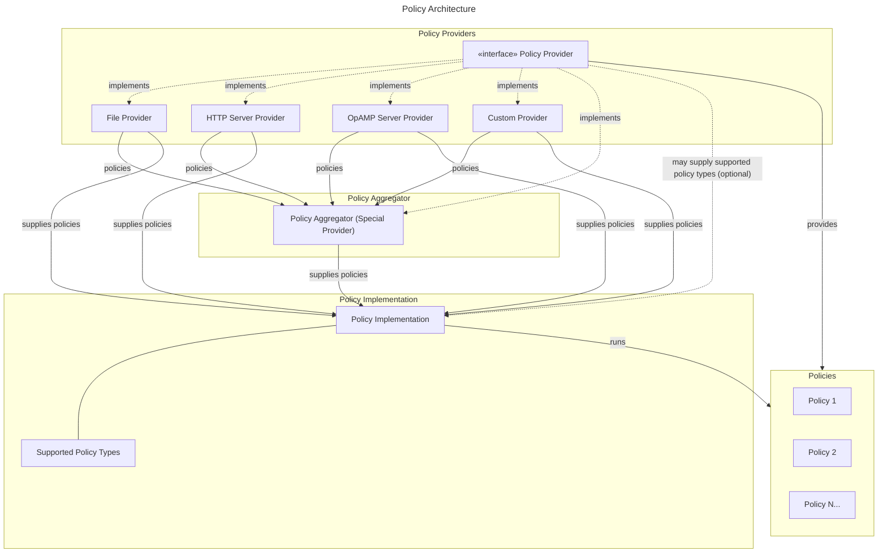

# Telemetry Policies

Defines a new concept for OpenTelemetry: Telemetry Policy.

## Motivation

OpenTelemetry provides a robust, standards based instrumentation solution.
this includes many great components, e.g.

- Declarative configuration
- Control Protocol via OpAMP
- X-language extension points in the SDK (samplers, processors, views)
- Telemetry-Plane controls via the OpenTelemetry collector.

However, OpenTelemetry still struggles to provide true "remote control"
capabilities that are implementation agnostic. When using OpAMP with an
OpenTelemetry collector, the "controlling server" of OpAMP needs to understand
the configuration layout of an OpenTelemetry collector.  If a user asked the
server to "filter out all attributes starting with `x.`", the server would
need to understand/parse the OpenTelemetry collector configuration. If the
controlling sever was also managing an OpenTelemetry SDK, then it would need
a *second* implementation of the 'filter attribute" feature for the SDK vs.
the Collector. Additionally, as the OpenTelemetry collector allows custom
configuration file formats, there is no way for a "controlling server" to
operate with an OpenTelemetry Collection distribution without understanding all
possible implementations it may need to talk to.

Additionally, existing remote-control capabilities in OpenTelemetry are not
"guaranteed" to be usable due to specification language. For example, today
one can use the Jaeger Remote Sampler specified for OpenTelemetry SDKs and the
jaeger remote sampler extension in the OpenTelemetry collector to dynamically
control the sampling of spans in SDKs. However, File-based configuration does
not require dynamic reloading of configuration. This means attempting to
provide a solution like Jaeger-remote-sampler with just OpAMP + file-based
config is impossible, today.

However, we believe there is a way to achieve our goals without changing
the direction of OpAmp or File-based configuration. Instead we can break apart
the notion of "Configuration" from "Policy", providing a new capability in
OpenTelemetry.

## Explanation

We define a new concept called a `Telemetry Policy`.  A Policy is an
intent-based specification from a user of OpenTelemetry.

- **Typed**: A policy self identifies its "type". Policies of different types
  cannot be merged, but policies of the same type MUST be merged together.
- **Clearly specified behavior**: A policy type enforces a specific behavior for
  a clear use case, e.g. trace sampling, metric aggregation, attribute
  filtering.
- **Implementation Agnostic**: I can use the exact same policy in the collector
  or an SDK or any other component supporting OpenTelemetry's ecosystem.
- **Standalone**: I don't need to understand how a pipeline is configured to define
  policy.
- **Dynamic**: We expect policies to be defined and driven outside the lifecycle
  of a single collector or SDK. This means the SDK behavior needs the ability
  to change post-instantiation.
- **Idempotnent**: I can give a policy to multiple components in a
  telemetry-plane safely. E.g. if both an SDK and collector obtain an
  attribute-filter policy, it would only occur once.

Every policy is defined with the following:

- A `type` denoting the use case for the policy
- A json schema denoting what a valid definitions of the policy entails.
- TODO - A merge algorithm, denoting how multiple policies can be merged
  together in a component to create desired behavior.
- TODO - A specification denoting the behavior the policy enforces.

Policies MUST NOT:

- Specify configuration relating to the underlying policy applier implementation.
  - A policy cannot know where the policy is going to be run.
- Specify its transport methodlogy.
- Interfere with telemetry upon failure.
  - Policies MUST be fail-open.
- Contain logical waterfalls.
  - Each policy's application is distinct from one another and at this moment
  MUST not depend on another running. This is in keeping with the idempotency
  principle.

Example policy types include: 
- `trace-sampling`: define how traces are sampled
- `metric-rate`: define sampling period for metrics
- `log-filter`: define how logs are sampled/filtered
- `attribute-redaction`: define attributes which need redaction/removal.
- `metric-aggregation`: define how metrics should be aggregated (i.e. views).
- `exemplar-sampling`: define how exemplars are sampled
- `attribute-filter`: define data that should be rejected based on attributes

## Policy Ecosystem

Policies are designed to be straightforward objects with little to no logic
tied to them. Policies are also designed to be agnostic to the transport, 
implementation, and data type. It is the goal of the ecosystem to support
policies in various ways. Policies MUST be additive and MUST NOT break existing
standards. It is therefore our goal to extend the ecosystem by recommending
implementations through the following architecture.

The architectural decisions are meant to be flexible to allow users optionality
in their infrastructure. For example, a user may decide to run a multi-stage
policy architecture where the SDK, daemon collector, and gateway collector work
in tandem where the SDK and Daemons are given set policies while the gateway is
remotely managed. Another user may choose to solely remotely manage their SDKs.
As a result of this scalable architecture, it's recommended the policy providers
updates are asynchronous. An out of date policy (i.e. one updated in a policy
provider but not yet in the applier) should not be lethal to the functionality
of the system.



## Example Ecosystem implementations

We make the following observations and recommendations for how the community may
integrate with this specification.

### OpenTelemetry SDKs

An SDK's declaritive configuration may be extended to support a list of policy
providers. An SDK with no policy providers set is the same behavior as today as
policies are fail open. The simplest policy provider is the file provider. The SDK
should read this file upon startup, and optionally watch the file for changes. The
policy provider may supply the configuration for watching. 

The policy providers for the SDK push policies into the SDK, allowing the SDK to become
a policy implementation. An SDK may receive updates at any time for these policies, so
it must allow for the reloading in its extension points. Sample SDK extension points:

- `PolicySampler`: Pulls relevant `trace-sampling` policies from
  PolicyProvider, and uses them.
- `PolicyLogProcessor`: Pulls Relevant `log-filter` policies from
  PolicyProvider and uses them.
- `PolicyPeriodicMetricReader`: Pulls Relevant `metric-rate` policies
  from PolicyProvider and uses them to export metrics.

### OpenTelemetry Collector

The collector is a natural place to run these policies. A policy processor may be
introduced to execute its set of policies. It is recommended that the collector uses
the same declaritive configuration the SDK uses for policy provider configuration. The
collector may introduce an inline policy provider that provides a set of default policies
to execute in addition to whatever may be received from the policy providers.

The collector may also have a policy extension which allows it to serve as a policy
aggregator. In this world, the collector's policy extension would have a list of policy
providers it pulls from while other policy implementations set the collector as a policy
provider. This is akin to the proxy pattern you see in other control plane implementations.
This pattern should allow for a horizontally scalable architecture where all extensions
eventually report the same policies.

### OpAMP

Per the constraints above, this specification makes NO requirements to the transport layer
for policy providers. OpAMP is a great extension point which may serve as a
policy provider through the use of custom messages. A policy implementation with OpAMP
support may use the OpAMP connection to transport policies. This specification makes no
recommendation as to what that custom message may look currently.

### Summary

While we make no requirements of these groups in this specification, it is recommended
that they all adhere to a consistent experience for users to enhance portability. The
authors here will coordinate with other SIGs to ensure agreement upon this configuration.
This may involve a follow up to this specification recommending policy provider specifics
such as an HTTP/gRPC definition. This definition would then serve as a basis for custom
implementations like that for OpAMP. More on this in `Future Possibilities`

## Internal details

TDOO - write

From a technical perspective, how do you propose accomplishing the proposal? In particular, please explain:

* How the change would impact and interact with existing functionality
* Likely error modes (and how to handle them)
* Corner cases (and how to handle them)

While you do not need to prescribe a particular implementation - indeed, OTEPs should be about **behaviour**, not implementation! - it may be useful to provide at least one suggestion as to how the proposal *could* be implemented. This helps reassure reviewers that implementation is at least possible, and often helps them inspire them to think more deeply about trade-offs, alternatives, etc.

## Trade-offs and mitigations

TODO - write

What are some (known!) drawbacks? What are some ways that they might be mitigated?

Note that mitigations do not need to be complete *solutions*, and that they do not need to be accomplished directly through your proposal. A suggested mitigation may even warrant its own OTEP!

## Prior art and alternatives

TODO - discuss https://github.com/open-telemetry/opentelemetry-specification/pull/4672

### Declarative Config + OpAMP as sole control for telemetry

The declarative config + OpAMP could be used to send any config to any
component in OpenTelemetry. Here, we would leverage OpAMP configuration passing
and the open-extension and definitions of Declarative Config to pass the whole
behavior of an SDK or Collector from an OpAMP "controlling server" down to a
component and have them dynamically reload behavior.

What this solution doesn't do is answer how to understand what config can be
sent to what component, and how to drive control / policy independent of
implementation or pipeline set-up.  For example, imagine a simple collector
configuration:

```yaml
receivers:
  otlp:
  prometheus:
    # ... config ...
processors:
  batch:
  memorylimiter:
  transform/drop_attribute:
    # config to drop an attribute
exporters:
  otlp:
pipelines:
  metrics/critical:
    receivers: [otlp]
    processors: [batch, transform/drop_attribute]
    exporters: [otlp]
  metrics/all:
    receivers: [prometheus]
    processors: [memorylimiter]
    exporters: [otlp]
```

Here, we have two pipelines with intended purposes and tuned configurations.
One which will *not* drop metrics when memory limits are reached and another
that will. Now - if we want to drop a particular metric from being reported,
which pipeline do we modify?  Should we construct a new processor for that
purpose?  Should we always do so?

Now imagine we *also* have an SDK we're controlling with declarative config. If
we want to control metric inclusion in that SDK, we'd need to generate a
completely different looking configuration file, as follows:

```yaml
file_format: '1.0-rc.1'
# ... other config ...
meter_provider:
  readers:
    - my_custom_metric_filtering_reader:
        my_filter_config: # defines what to filter
        wrapped: 
          periodic:
            exporter:
              otlp_http:
                endpoint: ${OTEL_EXPORTER_OTLP_ENDPOINT:-http://localhost:4318}/v1/metric
```

Here, I've created a custom component in java to allow filtering which metrics are read.
However, to insert / use this component I need to have all of the following:

- Know that this component exists in the java SDK
- Know how to wire it into any existing metric export pipeline (e.g. my reader
  wraps another reader that has the real export config).
  Note: This likely means I need to understand the rest of the exporter
  configuration or be able to parse it.

This is not ideal for a few reasons:

- Anyone designing a server that can control telemetry flow MUST have a deep
  understanding of all components it could control and their implementations.
- We don't have a "safe" mechanism to declare what configuration is supported
  or could be sent to a specific component (note: we can design one)
- The level of control we'd expose from our telemetry systems is *expansive*
  and possibly dangerous. 
  - We cannot limit the impact of any remote configuration on the working of a
    system. We cannot prevent changes that may take down a process.
  - We cannot limit the execution overhead of configuration or fine-grained
    control over what changes would be allowed remotely.

## Open questions

What are some questions that you know aren't resolved yet by the OTEP? These may be questions that could be answered through further discussion, implementation experiments, or anything else that the future may bring.

- Should this specification give recommendations for the server protobufs
- How should we handle policy merging?
  - (jacob) Could policies contain a priority and it's up to the providers to design around this?

## Prototypes

Link to any prototypes or proof-of-concept implementations that you have created.
This may include code, design documents, or anything else that demonstrates the
feasibility of your proposal.

Depending on the scope of the change, prototyping in multiple programming
languages might be required.

## Future possibilities

What are some future changes that this proposal would enable?
