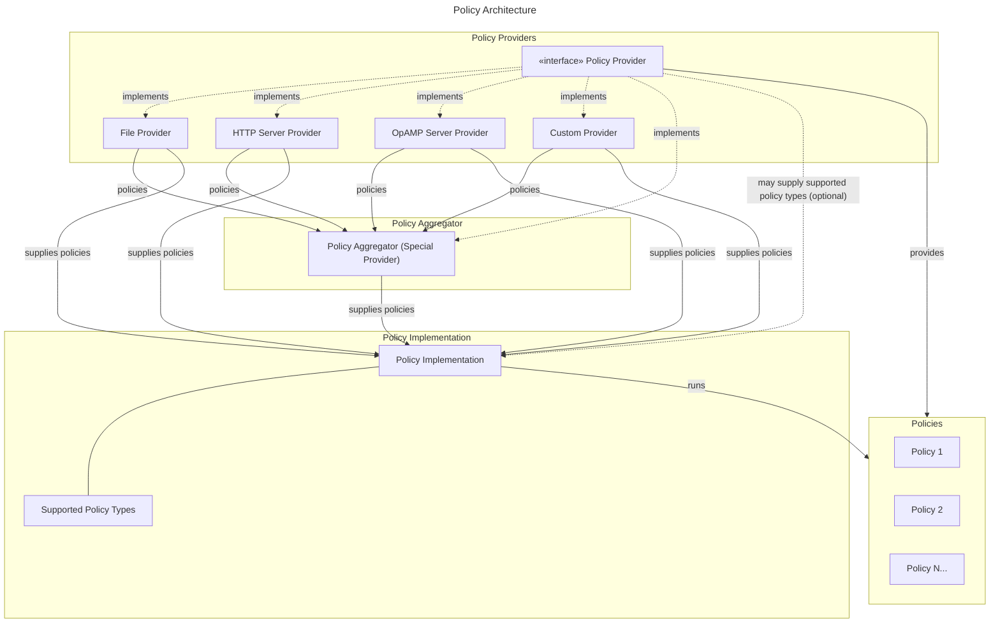

# Telemetry Policies

Defines a new concept for OpenTelemetry: Telemetry Policy.

## Motivation

OpenTelemetry provides declarative configuration, OpAMP for remote control,
cross-language SDK extension points, and the OpenTelemetry Collector for
telemetry processing. Controlling telemetry behavior at scale remains difficult.
The current model—configuration files that define processing pipelines—breaks
down in predictable ways.

### Configurations grow organically

Processing rules accumulate over time. A configuration that started as 50 lines
becomes thousands. Each line represents a problem that was solved, but the
context is lost. Line 847 exists for a reason, but that reason is not documented
in the configuration itself.

Changes become risky because the configuration encodes institutional knowledge
that is not legible to new team members or external tools.

### Configurations require global reasoning

To safely change one part, you need to understand the whole. Data flows through
a DAG of components—what shape is it at this point? What came before? What
breaks if you modify this? The cognitive load grows with the config size until
changes become risky and reviews become superficial.

When using OpAMP with an OpenTelemetry Collector, the controlling server needs
to understand the configuration layout of that specific collector. If a user
asks the server to "filter out all attributes starting with `x.`", the server
must understand and parse the collector configuration. If the same server also
manages an OpenTelemetry SDK, it needs a second implementation of the attribute
filtering feature—one for the SDK, one for the Collector. Each component has its
own configuration format and semantics.

### Configurations don't scale

Dropping a hundred noisy log patterns is feasible. A thousand patterns degrades
performance. Ten thousand is impractical. The sequential processing model was
not designed for this level of specificity. Organizations compromise by dropping
broad categories, losing signal with the noise.

### Remote control lacks guarantees

Existing remote-control capabilities in OpenTelemetry are not guaranteed to be
usable. The Jaeger Remote Sampler works with OpenTelemetry SDKs and the
Collector's Jaeger remote sampler extension. However, file-based configuration
does not require dynamic reloading. A solution combining OpAMP with file-based
configuration cannot provide the same dynamic behavior.

The OpenTelemetry Collector allows custom configuration file formats. A
controlling server cannot operate with an arbitrary Collector distribution
without understanding all possible configuration formats it may encounter.

### A different model

These goals can be achieved without changing the direction of OpAMP or
file-based configuration. The solution is to separate "configuration" from
"policy".

Policies are independent rules. Each policy is atomic, self-contained, and
understandable in isolation. The execution model supports tens of thousands of
policies without degradation. A policy works the same way whether it runs in an
SDK, a Collector, or any other component that implements the specification.

## Explanation

We define a new concept called a `Telemetry Policy`. A Policy is an intent-based
specification from a user of OpenTelemetry.

- **Typed**: A policy self-identifies its "type" through its target signal. In
  the proto schema, this is enforced by the `oneof target` field — a policy
  targets exactly one signal (e.g. log, metric, trace). Policies of different
  types cannot be merged, but policies of the same type MUST be merged together.
- **Clearly specified behavior**: A policy type enforces a specific behavior for
  a clear use case, e.g. trace sampling, metric aggregation, attribute
  filtering.
- **Implementation Agnostic**: I can use the exact same policy in the collector
  or an SDK or any other component supporting OpenTelemetry's ecosystem.
- **Standalone**: I don't need to understand how a pipeline is configured to
  define policy.
- **Dynamic**: We expect policies to be defined and driven outside the lifecycle
  of a single collector or SDK. This means the SDK behavior needs the ability to
  change post-instantiation.
- **Idempotent**: I can give a policy to multiple components in a
  telemetry-plane safely. E.g. if both an SDK and collector obtain an
  attribute-filter policy, it would only occur once.

Every policy is defined with the following:

- A `type` denoting the use case for the policy
- A schema denoting what a valid definition of the policy entails, describing
  how servers should present the policy to customers.
- A specification denoting behavior the policy enforces, i.e., for a given JSON
  entry, to which elements the policy applies and which behavior is expected
  from an agent or collector implementing the policy.

Policies MUST NOT:

- Specify configuration relating to the underlying policy applier
  implementation.
  - A policy cannot know where the policy is going to be run.
- Specify its transport methodology.
- Interfere with telemetry upon failure.
  - Policies MUST be fail-open.
- Contain logical waterfalls.
  - Each policy's application is distinct from one another and at this moment
    MUST NOT depend on another running. This is in keeping with the idempotency
    principle.

Example policy types include:

- `trace-sampling`: define how traces are sampled
- `metric-rate`: define sampling period for metrics
- `log-filter`: define how logs are sampled/filtered
- `attribute-redaction`: define attributes that need redaction/removal.
- `metric-aggregation`: define how metrics should be aggregated (i.e. views).
- `exemplar-sampling`: define how exemplars are sampled
- `attribute-filter`: define data that should be rejected based on attributes

## Policy Ecosystem

Policies are designed to be straightforward objects with little to no logic tied
to them. Policies are also designed to be agnostic to the transport,
implementation, and data type. It is the goal of the ecosystem to support
policies in various ways. Policies MUST be additive and MUST NOT break existing
standards. It is therefore our goal to extend the ecosystem by recommending
implementations through the following architecture.

The architectural decisions are meant to be flexible to allow users optionality
in their infrastructure. For example, a user may decide to run a multi-stage
policy architecture where the SDK, daemon collector, and gateway collector work
in tandem where the SDK and Daemons are given set policies while the gateway is
remotely managed. Another user may choose to solely remotely manage their SDKs.
As a result of this scalable architecture, it's recommended that policy provider
updates are asynchronous. An out-of-date policy (i.e. one updated in a policy
provider but not yet in the applier) should not be lethal to the functionality
of the system.

<details>
<summary>Architecture Diagram</summary>



</details>

### Example Ecosystem Implementations

The following observations and recommendations describe how the community may
integrate with this specification.

#### OpenTelemetry SDKs

An SDK's declarative configuration may be extended to support a list of policy
providers. An SDK with no policy providers configured behaves the same as
today—policies are fail-open. The simplest policy provider is the file provider.
The SDK reads this file at startup and optionally watches for changes.

Policy providers push policies into the SDK, allowing the SDK to become a policy
implementation. An SDK may receive updates at any time, so it must support
reloading in its extension points. Sample SDK extension points:

- `PolicySampler`: Pulls relevant `trace-sampling` policies from PolicyProvider.
- `PolicyLogProcessor`: Pulls relevant `log-filter` policies from
  PolicyProvider.
- `PolicyPeriodicMetricReader`: Pulls relevant `metric-rate` policies from
  PolicyProvider.

#### OpenTelemetry Collector

The Collector is a natural place to run policies. A policy processor may be
introduced to execute policies. The Collector should use the same declarative
configuration as the SDK for policy provider configuration. The Collector may
introduce an inline policy provider for default policies in addition to those
received from external providers.

The Collector may also serve as a policy aggregator through a policy extension.
The extension pulls from multiple policy providers while other policy
implementations set the Collector as their policy provider. This pattern enables
a horizontally scalable architecture where all extensions eventually report the
same policies.

#### OpAMP

This specification makes no requirements on the transport layer for policy
providers. OpAMP may serve as a policy provider through custom messages. A
policy implementation with OpAMP support may use the OpAMP connection to
transport policies. This specification makes no recommendation on the custom
message format.

#### Summary

This specification makes no requirements on these groups. It is recommended that
they adhere to a consistent experience for users to enhance portability.
Coordination with other SIGs will ensure agreement on configuration. A follow-up
specification may recommend policy provider specifics such as an HTTP/gRPC
definition, which would serve as a basis for custom implementations like OpAMP.
See `Future Possibilities` for more.

## Internal details

### Typed Schema

Below is a sample for the schema of a policy, defined in the protobuf format. We
make an effort to adhere to OpenTelemetry Semantic Conventions and previous
specifications.

```proto
message Policy {
  // Unique identifier for this policy
  string id = 1;

  // Human-readable name
  string name = 2;

  // Optional description
  string description = 3;

  // Whether this policy is enabled
  bool enabled = 4;

  // Timestamp when this policy was created (Unix epoch nanoseconds)
  fixed64 created_at_unix_nano = 5;

  // Timestamp when this policy was last modified (Unix epoch nanoseconds)
  fixed64 modified_at_unix_nano = 6;

  // Labels for metadata and routing
  repeated opentelemetry.proto.common.v1.KeyValue labels = 7;

  // Target configuration. Exactly one must be set.
  oneof target {
    LogTarget log = 10;
    MetricTarget metric = 11;
    TraceTarget trace = 12;
    ...
  }
}
```

Every policy MUST have an id and name. Each policy MAY specify associated labels
and metadata about its creation. Each policy MUST specify only one target
configuration to promote specificity for users when creating a policy.
Throughout the schema, we take advantage of `oneof` to prevent invalid
configuration (i.e. someone specifying type: trace and then a metric-only
configuration).

#### Policy Matchers

To optimize the performance of policies and adhere to the above requirements for
policies, each policy target configuration begins with setting a list of ANDed
matchers. The `LogMatcher` configuration below allows a user to easily target a
log or group of logs through any fields available to the log. A policy MUST
contain at least one matcher. Regular expressions MUST use RE2 syntax for
cross-implementation consistency.

```proto
message LogMatcher {
  // The field to match against. Exactly one must be set.
  oneof field {
    // Simple fields (body, severity_text, trace_id, span_id, etc.)
    LogField log_field = 1;

    // Log record attribute by key or path
    AttributePath log_attribute = 2;

    // Resource attribute by key or path
    AttributePath resource_attribute = 3;

    // Scope attribute by key or path
    AttributePath scope_attribute = 4;
  }

  // Match type. Exactly one must be set.
  oneof match {
    // Exact string match
    string exact = 10;

    // Regular expression match
    string regex = 11;

    ...
  }

  // If true, inverts the match result
  bool negate = 20;

  // If true, applies case-insensitive matching to all match types
  bool case_insensitive = 21;
}
```

### Policy Design

The configuration for the actions for policies will be determined after this
OTEP is accepted and is currently being developed. Each policy MUST specify its
runtime requirements. Policy actions MUST be run in designated stages. When
designing a new policy, a policy SHOULD begin with a filter to select the
targeted data.

### Runtime Requirements

#### Evaluation

Implementations MAY evaluate policies concurrently. The independence of policies
enables parallel matching without coordination.

#### Error Handling

Implementations MUST be fail-open:

- If a policy fails to parse, it MUST be skipped. Other policies MUST continue
  to execute.
- If a policy fails to evaluate (e.g., invalid regex at runtime), the telemetry
  MUST pass through unmodified by that policy.
- Policy failures MUST NOT cause telemetry loss.

Implementations SHOULD log policy evaluation errors for debugging.

#### Disabled Policies

Policies with `enabled: false` MUST NOT be evaluated. Implementations MUST treat
disabled policies as if they do not exist.

### Merging policies

Policy merging has two distinct concerns: how a provider **transports** policy
updates to a client, and how a runtime **resolves** overlapping policies at
evaluation time. We address each in turn.

#### Transport-level sync

Since the policy itself does not enforce a transport mechanism or format, the
sync mechanism is also not enforced by the policy. However, all transport
implementations SHOULD follow these principles:

**Prefer full-set replacement over patching.** Transmitting the complete policy
set on each sync avoids traditional merge pitfalls — field ordering ambiguity,
partial update conflicts, and array operation incompatibilities. A provider
SHOULD send the full list of active policies and the client SHOULD atomically
replace its local set. Implementations SHOULD support a hash or version
identifier for change detection so that clients can skip processing when the
policy set has not changed.

**Support incremental updates as an optimization, not a requirement.** Transport
protocols MAY support incremental diffs (e.g., add/remove individual policies by
ID) as a bandwidth optimization. When incremental updates are supported, the
protocol MUST also provide a mechanism for the client to request a full sync to
recover from drift or missed updates.

**Report policy status back to the provider.** Transport protocols SHOULD
provide a mechanism for clients to report per-policy status (match counts,
errors) back to the provider. This feedback loop enables providers to detect
misconfigured or ineffective policies. Status SHOULD be scoped to each provider
— a provider only receives status for the policies it supplies. Each provider is
responsible for ensuring its policies are not disruptive to the system.

**Resolve duplicate policy IDs by provider priority.** When multiple providers
supply a policy with the same `id`, the client must decide which one to keep.
Implementations SHOULD assign each provider a priority — for example, OPAMP (1),
HTTP (2), FILE (3), CUSTOM (user-defined) — where a lower number is higher
priority. When two policies share the same `id`, the policy from the
higher-priority provider wins and the other is dropped. Where a policy from a
lower-priority provider cannot be merged consistently with the higher-priority
version, the lower-priority policy SHOULD be dropped in its entirety.

The specific mechanism will depend on the `PolicyProvider` implementation:

- A `FileProvider` reads the full policy set from disk (YAML, JSON, or proto
  binary). Each read produces a complete snapshot; no patch semantics are
  needed.
- An HTTP or gRPC provider SHOULD implement request/response sync with
  hash-based change detection and support for client metadata (supported policy
  stages, resource attributes).
- OpAMP providers can embed the policy set in an OpAMP custom-message or
  agent-config payload, reusing OpAMP's existing change-detection mechanisms.

#### Runtime conflict resolution

Because policies are independent and self-contained, multiple policies may match
the same piece of telemetry. When this happens, the runtime must combine their
effects. Regardless of how an implementation structures its evaluation, the
following properties MUST hold:

- **Commutativity.** The result of applying a set of matching policies MUST NOT
  depend on the order in which they are processed.
- **Idempotency.** Applying the same policy twice MUST produce the same result
  as applying it once.
- **Determinism.** Given the same set of matching policies and the same
  telemetry, every instance MUST produce the same output.

These properties ensure that policies can be distributed across agents and
collectors without coordination, and that the outcome is reproducible regardless
of processing order.

As a concrete example, consider how a runtime might resolve conflicting `keep`
values. A naïve approach — last write wins — violates commutativity:

```python
# Bad: result depends on processing order
def resolve_keep_naive(matching_policies):
    result = "all"
    for policy in matching_policies:
        result = policy.keep  # last one wins
    return result
```

Instead, the runtime can apply a **commutative reduction** that always converges
to the same answer. For `keep`, a natural choice is "most restrictive wins":

```python
def resolve_keep(matching_policies):
    """Resolve conflicting keep values.

    Applies a commutative 'most restrictive' merge:
      none < N/s < N/m < N% < all

    The result is independent of policy ordering.
    """
    result = Keep("all")
    for policy in matching_policies:
        if policy.keep is None:
            continue
        candidate = Keep(policy.keep)
        # Keep the more restrictive of the two
        result = most_restrictive(result, candidate)
    return result
```

The same principle extends to any policy field where multiple policies may
contribute values. For each such field, the implementation should define a
commutative merge operation — for example, taking the minimum, taking the union,
or applying a deterministic priority order. Where no natural commutative
operation exists (e.g., two policies set different values for the same
attribute), implementations MUST process policies in a consistent order (e.g.,
alphanumerically by policy ID) to ensure reproducible results across instances.

## Trade-offs and mitigations

This specification makes deliberate trade-offs in favor of simplicity and scale.

**No user-defined ordering.** You cannot specify that policy A runs before
policy B. This is intentional—ordering creates dependencies, and dependencies
break the independence that makes policies scale. The trade-off is less
flexibility. If you need strict ordering, you need separate processing stages
outside the policy system.

**No conditional logic.** Policies don't support if/else or branching. Each
policy is a simple predicate and action. Complex conditional logic belongs in
your application code, not your telemetry processing. This keeps policies easy
to understand and easy to generate.

**No cross-policy references.** A policy cannot reference another policy's
output or depend on another policy having run. This limits composition but
ensures every policy is self-contained, allowing a user to run a policy anywhere
and verify its correctness. You can reason about each policy in isolation.

These constraints exist because the primary goal is scale—tens of thousands of
policies executing efficiently. Every feature that adds complexity makes that
goal harder. The spec intentionally stays minimal.

## Prior art and alternatives

This section examines existing approaches to telemetry processing and control,
analyzing their strengths and limitations relative to the policy model proposed
here.

### Pipeline Configurations

Pipeline-based configurations are the dominant model for telemetry processing.
Tools like Vector, Fluent Bit, Logstash, and the OpenTelemetry Collector define
processing as a directed acyclic graph (DAG) of components. Data flows through
receivers, processors, and exporters in a defined sequence, with each component
transforming the data before passing it to the next.

**Pros:**

- Expressive and flexible: arbitrary transformations are possible at each stage.
- Well-understood model with extensive tooling and community knowledge.
- Supports complex routing, fan-out, and conditional logic.
- Mature implementations with production-proven reliability.

**Cons:**

- Requires global reasoning: changing one component may affect downstream
  behavior.
- Configuration complexity grows with rule count; thousands of rules become
  unmanageable.
- Sequential execution creates performance bottlenecks as rules multiply.
- Not portable: each tool has its own configuration format and semantics.
- Interdependencies make it difficult to effectively remotely modify policies.

### OPA (Open Policy Agent)

OPA provides a general-purpose policy engine using the Rego query language.
Originally designed for authorization and admission control in cloud-native
environments, OPA can evaluate arbitrary policies against structured data. It is
widely used in Kubernetes admission control, API authorization, and
infrastructure policy enforcement.

**Pros:**

- Turing-complete policy language enables complex conditional logic.
- Decouples policy from enforcement: policies are data, not code.
- Strong ecosystem with tooling for testing, debugging, and distribution.
- Supports policy bundles for centralized management.

**Cons:**

- Rego has a steep learning curve; it is not intuitive for most engineers.
- General-purpose design means no telemetry-specific optimizations.
- Policies can have arbitrary logic, making behavior harder to predict.
- Evaluation overhead may be prohibitive for high-throughput telemetry streams.

### Datadog Processing Pipelines (prior art)

Datadog provides a UI-driven approach to log processing. Users define pipelines
containing processors that parse, enrich, filter, and transform logs. Each
processor has a filter (matcher) and an action. The UI abstracts the underlying
configuration, making it accessible to non-engineers.

**Pros:**

- User-friendly interface lowers the barrier to creating processing rules.
- Each processor is conceptually similar to a policy: matcher plus action.
- Integrated with Datadog's broader observability platform.
- Managed service eliminates operational burden.

**Cons:**

- Vendor lock-in: rules are specific to Datadog and not portable.
- Limited to Datadog's supported transformations and matchers.
- No programmatic API for bulk rule management at scale.
- Opaque execution model makes debugging difficult.

### OpenTelemetry Collector Processors / OTTL

The OpenTelemetry Collector includes processors for common telemetry
transformations: `filter` for dropping data, `attributes` for modifying
attributes, `transform` for OTTL-based transformations, and others. These are
configured in YAML as part of the collector pipeline.

**Pros:**

- Native to the OpenTelemetry ecosystem with strong community support.
- OTTL (OpenTelemetry Transformation Language) provides a structured
  transformation syntax.
- Processors are composable within the pipeline model.
- Open source with transparent behavior.

**Cons:**

- Rules are embedded in pipeline configuration, not standalone.
- Adding rules requires understanding the full pipeline context.
- Not portable to SDKs or other runtimes without reimplementation.
- No native support for dynamic updates without configuration reload.
- Scale is limited by the sequential processing model.
- No defined grammar for OTTL, making it impossible to run outside the
  collector.

### Declarative Config + OpAMP as sole control for telemetry

Declarative config + OpAMP could be used to send any config to any component in
OpenTelemetry. Here, we would leverage OpAMP configuration passing and the
open-extension and definitions of Declarative Config to pass the whole behavior
of an SDK or Collector from an OpAMP "controlling server" down to a component
and have them dynamically reload behavior.

What this solution doesn't do is answer how to understand what config can be
sent to what component, and how to drive control / policy independent of
implementation or pipeline set-up. For example, imagine a simple collector
configuration:

```yaml
receivers:
  otlp:
  prometheus:
    # ... config ...
processors:
  batch:
  memorylimiter:
  transform/drop_attribute:
    # config to drop an attribute
exporters:
  otlp:
pipelines:
  metrics/critical:
    receivers: [otlp]
    processors: [batch, transform/drop_attribute]
    exporters: [otlp]
  metrics/all:
    receivers: [prometheus]
    processors: [memorylimiter]
    exporters: [otlp]
```

Here, we have two pipelines with intended purposes and tuned configurations. One
which will _not_ drop metrics when memory limits are reached and another that
will. Now - if we want to drop a particular metric from being reported, which
pipeline do we modify? Should we construct a new processor for that purpose?
Should we always do so?

Now imagine we _also_ have an SDK we're controlling with declarative config. If
we want to control metric inclusion in that SDK, we'd need to generate a
completely different looking configuration file, as follows:

```yaml
file_format: "1.0-rc.1"
# ... other config ...
meter_provider:
  readers:
    - my_custom_metric_filtering_reader:
        my_filter_config: # defines what to filter
        wrapped:
          periodic:
            exporter:
              otlp_http:
                endpoint: ${OTEL_EXPORTER_OTLP_ENDPOINT:-http://localhost:4318}/v1/metric
```

Here, I've created a custom component in java to allow filtering which metrics
are read. However, to insert / use this component I need to have all of the
following:

- Know that this component exists in the java SDK
- Know how to wire it into any existing metric export pipeline (e.g. my reader
  wraps another reader that has the real export config). Note: This likely means
  I need to understand the rest of the exporter configuration or be able to
  parse it.

This is not ideal for a few reasons:

- Anyone designing a server that can control telemetry flow MUST have a deep
  understanding of all components it could control and their implementations.
- We don't have a "safe" mechanism to declare what configuration is supported or
  could be sent to a specific component (note: we can design one)
- The level of control we'd expose from our telemetry systems is _expansive_ and
  possibly dangerous.
  - We cannot limit the impact of any remote configuration on the working of a
    system. We cannot prevent changes that may take down a process.
  - We cannot limit the execution overhead of configuration or fine-grained
    control over what changes would be allowed remotely.

### Summary

This specification draws from all of these approaches but prioritizes
independence, portability, and scale over flexibility. Where pipeline
configurations offer maximum expressiveness, policies offer predictability.
Where OPA provides a general-purpose language, policies provide a minimal,
purpose-built model. Where vendor solutions lock users in, policies use
OpenTelemetry's data model for portability.

## Open questions

What are some questions that you know aren't resolved yet by the OTEP? These may
be questions that could be answered through further discussion, implementation
experiments, or anything else that the future may bring.

## Prototypes

1. [Tero edge](https://github.com/usetero/edge)
   1. a zig implementation of a proxy that applies policies.
   2. later we will show our policy representation as a sample of this OTEP.

## Future possibilities

What are some future changes that this proposal would enable?
