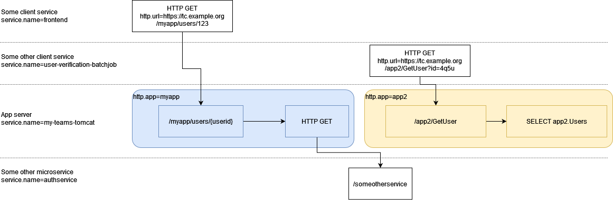

# Context-scoped attributes

Add Context-scoped telemetry attributes which typically apply to all signals
associated with a request as it crosses a single service.

Original author: [Christian Neumüller](https://github.com/Oberon00).

## Motivation

This OTEP aims to address various related demands that have been brought up
in the past, where the scope (and lifetime) of resource attributes is too broad,
but the scope of span attributes is too narrow. For example, this happens where there is a
mismatch between the OpenTelemetry SDK’s (and thus TracerProvider’s, MeterProvider’s, LoggerProvider's)
process-wide initialization and the semantic scope of a (sub)service.

A typical use case is supporting multi tenancy, with tenant information existing
in the request itself (e.g. header key, acess token, request parameter). This tenant information
could be then propagated via Context-scoped attributes. **Any** telemetry produced during the processing
of the request would then be automatically associated with the respective request/tenant.
Other alternatives would be problematic:

* Having an SDK instance per tenant (in order to report tenant-specific information) can be prohibitive
  as there could be hundreds or thousands of different tenants, and the processing/exporting pipeline
  would be duplicated N-times.
* Custom processors for attaching tenant-specific information would work for spans and logs. However,
  at the time of writing this OTEP there is no processor functionality for metrics.
* In general, OpenTelemetry should offer out-of-the-box common functionality that is extensively
  used, instead of asking users to write custom components recurringly.

A related usecase is posed in the issue
[open-telemetry/opentelemetry-specification#335](https://github.com/open-telemetry/opentelemetry-specification/issues/335)
“Consider adding a resource (semantic convention) to distinguish
HTTP applications (http.app attribute)”. If the opentelemetry-java agent
is injected in a JVM running a classical Java Application Server (such as tomcat),
there will be a single resource for the whole JVM. The application server can
host multiple independent applications. There is currently no way to distinguish
between these, other than with the generic HTTP attributes like
`http.route` or `url.template`. 
Logically, the app attribute would apply to all spans within the trace
as it crosses the app server, as shown in the diagram below:



This example shows two traces, with two "HTTP GET" root spans, one originating
from service `frontend` and another from `user-verification-batchjob`.
Each of these HTTP GET spans calls into a third service `my-teams-tomcat`.
That service hosts two distinct HTTP subservices, and as each of the traces crosses it,
all the spans have a respective `http.app` associated with it. When the `my-teams-tomcat` service
makes a call to another service `authservice`, that attribute does *not* apply
to the remote child spans.

A  similar problem occurs with `faas.name` and `cloud.resource_id`
([Function as a Service Resource semantic conventions](https://opentelemetry.io/docs/specs/semconv/resource/faas/))
on Azure Functions. While both are defined as Resource attributes, an Azure
function app hosts multiple co-deployed functions with different names and IDs.
In PR [open-telemetry/opentelemetry-specification#2502](https://github.com/open-telemetry/opentelemetry-specification/pull/2502),
this was solved by allowing to set these Resource attributes on the FaaS
root span instead. This has the drawback that the context of which function a span
is executed in is lost in any child spans that may occur within the function (app).

## Explanation

The Context-scoped attributes allows you to attach attributes to all telemetry
signals emitted within a Context. Context-scoped attributes are standard
attributes, which means you can use strings, integers, floating point numbers,
booleans or arrays thereof, just like for any telemetry item.

When  Context-scoped attributes are enabled, they MUST be added to telemetry items
that were **emitted** while the Context containing the Context-scoped attributes
was active, or to telemetry items that had this Context explicitly set as parent.

These attributes will then be automatically available to **any** component down the pipeline, i.e.
to samplers and processors. Like other telemetry APIs, Context-scoped attributes are
write-only for applications. You cannot query the currently set Context-scoped attributes,
as they are only available on the SDK level (to samplers and processors).

Context-scoped attributes should be thought of equivalent to adding the attribute
directly to each single telemetry item it applies to.

Context-scoped attributes MUST NOT be propagated cross-service, i.e. no context propagator
must be implemented for them. This is because they are meant to annotate (a subset of)
the telemetry items related of a single service (see also [the next section](#comp-baggage)).

Context-scoped attributes MUST be disabled by default, i.e. they will not be added to
any telemetry item by default, even if they are set and propagated.
They MUST be offered as an opt-in in order to reduce the possibility of unexpected
behavior for existing users. A new boolean configuration option will be added, so
they can be enabled (or disabled) for all signals. Following the existing
configuration format, this is how it would look like:

```yaml
disabled: false
context_scoped_attributes: true
tracer_provider:
   ...
```

See [Open questions](#open-questions) regarding the expected outcome for the configuration part.

<a name="comp-baggage"></a>

### Comparing Context-scoped attributes to Baggage

Context-scoped attributes and
[baggage](https://github.com/open-telemetry/opentelemetry-specification/blob/main/specification/baggage/api.md)
have two major commonalities:

* Both are "bags of attributes"
* Both are propagated identically in-process (Baggage also lives on the Context).

However, the use cases are very different: Baggage is meant to transport app-level
data along the path of execution, while Context-scoped attributes are annotations
for telemetry in the same execution path.

This also explains the functional & API differences:

* Most important point: Baggage is meant to be propagated across services;
  in fact, this is the main use case of baggage. While a propagator for
  Context-scoped attributes would be implementable, it would break the intended
  meaning by extending the scope of attributes to called services and would also
  raise many security concerns.
* Baggage only supports string values.
* **Related** Baggage (implicitly or explicitly linked to telemetry items) MAY not be available
  to telemetry exporters (although e.g., a SpanProcessor could be used to change that),
  while that's the whole purpose of Context-scoped attributes.

### Comparing Context-scoped attributes to Instrumentation Scope Attributes

Context-scoped attributes and
[Instrumentation Scope attributes](https://github.com/open-telemetry/oteps/pull/201)
have these commonalities:

* Both have "scope" in the name.
* Both apply a set of telemetry attributes to a set of telemetry items
  (those in their "scope").

While Instrumentation Scope attributes apply to all items emitted by the same
Tracer, Meter or LogEmitter (i.e., typically the same telemetry-implementing unit
of code), the scope of Context-scoped attributes is determined at runtime by the
Context, independently of the used Tracer, Meter or LogEmitter.

Moreover, Tracer, Meter and LogEmitter instances typically have the same
life span as the application itself, whereas Context-scoped attributes
lifespan is tied to the Context itself. For example, a Context solely created
for an incoming request will stop existing once such request is done.

In practice, Instrumentation Scope and Context-scoped attributes will
[often be completely orthogonal](#scope-and-context):
When the Context is flows in-process through a single
service, there will often be exactly one span per Tracer (e.g. one span from
the HTTP server instrumentation as the request arrives, and another one from
a HTTP client instrumentation, as a downstream service is called).

## Internal details

This section explains the API-level, SDK-level and exporter-level changes that
are expected to implement this.

### API changes

The API would be extended with an implementation of the following:

* `Context SetContextScopedAttributes(Context context, Attributes attributes)`
* `Attributes GetContextScopedAttributes(Context context)`

`SetContextScopedAttributes` takes a set of attributes and a Context and returns
a new Context that has the given context attributes set.

`GetContextScopedAttributes` takes a Context and returns the context-scoped
Attributes, or an empty set if none exists.

One possible way to expose this would be through a (global) OpenTelemetry instance (e.g.
`GlobalOpenTelemetry.GetInstance().SetContextScopedAttributes()`.

The implementation could look like this:

```C#
Context SetContextScopedAttributes(Context context, Attributes attributes) {
    return context.WithValue(
        _CTX_KEY_SCOPED_ATTRS,
        attributes);
}
```

### SDK changes

Upon telemetry items creation (e.g. Span, LogRecordItem), the SDK MUST add
the context-scoped attributes of the logically associated Context,
skipping attributes with keys already present in the telemetry item.
This MUST be done before any extension point is invoked, e.g. Sampler or Processor.

This will be an implementation-level change without any changes in the API-surface
of the SDK (i.e. it is not necessary to make Context-scoped attributes distinguishable
from “direct” telemetry attributes).

The snippet below shows what the expected behavior looks like:

```java
public Span startSpan(...) {
  // Implicit (currently active) or explicit parent.
  Context context = getParentContext();

  // Attributes specified by the user upon creation time.
  Attributes initialAttributes = getInitialAttributes();

  // Merge the Context attributes, which have lesser priority
  // than the attributes explicitly specified at telemetry item
  // creation.
  getContextScopedAttributes(context).forEach((key, value) -> {
    if (!initialAttributes.containsKey(key)) {
      initialAttributes.put(key, value);
    }
  });

  // Pass the updated attributes to the sampling layer.
  SamplingDecision samplingDecision = sampler.ShouldSample(
      context,
      initialAttributes, ...);

  return new Span(initialAttributes, ...);
}
```

## Trade-offs and mitigations

This OTEP suggests making Context-scoped attributes **indistinguishable** from
attributes set directly on the telemetry items. This should ease implementation
on both backends and OpenTelemetry client libraries, and hopefully also reduces
conceptual complexity. Nevertheless, some implications of making the Context-scoped
attributes **distinguishable** are explored in
[Prior art and alternatives](#prior-art-and-alternatives).

## Prior art and alternatives

### AddBeforeEnd callback and AddFieldToTrace

There is the (slightly related) issue
[open-telemetry/opentelemetry-specification#1089](https://github.com/open-telemetry/opentelemetry-specification/issues/1089)
“Add BeforeEnd to have a callback where the span is still writeable” which seems
to be motivated by essentially the same problem, though the motivation is stated
more on a technical level: “What I tried to implement is a feature called trace field
in Honeycomb (reference: [AddFieldToTrace](https://godoc.org/github.com/honeycombio/beeline-go#AddFieldToTrace))”.
The aforementioned feature's documentation reads: "AddFieldToTrace adds the field to both the currently
active span and all other spans involved in this trace that occur within this process.".

### Alternative: Making Context-scoped attributes semantically distinct from other telemetry attributes

As explained in trace-offs and mitigations, this alternative was not selected for
the main text, because it seems to add more effort and complexity than value.

#### SDK-changes for semantically distinct Context-scoped attributes

The Context-scoped attributes would not be automatically included with the other
telemetry attributes. Instead, extension components (e.g. samplers and processors) would
explicitly invoke `GetContextScopedAttributes()` to get and set any Context-scoped
attributes on all telemetry items.

**Alternatively**, a new argument could be added to the sampler input (languages
that implement the sampler arguments with a single object with multiple properties
can implement this in a backwards-compatible way).

While in theory, applications and instrumentations could take a dependency on the
SDK, and call this function from anywhere, this is **strongly discouraged** and not
guaranteed to work. Languages may even opt for an unorthodox way to expose this
functionality.

#### Exporter changes for semantically distinct Context-scoped attributes

Exporters would need to explicitly handle these attributes. As most protocols won’t
have support for this concept, the output should probably end up the same as with
the direct attributes.

#### OTLP protocol changes for semantically distinct Context-scoped attributes (optional)

With the implementation suggested in the main section of the OTEP, there is no
need to change the OTLP protocol for this feature, as the Context attributes
should semantically be equivalent to adding the attribute to every associated
telemetry item.

If Context attributes were distinguishable, the OTLP protocol could be extended
with special support for Context-scoped attributes. The scope of Context-scoped
attributes is orthogonal to the existing hierarchy of Resource -> (Emitter)Scope -> item.
Thus, each single telemetry item needs to get a new field with its Context-scoped
attributes. This could be just a repeated opentelemetry.proto.common.v1.KeyValue contextAttributes

If a more deduplicated representation is desired, it could alternatively be an
index into a list of Context-scoped attributes that is sent once in the root
message to be shared among multiple telemetry items.

```protobuf
message TracesData {
    // ...
    repeated opentelemetry.proto.common.v1.KeyValueList contexts = 12345;
}
```

As mentioned in the API-changes, it is expected that no particular care has to
be taken to optimize for merging attributes, so a repeated KeyValueList
seems to fit the bill. If a need for such optimization is found, a representation
of a tree-structure of these Contexts might be needed, e.g., by storing a
dedicated submessage that also contains a parent index. This could become complex
to implement in the exporter though, and generic compression (e.g. gzip) may be
more effective.

<a name="scope-and-context"></a>

Yet another alternative that would also have implications for semantics, would
be to merge Context-scoped attributes with the Resource of all associated
telemetry items, or with the Instrumentation Scope, instead of their own attributes.
This would mean that every distinct set of Context-scoped attributes gets sent
within a distinct ResourceSpans/ScopeSpans message, duplicating the resource and
instrumentation scope attributes that many times (a cross-product, if you will).
This approach seems semantically interesting, but could lead to larger export
messages, especially if we assume that very often there will only be one span of
the same instrumentation-scope per Context-scope (e.g., you typically will only
have one single Span produced by the HTTP server instrumentation as the trace
crosses a single service).

### Alternative: Associating Context-scoped attributes with the span on end and setting attributes on parent Contexts

This alternative seems to be a valid option which is just as easy to implement
as the approach in the main Context, but it feels a bit less natural.

For spec-conforming implementations of tracing (which excludes .NET in this case),
ending/starting a span is independent from setting it as active in a Context.
This allows ending a span in a different context from the one it was started in.
One use case this could enable is pushing attributes up to a parent span.
For example, an incoming web request might have a low-level HTTP span as root,
which might then be dispatched to a HTTP handler method that logically is a
Function as a Service span. In this case, one might want to associate the HTTP
parent span with the FaaS function (faas.id, faas.name, …) as well. This could
be implemented by leaving the Context with these Context-scoped attributes active
after returning from the handler method.

This approach would be more similar to what is suggested in
[open-telemetry/opentelemetry-specification#1089](https://github.com/open-telemetry/opentelemetry-specification/issues/1089),
i.e. have a writable Span passed to a callback before it ends, such as OnEnding().
However, the approach used in the motivation for that issue seems to go even further
and makes pushing attributes up to the local root span the default. See the
[next alternative](#alternative-with-prior-art-bubbling-attributes-up-to-the-root-span).

### Alternative with prior art: Bubbling attributes up to the root span

This alternative is explored because it came up in a spec issue before, but it
seems to be quite complex and not clearly any more useful than the semantics
in the main OTEP.

[open-telemetry/opentelemetry-specification#1089](https://github.com/open-telemetry/opentelemetry-specification/issues/1089)
implements “trace-fields” (trace attributes) and seems to be based on a shared
mutable set of Attributes created together with the root span instead of having
an immutable set per (child) Context. If we wanted these semantics, that would
probably warrant a modified API replacing SetContextScopedAttributes:

* `Context CreateContextScopedRoot(Context)`
* `void SetAttributes(Context context, Attributes newAttributes)`

CreateContextScopedRoot() would return a new Context with an empty set of mutable
attributes. Child contexts would inherit a reference to the same mutable set.
Additionally, it would seem appropriate that setting a span as active in a Context
that has neither an active span, nor a mutable attribute set, would implicitly
also CreateContextScopedRoot.

These semantics seem to be more complex and prone to surprises though.
A typical “failure mode” when trying to associate attributes with the whole trace
(or rather whole local part of the trace within a service) including parent spans
would be when some in-process parent span has already ended (e.g. asynchronous
fire-and-forget invocation), or if the parent span has created another child
span that already ended at the time SetAttributes() is called.

One also needs to define what happens when attributes are added after a span has
ended (or a metric was recorded) but before it is exported. Probably you would
want to have a snapshot of the mutable attributes at time of emitting the
telemetry item (ending the span).

Another difficult question would be what to do if SetAttributes() is called
with a Context that does not have mutable attributes yet. Should this case be
prevented by having every child of the root context eagerly create mutable
attributes? Should mutable attributes be created in-place, modifying the Context
(deliberately made impossible with the current Context API, where setting a key
always returns a new Context). Should it always return (new) Context then?
Should it be a no-op?

Do note that with the `CreateContextScopedRoot()` API, it would be possible to
use this approach even independently of the tracing signal, just as the main OTEP.

### Alternative: Associating attributes indirectly through spans

This does not seem particularly useful, but the existence of this alternative
should serve as a reminder that the trace structure might be different from the
(child) Context structure.

If going for the
[“Making context-scoped attributes semantically distinct from other telemetry attributes” alternative](#alternative-making-context-scoped-attributes-semantically-distinct-from-other-telemetry-attributes),
a possibility would pop up to store Context-scoped attributes not on the Context, but on spans (in a dedicated property).
Other telemetry signals could still go through the active span to associate subtrace-scoped attributes.
The (subtle?) difference would be that these attributes follow the trace tree instead of the context tree.

### Alternative: An implementation for traces on the Backend

A receiver of trace data (and only trace data! i.e. no other signals) has
information about the execution flow through the parent-child relationship of
spans. It could use that to propagate/copy attributes from the parent span to
children after receiving them. However, there are several problems/differences
in what is possible:

* The backend needs to determine which attributes only apply to a particular span,
  and which apply to a whole subtrace. In absence of a dedicated API that allows
  instrumentation libraries to add this information, it can only use pre-determined
  rules (e.g. fixed list of attribute keys) for that.
* Spans are only sent (by usual SpanProcessor+Exporter pipelines) when they are ended,
  meaning that the parent will usually arrive after the children. This complicates
  processing, and can make additional buffering and/or reprocessing (e.g. repeated
  on-read processing) necessary.
* To only propagate the attributes within a service,
  [open-telemetry/oteps#182](https://github.com/open-telemetry/oteps/pull/182)
  (sending the `IsRemote` property of the parent span Context in the OTLP protocol)
  would be required. This would also require using OTLP, or another protocol
  (is there any?) that transports this information. Also, the OTLP exporters &
  language SDKs used in the participating services need to actually implement
  the feature. In absence of that, the span kind (server/consumer as child of
  client/producer) would be the only heuristic to try working around this.

Additionally, Context-scoped attributes would have the advantage of **being usable
for metrics and logs** as well. The backend could alternatively try to re-integrate
attributes from matched spans, if it's a single backend for all signals, but this
would probably become even more costly to implement.

### Alternative: Implementing Context-scoped attributes on top of Baggage

See also:

* [Related GitHub discussion](https://github.com/open-telemetry/oteps/pull/207#pullrequestreview-1055913542)
* Section [Comparing Context-scoped attributes to Baggage](#comp-baggage) above

Instead of using a dedicated Context key and APIs, the Baggage APIs and
implementation could be extended to support the use cases Context-scoped
attributes are meant to solve. This would require:

* Having metadata on the Baggage entry to decide if it should be a "real Baggage"
  or a telemetry attribute. This would decide whether the Baggage entry is added
  to telemetry items, and whether it is (not) propagated. These could be separate
  flags, potentially enabling more use cases.
* Changing Baggage entries to hold an
  [Attribute](https://github.com/open-telemetry/opentelemetry-specification/blob/v1.12.0/specification/common/README.md#attribute)
  instead of a string as value.
* Defining and implementing an association between Baggage and telemetry items
  (this point would be more or less the same as what is required for the proposed
  OTEP, e.g. a span processor could be added that enumerates the baggage, filters
  for attributes).

Using Baggage as a vehicle for implementing Context-scoped attributes seems like
a valid approach, the decision could be left up to the language. Whether this
is sensible could depend, for example, on future features that Baggage might
gain anyway (for example, a flag to stop propagation might be useful for
interoperation with OpenCensus), and on how much boilerplate code is required in
the language for implementing a new API vs. extending an existing one.

### Alternative: Implementing Context-scoped attributes using a built-in Processor

An SDK built-in processor could be added in order to stamp telemetry items
with the context-scoped attribute. It needs specifically to be built-in in order to have access
to the internal key for getting the context-scoped attributes from `Context`. There are some issues
with this approach though:

* Samplers have their `ShouldSample` operation invoked _before_ a processor
  can get their `OnStart` call. Thus we would need to add a `BeforeShouldSample` or `BeforeStart`
  operations to the processor interface, which seems redundant.
* Processors would need to be configured per-signal, which is both redundant but could also
  offer more granularity.

## Open questions

* Should `Baggage` be included as part of this new process? The need to attach
  `Baggage` values to individual telemetry items has been a request from users
  in the past. This is even considered as part of one of the alternatives that
  were considered.

* Configuration could be defined, at least initially, as a single boolean value, similar
  to how the entire SDK is enabled or disabled via the `disabled` configuration option.
  However, this OTEP leaves the topic open in case further options
  are needed, e.g. only enable Context-scoped attributes for some signals.

## Future possibilities

With the changes implemented in this OTEP, we will hopefully unblock some
long-standing specification issues. See [Motivation](#motivation).
