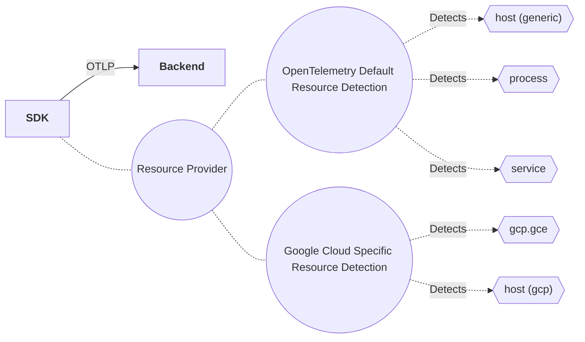
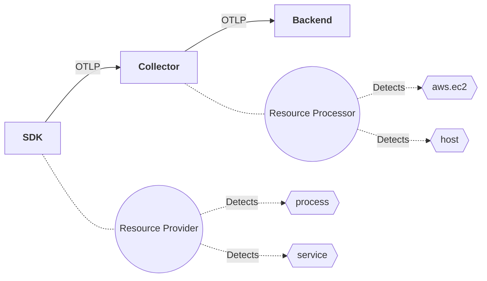
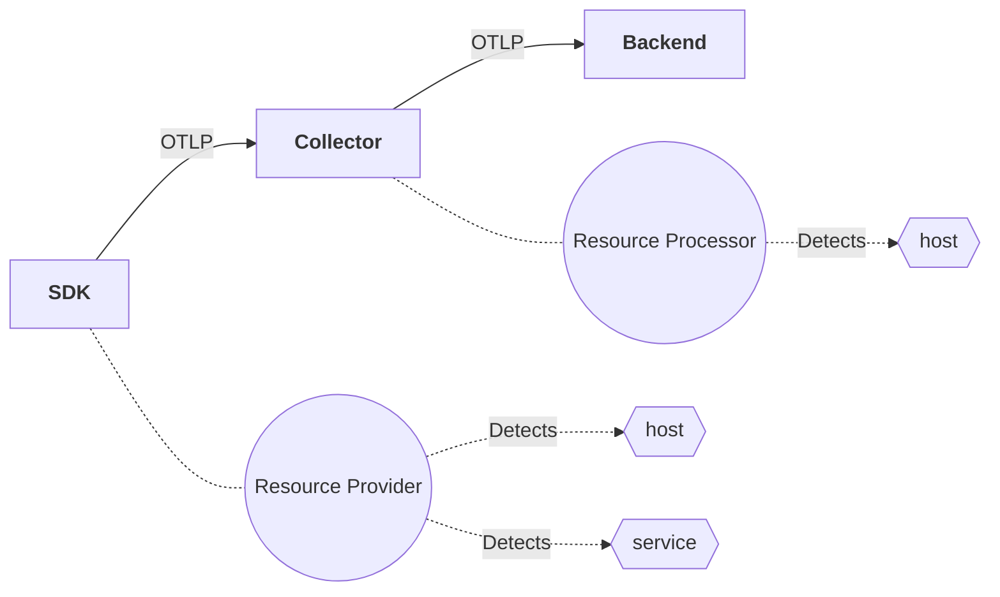
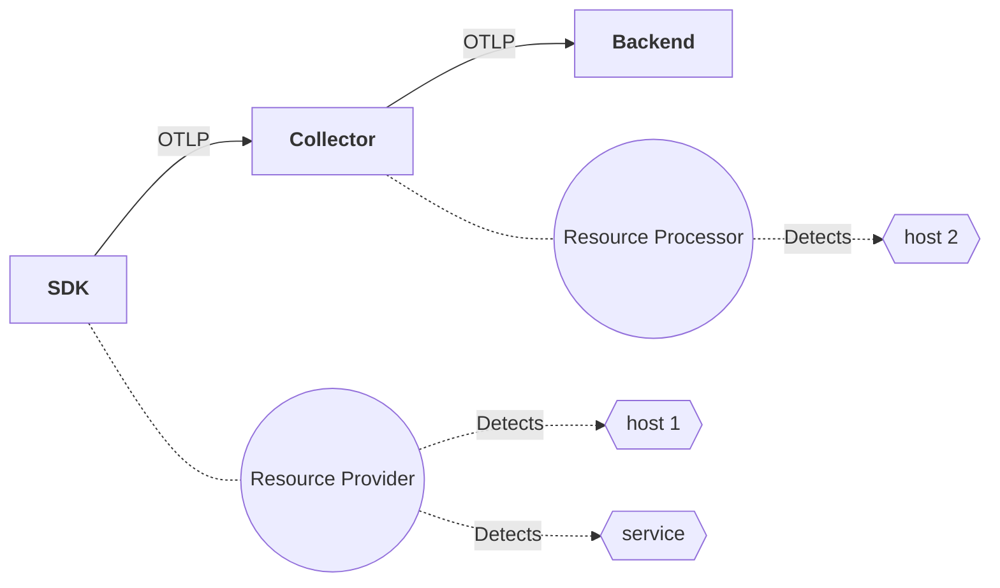
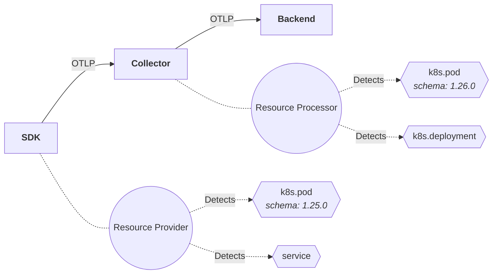

# Resource and Entities - Data Model Part 2

This is a proposal to address Resource and Entity data model interactions,
including a path forward to address immediate friction and issues in the
current resource specification.

It is an expansion on the [previous entity proposal](0256-entities-data-model.md).

<!-- toc -->

- [Motivation](#motivation)
- [Design](#design)
  * [Approach - Resource Improvements](#approach---resource-improvements)
    + [Resource Provider](#resource-provider)
    + [Entity Detector](#entity-detector)
    + [Entity Merging and Resource](#entity-merging-and-resource)
    + [Environment Variable Detector](#environment-variable-detector)
  * [Interactions with OpenTelemetry Collector](#interactions-with-opentelemetry-collector)
- [Datamodel Changes](#datamodel-changes)
  * [Resource](#resource)
  * [ResourceEntityRef](#resourceentityref)
  * [Resource Identity](#resource-identity)
- [How this proposal solves the problems that motivated it](#how-this-proposal-solves-the-problems-that-motivated-it)
  * [Problem 1: Commingling of Entities](#problem-1-commingling-of-entities)
  * [Problem 2: Lack of Precise Identity](#problem-2-lack-of-precise-identity)
  * [Problem 3: Lack of Mutable Attributes](#problem-3-lack-of-mutable-attributes)
  * [Problem 4: Metric Cardinality Problem](#problem-4-metric-cardinality-problem)
- [Entity WG Rubric](#entity-wg-rubric)
  * [Resource detectors (soon to be entity detectors) need to be composable / disjoint](#resource-detectors-soon-to-be-entity-detectors-need-to-be-composable--disjoint)
  * [New entities added by extension should not break existing code](#new-entities-added-by-extension-should-not-break-existing-code)
  * [Navigational attributes need to exist and can be used to identify an entity but could be augmented with UUID or other aspects. - Having ONLY a UUID for entity identification is not good enough](#navigational-attributes-need-to-exist-and-can-be-used-to-identify-an-entity-but-could-be-augmented-with-uuid-or-other-aspects---having-only-a-uuid-for-entity-identification-is-not-good-enough)
  * [Collector augmentation / enrichment (resource, e.g.) - Should be extensible and not hard-coded. We need a general algorithm not specific rulesets](#collector-augmentation--enrichment-resource-eg---should-be-extensible-and-not-hard-coded-we-need-a-general-algorithm-not-specific-rulesets)
  * [Users are expected to provide / prioritize "detectors" and determine which entity is "producing" or most-important for a signal](#users-are-expected-to-provide--prioritize-detectors-and-determine-which-entity-is-producing-or-most-important-for-a-signal)
  * [For an SDK - ALL telemetry should be associated with the same set of entities (resource labels)](#for-an-sdk---all-telemetry-should-be-associated-with-the-same-set-of-entities-resource-labels)
- [Open Questions](#open-questions)
  * [How to attach Entity "bundle" information in Resource?](#how-to-attach-entity-bundle-information-in-resource)
  * [How to deal with Resource/Entities whose lifecycle does not match the SDK?](#how-to-deal-with-resourceentities-whose-lifecycle-does-not-match-the-sdk)
  * [How to deal with Prometheus Compatibility for non-SDK telemetry?](#how-to-deal-with-prometheus-compatibility-for-non-sdk-telemetry)
  * [Should entities have a domain?](#should-entities-have-a-domain)
  * [Should resources have only one associated entity?](#should-resources-have-only-one-associated-entity)
  * [What identity should entities use (LID, UUID / GUID, or other)?](#what-identity-should-entities-use-lid-uuid--guid-or-other)
  * [What happens if existing Resource translation in the collector remove resource attributes an Entity relies on?](#what-happens-if-existing-resource-translation-in-the-collector-remove-resource-attributes-an-entity-relies-on)
  * [What about advanced entity interaction in the Collector?](#what-about-advanced-entity-interaction-in-the-collector)
- [Trade-offs and mitigations](#trade-offs-and-mitigations)
  * [Why don't we download schema url contents?](#why-dont-we-download-schema-url-contents)
- [Prior art and alternatives](#prior-art-and-alternatives)
- [Future Posibilities](#future-posibilities)
- [Use Cases](#use-cases)
  * [SDK - Multiple Detectors of the same Entity type](#sdk---multiple-detectors-of-the-same-entity-type)
  * [SDK and Collector - Simple coordination](#sdk-and-collector---simple-coordination)
  * [SDK and Collector - Entity coordination with descriptive attributes](#sdk-and-collector---entity-coordination-with-descriptive-attributes)
  * [SDK and Collector - Entity coordination with conflicts](#sdk-and-collector---entity-coordination-with-conflicts)
  * [SDK and Collector - Entity coordination across versions](#sdk-and-collector---entity-coordination-across-versions)
- [Collection of Resource detectors and attributes used](#collection-of-resource-detectors-and-attributes-used)
  * [Implications](#implications)
  * [What could this mean for choosing entities that belong on resource?](#what-could-this-mean-for-choosing-entities-that-belong-on-resource)

<!-- tocstop -->

## Motivation

This proposal attempts to focus on the following problems within OpenTelemetry to unblock multiple working groups:

- Allowing mutating attributes to participate in Resource ([OTEP 208](https://github.com/open-telemetry/oteps/pull/208)).
- Allow Resource to handle entities whose lifetimes don't match the SDK's lifetime ([OTEP 208](https://github.com/open-telemetry/oteps/pull/208)).
- Provide support for async resource lookup ([spec#952](https://github.com/open-telemetry/opentelemetry-specification/issues/952)).
- Fix current Resource merge rules in the specification, which most implementations violate ([oteps#208](https://github.com/open-telemetry/oteps/pull/208), [spec#3382](https://github.com/open-telemetry/opentelemetry-specification/issues/3382), [spec#3710](https://github.com/open-telemetry/opentelemetry-specification/issues/3710)).
- Allow semantic convention resource modeling to progress ([spec#605](https://github.com/open-telemetry/opentelemetry-specification/issues/605), [spec#559](https://github.com/open-telemetry/opentelemetry-specification/issues/559), etc).

## Design

### Approach - Resource Improvements

Let's focus on outlining Entity detectors and Resource composition.  This has a higher priority for fixing within OpenTelemetry, and needs to be unblocked sooner. Then infer our way back to data model and Collector use cases.

We define the following SDK components:

- **Resource Detectors (legacy)**:  We preserve existing resource detectors.  They have the same behavior and interfaces as today.
- **Entity Detectors (new)**: Detecting an entity that is relevant to the current instance of the SDK.  For example, this would detect a service entity for the current SDK, or its process. Every entity must have some relation to the current SDK.
- **Resource Provider (new)**: A component responsible for taking Resource and Entity detectors and doing the following:
  - Constructing a Resource for the SDK from detectors.
  - Dealing with conflicts between detectors.
  - Providing SDK-internal access to detected Resources for reporting via Log signal on configured LogProviders.
  - *(new) Managing Entity changes during SDK lifetime, specifically dealing with entities that have lifetimes shorter than the SDK*

#### Resource Provider

The SDK Resource Provider is responsible for running all configured Resource and Entity Detectors.  There will be some (user-controlled, otel default) priority order to these.

- The Resource Provider will detect conflicts in Entity of the same type being discovered and choose one to use.
- When using Entity Detectors and Resource detectors together, the following merge rules will be used:
  - Entity merging will occur first resulting in an "Entity Merged" Resource (See [algorithm here](#entity-merging-and-resource)).
  - Resource detectors otherwise follow existing merge semantics.
    - The Specification merge rules will be updated to account for violations prevalent in ALL implementation of resource detection.
    - Specifically: This means the [rules around merging Resource across schema-url will be dropped](../../specification/resource/sdk.md#merge).  Instead only conflicting attributes will be dropped.
    - SchemaURL on Resource will be deprecated with entity-specific schema-url replacing it. SDKs will only fill out SchemaURL on Resource when SchemaURL matches across all entities discovered. Additionally, only existing stable resource attributes can be used in Resource SchemaURL in stable OpenTelemetry components (Specifially `service.*` and `sdk.*` are the only stabilized resource convnetions). Given prevalent concerns of implementations around Resource merge specification, we suspect impact of this deprecation to be minimal, and existing usage was within the "experimental" phase of semantic conventions.
  - An OOTB ["Env Variable Entity Detector"](#environment-variable-detector) will be specified and provided vs. requiring SDK wide ENV variables for resource detection.
- *Additionally, Resource Provider would be responsible for understanding Entity lifecycle events, for Entities whose lifetimes do not match or exceed the SDK's own lifetime (e.g. browser session).*

#### Entity Detector

The Entity detector in the SDK is responsible for detecting possible entities that could identify the SDK (called "associated entities"). For Example, if the SDK is running in a kubernetes pod, it may provide an Entity for that pod. SDK Entity Detectors are only required to provide identifying attributes, but may provide descriptive attributes to ensure combined Resource contains similar attributes as today's SDK.

An Entity Detector would have an API similar to:

```rust
trait EntityDetector
  pub fn detect_entities(...) -> Result<Vec<Entity>, EntityDetectionError>>
```

Where `Result` is the equivalent of error channel in the language of choice (e.g. in Go this would be `entities, err := e.detectEntities()`).

An Entity Detector MUST NOT provide two entities of the same entity type (e.g. two `host` or two `service` entities).

#### Entity Merging and Resource

The most important aspect of this design is how Entities will be merged to construct a Resource.

We provide a simple algorithm for this behavior:

- Construct a set of detected entities, `E`
  - All entity detectors are sorted by priority (highest first)
  - For each entity detector `D`, detect entities
    - For each entity detected, `d'`
      - If an entity `e'` exists in `E` with same entity type as `d'`, do one of the following:
        - If the entity identiy and schema_url are the same, merge the descriptive attributes of `d'` into `e'`:
          - For each descriptive attribute `da'` in `d'`
            - If `da'.key` does not exist in `e'`, then add `da'` to `ei`
            - otherwise, ignore.
        - If the entity identity is the same, but schema_url is different: drop the new entity `d'`
          *Note: We could offer configuration in this case*
        - If the entity identity is different: drop the new entity `d'`.
      - Otherwise, add the entity `d'` to set `E`
- Construct a Resource from the set `E`.
  - If all entities within `E` have the same `schema_url`, set the resource's
    `schema_url` to match.
  - Otherwise, leave the Resource `schema_url` blank.

Any implementation that achieves the same result as this algorithm is acceptable.

#### Environment Variable Detector

An Entity detector will be specified to allow Platform to inject entity identity information into workloads running on that platform. For Example, the OpenTelemetry Operator could inject information about Kubernetes Deployment + Container into the environment, which SDKs can elect to interact with (through configuration of the Environment Variable Entity Detector). Here, Platform means an environment that can run workloads that would provide identity of those workloads, e.g. Kubernetes, Spark, Cloud environments, etc.

See [#3966](https://github.com/open-telemetry/opentelemetry-specification/issues/3966) for context on this issue.

While details of ENV variables will be subject to change, it would look something like the following:

```bash
set OTEL_DETECTED_ENTITIES=k8s.deployment[k8s.deployment.name=my-program],k8s.pod[k8s.pod.name=my-program-2314,k8s.namespace=default]
<run my program>
```

The minimum requirements of this entity detector are:

- ENV variable(s) can specify multiple entities (resource attribute bundles)
- ENV variable(s) can be easily appended or leverages by multiple participating systems, if needed.
- Entities discovered via ENV variable(s) can participate in Resource Provider generically, i.e. resolving conflicting definitions.
- ENV variable(s) have a priority that can be influenced by platform entity providers (e.g. prepending vs. appending)

The actual design for this ENV variable interaction would follow the approval of this OTEP.

### Interactions with OpenTelemetry Collector

The OpenTelemetry collector can be updated to optionally  interact with Entity on Resource. A new entity-focused resource detection process can be created which allows add/override behavior at the entity level, rather than individual attribute level.

For example, the existing resource detector looks like this:

```yaml
processors:
  resourcedetection/docker:
    detectors: [env, docker]
    timeout: 2s
    override: false
```

The future entity-based detector would look exactly the same, but interact with the entity model of resource:

```yaml
processor:
  entityresourcedetection:
     # Order determines override behavior
     detectors: [env, docker]
     # False means only append if entity doesn't already exist.
     override: false 
```

The list of detectors is given in priority order (first wins, in event of a tie, outside of override configuration). The processor may need to be updated to allow the override flag to apply to each individual detector.

The rules for attributes would follow entity merging rules, as defined for the SDK resource proivder.

Note: While this proposals shows a new processor replacing the `resourcedetection` processor, the details of whether to modify-in-place the existing `resourcedetection` processor or create a new one would be determined as a follow up to this design. Ideally, we don't want users to need new configuration for resource in the otel collector.

## Datamodel Changes

Given our desired design and algorithms for detecting, merging and manipulating Entities, we need the ability to denote how entity and resource relate. These changes must not break existing usage of Resource, therefore:

- The Entity model must be *layered on top of* the Resource model.  A system does not need to interact with entities for correct behavior.
- Existing key usage of Resource must remain when using Entities, specifically navigationality (see: [OpenTelemetry Resources: Principles and Characteristics](https://docs.google.com/document/d/1Xd1JP7eNhRpdz1RIBLeA1_4UYPRJaouloAYqldCeNSc/edit))
- Downstream components should be able to engage with the Entity model in Resource.

The following changes are made:

### Resource

| Field | Type | Description | Changes |
| ----- | ---- | ----------- | ------- |
| schema_url | string | The Schema URL, if known. This is the identifier of the Schema that the resource data  is recorded in.  This field is deprecated and should no longer be used. | Will be deprecated |
| dropped_attributes_count |  integer | dropped_attributes_count is the number of dropped attributes. If the value is 0, then no attributes were dropped. | Unchanged |
| attributes | repeated KeyValue | Set of attributes that describe the resource.<br/><br/>Attribute keys MUST be unique (it is not allowed to have more than one attribute with the same key).| Unchanged |
| entities | repeated ResourceEntityRef | Set of entities that participate in this Resource. | Added |

The DataModel would ensure that attributes in Resource are produced from both the identifying and descriptive attributes of Entity.  This does not mean the protocol needs to transmit duplicate data, that design is TBD.

### ResourceEntityRef

The entityref data model, would have the following changes from the original [entity OTEP](../../oteps/entities/0256-entities-data-model.md) to denote references within Resource:

| Field | Type | Description | Changes |
| ----- | ---- | ----------- | ------- |
| schema_url | string | The Schema URL, if known. This is the identifier of the Schema that the entity data  is recorded in. To learn more about Schema URL ([see docs](https://opentelemetry.io/docs/specs/otel/schemas/#schema-url)) | added |
| type | string | Defines the type of the entity. MUST not change during the lifetime of the entity. For example: "service" or "host". This field is required and MUST not be empty for valid entities. | unchanged |
| identifying_attributes_keys | repeated string | Attribute Keys that identify the entity.<br/>MUST not change during the lifetime of the entity. The Id must contain at least one attribute.<br/><br/>These keys MUST exists in Resource.attributes.<br/><br/>Follows OpenTelemetry common attribute definition. SHOULD follow OpenTelemetry semantic conventions for attributes.| now a reference |
| descriptive_attributes_keys | repeated string | Descriptive (non-identifying) attribute keys of the entity.<br/>MAY change over the lifetime of the entity. MAY be empty. These attribute keys are not part of entity's identity.<br/><br/>These keys MUST exist in Resource.attributes.<br/><br/>Follows any value definition in the OpenTelemetry spec - it can be a scalar value, byte array, an array or map of values. Arbitrary deep nesting of values for arrays and maps is allowed.<br/><br/>SHOULD follow OpenTelemetry semantic conventions for attributes.| now a reference |

### Resource Identity

OpenTelemetry resource identity will be modified as follows:

- When `entities` is empty on resource, then its identity is the collection
  of all `attributes` (both key and values).
- When `entities` is non-empty on resource, then its identity is the collection
  of all `attributes` where the key is not found in `entities.descriptive_attributes_keys`.

When grouping or mixing OTLP data, you can detect if two resources are the same
using its identity and merge descriptive attributes (if applicable) using the
entity merge algorithm (described above) which will be formalized in the data model.

## How this proposal solves the problems that motivated it

Let's look at some motivating problems from the [Entities Proposal](https://docs.google.com/document/d/1VUdBRInLEhO_0ABAoiLEssB1CQO_IcD5zDnaMEha42w/edit#heading=h.atg5m85uw9w8):

### Problem 1: Commingling of Entities

We embrace the need for commingling entities in Resource and allow downstream users to interact with the individual entities rather than erasing these details.

### Problem 2: Lack of Precise Identity

Identity is now clearly delineated from description via the Entity portion of Resource. When Entity is used for Resource, only identifying attributes need to be interacted with to create resource identity.

### Problem 3: Lack of Mutable Attributes

This proposal offers two solutions going forward to this:

- Descriptive attributes may be mutated without violating Resource identity
- Entities whose lifetimes do not match SDK may be attached/removed from Resource.

### Problem 4: Metric Cardinality Problem

Via solution to (2) we can leverage an identity synthesized from identifying attributes on Entity.  By directly modeling entity lifetimes, we guarantee that identity changes in Resource ONLY occur when source of telemetry changes.  This solves unintended metric cardinality problems (while leaving those that are necessary to deal with, e.g. collecting metrics from phones or browser instances where intrinsic cardinality is high).

## Entity WG Rubric

The Entities WG came up with a rubric to evaluate solutions based on shared
beliefs and goals for the overall effort.  Let's look at how each item is
achieved:

### Resource detectors (soon to be entity detectors) need to be composable / disjoint

Entity detection and Resource Manager now fulfill this need.

### New entities added by extension should not break existing code

Users will need to configure a new Entity detector for new entities being modelled.

### Navigational attributes need to exist and can be used to identify an entity but could be augmented with UUID or other aspects. - Having ONLY a UUID for entity identification is not good enough

Resource will still be composed of identifying and descriptive attributes of Entity, allowing baseline navigational attributes users already expect from resource.

### Collector augmentation / enrichment (resource, e.g.) - Should be extensible and not hard-coded. We need a general algorithm not specific rulesets

The concept of "Entity" is a new definition for Resource.  Where previously, resource was a collection of attributes and users would interact with each
individually, now there is a "bundle" of attributes called an Entity.  Entities have an identity and descriptions, and the collector is able to
identify conflicts against the set of attributes that make up an Entity.

The merge rules defined here give precedent for the collector to generically interact with "type", "identifying attributes" and "descriptive attributes"
rather than hard-coded rules that have to understand the nuance of when `host.id` influences `host.name`, e.g.

### Users are expected to provide / prioritize "detectors" and determine which entity is "producing" or most-important for a signal

The Resource Manager allows users to configure priority of Entity Detectors.

### For an SDK - ALL telemetry should be associated with the same set of entities (resource labels)

Resource Manager is responsible for resolving entities into a cohesive Resource that meets the same demands as Resource today.

## Open Questions

The following remain open questions:

### How to attach Entity "bundle" information in Resource?

The protocol today requires a raw grab bag of Attributes on Resource. We cannot break this going forward.  However, Entities represent a new mechanism of "bundling" attributes on Resource and interacting with these bundles.  We do not want this to bloat the protocol, nor do we want it to cause oddities.

Going forward, we have set of options:

- Duplicate attributes in `Entity` section of Resource.
- Reference attributes of Resource in entity.
- Only identify Entity id and keep attribute<->entity association out of band.
- Extend Attribute on Resource so that we can track the entity type per Key-Value (across any attribute in OTLP).

The third option prevents generic code from interacting with Resource and Entity without understanding the model of each.  The first keeps all usage of entity simple at the expense of duplicating information and the middle is awkward to interact with from an OTLP usage perspective. The fourth is violates our stability policy for OTLP.

### How to deal with Resource/Entities whose lifecycle does not match the SDK?

This proposal motivates a Resource Provider in the SDK whose job could include managing changes in entity lifetimes, but does not account for how these changes would be broadcast across TracerProvider, LogProvider, MeterProvider, etc.  That would be addressed in a follow on OTEP.

### How to deal with Prometheus Compatibility for non-SDK telemetry?

Today, [Prometheus compatibility](../../specification/compatibility/prometheus_and_openmetrics.md) relies on two key attributes in Resource: `service.name` and `service.instance.id`. These are not guaranteed to exist outside of OpenTelemetry SDK generation. While this question is not fully answered, we believe outlining identity in all resources within OpenTelemetry allows us to define a solution in the future while preserving compatibility with what works today.

Here's a list of requirements for the solution:

- Existing prometheus/OpenTelemetry users should be able to migrate from where they are today.
- Any solution MUST work with the [info-typed metrics](https://github.com/prometheus/proposals/blob/main/proposals/2024-04-10-native-support-for-info-metrics-metadata.md#goals) being added in prometheus.
  - Resource descriptive attributes should leverage `info()` or metadata.
  - Resource identifying attributes need more thought/design from OpenTelemetry semconv + entities WG.
  - Note: Current `info()` design will only work with `target_info` metric by default (other info metrics can be specified per `info` call), and `job/instance` labels for joins.  These labels MUST be generated by the OTLP endpoint in prometheus.
- (desired) Users should be able to correlate metric timeseries to other signals via Resource attributes showing up as labels in prometheus.
- (desired) Conversion from `OTLP -> prometheus` can be reversed such that `OTLP -> Prometheus -> OTLP` is non-lossy.

Here's a few (non-exhaustive) options for what this could look like:

- Option #1 - Stay with what we have today
  - `target_info` continues to exist as it is, with all resource attributes.
  - Prometheus OTLP ingestion continues to support promoting resource attributes to metric labels.
- Option #2 - Promote all identifying attributes
  - By default all identifying labels on Resource are promoted to resource attributes.
  - All descriptive labels are placed on `target_info`.
  - (likely) `job`/`instance` will need to be synthesized for resources lacking a `service` entity.
- Option #3 - Enocde entities into prometheus as info metrics
  - Create `{entity_type}_entity_info` metrics.
  - Synthesize `job`/`instance` labels for joins between all `*_info` metrics.
  - Expand the scope of info-typed metrics work in Prometheus to work with this encoding.
- Option #4 - Find solutions leveraging the [metadata design](https://docs.google.com/document/d/1epBslSSwRO2do4armx40fruStJy_PS6thROnPeDifz8/edit#heading=h.5sybau7waq2q)

These designs will be explored and evaluated in light of the requirements. For now, prometheus compatibility will continue with Option #1 as we work together towards building a better future for resource in prometheus.

### Should entities have a domain?

Is it worth having a `domain` in addition to type for entity?  We could force each entity to exist in one domain and leverage domain generically in resource management.  Entity Detectors would be responsible for an entire domain, selecting only ONE to apply a resource. Domains could be layered, e.g. a Cloud-specific domain may layer on top of a Kubernetes domain, where "GKE cluster entity" identifies *which* kubernetes cluster a kuberntes infra entity is part of.  This layer would be done naively, via automatic join of participating entities or explicit relationships derived from GKE specific hooks.

It's unclear if this is needed initially, and we believe this could be layered in later.

### Should resources have only one associated entity?

Given the problems leading to the Entities working group, and the needs of existing Resource users today, we think it is infeasible and unscalable to limit resource to only one entity.  This would place restrictions on modeling Entities that would require OpenTelemetry to be the sole source of entity definitions and hurt building an open and extensible ecosystem.  Additionally it would need careful definition of solutions for the following problems/rubrics:

- New entities added by extension should not break existing code
- Collector augmentation / enrichment (resource, e.g.) - Should be extensible and not hard-coded. We need a general algorithm not specific rulesets.

### What identity should entities use (LID, UUID / GUID, or other)?

One of the largest questions in the first entities' OTEP was how to identify an entity.  This was an attempt to unify the need for Navigational attributes with the notion that only identifying attributes of Entity would show up in Resource going forward. This restriction is no longer necessary in this proposal and we should reconsider how to model identity for an Entity.  

This can be done in follow up design / OTEPs.

### What happens if existing Resource translation in the collector remove resource attributes an Entity relies on?

While we expect the collector to be the first component to start engaging with Entities in an architecture, this could lead to data model violations.  We have a few options to deal with this issue:

- Consider this a bug and warn users not to do it.
- Specify that missing attribute keys are acceptable for descriptive attribtues.
- Specify that missing attribute keys denote that entities are unusable for that batch of telemetry, and treat the content as malformed.

### What about advanced entity interaction in the Collector?

One problem that motivated this design is the issue of "local resource detection" vs. "remote signal collection" in the OpenTelemetry collector.  That is, I have a process running on a machine writing to an OpenTelemetry
collector running on a different machine.  The current `resourcedetectionprocessor` in the collector appends attributes to resource based on discovering *where the collector is running*.  However,
as the collector could determine that telemetry has come from a different machine, it could also avoid adding resource attributes that are not relevant to incoming data.

Today, `resourcedetectionprocessor` is naive, as is the algorithm proposed in this OTEP.  We believe that a more sophisticated solution could be created where the collector would know not to join entities onto a
resource based on more advanced knowledge of the communication protocol used to obtain the data (e.g. using the ip address of the sender on an OTLP server).

## Trade-offs and mitigations

The design proposed here attempts to balance non-breaking (backwards and forwards compatible) changes with the need to improve problematic issues in the Specification.  Given the inability of most SDKs to implement the current Resource merge specification, breaking this should have little effect on actual users.  Instead, the proposed merge specification should allow implementations to match current behavior and expectation, while evolving for users who engage with the new model.

### Why don't we download schema url contents?

OpenTelemetry needs to work in environments that have no/limited access to the external internet. We entertained, and
dismissed merging solutions that *require* access to the contents of `schema_url` to work. While the core algorithm
*cannot require* this access, we *should* be able to provide improved processing and algorithms that may leverage this data.

For example:

- Within an SDK, we can registry entity schema information with `EntityDetector`.
- The OpenTelemetry Collector can allow registered `schema_url` via configuration
  or (optionally) download schema on demand.

This design does not prevent these solutions, but provides the baseline/fallback
where `schema_url` is not accessible and entities must still be usable.

## Prior art and alternatives

Previously, we have a few unaccepted oteps, e.g. ([OTEP 208](https://github.com/open-telemetry/oteps/pull/208)).  Additionally, there are some alternatives that were considered in the Entities WG and rejected.

Below is a brief discussion of some design decisions:

- **Only associating one entity with a Resource.**  This was rejected, as too high a friction point in evolving semantic conventions and allowing independent systems to coordinate identity + entities within the OpenTelemetry ecosystem.  Eventually, this would force OpenTelemetry to model all possibly entities in the world and understand their interaction or otherwise prevent non-OpenTelemetry instrumentation from interacting with OpenTelemetry entities.
- **Embed fully Entity in Resource.** This was rejected because it makes it easy/trivial for Resource attributes and Entities to diverge.  This would prevent the backwards/forwards compatibility goals and also require all participating OTLP users to leverage entities. Entity should be an opt-in / additional feature that may or may not be engaged with, depending on user need.
- **Re-using resource detection as-is** This was rejected as not having a viable compatibility path forward.  Creating a new set of components that can preserve existing behavior while allowing users to adopt the new functionality means that users have better control of when they see / change system behavior, and adoption is more obvious across the ecosystem.

## Future Posibilities

This proposal opens the door for addressing issues where an Entity's lifetime does not match an SDK's lifetime, in addition to providing a data model where mutable (descriptive) attributes can be changed over the lifetime of a resource without affecting its identity.  We expect a follow-on OTEP which directly handles this issue.

## Use Cases

Below are a set of use cases to help motivate this design.

### SDK - Multiple Detectors of the same Entity type

Let's consider the interaction of the SDK in the presence of multiple registered
entity detectors:



Here, there is a service running on Google Compute Engine. The user
has configured a Google Cloud specific set of entity detectors.  Both the
built in OpenTelemetry detection and the configured Google Cloud detection
discover a `host` entity.

The following outcome would occur:

- The resulting resource would have all of the following entities: `host`, `process`, `service` and `gcp.gce`
- The user-configured resource detector would take priority over built in: the `host` defined from the Google Cloud detection would "win" and be included in resource.
  - This means `host.id` e.g. could be the id discovered for GCE VMs.  Similarly for other cloud provider detection, like Amazon EC2 where VMs are given a unique ID by the Cloud Provider, rather than a generic machine ID, e.g.
  - This matches existing behavior/expectations today for AWS, GCP, etc. on what `host.id` would mean.
- Users would be able to configure which host wins, by swapping the priority order of "default" vs. cloud-specific detection.

### SDK and Collector - Simple coordination

Let's consider the interaction of resource, entity in the presence of an SDK
and a Collector:



Here, an SDK is running on Amazon EC2. it is configured with resource detection
that finds a `process` and `service` entity.  The SDK is sending data to an
OpenTelemetry Collector that has a resource processor configured to detect
the `ec2` and `host` entities.

The resulting OTLP from the collector would contain a resource with all
of the entities (`process`, `service`, `ec2`, and `host`).  This is because
the entities are all disjoint.

*Note: this matches today's behavior of existing resource detection and OpenTelmetry collector where all attributes wind up on resource.*

### SDK and Collector - Entity coordination with descriptive attributes

Let's consider the interaction of resource, entity where both the SDK and the Collector detect an entity:



Here, an SDK is running on a machine (physical or virtual).  The SDK is
configured to detect the host it is running on.  The collector is also running
on a machine (physical or virtual).  Both the SDK and the Collector detect
a `host` entity (with the same identity).

The behavior would be as follows:

- By default, the collector would append any missing descriptive attributes
  from its `host` entity to the `host` entity and resource.
- If the collector's processor is configured to `override: true`, then the
  host entity from the SDK would be dropped in favor of the collector's `host`
  entity.  All identifying+descriptive attributes from the original entity +
  resource would be removed and those detected in the collector would replace it.

This allows the collector to enrich or enhance resource attributes without altering the *identity* of the source.

### SDK and Collector - Entity coordination with conflicts

Let's consider the interaction of resource, entity where there is an identity conflict between the SDK and the Collector:



Here, and SDK is running on a machine (physical or virtual).  The SDK is
configured to detect the host it is running on.  The collector is also running
on a machine (physical or virtual).  Both the SDK and the Collector detect
a `host` entity.  However, the `host` entity has a *different identity* between
the SDK and Collector.

The behavior would be as follows:

- The default would *drop* the entity detected by the collector, as the
  entity identity does not match.  This would mean, e.g. descriptive host
  attributes from the collector are **not** added to the Resource in OTLP.
- If the collector's processor is configured to `override: true`, then the
  host entity from the SDK would be dropped in favor of the collector's `host`
  entity.  All identifying+descriptive attributes from the original entity +
  resource would be removed and those detected in the collector would replace it.

The default behavior is useful when the SDK and Collector are run on different
machines.  Unlike today's resource detection, this could prevent `host`
descriptive attributes that were not detected by the SDK from being added to the
resource.

The `override` behavior could also ensure that attributes which should be
detected and reported together are replaced together.  Today, it's possible the
collector may detect and override some, but not all attributes from the SDK.

### SDK and Collector - Entity coordination across versions

Let's look at SDK + collector coordination where semantic version differences
can occur between components within the system.



Here, an SDK is communicating with a Collector.  The SDK and the collector
are both participating in resource detection through the use of entities,
however the installed versions of software are leverage different standard
versions between the collector and the SDK.

Ideally, we'd like a solution where:

- The user can ensure only attributes related to previously undiscovered,
  but relevant, entities can be added in Resource (specifically, `k8s.deployment`).
- The user can address issues where schema version `1.26.0` and `1.25.0` may
  have different attributes for the same entity.
- We have default rules and merging that requires the least amount of
  configuration or customization for users to achieve their desired
  attributes in resource.

## Collection of Resource detectors and attributes used

- Collector
  - [system](https://github.com/open-telemetry/opentelemetry-collector-contrib/blob/main/processor/resourcedetectionprocessor/internal/system/metadata.yaml)
    - host.arch
    - host.name
    - host.id
    - host.ip
    - host.mac
    - host.cpu.vendor.id
    - host.cpu.family
    - host.cpu.model.id
    - host.cpu.model.name
    - host.cpu.stepping
    - host.cpu.cache.l2.size
    - os.description
    - os.type
  - [docker](https://github.com/open-telemetry/opentelemetry-collector-contrib/blob/main/processor/resourcedetectionprocessor/internal/docker/metadata.yaml)
    - host.name
    - os.type
  - [heroku](https://github.com/open-telemetry/opentelemetry-collector-contrib/blob/main/processor/resourcedetectionprocessor/internal/heroku/metadata.yaml)
    - cloud.provider
    - heroku.app.id
    - heroku.dyno.id
    - heroku.release.commit
    - heroku.release.creation_timestamp
    - service.instance.id
    - service.name
    - service.version
  - [gcp](https://github.com/open-telemetry/opentelemetry-collector-contrib/blob/main/processor/resourcedetectionprocessor/internal/gcp/metadata.yaml)
    - gke
      - cloud.provider
      - cloud.platform
      - cloud.account.id
      - cloud.region
      - cloud.availability_zone
      - k8s.cluster.name
      - host.id
      - host.name
    - gce
      - cloud.provider
      - cloud.platform
      - cloud.account.id
      - cloud.region
      - cloud.availability_zone
      - host.id
      - host.name
      - host.type
      - (optional) gcp.gce.instance.hostname
      - (optional) gcp.gce.instance.name
  - AWS
    - [ec2](https://github.com/open-telemetry/opentelemetry-collector-contrib/blob/main/processor/resourcedetectionprocessor/internal/aws/ec2/metadata.yaml)
      - cloud.provider
      - cloud.platform
      - cloud.account.id
      - cloud.region
      - cloud.availability_zone
      - host.id
      - host.image.id
      - host.name
      - host.type
    - [ecs](https://github.com/open-telemetry/opentelemetry-collector-contrib/blob/main/processor/resourcedetectionprocessor/internal/aws/ecs/metadata.yaml)
      - cloud.provider
      - cloud.platform
      - cloud.account.id
      - cloud.region
      - cloud.availability_zone
      - aws.ecs.cluster.arn
      - aws.ecs.task.arn
      - aws.ecs.task.family
      - aws.ecs.task.id
      - aws.ecs.task.revision
      - aws.ecs.launchtype (V4 only)
      - aws.log.group.names (V4 only)
      - aws.log.group.arns (V4 only)
      - aws.log.stream.names (V4 only)
      - aws.log.stream.arns (V4 only)
    - [elastic_beanstalk](https://github.com/open-telemetry/opentelemetry-collector-contrib/blob/main/processor/resourcedetectionprocessor/internal/aws/elasticbeanstalk/metadata.yaml)
      - cloud.provider
      - cloud.platform
      - deployment.environment
      - service.instance.id
      - service.version
    - eks
      - cloud.provider
      - cloud.platform
      - k8s.cluster.name
    - lambda
      - cloud.provider
      - cloud.platform
      - cloud.region
      - faas.name
      - faas.version
      - faas.instance
      - faas.max_memory
      - aws.log.group.names
      - aws.log.stream.names
  - Azure
    - cloud.provider
    - cloud.platform
    - cloud.region
    - cloud.account.id
    - host.id
    - host.name
    - azure.vm.name
    - azure.vm.size
    - azure.vm.scaleset.name
    - azure.resourcegroup.name
  - Azure aks
    - cloud.provider
    - cloud.platform
    - k8s.cluster.name
  - Consul
    - cloud.region
    - host.id
    - host.name
    - *exploded consul metadata*
  - k8s Node
    - k8s.node.uid
  - Openshift
    - cloud.provider
    - cloud.platform
    - cloud.region
    - k8s.cluster.name
- Java Resource Detection
  - SDK-Default
    - service.name
    - telemetry.sdk.version
    - telemetry.sdk.language
    - telemetry.sdk.name
  - [process](https://github.com/open-telemetry/opentelemetry-java-instrumentation/blob/691de74a4b0539c1329222aefb962c232028032b/instrumentation/resources/library/src/main/java/io/opentelemetry/instrumentation/resources/ProcessResource.java#L60)
    - process.pid
    - process.command_line
    - process.command_args
    - process.executable.path
  - [host](https://github.com/open-telemetry/opentelemetry-java-instrumentation/blob/main/instrumentation/resources/library/src/main/java/io/opentelemetry/instrumentation/resources/HostResource.java#L31)
    - host.name
    - host.arch
  - [container](https://github.com/open-telemetry/opentelemetry-java-instrumentation/blob/main/instrumentation/resources/library/src/main/java/io/opentelemetry/instrumentation/resources/ContainerResource.java)
    - container.id
  - [os](https://github.com/open-telemetry/opentelemetry-java-instrumentation/blob/main/instrumentation/resources/library/src/main/java/io/opentelemetry/instrumentation/resources/OsResource.java)
    - os.type
  - [AWS](https://github.com/open-telemetry/opentelemetry-java-contrib/tree/main/aws-resources)
    - EC2
      - host.id
      - cloud.availability_zone
      - host.type
      - host.image.id
      - cloud.account.id
      - cloud.region
      - host.name
    - ECS
      - cloud.provider
      - cloud.platform
      - aws.log.group.names
      - aws.log.stream.names
    - EKS
      - cloud.provider
      - cloud.platform
      - k8s.cluster.name
      - container.id
    - Lambda
      - cloud.platform
      - cloud.region
      - faas.name
      - faas.version
  - [GCP](https://github.com/open-telemetry/opentelemetry-java-contrib/tree/main/gcp-resources)
    - cloud.provider
    - cloud.platform
    - cloud.account.id
    - cloud.availability_zone
    - cloud.region
    - host.id
    - host.name
    - host.type
    - k8s.pod.name
    - k8s.namespace.name
    - k8s.container.name
    - k8s.cluster.name
    - faas.name
    - faas.instance
  - Go
    - [container](https://github.com/open-telemetry/opentelemetry-go/blob/main/sdk/resource/container.go)
      - container.id
    - [host](https://github.com/open-telemetry/opentelemetry-go/blob/main/sdk/resource/host_id.go)
      - host.id
    - [os](https://github.com/open-telemetry/opentelemetry-go/blob/main/sdk/resource/os.go)
      - os.name
    - [process](https://github.com/open-telemetry/opentelemetry-go/blob/main/sdk/resource/process.go)
      - process.pid
      - process.executable.name
      - process.executable.path
      - process.command_line
      - process.command_args
      - process.owner
    - [builtin](https://github.com/open-telemetry/opentelemetry-go/blob/main/sdk/resource/builtin.go)
      - service.instance.id
      - service.name
- [OTEL operator](https://github.com/open-telemetry/opentelemetry-operator/blob/a1e8f927909b81eb368c0483940e0b90d7fdb057/pkg/instrumentation/sdk_test.go#L752) injected ENV variables
  - service.instance.id
  - service.name
  - service.version
  - k8s.namespace.name
  - k8s.pod.name
  - k8s.node.name
  - k8s.container.name

### Implications

Some initial thoughts on implications:

AWS, Azure, GCP, Heroku, etc. all provide the following "bundles" of resource:

- `cloud.*`
- `faas.*`, when relevant
- `host.*`, when relevant
- `k8s.cluster.*`, when relevant
- `service.*` when relevant
- `container.*` for a subset of k8s providers

"system" detection provides the following:

- `host.*`
- `os.*`
- `process.*` for SDKs
- `container.*` for Docker images

SDK specific detection provides the following:

- `sdk.*`
- `service.*`

The OTEL operator for k8s provides the following via ENV variables:

- `k8s.namespace.*`
- `k8s.node.*`
- `k8s.pod.*`
- `k8s.container.*`
- `service.*`

### What could this mean for choosing entities that belong on resource?

Let's look at an example of a container running in kubernetes, specifically EKS.

If the OTEL operator, the SDK and the collector are all used, the following
attributes will wind up on resource:

- `service.*` - from SDK and otel operator
- `sdk.*` - from SDK
- `process.*` - from SDK
- `host.*` - Note: from system detector on collector
- `container.*` - from EKS detector on SDK
- `k8s.namespace.*` - from otel operator
- `k8s.node.*` - from otel operator
- `k8s.pod.*` - from otel operator
- `k8s.container.*` - from otel operator
- `k8s.cluster.*` - from EKS detector on SDK or collector
- `cloud.*` - from EKS detector on SDK or collector

A simple litmus test derived from this for when to include an entity on
Resource would be: "Any entity relevant to the produced telemetry should be
included".

However, this can be refined.  Resources today provide a [few key features](https://docs.google.com/document/d/1Xd1JP7eNhRpdz1RIBLeA1_4UYPRJaouloAYqldCeNSc/edit):

- They provide identity - Uniquely identifying the origin of the data.
- They provide "navigationality" - allowing users to find the source of the data within their o11y and infrastructure tools.
- They allow aggregation / slicing of data on interesting domains.

A litmus test for what entities to include on resource should be as follows:

- Is the entity the source/origin of the data?
- Does the entity help navigate to the source of the data? (e.g. `k8s.cluster.*` helping find a `k8s.container.*`)
- Do want to easily slice/aggregate on an axis provided by the entity? (e.g. quickly filtering all CPU container usage metrics across a cluster to find overloaded nodes).

If the answer to any question is yes, then include the entity on resource.
