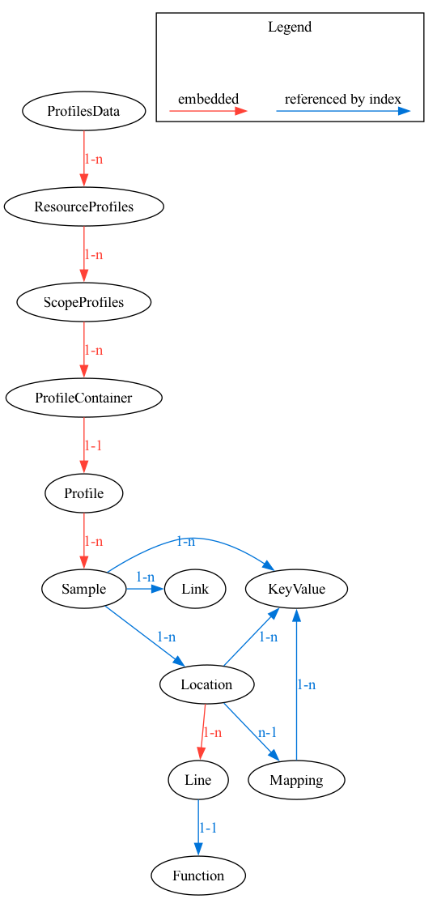

# Profiles Data Format

Introduces Data Model for Profiles signal to OpenTelemetry.

<!-- toc -->
* [Motivation](#motivation)
* [Design Notes](#design-notes)
  * [Design Goals](#design-goals)
* [Data Model](#data-model)
  * [Relationships Diagram](#relationships-diagram)
  * [Relationships With Other Signals](#relationships-with-other-signals)
    * [From Profiles to Other Signals](#from-profiles-to-other-signals)
    * [From Other Signals to Profiles](#from-other-signals-to-profiles)
  * [Compatibility With Original pprof](#compatibility-with-original-pprof)
  * [Proto Definition](#proto-definition)
  * [Message Descriptions](#message-descriptions)
    * [Message `ProfilesData`](#message-profilesdata)
    * [Message `ResourceProfiles`](#message-resourceprofiles)
    * [Message `ScopeProfiles`](#message-scopeprofiles)
    * [Message `ProfileContainer`](#message-profilecontainer)
    * [Message `Profile`](#message-profile)
    * [Message `ValueType`](#message-valuetype)
    * [Message `Sample`](#message-sample)
    * [Message `AttributeUnit`](#message-attributeunit)
    * [Message `Link`](#message-link)
    * [Message `Location`](#message-location)
    * [Message `Line`](#message-line)
    * [Message `Mapping`](#message-mapping)
    * [Message `Function`](#message-function)
  * [Example Payloads](#example-payloads)
    * [Simple Example](#simple-example)
  * [Notable Differences Compared to Other Signals](#notable-differences-compared-to-other-signals)
    * [Relationships Between Messages](#relationships-between-messages)
    * [Relationship Between Samples and Locations](#relationship-between-samples-and-locations)
* [Trade-Offs and Mitigations](#trade-offs-and-mitigations)
* [Prior Art and Alternatives](#prior-art-and-alternatives)
  * [Other Popular Formats](#other-popular-formats)
    * [Folded Stacks](#folded-stacks)
    * [Chromium's Trace Event Format](#chromiums-trace-event-format)
    * [Linux perf.data](#linux-perfdata)
    * [Java Flight Recorder (JFR)](#java-flight-recorder-jfr)
  * [Alternative Representations](#alternative-representations)
  * [Benchmarking](#benchmarking)
    * ["average" Profile](#average-profile)
    * ["average" Profile With Timestamps Added to Each Sample](#average-profile-with-timestamps-added-to-each-sample)
    * ["ruby" Profile With Very Deep Stacktraces](#ruby-profile-with-very-deep-stacktraces)
    * ["large" Profile](#large-profile)
    * [Conclusions](#conclusions)
  * [Semantic Conventions](#semantic-conventions)
    * [Profile Types](#profile-types)
    * [Profile Units](#profile-units)
  * [Decision Log](#decision-log)
* [Open Questions](#open-questions)
  * [Units in Attributes](#units-in-attributes)
  * [Timestamps](#timestamps)
  * [Repetition of Attribute Keys](#repetition-of-attribute-keys)
  * [Locations Optimization](#locations-optimization)
* [Future Possibilities](#future-possibilities)
<!-- toc -->

## Motivation

This is a proposal of a data model and semantic conventions that allow to represent profiles coming from a variety of different applications or systems. Existing profiling formats can be unambiguously mapped to this data model. Reverse mapping from this data model is also possible to the extent that the target profiling format has equivalent capabilities.

The purpose of the data model is to have a common understanding of what a profile is, what data needs to be recorded, transferred, stored and interpreted by a profiling system.

## Design Notes

### Design Goals

These goals are based on the vision set out in [Profiling Vision OTEP](./0212-profiling-vision.md):

* Make profiling compatible with other signals.
* Standardize profiling data model for industry-wide sharing and reuse.
* Profilers must be implementable with low overhead and conforming to OpenTelemetry-wide runtime overhead/intrusiveness and wire data size requirements.

The last point is particularly important in the context of profiling. Profilers generate large amounts of data, and users of profiling technology are very sensitive to the overhead that profiling introduces. In the past high overhead has been a blocker for wider adoption of continuous profiling and was one of the reasons why profiling was not used in production environments. Therefore, it is important to make sure that the overhead of handling the profiling data on the client side as well as in intermediaries (e.g collector) is minimal.

## Data Model

This section describes various protobuf messages that are used to represent profiles data.

### Relationships Diagram

The following diagram shows the relationships between the messages. Relationships between messages are represented by either embedding one message in another (red arrows), or by referencing a message by index in a lookup table (blue arrows). More on that in [Relationships Between Messages](#relationships-between-messages) section below.

In addition to that, relationship between `samples` and `locations` is further optimized for better performance. More on that in [Relationship Between Samples and Locations](#relationship-between-samples-and-locations) section below.



### Relationships With Other Signals

There are two types of relationships between profiles and other signals:

* from other signals to profiles (e.g from log records, exemplars or trace spans)
* from profiles to other signals

#### From Profiles to Other Signals

[Link](#message-link) is a message that is used to represent connections between profile [Samples](#message-sample) and trace spans. It uses `trace_id` and `span_id` as identifiers.

For other signals, such as logs or metrics, because other signals use the same way of linking between such signals and traces (`trace_id` and `span_id`), it is possible to correlate profiles with other signals using this same information.

#### From Other Signals to Profiles

Other signals can use `profile_id` to reference a profile. For example, a log record can reference a profile that was collected at the time when the log record was generated by using `profile_id` as one of the attributes. This allows to correlate logs with profiles.

Additionally, `trace_id`, `span_id` can be used to reference groups of [Samples](#message-sample) (but not individual [Samples](#message-sample)) in a Profile, since [Samples](#message-sample) are linked to traces with these same identifiers using [Links](#message-link).

The exact details of such linking are out of scope for this OTEP. It is expected that the exact details will be defined in Profiles part of [opentelemetry-specification](https://github.com/open-telemetry/opentelemetry-specification).

### Compatibility With Original pprof

The proposed data model is backward compatible with original pprof in a sense that a pprof file generated by existing software can be parsed using the new proto. All fields in the original pprof are preserved, so that original pprof files can still be parsed using the new proto, and no data is lost.

It is not forward compatible, meaning that a pprof file generated by the new proto cannot be parsed by existing software. This is mainly due to the sharing of the call stacks between samples + new format for labels (more on these differences below).

### Proto Definition

Proto definition is based on [pprof format](https://github.com/google/pprof/blob/main/proto/profile.proto).

In the landscape of performance profiling tools, pprof's data format stands as a clear industry standard. Its evolution and enduring relevance are a reflection of its effectiveness in addressing diverse and complex performance profiling needs. Major technology firms and open-source projects alike routinely employ pprof, underscoring its universal applicability and reliability.

According to the [data from Profilerpedia](https://docs.google.com/spreadsheets/d/1UM-WFQhNf4GcyXmluSUGnMbOenvN-TqP2HQC9-Y50Lc/edit?usp=sharing), pprof is one of the most widely used formats. Compared to other formats it has the highest number of profilers, UIs, formats it can be converted to and from.

The original pprof data model underwent enhancements to more effectively manage profiling data within the scope of OpenTelemetry, and certain upgrades were implemented to overcome a few of the original format's constraints.

Here's a [link to a diff between original pprof and modified pprof](https://github.com/open-telemetry/opentelemetry-proto-profile/compare/2cf711b3cfcc1edd4e46f9b82d19d016d6d0aa2a...petethepig:opentelemetry-proto:pprof-experiments#diff-9cb689ea05ecfd2edffc39869eca3282a3f2f45a8e1aa21624b452fa5362d1d2) and here's a list of main differences between pprof and OTLP profiles:

* Sharing of the call stacks between samples.
* Sharing of labels (now called attributes) between samples.
* Reuse of OpenTelemetry conventions and message types.
* Semantic conventions for linking to other signals via `trace_id`s and `span_id`s.
* First-class timestamp support.
* Expanded metadata attach points (Sample / Location / Mapping).

Below you will find the proto for the new Profiles signal. It is split into two parts: the first part is the OpenTelemetry specific part, and the second part is the modified pprof proto. Intention here is to make it easier to compare modified pprof proto to the original pprof proto.

OpenTelemetry specific part:
<!-- proto1 -->

```proto
syntax = "proto3";

package opentelemetry.proto.profiles.v1;

import "opentelemetry/proto/common/v1/common.proto";
import "opentelemetry/proto/resource/v1/resource.proto";

import "opentelemetry/proto/profiles/v1/alternatives/pprofextended/pprofextended.proto";

option csharp_namespace = "OpenTelemetry.Proto.Profiles.V1";
option java_multiple_files = true;
option java_package = "io.opentelemetry.proto.profiles.v1";
option java_outer_classname = "ProfilesProto";
option go_package = "go.opentelemetry.io/proto/otlp/profiles/v1";

//                Relationships Diagram
//
// ┌──────────────────┐                LEGEND
// │   ProfilesData   │
// └──────────────────┘            ─────▶ embedded
//   │
//   │ 1-n                         ─────▷ referenced by index
//   ▼
// ┌──────────────────┐
// │ ResourceProfiles │
// └──────────────────┘
//   │
//   │ 1-n
//   ▼
// ┌──────────────────┐
// │  ScopeProfiles   │
// └──────────────────┘
//   │
//   │ 1-n
//   ▼
// ┌──────────────────┐
// │ ProfileContainer │
// └──────────────────┘
//   │
//   │ 1-1
//   ▼
// ┌──────────────────┐
// │      Profile     │
// └──────────────────┘
//   │                                1-n
//   │ 1-n         ┌───────────────────────────────────────┐
//   ▼             │                                       ▽
// ┌──────────────────┐   1-n   ┌──────────────┐      ┌──────────┐
// │      Sample      │ ──────▷ │   KeyValue   │      │   Link   │
// └──────────────────┘         └──────────────┘      └──────────┘
//   │                    1-n       △      △
//   │ 1-n        ┌─────────────────┘      │ 1-n
//   ▽            │                        │
// ┌──────────────────┐   n-1   ┌──────────────┐
// │     Location     │ ──────▷ │   Mapping    │
// └──────────────────┘         └──────────────┘
//   │
//   │ 1-n
//   ▼
// ┌──────────────────┐
// │       Line       │
// └──────────────────┘
//   │
//   │ 1-1
//   ▽
// ┌──────────────────┐
// │     Function     │
// └──────────────────┘
//

// ProfilesData represents the profiles data that can be stored in persistent storage,
// OR can be embedded by other protocols that transfer OTLP profiles data but do not
// implement the OTLP protocol.
//
// The main difference between this message and collector protocol is that
// in this message there will not be any "control" or "metadata" specific to
// OTLP protocol.
//
// When new fields are added into this message, the OTLP request MUST be updated
// as well.
message ProfilesData {
  // An array of ResourceProfiles.
  // For data coming from a single resource this array will typically contain
  // one element. Intermediary nodes that receive data from multiple origins
  // typically batch the data before forwarding further and in that case this
  // array will contain multiple elements.
  repeated ResourceProfiles resource_profiles = 1;
}

// A collection of ScopeProfiles from a Resource.
message ResourceProfiles {
  reserved 1000;

  // The resource for the profiles in this message.
  // If this field is not set then no resource info is known.
  opentelemetry.proto.resource.v1.Resource resource = 1;

  // A list of ScopeProfiles that originate from a resource.
  repeated ScopeProfiles scope_profiles = 2;

  // This schema_url applies to the data in the "resource" field. It does not apply
  // to the data in the "scope_profiles" field which have their own schema_url field.
  string schema_url = 3;
}

// A collection of Profiles produced by an InstrumentationScope.
message ScopeProfiles {
  // The instrumentation scope information for the profiles in this message.
  // Semantically when InstrumentationScope isn't set, it is equivalent with
  // an empty instrumentation scope name (unknown).
  opentelemetry.proto.common.v1.InstrumentationScope scope = 1;

  // A list of ProfileContainers that originate from an instrumentation scope.
  repeated ProfileContainer profiles = 2;

  // This schema_url applies to all profiles and profile events in the "profiles" field.
  string schema_url = 3;
}

// A ProfileContainer represents a single profile. It wraps pprof profile with OpenTelemetry specific metadata.
message ProfileContainer {
  // A globally unique identifier for a profile. The ID is a 16-byte array. An ID with
  // all zeroes is considered invalid.
  //
  // This field is required.
  bytes profile_id = 1;

  // start_time_unix_nano is the start time of the profile.
  // Value is UNIX Epoch time in nanoseconds since 00:00:00 UTC on 1 January 1970.
  //
  // This field is semantically required and it is expected that end_time >= start_time.
  fixed64 start_time_unix_nano = 2;

  // end_time_unix_nano is the end time of the profile.
  // Value is UNIX Epoch time in nanoseconds since 00:00:00 UTC on 1 January 1970.
  //
  // This field is semantically required and it is expected that end_time >= start_time.
  fixed64 end_time_unix_nano = 3;

  // attributes is a collection of key/value pairs. Note, global attributes
  // like server name can be set using the resource API. Examples of attributes:
  //
  //     "/http/user_agent": "Mozilla/5.0 (Macintosh; Intel Mac OS X 10_14_2) AppleWebKit/537.36 (KHTML, like Gecko) Chrome/71.0.3578.98 Safari/537.36"
  //     "/http/server_latency": 300
  //     "abc.com/myattribute": true
  //     "abc.com/score": 10.239
  //
  // The OpenTelemetry API specification further restricts the allowed value types:
  // https://github.com/open-telemetry/opentelemetry-specification/blob/main/specification/common/README.md#attribute
  // Attribute keys MUST be unique (it is not allowed to have more than one
  // attribute with the same key).
  repeated opentelemetry.proto.common.v1.KeyValue attributes = 4;

  // dropped_attributes_count is the number of attributes that were discarded. Attributes
  // can be discarded because their keys are too long or because there are too many
  // attributes. If this value is 0, then no attributes were dropped.
  uint32 dropped_attributes_count = 5;

  // Specifies format of the original payload. Common values are defined in semantic conventions. [required if original_payload is present]
  string original_payload_format = 6;

  // Original payload can be stored in this field. This can be useful for users who want to get the original payload.
  // Formats such as JFR are highly extensible and can contain more information than what is defined in this spec.
  // Inclusion of original payload should be configurable by the user. Default behavior should be to not include the original payload.
  // If the original payload is in pprof format, it SHOULD not be included in this field.
  // The field is optional, however if it is present `profile` MUST be present and contain the same profiling information.
  bytes original_payload = 7;

  // This is a reference to a pprof profile. Required, even when original_payload is present.
  opentelemetry.proto.profiles.v1.alternatives.pprofextended.Profile profile = 8;
}
```

<!-- proto1 -->

Modified pprof:

<!-- proto2 -->

```proto
// Profile is a common stacktrace profile format.
//
// Measurements represented with this format should follow the
// following conventions:
//
// - Consumers should treat unset optional fields as if they had been
//   set with their default value.
//
// - When possible, measurements should be stored in "unsampled" form
//   that is most useful to humans.  There should be enough
//   information present to determine the original sampled values.
//
// - On-disk, the serialized proto must be gzip-compressed.
//
// - The profile is represented as a set of samples, where each sample
//   references a sequence of locations, and where each location belongs
//   to a mapping.
// - There is a N->1 relationship from sample.location_id entries to
//   locations. For every sample.location_id entry there must be a
//   unique Location with that index.
// - There is an optional N->1 relationship from locations to
//   mappings. For every nonzero Location.mapping_id there must be a
//   unique Mapping with that index.

syntax = "proto3";

package opentelemetry.proto.profiles.v1.alternatives.pprofextended;

import "opentelemetry/proto/common/v1/common.proto";

option csharp_namespace = "OpenTelemetry.Proto.Profiles.V1.Alternatives.PprofExtended";
option go_package = "go.opentelemetry.io/proto/otlp/profiles/v1/alternatives/pprofextended";

// Represents a complete profile, including sample types, samples,
// mappings to binaries, locations, functions, string table, and additional metadata.
message Profile {
  // A description of the samples associated with each Sample.value.
  // For a cpu profile this might be:
  //   [["cpu","nanoseconds"]] or [["wall","seconds"]] or [["syscall","count"]]
  // For a heap profile, this might be:
  //   [["allocations","count"], ["space","bytes"]],
  // If one of the values represents the number of events represented
  // by the sample, by convention it should be at index 0 and use
  // sample_type.unit == "count".
  repeated ValueType sample_type = 1;
  // The set of samples recorded in this profile.
  repeated Sample sample = 2;
  // Mapping from address ranges to the image/binary/library mapped
  // into that address range.  mapping[0] will be the main binary.
  repeated Mapping mapping = 3;
  // Locations referenced by samples via location_indices.
  repeated Location location = 4;
  // Array of locations referenced by samples.
  repeated int64 location_indices = 15;
  // Functions referenced by locations.
  repeated Function function = 5;
  // Lookup table for attributes.
  repeated opentelemetry.proto.common.v1.KeyValue attribute_table = 16;
  // Represents a mapping between Attribute Keys and Units.
  repeated AttributeUnit attribute_units = 17;
  // Lookup table for links.
  repeated Link link_table = 18;
  // A common table for strings referenced by various messages.
  // string_table[0] must always be "".
  repeated string string_table = 6;
  // frames with Function.function_name fully matching the following
  // regexp will be dropped from the samples, along with their successors.
  int64 drop_frames = 7;   // Index into string table.
  // frames with Function.function_name fully matching the following
  // regexp will be kept, even if it matches drop_frames.
  int64 keep_frames = 8;  // Index into string table.

  // The following fields are informational, do not affect
  // interpretation of results.

  // Time of collection (UTC) represented as nanoseconds past the epoch.
  int64 time_nanos = 9;
  // Duration of the profile, if a duration makes sense.
  int64 duration_nanos = 10;
  // The kind of events between sampled occurrences.
  // e.g [ "cpu","cycles" ] or [ "heap","bytes" ]
  ValueType period_type = 11;
  // The number of events between sampled occurrences.
  int64 period = 12;
  // Free-form text associated with the profile. The text is displayed as is
  // to the user by the tools that read profiles (e.g. by pprof). This field
  // should not be used to store any machine-readable information, it is only
  // for human-friendly content. The profile must stay functional if this field
  // is cleaned.
  repeated int64 comment = 13; // Indices into string table.
  // Index into the string table of the type of the preferred sample
  // value. If unset, clients should default to the last sample value.
  int64 default_sample_type = 14;
}

// Represents a mapping between Attribute Keys and Units.
message AttributeUnit {
  // Index into string table.
  int64 attribute_key = 1;
  // Index into string table.
  int64 unit = 2;
}

// A pointer from a profile Sample to a trace Span.
// Connects a profile sample to a trace span, identified by unique trace and span IDs.
message Link {
  // A unique identifier of a trace that this linked span is part of. The ID is a
  // 16-byte array.
  bytes trace_id = 1;

  // A unique identifier for the linked span. The ID is an 8-byte array.
  bytes span_id = 2;
}

// Specifies the method of aggregating metric values, either DELTA (change since last report)
// or CUMULATIVE (total since a fixed start time).
enum AggregationTemporality {
  /* UNSPECIFIED is the default AggregationTemporality, it MUST not be used. */
  AGGREGATION_TEMPORALITY_UNSPECIFIED = 0;

  /** DELTA is an AggregationTemporality for a profiler which reports
  changes since last report time. Successive metrics contain aggregation of
  values from continuous and non-overlapping intervals.

  The values for a DELTA metric are based only on the time interval
  associated with one measurement cycle. There is no dependency on
  previous measurements like is the case for CUMULATIVE metrics.

  For example, consider a system measuring the number of requests that
  it receives and reports the sum of these requests every second as a
  DELTA metric:

  1. The system starts receiving at time=t_0.
  2. A request is received, the system measures 1 request.
  3. A request is received, the system measures 1 request.
  4. A request is received, the system measures 1 request.
  5. The 1 second collection cycle ends. A metric is exported for the
      number of requests received over the interval of time t_0 to
      t_0+1 with a value of 3.
  6. A request is received, the system measures 1 request.
  7. A request is received, the system measures 1 request.
  8. The 1 second collection cycle ends. A metric is exported for the
      number of requests received over the interval of time t_0+1 to
      t_0+2 with a value of 2. */
  AGGREGATION_TEMPORALITY_DELTA = 1;

  /** CUMULATIVE is an AggregationTemporality for a profiler which
  reports changes since a fixed start time. This means that current values
  of a CUMULATIVE metric depend on all previous measurements since the
  start time. Because of this, the sender is required to retain this state
  in some form. If this state is lost or invalidated, the CUMULATIVE metric
  values MUST be reset and a new fixed start time following the last
  reported measurement time sent MUST be used.

  For example, consider a system measuring the number of requests that
  it receives and reports the sum of these requests every second as a
  CUMULATIVE metric:

  1. The system starts receiving at time=t_0.
  2. A request is received, the system measures 1 request.
  3. A request is received, the system measures 1 request.
  4. A request is received, the system measures 1 request.
  5. The 1 second collection cycle ends. A metric is exported for the
      number of requests received over the interval of time t_0 to
      t_0+1 with a value of 3.
  6. A request is received, the system measures 1 request.
  7. A request is received, the system measures 1 request.
  8. The 1 second collection cycle ends. A metric is exported for the
      number of requests received over the interval of time t_0 to
      t_0+2 with a value of 5.
  9. The system experiences a fault and loses state.
  10. The system recovers and resumes receiving at time=t_1.
  11. A request is received, the system measures 1 request.
  12. The 1 second collection cycle ends. A metric is exported for the
      number of requests received over the interval of time t_1 to
      t_0+1 with a value of 1.

  Note: Even though, when reporting changes since last report time, using
  CUMULATIVE is valid, it is not recommended. */
  AGGREGATION_TEMPORALITY_CUMULATIVE = 2;
}

// ValueType describes the type and units of a value, with an optional aggregation temporality.
message ValueType {
  int64 type = 1; // Index into string table.
  int64 unit = 2; // Index into string table.

  AggregationTemporality aggregation_temporality = 3;
}

// Each Sample records values encountered in some program
// context. The program context is typically a stack trace, perhaps
// augmented with auxiliary information like the thread-id, some
// indicator of a higher level request being handled etc.
message Sample {
  // The indices recorded here correspond to locations in Profile.location.
  // The leaf is at location_index[0]. [deprecated, superseded by locations_start_index / locations_length]
  repeated uint64 location_index = 1;
  // locations_start_index along with locations_length refers to to a slice of locations in Profile.location.
  // Supersedes location_index.
  uint64 locations_start_index = 7;
  // locations_length along with locations_start_index refers to a slice of locations in Profile.location.
  // Supersedes location_index.
  uint64 locations_length = 8;
  // A 128bit id that uniquely identifies this stacktrace, globally. Index into string table. [optional]
  uint32 stacktrace_id_index = 9;
  // The type and unit of each value is defined by the corresponding
  // entry in Profile.sample_type. All samples must have the same
  // number of values, the same as the length of Profile.sample_type.
  // When aggregating multiple samples into a single sample, the
  // result has a list of values that is the element-wise sum of the
  // lists of the originals.
  repeated int64 value = 2;
  // label includes additional context for this sample. It can include
  // things like a thread id, allocation size, etc.
  //
  // NOTE: While possible, having multiple values for the same label key is
  // strongly discouraged and should never be used. Most tools (e.g. pprof) do
  // not have good (or any) support for multi-value labels. And an even more
  // discouraged case is having a string label and a numeric label of the same
  // name on a sample.  Again, possible to express, but should not be used.
  // [deprecated, superseded by attributes]
  repeated Label label = 3;
  // References to attributes in Profile.attribute_table. [optional]
  repeated uint64 attributes = 10;

  // Reference to link in Profile.link_table. [optional]
  uint64 link = 12;

  // Timestamps associated with Sample represented in ms. These timestamps are expected
  // to fall within the Profile's time range. [optional]
  repeated uint64 timestamps = 13;
}

// Provides additional context for a sample,
// such as thread ID or allocation size, with optional units. [deprecated]
message Label {
  int64 key = 1;   // Index into string table

  // At most one of the following must be present
  int64 str = 2;   // Index into string table
  int64 num = 3;

  // Should only be present when num is present.
  // Specifies the units of num.
  // Use arbitrary string (for example, "requests") as a custom count unit.
  // If no unit is specified, consumer may apply heuristic to deduce the unit.
  // Consumers may also  interpret units like "bytes" and "kilobytes" as memory
  // units and units like "seconds" and "nanoseconds" as time units,
  // and apply appropriate unit conversions to these.
  int64 num_unit = 4;  // Index into string table
}

// Indicates the semantics of the build_id field.
enum BuildIdKind {
  // Linker-generated build ID, stored in the ELF binary notes.
  BUILD_ID_LINKER = 0;
  // Build ID based on the content hash of the binary. Currently no particular
  // hashing approach is standardized, so a given producer needs to define it
  // themselves and thus unlike BUILD_ID_LINKER this kind of hash is producer-specific.
  // We may choose to provide a standardized stable hash recommendation later.
  BUILD_ID_BINARY_HASH = 1;
}

// Describes the mapping of a binary in memory, including its address range,
// file offset, and metadata like build ID
message Mapping {
  // Unique nonzero id for the mapping. [deprecated]
  uint64 id = 1;
  // Address at which the binary (or DLL) is loaded into memory.
  uint64 memory_start = 2;
  // The limit of the address range occupied by this mapping.
  uint64 memory_limit = 3;
  // Offset in the binary that corresponds to the first mapped address.
  uint64 file_offset = 4;
  // The object this entry is loaded from.  This can be a filename on
  // disk for the main binary and shared libraries, or virtual
  // abstractions like "[vdso]".
  int64 filename = 5;  // Index into string table
  // A string that uniquely identifies a particular program version
  // with high probability. E.g., for binaries generated by GNU tools,
  // it could be the contents of the .note.gnu.build-id field.
  int64 build_id = 6;  // Index into string table
  // Specifies the kind of build id. See BuildIdKind enum for more details [optional]
  BuildIdKind build_id_kind = 11;
  // References to attributes in Profile.attribute_table. [optional]
  repeated uint64 attributes = 12;
  // The following fields indicate the resolution of symbolic info.
  bool has_functions = 7;
  bool has_filenames = 8;
  bool has_line_numbers = 9;
  bool has_inline_frames = 10;
}

// Describes function and line table debug information.
message Location {
  // Unique nonzero id for the location.  A profile could use
  // instruction addresses or any integer sequence as ids. [deprecated]
  uint64 id = 1;
  // The index of the corresponding profile.Mapping for this location.
  // It can be unset if the mapping is unknown or not applicable for
  // this profile type.
  uint64 mapping_index = 2;
  // The instruction address for this location, if available.  It
  // should be within [Mapping.memory_start...Mapping.memory_limit]
  // for the corresponding mapping. A non-leaf address may be in the
  // middle of a call instruction. It is up to display tools to find
  // the beginning of the instruction if necessary.
  uint64 address = 3;
  // Multiple line indicates this location has inlined functions,
  // where the last entry represents the caller into which the
  // preceding entries were inlined.
  //
  // E.g., if memcpy() is inlined into printf:
  //    line[0].function_name == "memcpy"
  //    line[1].function_name == "printf"
  repeated Line line = 4;
  // Provides an indication that multiple symbols map to this location's
  // address, for example due to identical code folding by the linker. In that
  // case the line information above represents one of the multiple
  // symbols. This field must be recomputed when the symbolization state of the
  // profile changes.
  bool is_folded = 5;

  // Type of frame (e.g. kernel, native, python, hotspot, php). Index into string table.
  uint32 type_index = 6;

  // References to attributes in Profile.attribute_table. [optional]
  repeated uint64 attributes = 7;
}

// Details a specific line in a source code, linked to a function.
message Line {
  // The index of the corresponding profile.Function for this line.
  uint64 function_index = 1;
  // Line number in source code.
  int64 line = 2;
  // Column number in source code.
  int64 column = 3;
}

// Describes a function, including its human-readable name, system name,
// source file, and starting line number in the source.
message Function {
  // Unique nonzero id for the function. [deprecated]
  uint64 id = 1;
  // Name of the function, in human-readable form if available.
  int64 name = 2; // Index into string table
  // Name of the function, as identified by the system.
  // For instance, it can be a C++ mangled name.
  int64 system_name = 3; // Index into string table
  // Source file containing the function.
  int64 filename = 4; // Index into string table
  // Line number in source file.
  int64 start_line = 5;
}
```

<!-- proto2 -->

### Message Descriptions

These are detailed descriptions of protobuf messages that are used to represent profiling data.

<!-- messages -->
#### Message `ProfilesData`

ProfilesData represents the profiles data that can be stored in persistent storage,
OR can be embedded by other protocols that transfer OTLP profiles data but do not
implement the OTLP protocol.
The main difference between this message and collector protocol is that
in this message there will not be any "control" or "metadata" specific to
OTLP protocol.
When new fields are added into this message, the OTLP request MUST be updated
as well.

#### Message `ResourceProfiles`

A collection of ScopeProfiles from a Resource.

<details>
<summary>Field Descriptions</summary>

##### Field `resource`

The resource for the profiles in this message.
If this field is not set then no resource info is known.

##### Field `scope_profiles`

A list of ScopeProfiles that originate from a resource.

##### Field `schema_url`

This schema_url applies to the data in the "resource" field. It does not apply
to the data in the "scope_profiles" field which have their own schema_url field.
</details>

#### Message `ScopeProfiles`

A collection of Profiles produced by an InstrumentationScope.

<details>
<summary>Field Descriptions</summary>

##### Field `scope`

The instrumentation scope information for the profiles in this message.
Semantically when InstrumentationScope isn't set, it is equivalent with
an empty instrumentation scope name (unknown).

##### Field `profiles`

A list of ProfileContainers that originate from an instrumentation scope.

##### Field `schema_url`

This schema_url applies to all profiles and profile events in the "profiles" field.
</details>

#### Message `ProfileContainer`

A ProfileContainer represents a single profile. It wraps pprof profile with OpenTelemetry specific metadata.

<details>
<summary>Field Descriptions</summary>

##### Field `profile_id`

A globally unique identifier for a profile. The ID is a 16-byte array. An ID with
all zeroes is considered invalid.
This field is required.

##### Field `start_time_unix_nano`

start_time_unix_nano is the start time of the profile.
Value is UNIX Epoch time in nanoseconds since 00:00:00 UTC on 1 January 1970.
This field is semantically required and it is expected that end_time >= start_time.

##### Field `end_time_unix_nano`

end_time_unix_nano is the end time of the profile.
Value is UNIX Epoch time in nanoseconds since 00:00:00 UTC on 1 January 1970.
This field is semantically required and it is expected that end_time >= start_time.

##### Field `attributes`

attributes is a collection of key/value pairs. Note, global attributes
like server name can be set using the resource API.

##### Field `dropped_attributes_count`

dropped_attributes_count is the number of attributes that were discarded. Attributes
can be discarded because their keys are too long or because there are too many
attributes. If this value is 0, then no attributes were dropped.

##### Field `original_payload_format`

Specifies format of the original payload. Common values are defined in semantic conventions. [required if original_payload is present]

##### Field `original_payload`

Original payload can be stored in this field. This can be useful for users who want to get the original payload.
Formats such as JFR are highly extensible and can contain more information than what is defined in this spec.
Inclusion of original payload should be configurable by the user. Default behavior should be to not include the original payload.
If the original payload is in pprof format, it SHOULD not be included in this field.
The field is optional, however if it is present `profile` MUST be present and contain the same profiling information.

##### Field `profile`

This is a reference to a pprof profile. Required, even when original_payload is present.
</details>

#### Message `Profile`

Profile is a common stacktrace profile format.
Measurements represented with this format should follow the
following conventions:

- Consumers should treat unset optional fields as if they had been
  set with their default value.
- When possible, measurements should be stored in "unsampled" form
  that is most useful to humans.  There should be enough
  information present to determine the original sampled values.
- On-disk, the serialized proto must be gzip-compressed.
- The profile is represented as a set of samples, where each sample
  references a sequence of locations, and where each location belongs
  to a mapping.
- There is a N->1 relationship from sample.location_id entries to
  locations. For every sample.location_id entry there must be a
  unique Location with that index.
- There is an optional N->1 relationship from locations to
  mappings. For every nonzero Location.mapping_id there must be a
  unique Mapping with that index.

Represents a complete profile, including sample types, samples,
mappings to binaries, locations, functions, string table, and additional metadata.

<details>
<summary>Field Descriptions</summary>

##### Field `sample_type`

A description of the samples associated with each Sample.value.
For a cpu profile this might be:
[["cpu","nanoseconds"]] or [["wall","seconds"]] or [["syscall","count"]]
For a heap profile, this might be:
[["allocations","count"], ["space","bytes"]],
If one of the values represents the number of events represented
by the sample, by convention it should be at index 0 and use
sample_type.unit == "count".

##### Field `sample`

The set of samples recorded in this profile.

##### Field `mapping`

Mapping from address ranges to the image/binary/library mapped
into that address range.  mapping[0] will be the main binary.

##### Field `location`

Locations referenced by samples via location_indices.

##### Field `location_indices`

Array of locations referenced by samples.

##### Field `function`

Functions referenced by locations.

##### Field `attribute_table`

Lookup table for attributes.

##### Field `attribute_units`

Represents a mapping between Attribute Keys and Units.

##### Field `link_table`

Lookup table for links.

##### Field `string_table`

A common table for strings referenced by various messages.
string_table[0] must always be "".

##### Field `drop_frames`

frames with Function.function_name fully matching the following
regexp will be dropped from the samples, along with their successors.

##### Field `keep_frames`

Index into string table.
frames with Function.function_name fully matching the following
regexp will be kept, even if it matches drop_frames.

##### Field `time_nanos`

Index into string table.
The following fields are informational, do not affect
interpretation of results.
Time of collection (UTC) represented as nanoseconds past the epoch.

##### Field `duration_nanos`

Duration of the profile, if a duration makes sense.

##### Field `period_type`

The kind of events between sampled occurrences.
e.g [ "cpu","cycles" ] or [ "heap","bytes" ]

##### Field `period`

The number of events between sampled occurrences.

##### Field `comment`

Free-form text associated with the profile. The text is displayed as is
to the user by the tools that read profiles (e.g. by pprof). This field
should not be used to store any machine-readable information, it is only
for human-friendly content. The profile must stay functional if this field
is cleaned.

##### Field `default_sample_type`

Indices into string table.
Index into the string table of the type of the preferred sample
value. If unset, clients should default to the last sample value.
</details>

#### Message `ValueType`

ValueType describes the type and units of a value, with an optional aggregation temporality.

<details>
<summary>Field Descriptions</summary>

##### Field `unit`

Index into string table.

##### Field `aggregation_temporality`

Index into string table.
</details>

#### Message `Sample`

Each Sample records values encountered in some program
context. The program context is typically a stack trace, perhaps
augmented with auxiliary information like the thread-id, some
indicator of a higher level request being handled etc.

<details>
<summary>Field Descriptions</summary>

##### Field `location_index`

The indices recorded here correspond to locations in Profile.location.
The leaf is at location_index[0]. [deprecated, superseded by locations_start_index / locations_length]

##### Field `locations_start_index`

locations_start_index along with locations_length refers to to a slice of locations in Profile.location.
Supersedes location_index.

##### Field `locations_length`

locations_length along with locations_start_index refers to a slice of locations in Profile.location.
Supersedes location_index.

##### Field `stacktrace_id_index`

A 128bit id that uniquely identifies this stacktrace, globally. Index into string table. [optional]

##### Field `value`

The type and unit of each value is defined by the corresponding
entry in Profile.sample_type. All samples must have the same
number of values, the same as the length of Profile.sample_type.
When aggregating multiple samples into a single sample, the
result has a list of values that is the element-wise sum of the
lists of the originals.

##### Field `label`

label includes additional context for this sample. It can include
things like a thread id, allocation size, etc.
NOTE: While possible, having multiple values for the same label key is
strongly discouraged and should never be used. Most tools (e.g. pprof) do
not have good (or any) support for multi-value labels. And an even more
discouraged case is having a string label and a numeric label of the same
name on a sample.  Again, possible to express, but should not be used.
[deprecated, superseded by attributes]

##### Field `attributes`

References to attributes in Profile.attribute_table. [optional]

##### Field `link`

Reference to link in Profile.link_table. [optional]

##### Field `timestamps`

Timestamps associated with Sample represented in ms. These timestamps are expected
to fall within the Profile's time range. [optional]
</details>

#### Message `AttributeUnit`

Represents a mapping between Attribute Keys and Units.

<details>
<summary>Field Descriptions</summary>

##### Field `attribute_key`

Index into string table.

##### Field `unit`

Index into string table.
</details>

#### Message `Link`

A pointer from a profile Sample to a trace Span.
Connects a profile sample to a trace span, identified by unique trace and span IDs.

<details>
<summary>Field Descriptions</summary>

##### Field `trace_id`

A unique identifier of a trace that this linked span is part of. The ID is a
16-byte array.

##### Field `span_id`

A unique identifier for the linked span. The ID is an 8-byte array.
</details>

#### Message `Location`

Describes function and line table debug information.

<details>
<summary>Field Descriptions</summary>

##### Field `id`

Unique nonzero id for the location.  A profile could use
instruction addresses or any integer sequence as ids. [deprecated]

##### Field `mapping_index`

The index of the corresponding profile.Mapping for this location.
It can be unset if the mapping is unknown or not applicable for
this profile type.

##### Field `address`

The instruction address for this location, if available.  It
should be within [Mapping.memory_start...Mapping.memory_limit]
for the corresponding mapping. A non-leaf address may be in the
middle of a call instruction. It is up to display tools to find
the beginning of the instruction if necessary.

##### Field `line`

Multiple line indicates this location has inlined functions,
where the last entry represents the caller into which the
preceding entries were inlined.
E.g., if memcpy() is inlined into printf:
line[0].function_name == "memcpy"
line[1].function_name == "printf"

##### Field `is_folded`

Provides an indication that multiple symbols map to this location's
address, for example due to identical code folding by the linker. In that
case the line information above represents one of the multiple
symbols. This field must be recomputed when the symbolization state of the
profile changes.

##### Field `type_index`

Type of frame (e.g. kernel, native, python, hotspot, php). Index into string table.

##### Field `attributes`

References to attributes in Profile.attribute_table. [optional]
</details>

#### Message `Line`

Details a specific line in a source code, linked to a function.

<details>
<summary>Field Descriptions</summary>

##### Field `function_index`

The index of the corresponding profile.Function for this line.

##### Field `line`

Line number in source code.

##### Field `column`

Column number in source code.
</details>

#### Message `Mapping`

Describes the mapping of a binary in memory, including its address range,
file offset, and metadata like build ID

<details>
<summary>Field Descriptions</summary>

##### Field `id`

Unique nonzero id for the mapping. [deprecated]

##### Field `memory_start`

Address at which the binary (or DLL) is loaded into memory.

##### Field `memory_limit`

The limit of the address range occupied by this mapping.

##### Field `file_offset`

Offset in the binary that corresponds to the first mapped address.

##### Field `filename`

The object this entry is loaded from.  This can be a filename on
disk for the main binary and shared libraries, or virtual
abstractions like "[vDSO]".

##### Field `build_id`

Index into string table
A string that uniquely identifies a particular program version
with high probability. E.g., for binaries generated by GNU tools,
it could be the contents of the .note.gnu.build-id field.

##### Field `build_id_kind`

Index into string table
Specifies the kind of build id. See BuildIdKind enum for more details [optional]

##### Field `attributes`

References to attributes in Profile.attribute_table. [optional]

##### Field `has_functions`

The following fields indicate the resolution of symbolic info.
</details>

#### Message `Function`

Describes a function, including its human-readable name, system name,
source file, and starting line number in the source.

<details>
<summary>Field Descriptions</summary>

##### Field `id`

Unique nonzero id for the function. [deprecated]

##### Field `name`

Name of the function, in human-readable form if available.

##### Field `system_name`

Index into string table
Name of the function, as identified by the system.
For instance, it can be a C++ mangled name.

##### Field `filename`

Index into string table
Source file containing the function.

##### Field `start_line`

Index into string table
Line number in source file.
</details>

<!-- messages -->

### Example Payloads

#### Simple Example

Considering the following example presented in a modified folded format:

```
foo;bar;baz 100 region=us,trace_id=0x01020304010203040102030401020304,span_id=0x9999999999999999 1687841528000000
foo;bar 200 region=us
```

It represents 2 samples:

* one for stacktrace `foo;bar;baz` with value `100`, attributes `region=us`, linked to trace `0x01020304010203040102030401020304` and span `0x9999999999999999`, and timestamp `1687841528000000`
* one for stacktrace `foo;bar` with value `200`, attributes `region=us`, no link, no timestamp

The resulting profile in OTLP format would look like this (converted to YAML format for legibility):

```yaml
resource_profiles:
  - resource:
      attributes: null
    schema_url: todo
    scope_profiles:
      - profiles:
          - profile_id: 0x0102030405060708090a0b0c0d0e0f10
            start_time_unix_nano: 1687841520000000
            end_time_unix_nano: 1687841530000000
            profile:
              sample_type:
                type: 4
                unit: 5
                aggregation_temporality: 1
              attribute_table:
                - key: trace_id
                  value:
                    Value:
                      bytes_value: 0x01020304010203040102030401020304
                - key: span_id
                  value:
                    Value:
                      bytes_value: 0x9999999999999999
                - key: region
                  value:
                    Value:
                      string_value: us
              function:
                - name: 1
                - name: 2
                - name: 3
              location:
                - line:
                    - function_index: 0
                - line:
                    - function_index: 1
                - line:
                    - function_index: 2
              location_indices:
                - 0
                - 1
                - 2
              sample:
                - locations_start_index: 0
                  locations_length: 3
                  timestamps:
                    - 1687841528000000
                  value:
                    - 100
                - locations_start_index: 0
                  locations_length: 2
                  value:
                    - 200
              string_table:
                - ""
                - foo
                - bar
                - baz
                - cpu
                - samples
```

### Notable Differences Compared to Other Signals

Due to the increased performance requirements associated with profiles signal, here are some notable differences between profiles signal and other signals.

#### Relationships Between Messages

There are two main ways relationships between messages are represented:

* by embedding a message into another message (standard protobuf way)
* by referencing a message by index (similar to how it's done in pprof)

Profiling signal is different from most other ones in that we use the referencing technique a lot to represent relationships between messages where there is a lot of duplication happening. This allows to reduce the size of the resulting protobuf payload and the number of objects that need to be allocated to parse such payload.

This example illustrates the conceptual difference between the two approaches. Note that this example is simplified for clarity and provided in YAML format for legibility:

```yaml
# denormalized
samples:
- stacktrace:
  - foo
  - bar
  value: 100
  attribute_set:
    endpoint: "/v1/users"
- stacktrace:
  - foo
  - bar
  - baz
  value: 200
  attribute_set:
    endpoint: "/v1/users"

# normalized
attribute_sets:
- endpoint: "/v1/users"
samples:
- stacktrace:
  - foo
  - bar
  value: 100
  attribute_set_index: 0
- stacktrace:
  - foo
  - bar
  - baz
  value: 200
  attribute_set_index: 0

```

Explanation: because multiple samples have the same attributes, we can store them in a separate table and reference them by index. This reduces the size of the resulting protobuf payload and the number of objects that need to be allocated to parse such payload.

Benchmarking shows that this approach is significantly more efficient in terms of CPU utilization, memory consumption and size of the resulting protobuf payload. See [Prior art and alternatives](#prior-art-and-alternatives) for more details.

#### Relationship Between Samples and Locations

Relationship between Samples and Locations is using the referencing technique described above. However, there's an additional optimization technique used to reduce the size of the resulting protobuf payload and the number of objects that need to be allocated to parse such payload. The technique is based on the fact that many samples share the same locations.

Considering the following example presented in a folded format:

```
foo;bar;baz 100
abc;def 200
foo;bar 300
```

It represents 3 samples:

* one for stacktrace `foo;bar;baz` with value `100`.
* one for stacktrace `abc;def` with value `200`.
* one for stacktrace `foo;bar` with value `300`. Note that 2 of the locations are shared with the first sample.

By storing locations in a separate table and referring to start_index+length in that table, we can reduce the size of the resulting protobuf payload and the number of objects that need to be allocated to parse such payload. With this approach we can also take advantage of the fact that many samples share the same locations. Below is a representation of the resulting protobuf payload (in YAML format for legibility):

```yaml
sample:
  - locations_start_index: 0
    locations_length: 3
    value:
      - 100
  - locations_start_index: 3
    locations_length: 2
    value:
      - 200
  - locations_start_index: 0
    locations_length: 2
    value:
      - 300
location_indices:
  - 0 # foo
  - 1 # bar
  - 2 # baz
  - 3 # abc
  - 4 # def
location:
  - line:
      - function_index: 0 # foo
  - line:
      - function_index: 1 # bar
  - line:
      - function_index: 2 # baz
  - line:
      - function_index: 3 # abc
  - line:
      - function_index: 4 # def
function:
  - name: 1 # foo
  - name: 2 # bar
  - name: 3 # baz
  - name: 4 # abc
  - name: 5 # def
string_table:
  - ""
  - foo
  - bar
  - baz
  - abc
  - def
```

Benchmarking shows that this approach is significantly more efficient in terms of CPU utilization, memory consumption and size of the resulting protobuf payload. See [Prior art and alternatives](#prior-art-and-alternatives) for more details.

## Trade-Offs and Mitigations

The biggest trade-off was made between the performance characteristics of the format and it's simplicity. The emphasis was made on the performance characteristics, which resulted in a cognitively more complex format.

Authors feel like the complexity is justified for the following reasons:

* as presented in [Design Goals](#design-goals) section, the performance characteristics of the format are very important for the profiling signal
* the format is not intended to be used directly by the end users, but rather by the developers of profiling systems that are used to and are expected to be able to handle the complexity. It is not more complex than other existing formats

Alternative formats that are simpler to understand were considered, but they were not as efficient in terms of CPU utilization, memory consumption and size of the resulting protobuf payload. See [next chapter, Prior art and alternatives](#prior-art-and-alternatives) for more details.

## Prior Art and Alternatives

This section describes other existing popular formats and alternative representations that were considered in the process of designing this data model.

### Other Popular Formats

Many other popular formats were considered as part of the process of designing this format. The popularity was assessed based on [data from Profilerpedia website](https://docs.google.com/spreadsheets/d/1UM-WFQhNf4GcyXmluSUGnMbOenvN-TqP2HQC9-Y50Lc/edit?usp=sharing). This chapter describes the most notable formats that were considered.

#### Folded Stacks

The [Folded Stacks representation](https://profilerpedia.markhansen.co.nz/formats/folded-stacks/), which is rooted in a straightforward text-based format, presents its own set of limitations. The main one is its inefficiency in handling large datasets, as it can struggle with both the complexity and the volume of data. The format's definition also reveals shortcomings, such as the absence of standardized, machine-readable attributes, resulting in varying interpretations and implementations by different profiling tools and analysis software.

#### Chromium's Trace Event Format

The [Chromium Trace Event Format](https://profilerpedia.markhansen.co.nz/formats/trace-event-format/), which employs JSON as its foundation, exhibits certain limitations. Notably, it does not excel in terms of payload size efficiency and lacks robust support for aggregation. Additionally, its specification demonstrates weaknesses, as it lacks machine-readable attributes, leading to distinct interpretations by various implementations, such as Perfetto and Catapult.

#### Linux perf.data

The [Linux perf.data format](https://profilerpedia.markhansen.co.nz/formats/linux-perf-data/), primarily aimed at low-level data collection, offers insights at a granularity that may not be suitable for high-level analysis. As it contains events generated by Performance Monitoring Units (PMUs) along with metadata, many of its fields find relevance primarily in data collected at the kernel level.

#### Java Flight Recorder (JFR)

[Java Flight Recorder](https://profilerpedia.markhansen.co.nz/formats/jfr/) (JFR) may not be the ideal choice for profiling applications outside the Java ecosystem. Its specialization in Java profiling limits its applicability in environments that rely on other programming languages, rendering it unsuitable for non-Java applications.

### Alternative Representations

In the process of refining the data model, multiple alternative representations were considered, including:

* `pprof` representation is data in original pprof format.
* `denormalized` representation, where all messages are embedded and no references by index are used. This is the simplest representation, but it is also the least efficient (by a huge margin) in terms of CPU utilization, memory consumption and size of the resulting protobuf payload.
* `normalized` representation, where messages that repeat often are stored in separate tables and are referenced by indices. See [this chapter](#relationships-between-messages) for more details. This technique reduces the size of the resulting protobuf payload and the number of objects that need to be allocated to parse such payload.
* `arrays` representation, which is based on `normalized` representation, but uses arrays of integers instead of arrays of structures to represent messages. It further reduces the number of allocations, and the size of the resulting protobuf payload.
* `pprofextended` is a modified `pprof` representation. It is the one presented in this OTEP.

You can find exact proto definitions for each one [here](https://github.com/open-telemetry/opentelemetry-proto-profile/commit/622c1658673283102a9429109185615bfcfaa78e#diff-a21ad1b0e4735fa9b5085cf46abe16f6c13d1710fd255b15b28adb2493a129bfR1).

These alternative representations helped us narrow down various techniques for representing profiling data. It was found that all of the representations above are less performant compared to the data model presented in this OTEP. More on that in the next section, [Benchmarking](#benchmarking).

### Benchmarking

The benchmarking was done using Go benchmarking tools.
As part of the process of designing the data model we ran many benchmarks. All benchmarks follow the same 3 step process:

* Get a profile in pprof format
* Convert it into a profile in some other format, serialize it to bytes, gzip the result
* Measure key performance indicators

All benchmarks measured a few key indicators:

* `bytes` — size of payload after conversion and serialization
* `gzipped_bytes` — size of payload after gzip compression.
* `retained_objects` — number of go runtime objects created and retained after conversion.
* `unique_label_sets` — number of unique label sets in source pprof file
* `bytes_allocated` - number of bytes allocated by go runtime during conversion
* `allocs` — number of allocations by go runtime during conversion

`gzipped_bytes` is an important metric since this is a cost center for network traffic.

`bytes`, `retained_objects`, `bytes_allocated`, `allocs` metrics are important because they directly affects memory as well as garbage collection overhead on data producers as well as the intermediaries (such as collector).

[Benchmarking results](https://docs.google.com/spreadsheets/d/1Q-6MlegV8xLYdz5WD5iPxQU2tsfodX1-CDV1WeGzyQ0/edit#gid=0) spreadsheet shows the most recent benchmarking results as well as history of previous benchmarking runs. [Here](https://github.com/petethepig/opentelemetry-collector/pull/1#:~:text=in%20text%20form-,To%20run%20benchmarks%3A,-Clone%20this%20repo) are instructions on how to run the benchmarks. Here's a rough history of benchmarking our group has done:

* "23 July 2023", "24 Aug 2023" — show differences between "pprof", "denormalized" and "normalized" representations
* "04 Oct 2023" — introduces "pprofextended" representation, compares it to "pprof" and "arrays". Shoes that "pprofextended" version is overall better than "pprof", but not as a good as "arrays"
* "06 Oct 2023" vs "After Stacktrace removal (Oct 6 2023)" — shows difference between representing stacktraces as separate struct vs a separate array of integers. Shows massive reduction in retained_objects. Demonstrates that after Stacktrace struct removal "pprofextended" representation is better than "arrays" representation
* "Attribute Representations (Oct 13 2023)" — focuses on differences between different attribute representations. Shows that having a lookup table for attributes is optimal compared to other representations

Below you can see the benchmarking results for most notable example profiles:

#### "average" Profile

The source for this benchmark is a single 10 second pprof profile collected from a simple go program. It represents a typical profile that is collected from a running application.

|name|bytes|gzipped_bytes|retained_objects|unique_label_sets|bytes_allocated|allocs|
|---|---|---|---|---|---|---|
|pprof|7,974|3,772|653|1|876,968|824|
|denormalized|83,204|3,844|3,166|1|1,027,424|3,191|
|normalized|7,940|3,397|753|1|906,848|1,815|
|arrays|7,487|3,276|586|1|922,948|2,391|
|pprofextended|7,695|3,347|654|1|899,400|779|

#### "average" Profile With Timestamps Added to Each Sample

The source is the same as in the previous example, but this time there were timestamps added to each sample in the profile.

|name|bytes|gzipped_bytes|retained_objects|unique_label_sets|bytes_allocated|allocs|
|---|---|---|---|---|---|---|
|pprof|9,516|3,787|968|1|898,696|1,568|
|denormalized|121,396|4,233|4,536|1|1,126,280|4,894|
|normalized|9,277|3,394|900|1|925,904|2,632|
|arrays|8,877|3,309|588|1|946,468|3,306|
|pprofextended|8,863|3,387|806|1|919,904|1,476|

#### "ruby" Profile With Very Deep Stacktraces

The source for this test is an aggregated pprof profile collected from a Ruby application that has very deep stacktraces.

|name|bytes|gzipped_bytes|retained_objects|unique_label_sets|bytes_allocated|allocs|
|---|---|---|---|---|---|---|
|pprof|1,869,549|115,289|19,759|1|14,488,578|42,359|
|denormalized|163,107,501|4,716,428|3,840,093|1|319,473,752|3,844,625|
|normalized|1,931,909|130,565|46,890|1|315,003,144|1,725,508|
|arrays|1,868,982|120,298|23,483|1|314,117,160|1,689,537|
|pprofextended|841,957|94,852|19,759|1|20,719,752|33,410|

#### "large" Profile

The source for this test is an aggregated pprof profile collected from a Go application over a long period of time (24 hours).

|name|bytes|gzipped_bytes|retained_objects|unique_label_sets|bytes_allocated|allocs|
|---|---|---|---|---|---|---|
|pprof|2,874,764|1,110,109|350,659|27|27,230,584|470,033|
|denormalized|87,887,253|6,890,103|2,287,303|27|190,243,856|2,325,604|
|normalized|2,528,337|953,211|333,565|27|46,449,824|1,274,000|
|arrays|2,251,355|999,310|213,018|27|60,971,752|1,904,756|
|pprofextended|2,398,961|872,059|274,140|27|38,874,712|353,083|

#### Conclusions

After running many benchmarks and analyzing the results, we came to the following conclusions:

* `pprof` representation is good but lacks deeper integration with OpenTelemetry standards and could be improved in terms of performance.
* `denormalized` representation is significantly more expensive in terms of CPU utilization, memory consumption and size of the resulting protobuf payload compared to `normalized` representation. It is not suitable for production use.
* `normalized` representation is much better than `denormalized` one
* `arrays` representation is generally better than `normalized` one, but introduces significant changes to the data model and is not as easy to understand
* `pprofextended` (the representation that is used in this OTEP) is the perfect mix of performance and simplicity. It is significantly better than `normalized` representation in terms of CPU utilization, memory consumption and size of the resulting protobuf payload, but it is also more similar to original pprof and easier to understand and implement than `arrays` representation.

### Semantic Conventions

We plan to leverage OTEL Semantic Conventions for various attributes and enums such as profile types or units. Here's a non-exhaustive list of semantic conventions that are used in data model. It is expected to be polished and extended in the future.

#### Profile Types

Here's a list of possible profile types. It is not exhaustive, and it is expected that more profile types will be added in the future:

* `cpu`
* `wall`
* `goroutines`
* `alloc_objects`
* `alloc_space`
* `inuse_objects`
* `inuse_space`
* `mutex_contentions`
* `mutex_delay`
* `block_contentions`
* `block_delay`

#### Profile Units

Here's a list of possible profile units. It is not exhaustive, and it is expected that more units will be added in the future. [UCUM](https://ucum.org/) will be used as a reference for some of these units:

* `bytes`
* `samples`
* `ns`
* `ms`
* `count`

### Decision Log

There were many other alternatives considered during the design process. See [Decision Log](https://github.com/open-telemetry/opentelemetry-proto-profile/blob/54bba7a86d839b9d29488de8e22d8c567d283e7b/opentelemetry/proto/profiles/v1/decision-log.md#L0-L1) for more information about various decisions that were made during the design process.

## Open Questions

Some minor details about the data model are still being discussed and will be flushed out in the future OTEPs. We intend to finalize these details after doing experiments with early versions of working client + collector + backend implementations and getting feedback from the community. The goal of this OTEP is to provide a solid foundation for these experiments and [more](#future-possibilities).

Here's a list of open questions:

### Units in Attributes

Original pprof format allows to specify units for attributes. The current data model supports a similar concept via the use of string table (see `attribute_units` in `Sample` message). It might be a good idea to have the units be specified directly in `KeyValue` message. However, such change would require changes in virtually all signals and it is not clear if it is worth it. We intend to research this question in the future and if it is worth it, we will submit a separate OTEP to make this change.

### Timestamps

Although there's support for timestamps in the data model, it is not clear how they should be used and therefore we expect to make changes to this aspect of the data model in the future after we do more experiments.

### Repetition of Attribute Keys

Original pprof format allows for efficient encoding of repeating attribute keys. For example, if 3 attributes have the same key (e.g `pid: 1`, `pid: 2`, `pid: 3`), the key is only stored once in the string table. The current data model doesn't support this optimization. We intend to research if this optimization is truly needed and if it is, it will be added to the data model in the future.

### Locations Optimization

[Relationship Between Samples And Location](#relationship-between-samples-and-locations) section describes the technique that is used to reduce the size of the resulting protobuf payload and the number of objects that need to be allocated to parse such payload. However, there are concerns that this technique makes the data model more complex, in particular:

* it requires somewhat custom memory management which means things like array-out-of-bounds can go unnoticed
* makes it harder to implement a `Merge` function for 2 or more profiles

We intend to research this question in the future while we experiment with early versions of working client + collector + backend implementations. If it is not worth it, we will submit a separate OTEP to remove this change.

## Future Possibilities

This OTEP enables us to start working on various parts of [OTEL Specification](https://github.com/open-telemetry/opentelemetry-specification):

* Profiles Data Model
* Profiles API
* Profiles SDK

That in turn would enable us to start working on:

* Profiles support in [OTEL Collector](https://github.com/open-telemetry/opentelemetry-collector)
* Client SDK implementations in various languages (e.g Go and Java)
