# Span structure for messaging scenarios

This OTEP aims at defining consistent conventions about what spans to create
for messaging scenarios, and at defining how those spans relate to each other.

This OTEP is based on [OTEP 0173](0173-messaging-semantic-conventions.md),
which defines basic terms and describes messaging scenarios that should be
supported by messaging semantic conventions. It also relies on context
propagation requirements put forth in the existing [semantic conventions](https://github.com/open-telemetry/semantic-conventions/blob/main/docs/messaging/messaging-spans.md#context-propagation)
and detailed in [OTEP 0205](0205-messaging-semantic-conventions-context-propagation.md).

* [Terminology](#terminology)
* [Motivation](#motivation)
* [Stages of producing and consuming messages](#stages-of-producing-and-consuming-messages)
* [Trace structure](#trace-structure)
* [Proposed changes and additions to the messaging semantic conventions](#proposed-changes-and-additions-to-the-messaging-semantic-conventions)
  - [Operation name](#operation-name)
  - [Span kind](#span-kind)
  - [Span relationships](#span-relationships)
* [Open issues](#open-issues)
* [Future possibilities](#future-possibilities)
  - [Intermediary instrumentation](#intermediary-instrumentation)
* [Prior art](#prior-art)
* [Examples](#examples)

## Terminology

For terms used in this document, refer to [OTEP 173](0173-messaging-semantic-conventions.md#terminology).

## Motivation

Tracking the path of an individual message through a distributed system poses
several challenges. Messaging systems allow for asynchronous workflows, which
means that the stages of producing and consuming a message can be separated by
a considerable time gap (this can be minutes, hours, or days). Furthermore, one
cannot rely on consistent instrumentation across all parts of the system that
touch a message. Correlating producer and consumer stages are expected even when
the intermediary forwarding the message between them is not instrumented.
Finally, batching of messages can happen in many different parts of a message
processing workflow, be it batch publishing, batch receiving, batch processing,
or batch settling.

Despite all those challenges, requirements for instrumentation of messaging
scenarios are high. Besides correlating spans that model the different
processing stages of a message, it should also be possible to determine the
end-to-end latency of processing a message. If intermediaries are not
instrumented, this shouldn't impact the correlation of producer and consumer
stages. If, on the other hand, intermediaries are instrumented, spans from
intermediary instrumentation should seamlessly integrate with producer and
consumer instrumentation. This integration should not require any changes in
producer or consumer instrumentation, and it should not cause any changes to
the relationships of producer and consumer spans. Furthermore, it should be
possible to provide tracing instrumentation as an out-of-the-box experience
from messaging SDKs, without requiring any additional custom instrumentation
from the user.

This OTEP aims at proposing consistent guidelines for creating spans that model
the stages of the messaging flow, and correlating those in a way so that the
requirements sketched above can be met in a consistent way across messaging
scenarios and different messaging systems.

## Stages of producing and consuming messages

As previously described in [OTEP 173](0173-messaging-semantic-conventions.md#scenarios),
producing and consuming a message involves five stages:

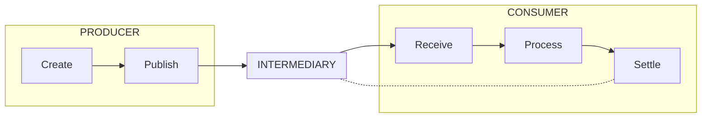

1. The producer creates a message.
2. The producer publishes the message to an intermediary.
3. The consumer receives the message from an intermediary.
4. The consumer processes the message.
5. The consumer settles the message by notifying the intermediary that the
   message was processed. In some cases (fire-and-forget scenarios, or when
   settlement happens on the broker), the settlement stage does not exist.

The semantic conventions below define how to model those stages with spans.

## Trace structure

### Producer

Producers are responsible for injecting a creation context into a message.
Subsequent consumers will use this context to link consumer traces to producer
traces. Ideally, each message gets a unique and distinct creation context
assigned.

However, as a context must refer to a span this would require the
creation of a distinct span for each message, which is not feasible in all
scenarios. In certain batching scenarios where many messages are created and
published in large batches, creating a span for every single message would
obfuscate traces and is not desirable. Thus instrumentation libraries and
auto-instrumentation should default to creating a unique and distinct context
per message, but may support configuration or other ways to change this default
behavior. The latter can help to reduce the number of spans and to avoid overly
verbose traces.

For each producer scenario, a "Publish" span needs to be created. This span
measures the duration of the call or operation that provides messages for
sending or publishing to an intermediary. This call or operation (and the
related "Publish" span) can either refer to a single message or to a batch of
multiple messages.

There are four different scenarios for injecting a creation context into a message:

1. A user provides custom creation contexts for the messages that are published, which don't refer
   to any spans described in this document. This provides flexibility to users
   to model custom scenarios. In this case, no other additional spans besides the "Publish"
   span should be created. The "Publish" span should link to the provided
   creation contexts.
2. If no custom creation context is provided for a message, it is recommended
   to create a "Create" span for every single message and inject its context
   into the message.  "Create" spans can be created during the "Publish" operation
   as children of the "Publish" span.
3. As a variation of the scenario above, "Create" spans can be created
   independently of the "Publish" operation, e. g.  in cases where messages are
   created before they are passed to a "Publish" operation. In this case, the
   "Publish" span should link to the "Create" spans.
4. For single-message scenarios or when large number of spans are a problem,
   the context of the "Publish" span can be injected into the message, thus
   acting as the creation context. In this case, no other spans besides the
   "Publish" span should be created.

### Consumer

Existing semantic conventions [prescribe the use of "Process" spans](https://github.com/open-telemetry/semantic-conventions/blob/main/docs/messaging/messaging-spans.md#span-name)
for correlating producer with consumer traces.  However, for many use cases, it
is not possible to rely on the presence of "Process" spans: there are cases
where a dedicated processing operation cannot be identified, or where
processing happens in a different trace than receiving or delivering.
Furthermore, processing operations are not often covered by messaging libraries
and SDKs, but take place in application code.  Consistently creating spans for
"Processing" operations would require either effort from the application owner
to correctly instrument those operations, or additional capabilities of
messaging libraries and SDKs (e. g. hooks for processing callbacks, which can
then be instrumented by the libraries or SDKs).

While it is possible to create "Process" spans and correlate those with
consumer traces in certain cases, this is not something that can be generally
required. Therefore, it is more feasible to require the creation of "Deliver"
spans (for push-based APIs) or "Receive" spans (for pull-based APIs) to
correlate producer with consumer traces.

#### Instrumenting push-based scenarios

In push-based consumer scenarios, the delivery of messages is not initiated by
the application code. Instead, callbacks or handlers are registered and then
called by messaging SDKs to forward messages to the application.

A "Deliver" span covers the call of such a callback or handler and should link
to the creation context of all messages that are forwarded via the respective
call.

#### Instrumenting pull-based scenarios

In pull-based consumer scenarios, the message is actively requested by the
application code. This usually involves a blocking call, which returns zero or
more messages on completion.

A "Receive" span covers such calls and should link to the creation context of
all messages that are forwarded via the respective call. To achieve this in an
idiomatic manner, it must be possible to add links after span creation, which
is not currently supported (see [open issues](#open-issues)).

#### General considerations for both push-based and pull-based scenarios

The operations modelled by "Deliver" or "Receive" spans do not strictly refer
to receiving the message from intermediaries, but instead refer to the
application receiving messages for processing. If messages are fetched from the
intermediary and forwarded to the application in one go, the whole operation
might be covered by a "Deliver" or "Receive" span. However, libraries or SDKs
might pre-fetch messages from intermediaries and cache those messages, and only
forward messages to the application at a later time. In this case, the
operation of pre-fetching and caching should not be covered by the "Deliver" or
"Receive" spans.

Operations covered by "Deliver" or "Receive" can forward zero messages (e. g.
to notify the application that no message is available for processing), one
message, or multiple messages (a batch of messages). "Deliver" and "Receive"
spans should link to the creation context of the messages forwarded, thus those
spans can link to zero, one, or multiple producer spans.

For single-message scenarios, and if the "Deliver" or "Receive" spans would be
root spans of a new trace, the creation context may also be used as a parent on
those operations in addition to being added as a link. Keeping single-messages
operations in the same trace can greatly improve the user experience.

#### Settlement

Messages can be settled in a variety of different ways:

* The intermediary settles the messages as it is sent to the consumer. No
  settlement operations happen on the consumer.
* The consumer settles a message without awaiting an acknowledgment from the
  intermediary.
* The consumer settles a message and awaits an acknowledgment from the
  intermediary. This involves a round-trip exchange between the consumer and
  the intermediary.

Settlement operations on the consumer can either be triggered manually by the
user, or can be triggered automatically by messaging SDKs based on return
values of callbacks.

A "Settle" span should be created for every settlement operation that happens
on the consumer (at-least-once and exactly-once). SDKs will, in some cases,
auto-settle messages in push-scenarios when messages are delivered via
callbacks.

"Settle" spans should link to creation context of the messages that are
settled, when possible.

No settlement span should be created for settlement scenarios that do not
involve any settlement operations on the consumer side.

## Proposed changes and additions to the messaging semantic conventions

This section contains a concise and normative definition of what was outlined
in the [Trace structure](#trace-structure) section. The following subsections
are supposed to be merged into the semantic conventions, whereas the detailed
description in the [Trace structure](#trace-structure) section in this OTEP will
serve as explanation and future reference.

### Operation name

The following operations related to messages are covered by these semantic
conventions:

| Operation name | Description |
|----------------|-------------|
| `publish`      | One or more messages are provided for publishing to an intermediary. |
| `create`       | A message is created. |
| `receive`      | One or more messages are requested by a consumer. |
| `deliver`      | One or more messages are passed to a consumer. |
| `settle`       | One or more messages are settled. |

For further details about each of those operations refer to the [section about trace structure](#trace-structure).

### Span kind

[Span kinds](../../specification/trace/api.md#spankind)
SHOULD be set according to the following table, based on the operation a span describes.

| Operation name | Span kind|
|----------------|-------------|
| `publish`      | `PRODUCER`, if no `create` spans are present. |
| `create`       | `PRODUCER` |
| `receive`      | `CONSUMER` |
| `deliver`      | `CONSUMER` |
| `settle`       | (see below) |

The kind of `settle` spans should be set according to the [generic specification about span kinds](../../specification/trace/api.md#spankind),
e. g. it should be set to `CLIENT` if the `settle` spans models a synchronous call
to the intermediary.

Setting span kinds according to this table ensures that span links between
consumers and producers always exist between a `PRODUCER` span on the producer
side and a `CONSUMER` span on the consumer side. This allows analysis tools to
interpret linked traces without the need for additional semantic hints.

### Span relationships

#### Producer spans

"Publish" spans SHOULD be created for operations of providing messages for
sending or publishing to an intermediary. A single "Publish" span can account
for a single message, or for multiple messages (in the case of providing
messages in batches). "Create" spans MAY be created. A single "Create" span
SHOULD account only for a single message. "Create" spans SHOULD either be
children or links of the related "Publish" span.

If a "Create" span exists for a message, its context SHOULD be injected into
the message. If no "Create" span exists, the context of the related "Publish"
span SHOULD be injected into the message.

#### Consumer spans

##### Push-based scenarios

"Deliver" spans SHOULD be created for operations of passing messages to the
application when those operations are not initiated by the application
code.

##### Pull-based scenarios

"Receive" spans SHOULD be created for operations of passing messages to the
application when those operations are initiated by the application code.

##### General considerations

"Deliver" or "Receive" spans MUST NOT be created for messages which are not
forwarded to the caller, but are pre-fetched or cached by messaging
libraries or SDKs.

A single "Deliver" or "Receive" span can account for a single message, for
multiple messages (in case messages are passed for processing as batches), or
for no message at all (if it is signalled that no messages were received).  For
each message it accounts for, the "Deliver" or "Receive" span SHOULD link to
the message's creation context. In addition, if it is possible the creation
context MAY be set as a parent of the "Deliver" or "Receive" span.

#### Settlement spans

"Settle" spans SHOULD be created for every manually or automatically triggered
settlement operation. A single "Settle" span can account for a single message
or for multiple messages (in case messages are passed for settling as batches).
For each message it accounts for, the "Settle" span MAY link to the creation
context of the message.

## Open issues

Fully integrating the changes proposed in this document into messaging semantic
conventions requires some additions and clarifications in the specification,
which are listed in this section:

* [open-telemetry/opentelemetry-specification#454](https://github.com/open-telemetry/opentelemetry-specification/issues/454)
  To instrument pull-based "Receive" operations as described in this document,
  it is necessary to add links to spans after those spans were created. The
  reason for this is, that not all messages are present at the start of a
  "Receive" operations, so links to related contexts cannot be added at the start
  of the span.
* [open-telemetry/opentelemetry-specification#2176](https://github.com/open-telemetry/opentelemetry-specification/issues/2176)
  When consuming a message with no attached creation context as part of a
  batch, it would still be useful to capture related message-specific
  attributes as part of a link which points to an invalid context. However,
  according to the specification links pointing to an invalid context may be
  ignored. For consistently reporting message-specific attributes on links, links
  to invalid contexts should be allowed and supported.
* [open-telemetry/opentelemetry-specification#3172](https://github.com/open-telemetry/opentelemetry-specification/issues/3172)
  Currently the specification is unclear about whether relationships between
  producer and consumer spans can be modelled via links, the wording suggests
  that it should be a parent/child relationship. The wording in the specification
  needs to make it clear that this can be a link too.
* This OTEP allows the creation of parent/child relationships between producer
  and consumer spans in addition to the required creation of links. However,
  in some instances, adding this parent/child relationship might lead to
  undesired consequences, e. g. to large traces in scenarios where batches are
  published. Some further attention needs to be paid to those scenarios when
  the changes proposed in this OTEP are merged into the semantic conventions.

## Future possibilities

### Intermediary instrumentation

While intermediary instrumentation is not directly covered by the conventions
in this document, it certainly is necessary to keep the proposed conventions
extensible so that intermediary instrumentation can be easily added in a way
that integrates well with producer and consumer instrumentation.

The diagram below gives an example of how intermediary instrumentation can be
added. The fact that producers and consumers are consistently correlated by
links across all scenarios provides maximal flexibility for adding intermediary
instrumentation.

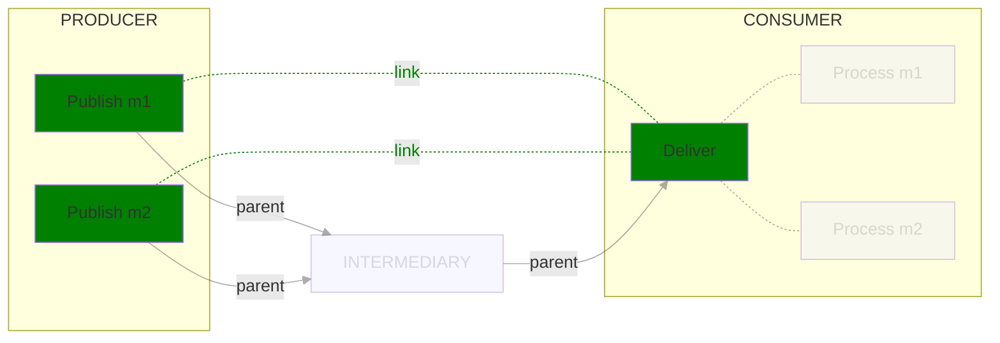

### Instrumentation of "Process" operations

This OTEP focuses on a consistent set of conventions that can be applied across
all messaging scenarios, which in one form or another cover "Publish" and/or
"Create", "Deliver" or "Receive", and "Settle" operations. Those operations
share common characteristics across all messaging scenarios.

Characteristics of "Process" operations on the other hand vary considerable
across messaging scenarios. Furthermore it is often hard or even impossible to
provide auto-instrumentation for such operations. For those reasons,
conventions for "Process" operations were declared as out-of-scope for this
OTEP.

However, interest was expressed from many sides to also achieve some
consistency for the instrumentation of "Process" operations. Therefore,
[#3395](https://github.com/open-telemetry/opentelemetry-specification/issues/3395)
covers the effort to define conventions for "Process" operations, which will
build on the foundation that this OTEP lays.

## Prior art

The existing semantic conventions for messaging contain a [list of examples](https://github.com/open-telemetry/semantic-conventions/blob/main/docs/messaging/messaging-spans.md#examples),
each specifying the spans with their attributes and relationships that should
be created for a given messaging scenario.

Many users writing instrumentation for messaging systems expressed confusion
about those examples. The relationships between spans defined in the examples
don't follow a well-documented and consistent pattern, which creates confusion
for users whose use cases don't fit any of the given examples. Instrumentors
should be able to rely on a consistent set of conventions, as opposed to
deducing conventions from a set of examples.

## Examples

This section contains a list of examples illustrating the use of the
conventions outlined above. Green boxes denote spans that are required to
exist in order to conform to those conventions. Other boxes denote spans that
are not required and covered by the conventions, but are hopefully helpful in
understanding how messaging spans can be integrated into an overall trace flow.
Solid arrows denote parent/child relationships, dotted arrows denote link
relationships.

### Push-based scenarios

A producer creates and publishes a single message, the single message is delivered to a consumer:

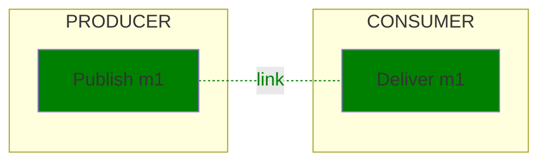

When consuming a single message, the "Deliver" spans can be parented to the creation context:

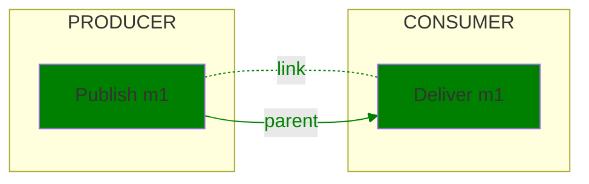

It is recommended to add spans for settlement operations on the consumer side.
Those spans can either be created manually or via auto-instrumentation:

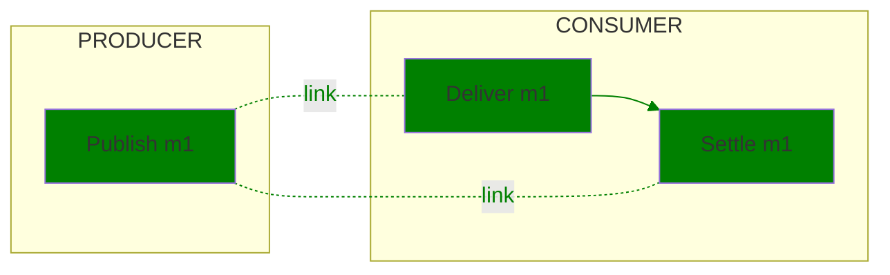

A producer publishes a batch of messages, single messages are delivered to
consumers. "Create" spans are created as part of the "Publish" operation:

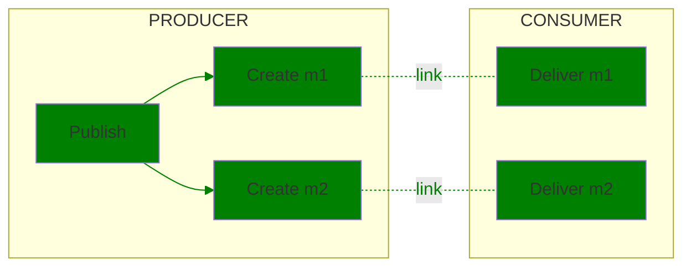

When consuming a single message, the "Deliver" spans can be parented to the creation context:

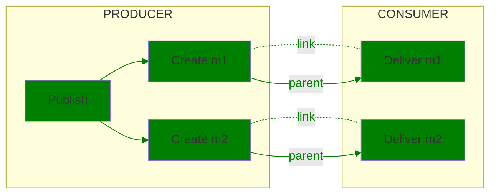

A producer creates and publishes a single message, it is delivered as part of a
batch of messages to a consumer:

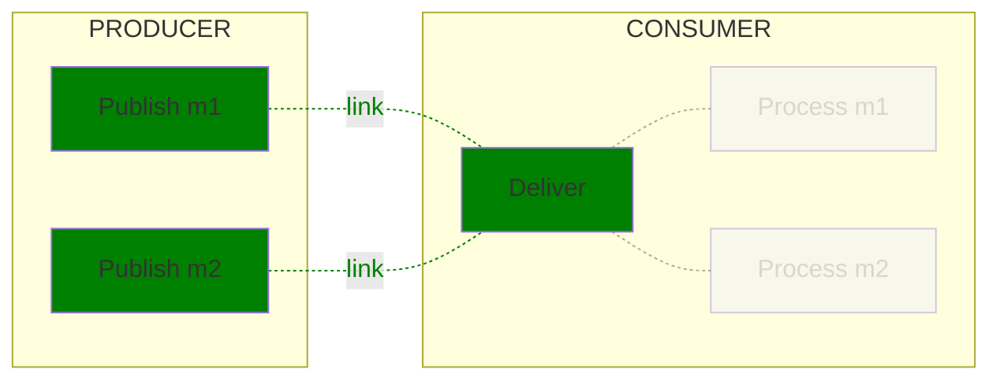

### Pull-based scenarios

A producer creates and publishes a single message, the single message is
delivered to a consumer. "Create" spans are created independently of the
"Publish" operation:

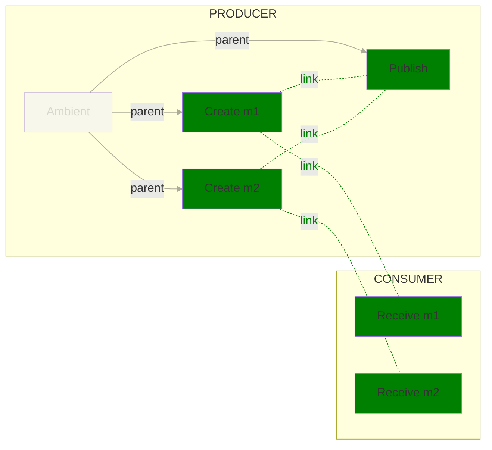

"Create" spans are created as part of the "Publish" operation:

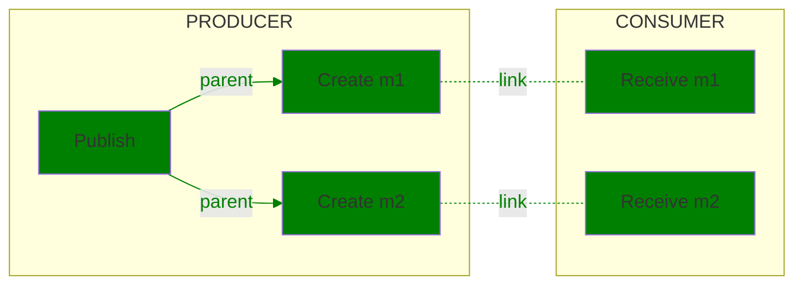

A producer creates and publishes a single message, it is delivered as part of a
batch of messages to a consumer. "Process" spans for single messages can be
created, but are not covered by these conventions:

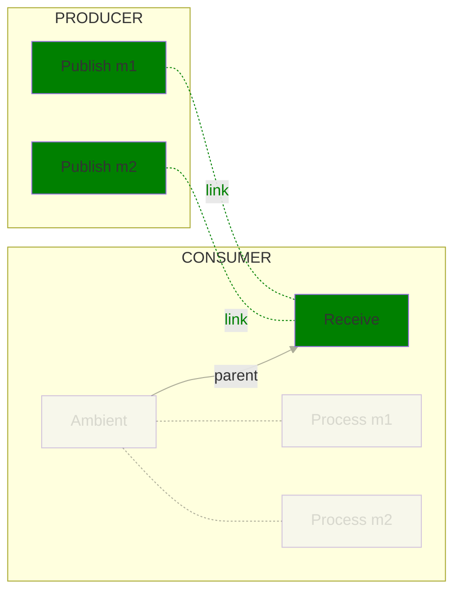

It is recommended to add spans for settlement operations. Those spans can
either be created manually or via auto-instrumentation:

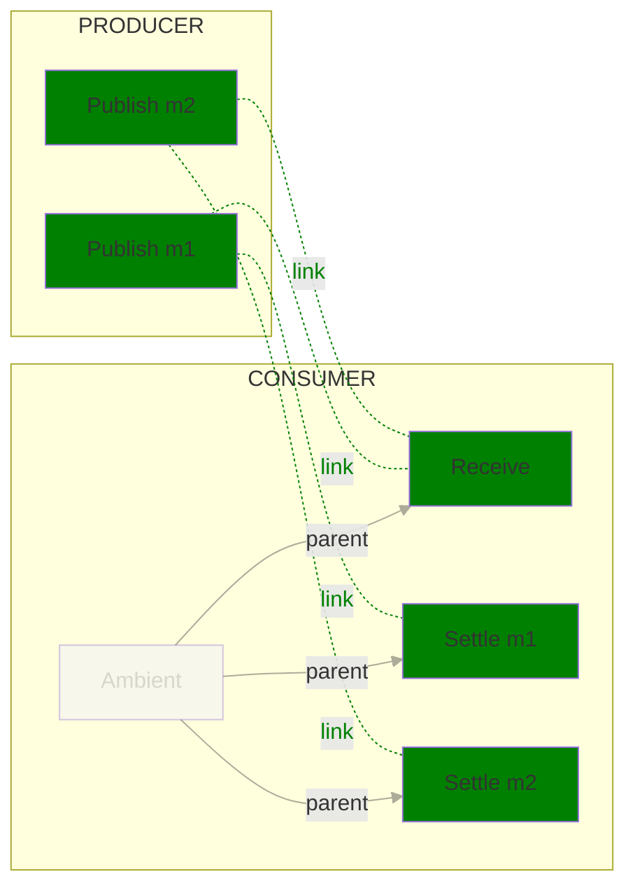
