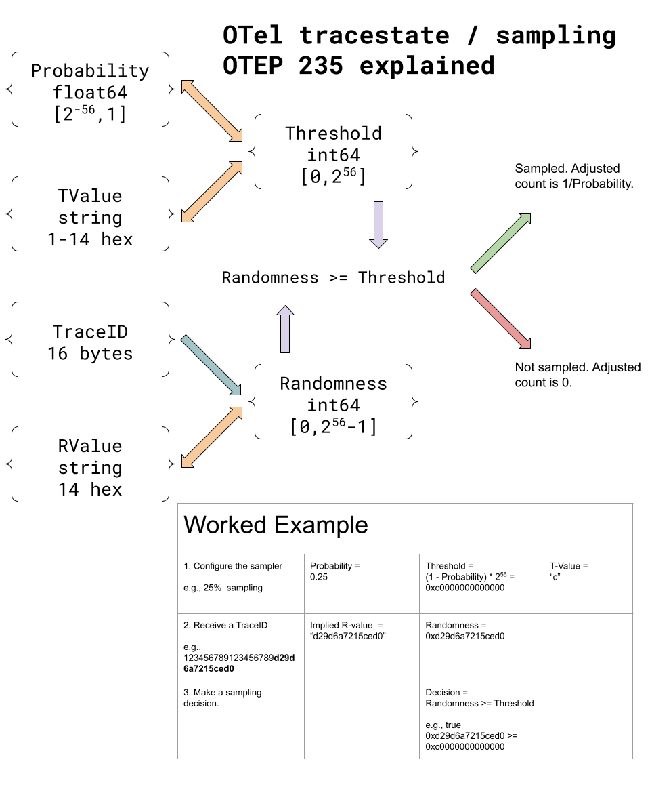

# Sampling Threshold Propagation in TraceState

## Motivation

Sampling is a broad topic; here it refers to the independent decisions made at points in a distributed tracing system of whether to collect a span or not. Multiple sampling decisions can be made before a span is finally consumed. When sampling is to be performed at multiple points in the process, the only way to reason about it effectively is to make sure that the sampling decisions are **consistent**.
In this context, consistency means that a positive sampling decision made for a particular span with probability p1 implies a positive sampling decision for any span belonging to the same trace, if it is made with probability p2 >= p1.

## Explanation

The existing, experimental [specification for probability sampling using TraceState](https://github.com/open-telemetry/opentelemetry-specification/blob/main/specification/trace/tracestate-probability-sampling.md) is limited to powers-of-two probabilities, and is designed to work without making assumptions about TraceID randomness.
This system can only achieve non-power-of-two sampling using interpolation between powers of two, which is unnecessarily restrictive.
In existing sampling systems, sampling probabilities like 1%, 10%, and 75% are common, and it should be possible to express these without interpolation.
There is also a need for consistent sampling in the collection path (outside of the head-sampling paths) and using inherent randomness in the traceID is a less-expensive solution than referencing a custom `r-value` from the tracestate in every span.
This proposal introduces a new value with the key `th` as an alternative to the `p` value in the previous specification.
The `p` value is limited to powers of two, while the `th` value in this proposal supports a large range of values.
This proposal allows for the continued expression of randomness using `r-value` as specified there using the key `r`.
To distinguish the cases, this proposal uses the key `rv`.

In the general case, in order to make consistent sampling decisions across the entire path of the trace, two values MUST be present in the `SpanContext`:

1. A _random_ (or pseudo-random) 56-bit value, called `R` below.
2. A 56-bit _rejection threshold_ (or just "threshold") as expressed in the TraceState, called `T` below. `T` represents the maximum threshold that was applied in all previous consistent sampling stages. If the current sampling stage applies a greater-valued threshold than any stage before, it MUST update (increase) the threshold correspondingly.

One way to think about _rejection threshold_ is that is the number of spans that would be discarded out of 2^56 considered spans. This means that spans where `R >= T` will be sampled.

Here is an example involving three participants `A`, `B`, and `C`:

`A` -> `B` -> `C`

where -> indicates a parent -> child relationship.

`A` uses consistent probability sampling with a sampling probability of 0.25 (this corresponds to a rejection probability of .75).
`B` uses consistent probability sampling with a sampling probability of 0.5.
`C` uses a parent-based sampler.

When `A` samples a span, its outgoing traceparent will have the 'sampled' flag SET and the 'th' in its outgoing tracestate will be set to `0xc0_0000_0000_0000`.
When `A` does not sample a span, its outgoing traceparent will have the 'sampled' flag UNSET but the 'th' in its outgoing tracestate will still be set to `0xc0_0000_0000_0000`.
When B samples a span, its outgoing traceparent will have the 'sampled' flag SET and the 'th' in its outgoing tracestate will be set to `0x80_0000_0000_0000`.
C (being a parent based sampler) samples a span purely based on its parent (B in this case), it will use the sampled flag to make the decision. Its outgoing 'th' value will continue to reflect what it got from B (`0x80_0000_0000_0000`), and this is useful to understand its adjusted count.

This design requires that as a given span progresses along its collection path, `th` is non-decreasing (and, in particular, must be increased at stages that apply lower sampling probabilities).
It does not, however, restrict a span's initial `th` in any way (e.g., relating it to that of its parent, if it has one).
It is acceptable for B to have a lesser initial `th` than A has. It would not be ok if some later-stage sampler decreased A's `th`.

The system has the following invariant:

`(R >= T) = sampled flag`

The sampling decision is propagated with the following algorithm:

* If the `th` key is not specified, this implies that non-probabilistic sampling may be taking place.
* Else derive `T` by parsing the `th` key as a hex value as described below.
* If `T` is 0, Always Sample.
* Compare the 56 bits of `T` with the 56 bits of `R`. If `T > R`, then do not sample.

The `R` value MUST be derived as follows:

* If the key `rv` is present in the Tracestate header, then `R = rv`.
* Else if the Random Trace ID Flag is `true` in the traceparent header, then `R` is the lowest-order 56 bits of the trace-id.
* Else `R` MUST be generated as a random value in the range `[0, (2**56)-1]` and added to the Tracestate header with key `rv`.

The preferred way to propagate the `R` value is as the lowest 56 bits of the trace-id.
If these bits are in fact random, the `random` trace-flag SHOULD be set as specified in [the W3C trace context specification](https://w3c.github.io/trace-context/#trace-id).
There are circumstances where trace-id randomness is inadequate (for example, sampling a group of traces together); in these cases, an `rv` value is required.

The value of the `rv` and `th` keys MUST be expressed as up to 14 hexadecimal digits from the set `[0-9a-f]`. For `th` keys only, trailing zeros (but not leading zeros) may be omitted. `rv` keys MUST always be exactly 14 hex digits.

Examples:

- `th` value is missing: non-probabalistic sampling may be taking place.
- `th=4` -- equivalent to `th=40000000000000`, which is a 25% rejection threshold, corresponding to a 75% sampling probability.
- `th=c` -- equivalent to `th=c0000000000000`, which is a rejection threshold of 75%, corresponding to a sampling probability of 25%.
- `th=08` -- equivalent to `th=08000000000000`, which is a rejection threshold of 3.125%, corresponding to a sampling probability of 96.875%.
- `th=0` -- equivalent to `th=00000000000000`, which is a 0% rejection threshold, which means Always Sample.

The `T` value MUST be derived as follows:

* If the `th` key is not present in the Tracestate header, then non-probabalistic sampling may be in use.
* Else the value corresponding to the `th` key should be interpreted as above.

Sampling Decisions MUST be propagated by setting the value of the `th` key in the Tracestate header according to the above.

## Initializing and updating T and R values

There are two categories of sampler:

- **Head samplers:** Implementations of [`Sampler`](https://github.com/open-telemetry/opentelemetry-specification/blob/v1.29.0/specification/trace/sdk.md#sampler), called by a `Tracer` during span creation.
- **Downstream samplers:** Any component that, given an ended Span, decides whether to drop or forward ("sample") it on to the next component in the system. Also known as "collection-path samplers" or "sampling processors". _Tail samplers_ are a special class of downstream samplers that buffer the spans in a trace and select a sampling probability for the trace as a whole using data from any span in the buffered trace.

This section defines behavior for each kind of sampler.

### Head samplers

A head sampler is responsible for computing the `rv` and `th` values in a new span's initial [`TraceState`](https://github.com/open-telemetry/opentelemetry-specification/blob/v1.29.0/specification/trace/api.md#tracestate). Notable inputs to that computation include the parent span's trace state (if a parent span exists) and the new span's trace ID.

First, a consistent `Sampler` decides which sampling probability to use. The sampler MAY select any value of T. If a valid `SpanContext` is provided in the call to `ShouldSample` (indicating that the span being created will be a child span),

- Choosing a T greater than the parent span's is expected to result in partial traces (the parent may be sampled but its child, the current span, dropped).
- Choosing a T less than or equal to the parent span is expected to result in complete traces (this is definition of consistent probability sampling).

For the output TraceState,

- The `th` key MUST be defined with a value corresponding to the sampling probability the sampler actually used.
- The `rv` value, if present on the input TraceState, MUST be defined and equal to the parent span's `rv`. Otherwise, `rv` MUST be defined if and only if the effective R was _generated_ during the decision, per the "derive R" algorithm given earlier.

TODO: For _new_ spans, `ShouldSample` doesn't currently have a way to know the new Span's `TraceFlags`, so it can't determine whether the Random Trace ID Flag is set, and in turn can't execute the "derive R" algorithm. Maybe it should take `TraceFlags` as an additional parameter, just like it takes `TraceId`?

### Downstream samplers

A downstream sampler, in contrast, may output a given ended Span with a _modified_ trace state, complying with following rules:

- If the chosen sampling probability is 1, the sampler MUST NOT modify any existing `th`, nor set any `th`.
- Otherwise, the chosen sampling probability is in `(0, 1)`. In this case the sampler MUST output the span with a `th` equal to `max(input th, chosen th)`. In other words, `th` MUST NOT be decreased (as it is not possible to retroactively adjust an earlier stage's sampling probability), and it MUST be increased if a lower sampling probability was used. This case represents the common case where a downstream sampler is reducing span throughput in the system.

## Visual



## Algorithms

The `th` and `rv` values may be represented and manipulated in a variety of forms depending on the capabilities of the processor and needs of the implementation. As 56-bit values, they are compatible with byte arrays and 64-bit integers, and can also be manipulated with 64-bit floating point with a truly negligible loss of precision.

The following examples are in Python3. They are intended as examples only for clarity, and not as a suggested implementation.

### Converting t-value to a 56-bit integer threshold

To convert a t-value string to a 56-bit integer threshold, pad it on the right with 0s so that it is 14 digits in length, and then parse it as a hexadecimal value.

```py
padded = (tvalue + "00000000000000")[:14]
threshold = int('0x' + padded, 16)
```

### Converting integer threshold to a t-value

To convert a 56-bit integer threshold value to the t-value representation, emit it as a hexadecimal value (without a leading '0x'), optionally with trailing zeros omitted:

```py
h = hex(tvalue).rstrip('0')
# remove leading 0x
tv = 'tv='+h[2:]
```

### Testing rv vs threshold

Given rv and threshold as 64-bit integers, a sample should be taken if rv is greater than or equal to the threshold.

```
shouldSample = (rv >= threshold)
```

### Converting threshold to a sampling probability

The sampling probability is a value from 0.0 to 1.0, which can be calculated using floating point by dividing by 2^56:

```py
# embedded _ in numbers for clarity (permitted by Python3)
maxth = 0x100_0000_0000_0000  # 2^56
prob = float(maxth - threshold) / maxth
```

### Converting threshold to an adjusted count (sampling rate)

The adjusted count indicates the approximate quantity of items from the population that this sample represents. It is equal to `1/probability`. It is not defined for spans that were obtained via non-probabilistic sampling (a sampled span with no `th` value).

## Trade-offs and mitigations

This proposal is the result of long negotiations on the Sampling SIG over what is required and various alternative forms of expressing it. [This issue](https://github.com/open-telemetry/opentelemetry-specification/issues/3602) exhaustively covers the various formats that were discussed and their pros and cons. This proposal is the result of that decision.

## Prior art and alternatives

The existing specification for `r-value` and `p-value` attempted to solve this problem, but were limited to powers of 2, which is inadequate.

## Open questions

This specification leaves room for different implementation options. For example, comparing hex strings or converting them to numeric format are both viable alternatives for handling the threshold.

We also know that some implementations prefer to use a sampling probability (in the range from 0-1.0) or a sampling rate (1/probability); this design permits conversion to and from these formats without loss up to at least 6 decimal digits of precision.

## Future possibilities

This permits sampling systems to propagate consistent sampling information downstream where it can be compensated for.
For example, this will enable the tail-sampling processor in the OTel Collector to propagate its sampling decisions to backends in a standard way.
This permits backend systems to use the effective sampling probability in data presentations.
