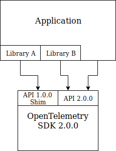

# OpenTelemetry API Compatibility Guarantees

## Semantic Versioning of API

OpenTelemetry API follows [semantic versioning convention](https://semver.org/spec/v2.0.0.html). Patch number in API version is incremented for bug fixes, minor version number is incremented when new, backwards compatible functionality is added, major version number is incremented when breaking, non-backwards compatible changes are done.

New functionality in minor version increases may be added in the form of new classes, methods or functions in a way that does not affect existing functionality.

The first OpenTelemetry API release will be version 1.0.0.

## Compatibility of SDK Implementations

Any application or third party library that uses OpenTelemetry API of a particular version can safely be packaged with OpenTelemetry SDK implementation provided that these conditions are met:

1. The full version number of the SDK is not lower than the full version number of API used by application or third party library.
2. The major version number of the SDK is the same as major version number of API or major version number of the SDK is higher by 1.

For example, an application that uses API 1.5.10 can be packaged with SDK 1.5.12 or SDK 2.0.0, but it cannot be packaged with SDK 1.0.0 (too old) or with SDK 3.0.0 (too new).

Backwards compatibility of SDK implementations is achieved via namespacing of API definitions and by providing shims in new SDK implementations that map previous major version API calls to the current SDK implementation (or fully re-implement them if necessary).

## API Namespacing

The OpenTelemetry API version 1.x.x is defined in io.opentelemetry namespace. The second major version of the API will be in io.opentelemetry.v2 namespace.

The above is specified using Java's convention of reverse domain name notation. Other languages will use their equivalent convention for namespaces, e.g. for Go the package name for version 1.x.x of the API will be go.opencensus.io, for version 2.x.x of the API it will be go.opencensus.io/v2.

## Interoperability of Mixed-version Code

API namespacing and backward compatibility guarantee of SDK allows coexistence within the same application of an instrumenting code or third party libraries that depend on different version numbers of OpenTelemetry API, provided that the oldest API version used either has the same major version number or at most one major version number lower than the SDK that the application is packaged with.

For example: the application code is instrumented using OpenTelemetry API v2 and the application includes 2 third party libraries: library A that is instrumented using OpenTelemetry API v1 and library B that is instrumented using API v2. Provided that this application is packaged with OpenTelemetry SDK implementation v2 it will work correctly. Namespacing ensures that there are no conflicts in APIs used and SDK's backward compatibility promise ensures that third party library A that calls API v1 continues to work correctly.

## Compatibility with OpenTracing and OpenCensus

TBD: https://github.com/open-telemetry/opentelemetry-specification/issues/114

## Vendor API Compatibility

TBD: https://github.com/open-telemetry/opentelemetry-specification/issues/128
