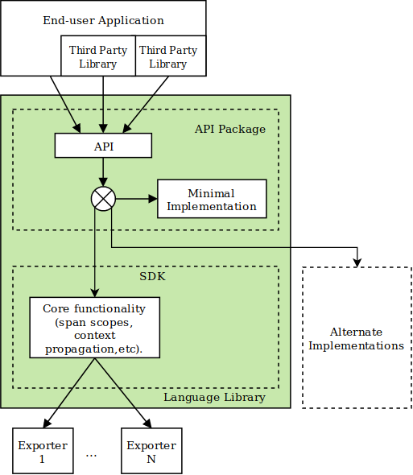
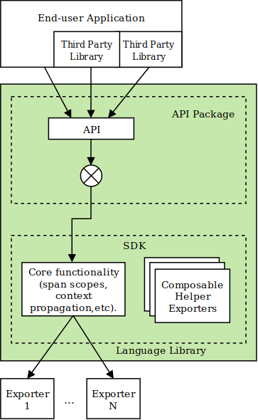

# OpenTelemetry Client Design Principles

This document defines common principles that will help designers create OpenTelemetry clients that are easy to use, are uniform across all supported languages, yet allow enough flexibility for language-specific expressiveness.

OpenTelemetry clients are expected to provide full features out of the box and allow for innovation and experimentation through extensibility.

Please read the [overview](overview.md) first, to understand the fundamental architecture of OpenTelemetry.

This document does not attempt to describe the details or functionality of the OpenTelemetry client API. For API specs see the [API specifications](../README.md).

_Note to OpenTelemetry client Authors:_ OpenTelemetry specification, API and SDK implementation guidelines are work in progress. If you notice incomplete or missing information, contradictions, inconsistent styling and other defects please let specification writers know by creating an issue in this repository or posting in [Slack](https://cloud-native.slack.com/archives/C01N7PP1THC). As implementors of the specification you will often have valuable insights into how the specification can be improved. The Specification SIG and members of Technical Committee highly value your opinion and welcome your feedback.

## Requirements

1. The OpenTelemetry API must be well-defined and clearly decoupled from the implementation. This allows end users to consume API only without also consuming the implementation (see points 2 and 3 for why it is important).

2. Third party libraries and frameworks that add instrumentation to their code will have a dependency only on the API of OpenTelemetry client. The developers of third party libraries and frameworks do not care (and cannot know) what specific implementation of OpenTelemetry is used in the final application. To enable this clean separation, the OpenTelemetry API and SDK libraries MUST be provided as independent artifacts.

3. The developers of the final application normally decide how to configure OpenTelemetry SDK and what extensions to use. They should be also free to choose to not use any OpenTelemetry implementation at all, even though the application and/or its libraries are already instrumented.  The rationale is that third-party libraries and frameworks which are instrumented with OpenTelemetry must still be fully usable in the applications which do not want to use OpenTelemetry (so this removes the need for framework developers to have "instrumented" and "non-instrumented" versions of their framework).

4. The SDK must be clearly separated into wire protocol-independent parts that implement common logic (e.g. batching, tag enrichment by process information, etc.) and protocol-dependent telemetry exporters. Telemetry exporters must contain minimal functionality, thus enabling vendors to easily add support for their specific protocol.

5. The SDK implementation should include the following exporters:
    - logs, metrics, trace
        - OTLP (OpenTelemetry Protocol).
        - Standard output (or logging) to use for debugging and testing as well as an input for the various log proxy tools.
        - In-memory (mock) exporter that accumulates telemetry data in the local memory and allows to inspect it (useful for e.g. unit tests).
    - metrics
        - Prometheus.
    - trace
        - Zipkin.

    Note: some of these support multiple protocols (e.g. gRPC, Thrift, etc). The exact list of protocols to implement in the exporters is TBD.

    Other vendor-specific exporters (exporters that implement vendor protocols) should not be included in OpenTelemetry clients and should be placed elsewhere (the exact approach for storing and maintaining vendor-specific exporters will be defined in the future).

## OpenTelemetry Client Generic Design

Here is a generic design for an OpenTelemetry client (arrows indicate calls):

### Expected Usage

The OpenTelemetry client is composed of 4 types of [packages](glossary.md#packages): API packages, SDK packages, a Semantic Conventions package, and plugin packages (e.g. Contrib).
The API and the SDK are split into multiple packages, based on signal type (e.g. one for api-trace, one for api-metric, one for sdk-trace, one for sdk-metric) is considered an implementation detail as long as the API artifact(s) stay separate from the SDK artifact(s).

Libraries, frameworks, and applications that want to be instrumented with OpenTelemetry take a dependency only on the API packages. The developers of these third-party libraries will make calls to the API to produce telemetry data.

Applications that use third-party libraries that are instrumented with OpenTelemetry API control whether or not to install the SDK and generate telemetry data. When the SDK is not installed, the API calls should be no-ops which generate minimal overhead.

In order to enable telemetry the application must take a dependency on the OpenTelemetry SDK. The application must also configure exporters and other plugins so that telemetry can be correctly generated and delivered to their analysis tool(s) of choice. The details of how plugins are enabled and configured are language specific.

### API and Minimal Implementation

The API package is a self-sufficient dependency, in the sense that if the end user application or a third-party library depends only on it and does not plug a full SDK implementation then the application will still build and run without failing, although no telemetry data will be actually delivered to a telemetry backend.

This self-sufficiency is achieved the following way.

The API dependency contains a minimal implementation of the API. When no other implementation is explicitly included in the application no telemetry data will be collected. Here is what active components look like in this case:

It is important that values returned from this minimal implementation of API are valid and do not require the caller to perform extra checks (e.g. createSpan() method should not fail and should return a valid non-null Span object). The caller should not need to know and worry about the fact that minimal implementation is in effect. This minimizes the boilerplate and error handling in the instrumented code.

It is also important that minimal implementation incurs as little performance penalty as possible, so that third-party frameworks and libraries that are instrumented with OpenTelemetry impose negligible overheads to users of such libraries that do not want to use OpenTelemetry too.

### SDK Implementation

SDK implementation is a separate (optional) dependency. When it is plugged in it substitutes the minimal implementation that is included in the API package (exact substitution mechanism is language dependent).

SDK implements core functionality that is required for translating API calls into telemetry data that is ready for exporting. Here is how OpenTelemetry components look like when SDK is enabled:

SDK defines an [Exporter interface](trace/sdk.md#span-exporter). Protocol-specific exporters that are responsible for sending telemetry data to backends must implement this interface.

SDK also includes optional helper exporters that can be composed for additional functionality if needed.

Library designers need to define the language-specific `Exporter` interface based on [this generic specification](trace/sdk.md#span-exporter).

#### Protocol Exporters

Telemetry backend vendors are expected to implement [Exporter interface](trace/sdk.md#span-exporter). Data received via Export() function should be serialized and sent to the backend in a vendor-specific way.

Vendors are encouraged to keep protocol-specific exporters as simple as possible and achieve desirable additional functionality such as queuing and retrying using helpers provided by SDK.

End users should be given the flexibility of making many of the decisions regarding the queuing, retrying, tagging, batching functionality that make the most sense for their application. For example, if an application's telemetry data must be delivered to a remote backend that has no guaranteed availability the end user may choose to use a persistent local queue and an `Exporter` to retry sending on failures. As opposed to that for an application that sends telemetry to a locally running Agent daemon, the end user may prefer to have a simpler exporting configuration without retrying or queueing.

If additional exporters for the SDK are provided as separate libraries, the
name of the library should be prefixed with the terms "OpenTelemetry" and "Exporter" in accordance with the naming conventions of the respective technology.

For example:

- Python and Java: opentelemetry-exporter-{vendor_name}
- JavaScript: @opentelemetry/exporter-{vendor_name}

#### Resource Detection

Cloud vendors are encouraged to provide packages to detect resource information from the environment. These MUST be implemented outside of the SDK. See [Resource SDK](./resource/sdk.md#detecting-resource-information-from-the-environment) for more details.

### Alternative Implementations

The end user application may decide to take a dependency on alternative implementation.

SDK provides flexibility and extensibility that may be used by many implementations. Before developing an alternative implementation, please, review extensibility points provided by OpenTelemetry.

An example use-case for alternate implementations is automated testing. A mock implementation can be plugged in during automated tests. For example, it can store all generated telemetry data in memory and provide a capability to inspect this stored data. This will allow the tests to verify that the telemetry is generated correctly. OpenTelemetry client authors are encouraged to provide such a mock implementation.

Note that mocking is also possible by using SDK and a Mock `Exporter` without needing to swap out the entire SDK.

The mocking approach chosen will depend on the testing goals and at which point exactly it is desirable to intercept the telemetry data path during the test.

### Version Labeling

API and SDK packages must use semantic version numbering. API package version number and SDK package version number are decoupled and can be different (and they both can be also different from the Specification version number that they implement). API and SDK packages MUST be labeled with their own version number.

This decoupling of version numbers allows OpenTelemetry client authors to make API and SDK package releases independently without the need to coordinate and match version numbers with the Specification.

Because API and SDK package version numbers are not coupled, every API and SDK package release MUST clearly mention the Specification version number that they implement. In addition, if a particular version of SDK package is only compatible with a specific version of API package, then this compatibility information must be also published by OpenTelemetry client authors. OpenTelemetry client authors MUST include this information in the release notes. For example, the SDK package release notes may say: "SDK 0.3.4, use with API 0.1.0, implements OpenTelemetry Specification 0.1.0".

_TODO: How should third-party library authors who use OpenTelemetry for instrumentation guide their end users to find the correct SDK package?_

### Performance and Blocking

See the [Performance and Blocking](performance.md) specification for
guidelines on the performance expectations that API implementations should meet, strategies for meeting these expectations, and a description of how implementations should document their behavior under load.

### Concurrency and Thread-Safety

Please refer to individual API specification for guidelines on what concurrency
safeties should API implementations provide and how they should be documented:

* [Metrics API](./metrics/api.md#concurrency-requirements)
* [Metrics SDK](./metrics/sdk.md#concurrency-requirements)
* [Tracing API](./trace/api.md#concurrency)
