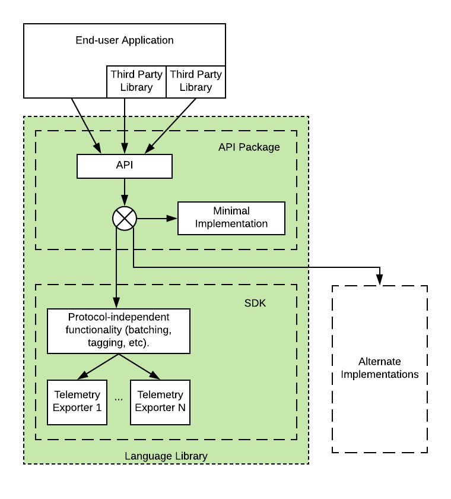
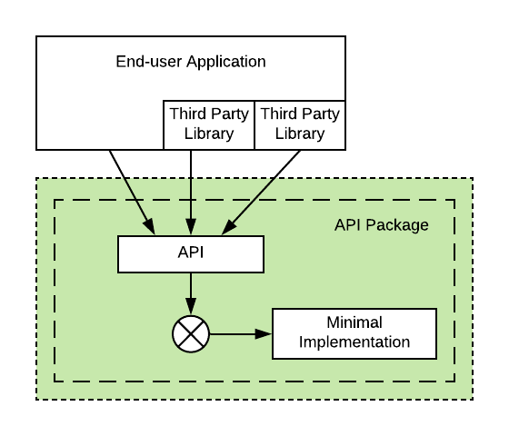
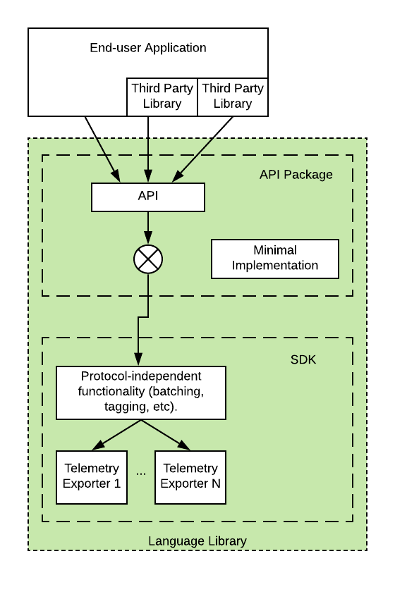

# OpenTelemetry Language Library Design Principles

This document defines common principles that will help designers create language libraries that are easy to use, are uniform across all supported languages, yet allow enough flexibility for language-specific expressiveness. 

The language libraries are expected to provide full features out of the box and allow for innovation and experimentation through extensibility points.

The document does not attempt to describe a language library API. For API specs see [specification](../README.md).

_Note to Language Library Authors:_ OpenTelemetry specification, API and SDK implementation guidelines are work in progress. If you notice incomplete or missing information, contradictions, inconsistent styling and other defects please let specification writers know by creating an issue in this repository or posting in [Gitter](https://gitter.im/open-telemetry/opentelemetry-specification). As implementors of the specification you will often have valuable insights into how the specification can be improved. The Specification SIG and members of Technical Committee highly value you opinion and welcome your feedback.

## Requirements

1. The OpenTelemetry API must be well-defined and clearly decoupled from the implementation. This allows end users to consume API only without also consuming the implementation (see points 2 and 3 for why it is important).

2. Third party libraries and frameworks that add instrumentation to their code will have a dependency only on the API of OpenTelemetry language library. The developers of third party libraries and frameworks do not care (and cannot know) what specific implementation of OpenTelemetry is used in the final application.

3. The developers of the final application normally decide how to configure OpenTelemetry SDK and what extensions to use. They should be also free to choose to not use any OpenTelemetry implementation at all, even though the application and/or its libraries are already instrumented.  The rationale is that third-party libraries and frameworks which are instrumented with OpenTelemetry must still be fully usable in the applications which do not want to use OpenTelemetry (so this removes the need for framework developers to have "instrumented" and "non-instrumented" versions of their framework).

4. Language library implementation must be clearly separated into wire protocol-independent parts that implement common logic (e.g. batching, tag enrichment by process information, etc.) and protocol-dependent telemetry exporters. Telemetry exporters must contain minimal functionality, thus enabling vendors to easily add support for their specific protocol.

5. Language library implementation should include an exporter for OpenTelemetry Protocol (when the protocol is specified and approved) and may include an exporter that writes to standard output (to use for debugging and testing). Vendor-specific exporters (exporters that implement vendor protocols) should not be included in language libraries and should be placed elsewhere (the exact approach for storing and maintaining vendor-specific exporters will be defined in the future).

# Language Library Generic Design

Here is a generic design for a language library (arrows indicate calls):

## Expected Usage

The OpenTelemetry Language Library is composed of 2 packages: API package and SDK package.

Third-party libraries and frameworks that want to be instrumented in OpenTelemetry-compatible way will have a dependency on the API package. The developers of these third-party libraries will add calls to telemetry API to produce telemetry data.

Applications that use third-party libraries that are instrumented with OpenTelemetry API will have a choice to enable or not enable the actual delivery of telemetry data. The application can also call telemetry API directly to produce additional telemetry data.

In order to enable telemetry the application must take a dependency on the OpenTelemetry SDK, which implements the delivery of the telemetry. The application must also configure exporters so that the SDK knows where and how to deliver the telemetry. The details of how exporters are enabled and configured are language specific.

## API and Minimal Implementation

The API package is a self-sufficient dependency, in the sense that if the end-user application or a third-party library depends only on it and does not plug a full SDK implementation then the application will still build and run without failing, although no telemetry data will be actually delivered to a telemetry backend.

This self-sufficiency is achieved the following way.

The API dependency contains a minimal implementation of the API. When no other implementation is explicitly included in the application no telemetry data will be collected. Here is what active components look like in this case:

It is important that values returned from this minimal implementation of API are valid and do not require the caller to perform extra checks (e.g. createSpan() method should not fail and should return a valid non-null Span object). The caller should not need to know and worry about the fact that minimal implementation is in effect. This minimizes the boilerplate and error handling in the instrumented code.

It is also important that minimal implementation incurs as little performance penalty as possible, so that third-party frameworks and libraries that are instrumented with OpenTelemetry impose negligible overheads to users of such libraries that do not want to use OpenTelemetry too.

## SDK Implementation

SDK implementation is a separate (optional) dependency. When it is plugged in it substitutes the minimal implementation that is included in the API package (exact substitution mechanism is language dependent).

SDK implements core functionality that is required for translating API calls into telemetry data that is ready for exporting. Here is how OpenTelemetry components look like when SDK is enabled:

SDK defines an [Exporter interface](sdk-tracing.md#span-exporter). Protocol-specific exporters that are responsible for sending telemetry data to backends must implement this interface.

SDK also includes optional helper exporters that can be composed for additional functionality if needed.

Library designers need to define the language-specific `Exporter` interface based on [this generic specification](sdk-tracing.md#span-exporter). 

### Protocol Exporters

Telemetry backend vendors are expected to implement [Exporter interface](sdk-tracing.md#span-exporter). Data received via Export() function should be serialized and sent to the backend in a vendor-specific way.

Vendors are encouraged to keep protocol-specific exporters as simple as possible and achieve desirable additional functionality such as queuing and retrying using helpers provided by SDK.

End users should be given the flexibility of making many of the decisions regarding the queuing, retrying, tagging, batching functionality that make the most sense for their application. For example, if an application's telemetry data must be delivered to a remote backend that has no guaranteed availability the end user may choose to use a persistent local queue and an `Exporter` to retry sending on failures. As opposed to that for an application that sends telemetry to a locally running Agent daemon, the end user may prefer to have a simpler exporting configuration without retrying or queueing. 

## Alternative Implementations

The end-user application may decide to take a dependency on alternative implementation. 

SDK provides flexibility and extensibility that may be used by many implementations. Before developing an alternative implementation, please, review extensibility points provided by OpenTelemetry.

An example use case for alternate implementations is automated testing. A mock implementation can be plugged in during automated tests. For example it can store all generated telemetry data in memory and provide a capability to inspect this stored data. This will allow the tests to verify that the telemetry is generated correctly. Language Library authors are encouraged to provide such mock implementation.

Note that mocking is also possible by using SDK and a Mock `Exporter` without needed to swap out the entire SDK. 

The mocking approach chosen will depend on the testing goals and at which point exactly it is desirable to intercept the telemetry data path during the test.

## Performance and Blocking

See the [Performance and Blocking](performance.md) specification for
guidelines on the performance expectations that API implementations should meet, strategies for meeting these expectations, and a description of how implementations should document their behavior under load.

## Concurrency and Thread-Safety

See the [Concurrency and Thread-Safety](concurrency.md) specification for
guidelines on what concurrency safeties should API implementations provide
and how they should be documented.
