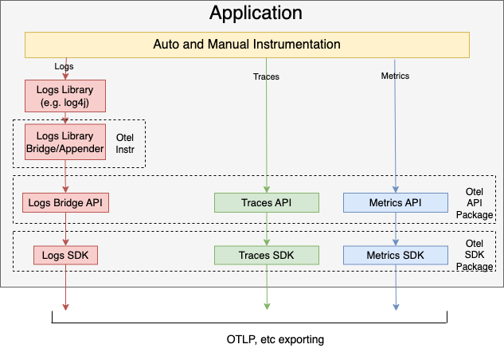

<!--- Hugo front matter used to generate the website version of this page:
linkTitle: Logs
aliases:
  - /docs/reference/specification/logs/overview
  - ./event-api
  - ./event-sdk
path_base_for_github_subdir:
  from: tmp/otel/specification/logs/_index.md
  to: logs/README.md
--->

# OpenTelemetry Logging

Table of Contents

<!-- toc -->

- [Introduction](#introduction)
- [Limitations of non-OpenTelemetry Solutions](#limitations-of-non-opentelemetry-solutions)
- [OpenTelemetry Solution](#opentelemetry-solution)
- [Log Correlation](#log-correlation)
- [Legacy and Modern Log Sources](#legacy-and-modern-log-sources)
  * [System Logs](#system-logs)
  * [Infrastructure Logs](#infrastructure-logs)
  * [Third-party Application Logs](#third-party-application-logs)
  * [Legacy First-Party Applications Logs](#legacy-first-party-applications-logs)
    + [Via File or Stdout Logs](#via-file-or-stdout-logs)
    + [Direct to Collector](#direct-to-collector)
  * [New First-Party Application Logs](#new-first-party-application-logs)
- [OpenTelemetry Collector](#opentelemetry-collector)
- [Auto-Instrumenting Existing Logging](#auto-instrumenting-existing-logging)
- [Specifications](#specifications)
- [References](#references)

<!-- tocstop -->

## Introduction

Of all telemetry signals logs have probably the biggest legacy. Most programming
languages have built-in logging capabilities or well-known, widely used logging
libraries.

For metrics and traces OpenTelemetry takes the approach of a clean-sheet design,
specifies a new API and provides full implementations of this API in multiple
languages.

Our approach with logs is somewhat different. For OpenTelemetry to be
successful in logging space we need to support existing legacy of logs and
logging libraries, while offering improvements and better integration with the
rest of observability world where possible.

This is in essence the philosophy behind OpenTelemetry's logs support. We
embrace existing logging solutions and make sure OpenTelemetry works nicely with
existing logging libraries, log collection and processing solutions.

## Limitations of non-OpenTelemetry Solutions

Unfortunately existing logging solutions are currently weakly integrated with
the rest of the observability signals. Logs typically have limited support in
tracing and monitoring tools in the form of links that use available and often
incomplete correlation information (such as the time and origin attributes).
This correlation may be fragile because attributes are often added to logs,
traces and metrics via different means (e.g. using different collection agents).
There is no standardized way to include the information about the origin and
source of logs (such as the application and the location/infrastructure where
the application runs) that is uniform with traces and metrics and allows all
telemetry data to be fully correlated in a precise and robust manner.

Similarly, logs have no standardized way to propagate and record the request
execution context. In distributed systems this often results in a disjoint set
of logs collected from different components of the system.

This is how a typical non-OpenTelemetry observability collection pipeline looks
like today:

There are often different libraries and different collection agents, using
different protocols and data models, with telemetry data ending up in separate
backends that don't know how to work well together.

## OpenTelemetry Solution

Distributed tracing introduced the notion of trace context propagation.

Fundamentally, though, nothing prevents the logs to adopt the same context
propagation concepts. If the recorded logs contained trace context identifiers
(such as trace and span ids or user-defined baggage) it would result
in much richer correlation between logs and traces, as well as correlation
between logs emitted by different components of a distributed system. This would
make logs significantly more valuable in distributed systems.

This is one of the promising evolutionary directions for observability tools.
Standardizing log correlation with traces and metrics, adding support for
distributed context propagation for logs, unification of source attribution of
logs, traces and metrics will increase the individual and combined value of
observability information for legacy and modern systems. This is the vision of
OpenTelemetry's collection of logs, traces and metrics:

We emit logs, traces and metrics in a way that is compliant with OpenTelemetry
data models, send the data through OpenTelemetry Collector, where it can be
enriched and processed in a uniform manner. For example, Collector can add to
all telemetry data coming from a Kubernetes Pod several attributes that describe
the pod and it can be done automatically using
[k8sprocessor](https://pkg.go.dev/github.com/open-telemetry/opentelemetry-collector-contrib/processor/k8sprocessor?tab=doc)
without the need for the Application to do anything special. Most importantly
such enrichment is completely uniform for all 3 signals. The Collector
guarantees that logs, traces and metrics have precisely the same attribute names
and values describing the Kubernetes Pod that they come from. This enables exact
and unambiguous correlation of the signals by the Pod in the backend.

For traces and metrics OpenTelemetry defines a new API that application
developers must use to emit traces and metrics.

For logs we did not take the same path. We realized that there is a much bigger
and more diverse legacy in logging space. There are many existing logging
libraries in different languages, each having their own API. Many programming
languages have established standards for using particular logging libraries. For
example in Java world there are several highly popular and widely used logging
libraries, such as Log4j or Logback.

There are also countless existing prebuilt applications or systems that emit
logs in certain formats. Operators of such applications have no or limited
control on how the logs are emitted. OpenTelemetry needs to support these logs.

Given the above state of the logging space we took the following approach:

- OpenTelemetry defines a [log data model](data-model.md). The purpose of the
  data model is to have a common understanding of what a LogRecord is, what
  data needs to be recorded, transferred, stored and interpreted by a logging
  system.

- Newly designed logging systems are expected to emit logs according to
  OpenTelemetry's log data model. More on this [later](#new-first-party-application-logs).

- Existing log formats can be
  [unambiguously mapped](data-model-appendix.md) to
  OpenTelemetry log data model. OpenTelemetry Collector can read such logs and
  translate them to OpenTelemetry log data model.

- OpenTelemetry defines a Logs API
  for [emitting LogRecords](./api.md#emit-a-logrecord). Application developers are
  NOT encouraged to call this API directly. It is provided for library authors
  to build [log appender](../glossary.md#log-appender--bridge), which use
  the API to bridge between existing logging libraries and the OpenTelemetry log
  data model. Existing logging libraries generally provide a much richer set of
  features than what is defined in OpenTelemetry. It is NOT a goal of
  OpenTelemetry to ship a feature-rich logging library.

- OpenTelemetry defines an [SDK](./sdk.md) implementation of the [API](./api.md),
  which enables configuration of [processing](./sdk.md#logrecordprocessor)
  and [exporting](./sdk.md#logrecordexporter) LogRecords.

This approach allows OpenTelemetry to read existing system and application logs,
provides a way for newly built application to emit rich, structured,
OpenTelemetry-compliant logs, and ensures that all logs are eventually
represented according to a uniform log data model on which the backends can
operate.

Later in this document we will discuss in more details
[how various log sources are handled](#legacy-and-modern-log-sources) by
OpenTelemetry, but first we need to describe in more details an important
concept: the log correlation.

## Log Correlation

Logs can be correlated with the rest of observability data in a few dimensions:

- By the **time of execution**. Logs, traces and metrics can record the moment
  of time or the range of time the execution took place. This is the most basic
  form of correlation.

- By the **execution context**, also known as the trace context. It is a
  standard practice to record the execution context (trace and span ids as well
  as user-defined context) in the spans. OpenTelemetry extends this practice to
  logs where possible by including [TraceId](data-model.md#field-traceid) and
  [SpanId](data-model.md#field-spanid) in the LogRecords. This allows to
  directly correlate logs and traces that correspond to the same execution
  context. It also allows to correlate logs from different components of a
  distributed system that participated in the particular request execution.

- By the **origin of the telemetry**, also known as the Resource context.
  OpenTelemetry traces and metrics contain information about the Resource they
  come from. We extend this practice to logs by including the
  [Resource](data-model.md#field-resource) in LogRecords.

These 3 correlations can be the foundation of powerful navigational, filtering,
querying and analytical capabilities. OpenTelemetry aims to record and collects
logs in a manner that enables such correlations.

## Legacy and Modern Log Sources

It is important to distinguish several sorts of legacy and modern log sources.
Firstly, this directly affects how exactly we get access to these logs and how
we collect them. Secondly, we have varying levels of control over how these logs
are generated and whether we can amend the information that can be included in
the logs.

Below we list several categories of logs and describe what can be possibly done
for each category to have better experience in the observability solutions.

### System Logs

These are logs generated by the operating system and over which we have no
control. We cannot change the format or affect what information is included.
Examples of system format are Syslog and Windows Event Logs.

System logs are written at the host level (which may be physical, virtual or
containerized) and have a predefined format and content (note that applications
may also be able to write records to standard system logs: this case is covered
below in the [Third-Party Applications](#third-party-application-logs) section).

System operations recorded in the logs can be a result of a request execution.
However system logs either do not include any data about the trace context or
if included it is highly idiosyncratic and thus difficult to identify, parse and
use. This makes it nearly impossible to perform trace context correlation for
system logs. However we can and should automatically enrich system logs with the
resource context - the information about the host that is available during
collection. This can include the host name, IP address, container or pod name,
etc. This information should be added to the Resource field of collected log
data.

OpenTelemetry Collector can read system logs (link TBD) and automatically enrich
them with Resource information using the
[resourcedetection](https://github.com/open-telemetry/opentelemetry-collector-contrib/tree/master/processor/resourcedetectionprocessor)
processor.

### Infrastructure Logs

These are logs generated by various infrastructure components, such as
Kubernetes events. Like system logs, the
infrastructure logs lack a trace context and can be enriched by the resource
context - information about the node, pod, container, etc.

OpenTelemetry Collector or other agents can be used to query logs from most
common infrastructure controllers.

### Third-party Application Logs

Applications typically write logs to standard output, to files or other
specialized medium (e.g. Windows Event Logs for applications). These logs can be
in many different formats, spanning a spectrum along these variations:

- Free-form text formats with no easily automatable and reliable way to parse
  structured data from them.

- Better specified and sometimes customizable formats that can be parsed to
  extract structured data (such as Apache logs or RFC5424 Syslog).

- Formally structured formats (e.g. JSON files with well-defined schema or
  Windows Event Log).

The collection system needs to be able to discover most commonly used
applications and have parsers that can convert these logs into a structured
format. Like system and infrastructure logs, application logs often lack request
context but can be enriched by resource context, including the attributes that
describe the host and infrastructure as well as application-level attributes
(such as the application name, version, name of the database - if it is a DBMS,
etc).

OpenTelemetry recommends to collect application logs using Collector's
[filelog receiver](https://github.com/open-telemetry/opentelemetry-collector-contrib/tree/main/receiver/filelogreceiver).
Alternatively, another log collection agent, such as FluentBit, can collect
logs,
[then send](https://github.com/open-telemetry/opentelemetry-collector-contrib/tree/master/receiver/fluentforwardreceiver)
to OpenTelemetry Collector where the logs can be further processed and enriched.

### Legacy First-Party Applications Logs

These are applications that are created in-house. People tasked with setting up
log collection infrastructure sometimes are able to modify these applications to
alter how logs are written and what information is included in the logs. For
example, the application’s log formatters may be reconfigured to output json
instead of plain text and by doing so help improve the reliability of log
collection.

More significant modifications to these applications can be done manually by
their developers, such as addition of the trace context to every log
statement, however this is likely going to be vanishingly rare due to the effort
required.

As opposed to manual efforts we have an interesting opportunity to "upgrade"
application logs in a less laborious way by providing full or semi
auto-instrumenting solutions that modify trace logging libraries used by the
application to automatically output the trace context such as the trace id or
span id with every log statement. The trace context can be automatically
extracted from incoming requests if standard compliant request propagation is
used, e.g. via [W3C TraceContext](https://www.w3.org/TR/trace-context). In
addition, the requests outgoing from the application may be injected with the
same trace context data, thus resulting in context propagation through the
application and creating an opportunity to have full trace context in logs
collected from all applications that can be instrumented in this manner.

Some logging libraries are designed to be extended in this manner relatively
easily. There is no need to actually modify the libraries, instead we can
implement "log appender" or "log bridge" components for such libraries and
implement the additional LogRecord enrichment in these components.

There are typically 2 ways to collect logs from these applications.

#### Via File or Stdout Logs

The first approach, assuming the logs are written to files or to standard
output, requires ability to read file logs, tail them, work correctly when log
rotation is used, optionally also parse the logs to convert them into more
structured formats. Parsing requires support for different parser types, which
can also be configured to parse custom formats as well as ability to add custom
parsers. Examples of common formats that parsers need to support are: CSV,
Common Log Format, Labeled Tab-separated Values (LTSV), Key/Value Pair format,
JSON, etc. To support this approach OpenTelemetry recommends to collect logs
using OpenTelemetry
[Collector](https://github.com/open-telemetry/opentelemetry-collector-contrib/tree/main/receiver/filelogreceiver).

Alternatively, if the Collector does not have the necessary file reading and
parsing capabilities, another log collection agent, such as FluentBit can
collect the logs,
[then send the logs](https://github.com/open-telemetry/opentelemetry-collector-contrib/tree/master/receiver/fluentforwardreceiver)
to OpenTelemetry Collector.

The benefit of using an intermediary medium is that how logs are produced and
where they are written by the application requires no or minimal changes. The
downside is that it requires the often non-trivial log file reading and parsing
functionality. Parsing may also be not reliable if the output format is not
well-defined. For details on recording and parsing trace context,
see [Trace Context in Non-OTLP Log Formats](../compatibility/logging_trace_context.md).

#### Direct to Collector

The second approach is to modify the application so that the logs are output via
a network protocol, e.g. via
[OTLP](https://github.com/open-telemetry/opentelemetry-proto/blob/master/opentelemetry/proto/logs/v1/logs.proto).
The most convenient way to achieve this is to provide addons or extensions to
the commonly used logging libraries. The addons implement sending over such
network protocols, which would then typically require small, localized changes
to the application code to change the logging target.

The application logs will be also enriched by the resource context, similarly to
how it is done for third-party applications and so will potentially have full
correlation information across all context dimensions.

The downside of this approach is that the simplicity of having the logs in a
local file is lost (e.g. ability to easily inspect the log file locally) and
requires a full buy-in in OpenTelemetry's logging approach. This approach also
only works if the destination that the logs need to be delivered is able to
receive logs via the network protocol that OpenTelemetry can send in.

The benefits of this approach is that it emits the logs in well-defined, formal,
highly structured format, removes all complexity associated with file logs, such
as parsers, log tailing and rotation. It also enables the possibility to send
logs directly to the logging backend without using a log collection agent.

To facilitate both approaches described above OpenTelemetry provides
a [API](./api.md) and [SDK](./sdk.md), which can be used together with existing
logging libraries to automatically inject the trace context in the emitted logs,
and provide an easy way to send the logs via OTLP. Instead of
modifying each logging statement, [log appenders](../glossary.md#log-appender--bridge)
use the API to bridge logs from existing logging libraries to the OpenTelemetry
data model, where the SDK controls how the logs are processed and exported.
Application developers only need to configure the Appender and SDK at
application startup.

### New First-Party Application Logs

These are greenfield developments. OpenTelemetry provides recommendations and
best practices about how to emit logs (along with traces and metrics) from these
applications. For applicable languages and frameworks the auto-instrumentation
or simple configuration of a logging library to use an OpenTelemetry log appender
will still be the easiest way to emit context-enriched logs. As
already described earlier we provide extensions to some popular logging
libraries languages to support the manual instrumentation cases. The extensions
will support the inclusion of the trace context in the logs and allow to send
logs using OTLP protocol to the backend or to the Collector, bypassing the need
to have the logs represented as text files. Emitted logs are automatically
augmented by application-specific resource context (e.g. process id, programming
language, logging library name and version, etc). Full correlation across all
context dimensions will be available for these logs.

This is how a typical new application uses OpenTelemetry API, SDK and the
existing log libraries:

## OpenTelemetry Collector

To enable log collection according to this specification we use OpenTelemetry
Collector.

The following functionality exists to enable log collection:

- Support for log data type and log pipelines based on the
  [log data model](data-model.md). This includes processors such as
  [attributesprocessor](https://github.com/open-telemetry/opentelemetry-collector-contrib/tree/main/processor/attributesprocessor)
  that can operate on log data.

- Ability to read logs from text files, tail the files, understand common log
  rotation schemes, watch directories for log file creation, ability to
  checkpoint file positions and resume reading from checkpoints. This ability is
  implemented by using Collector's
  [filelog receiver](https://github.com/open-telemetry/opentelemetry-collector-contrib/tree/main/receiver/filelogreceiver)
  or using an externally running agent (such as FluentBit).

- Ability to parse logs in common text formats and to allow end users to
  customize parsing formats and add custom parsers as needed. Collector's
  [parsers](https://github.com/open-telemetry/opentelemetry-collector-contrib/tree/main/receiver/filelogreceiver#operators)
  or parsing in the external agent is used for this.

- Ability to receive logs via common network protocols for logs, such as Syslog
  and interpret them according to semantic conventions defined in this
  specification. FluentBit or similar agent is used for this. Over time some of
  this functionality may be migrated directly to the Collector.

- Ability to send logs via common network protocols for logs, such as Syslog, or
  vendor-specific log formats. Collector contains exporters that directly
  implement this ability.

## Auto-Instrumenting Existing Logging

We can provide auto-instrumentation for most popular logging libraries. The
auto-instrumented logging statements will do the following:

- Read incoming trace context (this is part of broader instrumentation that
  auto-instrumenting libraries perform).

- Configure logging libraries to use trace id and span id fields from request
  context as logging context and automatically include them in all logged
  statements.

This is possible to do for certain languages (e.g. in Java) and we can reuse
[existing open-source libraries](https://docs.datadoghq.com/tracing/connect_logs_and_traces/java/?tab=log4j2)
that do this.

A further optional modification would be to auto-instrument loggers to send logs
directly to the backend via OTLP instead or in addition to writing to a file or
standard output.

## Specifications

* [Logs API](./api.md)
* [Logs SDK](./sdk.md)
* [Logs Data Model](./data-model.md)
* [Trace Context in non-OTLP Log Formats](../compatibility/logging_trace_context.md)

## References

- [OTEP0091 Logs: Vocabulary](https://github.com/open-telemetry/oteps/blob/main/text/logs/0091-logs-vocabulary.md)
- [OTEP0092 OpenTelemetry Logs Vision](https://github.com/open-telemetry/oteps/blob/main/text/logs/0092-logs-vision.md)
