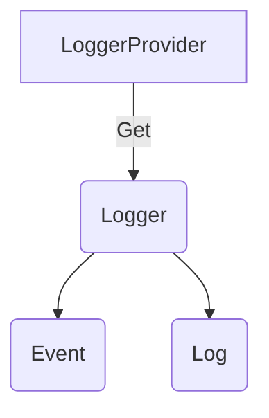

# Events and Logs API Interface

**Status**: [Experimental](../document-status.md)

Table of Contents

<!-- Re-generate TOC with `markdown-toc --no-first-h1 -i` -->

<!-- toc -->

- [Data Model](#data-model)
- [LoggerProvider](#loggerprovider)
  * [LoggerProvider operations](#loggerprovider-operations)
    + [Get a Logger](#get-a-logger)
- [Logger](#logger)
  * [Logger operations](#logger-operations)

<!-- tocstop -->

The Events and Logs API consist of these main classes:

* LoggerProvider is the entry point of the API. It provides access to Loggers.
* Logger is the class responsible for creating events and logs using Log records.

LoggerProvider/Logger are analogous to TracerProvider/Tracer.

## Data Model

The API creates Events and Logs using the `LogRecord` data model. See `LogRecord` [data model](data-model.md) for the list of fields.

## LoggerProvider

`Logger`s can be accessed with a `LoggerProvider`.

In implementations of the API, the LoggerProvider is expected to be the stateful
object that holds any configuration.

Normally, the LoggerProvider is expected to be accessed from a central place.
Thus, the API SHOULD provide a way to set/register and access a global default
LoggerProvider.

Notwithstanding any global LoggerProvider, some applications may want to or have
to use multiple LoggerProvider instances, e.g. to have different configuration
(like LogProcessors) for each (and consequently for the Loggers obtained
from them), or because it's easier with dependency injection frameworks. Thus,
implementations of LoggerProvider SHOULD allow creating an arbitrary number of
instances.

### LoggerProvider operations

The LoggerProvider MUST provide the following functions:

* Get a Logger

#### Get a Logger

This API MUST accept the following parameters:

- `name` (required): This name SHOULD uniquely identify the [instrumentation scope](../glossary.md#instrumentation-scope),
such as the [instrumentation library](../glossary.md#instrumentation-library)
(e.g. `io.opentelemetry.contrib.mongodb`), package, module or class name.
If an application or library has built-in OpenTelemetry instrumentation, both
[Instrumented library](../glossary.md#instrumented-library) and
[Instrumentation library](../glossary.md#instrumentation-library) may refer to
the same library. In that scenario, the `name` denotes a module name or component
name within that library or application. In case an invalid name
(null or empty string) is specified, a working Logger implementation MUST be
returned as a fallback rather than returning null or throwing an exception, its
`name` property SHOULD be set to an empty string, and a message reporting that
the specified value is invalid SHOULD be logged. A library implementing the
OpenTelemetry API may also ignore this name and return a default instance for
all calls, if it does not support "named" functionality (e.g. an implementation
which is not even observability-related). A LoggerProvider could also return a
no-op Logger here if application owners configure the SDK to suppress telemetry
produced by this library.
- `version` (optional): Specifies the version of the instrumentation scope if
the scope has a version (e.g. a library version). Example value: 1.0.0.
- `schema_url` (optional): Specifies the Schema URL that should be recorded in
the emitted telemetry.
- `event_domain` (optional): Specifies the domain for the events created, which
should be added as `event.domain` attribute of the instrumentation scope.
- `include_trace_context` (optional): Specifies whether the Trace Context should
automatically be passed on to the events and logs created by the Logger. This
SHOULD be true by default.
- `attributes` (optional): Specifies the instrumentation scope attributes to
associate with emitted telemetry.

Implementations MUST return different `Logger` instances when called repeatedly
with different values of parameters. Note that always returning a new `Logger`
instance is a valid implementation. The only exception to this rule is the no-op
`Logger`: implementations MAY return the same instance regardless of parameter
values.

Implementations MUST NOT require users to repeatedly obtain an Logger again with
the same name+version+schema_url+event_domain+include_trace_context+attributes
to pick up configuration changes. This can be achieved either by allowing to
work with an outdated configuration or by ensuring that new configuration
applies also to previously returned Loggers.

Note: This could, for example, be implemented by storing any mutable
configuration in the `LoggerProvider` and having `Logger` implementation objects
have a reference to the `LoggerProvider` from which they were obtained.
If configuration must be stored per-Logger (such as disabling a certain `Logger`),
the `Logger` could, for example, do a look-up with its name+version+schema_url+event_domain+include_trace_context+attributes
in a map in the `LoggerProvider`, or the `LoggerProvider` could maintain a registry
of all returned `Logger`s and actively update their configuration if it changes.

The effect of associating a Schema URL with a `Logger` MUST be that the telemetry
emitted using the `Logger` will be associated with the Schema URL, provided that
the emitted data format is capable of representing such association.

## Logger

The `Logger` is responsible for creating Events and Logs.

Note that `Logger`s should not be responsible for configuration. This should be
the responsibility of the `LoggerProvider` instead.

### Logger operations

The Logger MUST provide functions to:

- Create a `LogRecord`, representing an `Event` and emit it to the processing
pipeline.
  - The API MUST accept an event name as a parameter. The event name provided
  should be recorded as an attribute with key `event.name`. Care MUST be taken
  by the implementation to not override or delete this attribute while the
  `Event` is created to preserve its identity.
  - Events require the `event.domain` attribute. The API MUST not allow creating
  an event if the Logger instance doesn't have `event.domain` scope attribute.
  - This function MAY be named `logEvent`.
- Create a `LogRecord` and emit it to the processing pipeline.
  - This function MAY be named `logRecord`.
  - This API is intended for use by Log Appenders, and SHOULD not be used by end
  users or other instrumentation.
