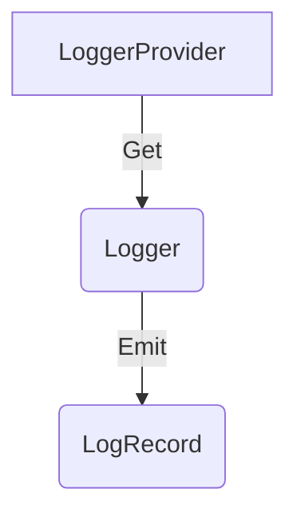

<!--- Hugo front matter used to generate the website version of this page:
linkTitle: API
aliases: [bridge-api]
--->

# Logs API

**Status**: [Stable](../document-status.md), except where otherwise specified

Table of Contents

<!-- Re-generate TOC with `markdown-toc --no-first-h1 -i` -->

<!-- toc -->

- [LoggerProvider](#loggerprovider)
  * [LoggerProvider operations](#loggerprovider-operations)
    + [Get a Logger](#get-a-logger)
- [Logger](#logger)
  * [Log Bridge operations](#log-bridge-operations)
    + [Emit a LogRecord](#emit-a-logrecord)
    + [Enabled](#enabled)
  * [Log Instrumentation operations](#log-instrumentation-operations)
    + [Emit an Event](#emit-an-event)
- [Optional and required parameters](#optional-and-required-parameters)
- [Concurrency requirements](#concurrency-requirements)
- [References](#references)

<!-- tocstop -->

<b>Note: this document defines a log *backend* API. The API is not intended
to be called by application developers directly. It is provided for logging
library authors to build
[log appenders](./supplementary-guidelines.md#how-to-create-a-log4j-log-appender),
which use this API to bridge between existing logging libraries and the
OpenTelemetry log data model.</b>

The Logs API consist of these main components:

* [LoggerProvider](#loggerprovider) is the entry point of the API. It provides access to `Logger`s.
* [Logger](#logger) is responsible for emitting logs as
  [LogRecords](./data-model.md#log-and-event-record-definition).

## LoggerProvider

`Logger`s can be accessed with a `LoggerProvider`.

Normally, the `LoggerProvider` is expected to be accessed from a central place.
Thus, the API SHOULD provide a way to set/register and access a global default
`LoggerProvider`.

### LoggerProvider operations

The `LoggerProvider` MUST provide the following functions:

* Get a `Logger`

#### Get a Logger

This API MUST accept the following [instrumentation scope](data-model.md#field-instrumentationscope)
parameters:

* `name`: Specifies the name of the [instrumentation scope](../glossary.md#instrumentation-scope),
  such as the [instrumentation library](../glossary.md#instrumentation-library)
  (e.g. `io.opentelemetry.contrib.mongodb`), package, module or class name.
  If an application or library has built-in OpenTelemetry instrumentation, both
  [Instrumented library](../glossary.md#instrumented-library) and
  [Instrumentation library](../glossary.md#instrumentation-library) may refer to
  the same library. In that scenario, the `name` denotes a module name or component
  name within that library or application.
  For log sources which define a logger name (e.g. Java
  [Logger Name](https://docs.oracle.com/javase/7/docs/api/java/util/logging/Logger.html#getLogger(java.lang.String)))
  the Logger Name should be recorded as the instrumentation scope name.

* `version` (optional): Specifies the version of the instrumentation scope if
  the scope has a version (e.g. a library version). Example value: 1.0.0.

* `schema_url` (optional): Specifies the Schema URL that should be recorded in
  the emitted telemetry.

* `attributes` (optional): Specifies the instrumentation scope attributes to
  associate with emitted telemetry. This API MUST be structured to accept a
  variable number of attributes, including none.

The term *identical* applied to `Logger`s describes instances where all
parameters are equal. The term *distinct* applied to `Logger`s describes
instances where at least one parameter has a different value.

## Logger

The `Logger` is responsible for emitting `LogRecord`s. There are two types of
logging operations:

* **Log Bridge** operations to be used when receiving data from other logging
  libraries.
* **Log Instrumentation** operations to be used when writing instrumentation
  for OpenTelemetry.

The Logger contains methods for both types of operations. The `Logger` MUST
provide a function to:

- [Emit a `LogRecord`](#emit-a-logrecord)

The `Logger` SHOULD provide functions to:

- [Emit an `Event`](#emit-an-event)
- [Report if `Logger` is `Enabled`](#enabled)

### Log Bridge operations

Log Bridge operations are not intended to be used for writing instrumentation,
and SHOULD include documentation that discourages this use.

#### Emit a LogRecord

The effect of calling this API is to emit a `LogRecord` to the processing pipeline.

The API MUST accept the following parameters:

- [Timestamp](./data-model.md#field-timestamp) (optional)
- [Observed Timestamp](./data-model.md#field-observedtimestamp) (optional). If unspecified the
  implementation SHOULD set it equal to the current time.
- The [Context](../context/README.md) associated with the `LogRecord`.
  When implicit Context is supported, then this parameter SHOULD be optional and
  if unspecified then MUST use current Context.
  When only explicit Context is supported, this parameter SHOULD be required.
- [Severity Number](./data-model.md#field-severitynumber) (optional)
- [Severity Text](./data-model.md#field-severitytext) (optional)
- [Body](./data-model.md#field-body) (optional)
- [Attributes](./data-model.md#field-attributes) (optional)

##### Event Name

**Status**: [Development](../document-status.md)

[Event Name](./data-model.md#event-name) is an optional parameter to [`Emit a LogRecord`](#emit-a-logrecord).

#### Enabled

**Status**: [Development](../document-status.md)

To help users avoid performing computationally expensive operations when
generating a `LogRecord`, a `Logger` SHOULD provide this `Enabled` API.

The API SHOULD accept the following parameters:

- The [Context](../context/README.md) to be associated with the `LogRecord`.
  When implicit Context is supported, then this parameter SHOULD be optional and
  if unspecified then MUST use current Context.
  When only explicit Context is supported, accepting this parameter is REQUIRED.
- [Severity Number](./data-model.md#field-severitynumber) (optional)

This API MUST return a language idiomatic boolean type. A returned value of
`true` means the `Logger` is enabled for the provided arguments, and a returned
value of `false` means the `Logger` is disabled for the provided arguments.

The returned value is not always static, it can change over time. The API
SHOULD be documented that instrumentation authors needs to call this API each
time they [emit a LogRecord](#emit-a-logrecord) to ensure they have the most
up-to-date response.

### Log Instrumentation operations

#### Emit an Event

**Status**: [Development](../document-status.md)

The effect of calling this API is to emit a `LogRecord` to the processing pipeline
formatted as an [event](./data-model.md#events).

**Parameters:**

* [Event Name](./data-model.md#event-name) (required)
* [Timestamp](./data-model.md#field-timestamp) (optional)
* [Observed Timestamp](./data-model.md#field-observedtimestamp) (optional). If unspecified
  the implementation SHOULD set it equal to the current time.
* The [Context](../context/README.md) associated with the `Event`. When implicit
  Context is supported, then this parameter SHOULD be optional and if unspecified
  then MUST use current Context. When only explicit Context is supported, this parameter
  SHOULD be required.
* [Severity Number](./data-model.md#field-severitynumber) (optional)
* [Severity Text](./data-model.md#field-severitytext) (optional)
* [Body](./data-model.md#field-body) (optional)
* [Attributes](./data-model.md#field-attributes) (optional) Event `Attributes` conform
  to the [standard definition](../common/README.md#standard-attribute) of an attribute.

## Optional and required parameters

The operations defined include various parameters, some of which are marked
optional. Parameters not marked optional are required.

For each optional parameter, the API MUST be structured to accept it, but MUST
NOT obligate a user to provide it.

For each required parameter, the API MUST be structured to obligate a user to
provide it.

## Concurrency requirements

For languages which support concurrent execution the Logs APIs provide
specific guarantees and safeties.

**LoggerProvider** - all methods are safe to be called concurrently.

**Logger** - all methods are safe to be called concurrently.

## References

- [OTEP0150 Logging Library SDK Prototype Specification](https://github.com/open-telemetry/oteps/blob/main/text/logs/0150-logging-library-sdk.md)
