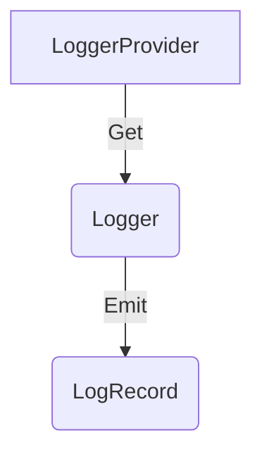

# Logs API

**Status**: [Stable](../document-status.md), except where otherwise specified

Table of Contents

<!-- Re-generate TOC with `markdown-toc --no-first-h1 -i` -->

<!-- toc -->

- [Overview](#overview)
- [LoggerProvider](#loggerprovider)
  * [LoggerProvider operations](#loggerprovider-operations)
    + [Get a Logger](#get-a-logger)
- [Logger](#logger)
  * [Logger operations](#logger-operations)
    + [Emit a LogRecord](#emit-a-logrecord)
    + [Enabled](#enabled)
- [Optional and required parameters](#optional-and-required-parameters)
- [Concurrency requirements](#concurrency-requirements)
- [References](#references)

<!-- tocstop -->

## Overview

This document defines a log *backend* API.

The API serves following use cases.

It is provided for instrumentation libraries to emit events (log records following
OpenTelemetry Semantic Conventions).

It is provided for logging library authors to build
[log appenders/bridges](./supplementary-guidelines.md#how-to-create-a-log4j-log-appender),
which use this API to bridge between existing logging libraries and the
OpenTelemetry log data model.

It is provided for application developers to emit structured log records
(e.g. custom events).

Languges MAY provide a separate Logs Bridge API if they need different
ergonomics for consumers that are building log appenders/bridges.

The Logs API consist of these main components:

* [LoggerProvider](#loggerprovider) is the entry point of the API. It provides access to `Logger`s.
* [Logger](#logger) is responsible for emitting logs as
  [LogRecords](./data-model.md#log-and-event-record-definition).

## LoggerProvider

`Logger`s can be accessed with a `LoggerProvider`.

Normally, the `LoggerProvider` is expected to be accessed from a central place.
Thus, the API SHOULD provide a way to set/register and access a global default
`LoggerProvider`.

### LoggerProvider operations

The `LoggerProvider` MUST provide the following functions:

* Get a `Logger`

#### Get a Logger

This API MUST accept the following [instrumentation scope](data-model.md#field-instrumentationscope)
parameters:

* `name`: Specifies the name of the [instrumentation scope](../glossary.md#instrumentation-scope),
  such as the [instrumentation library](../glossary.md#instrumentation-library)
  (e.g. `io.opentelemetry.contrib.mongodb`), package, module or class name.
  If an application or library has built-in OpenTelemetry instrumentation, both
  [Instrumented library](../glossary.md#instrumented-library) and
  [Instrumentation library](../glossary.md#instrumentation-library) may refer to
  the same library. In that scenario, the `name` denotes a module name or component
  name within that library or application.
  For log sources which define a logger name (e.g. Java
  [Logger Name](https://docs.oracle.com/javase/7/docs/api/java/util/logging/Logger.html#getLogger(java.lang.String)))
  the Logger Name should be recorded as the instrumentation scope name.

* `version` (optional): Specifies the version of the instrumentation scope if
  the scope has a version (e.g. a library version). Example value: 1.0.0.

* `schema_url` (optional): Specifies the Schema URL that should be recorded in
  the emitted telemetry.

* `attributes` (optional): Specifies the instrumentation scope attributes to
  associate with emitted telemetry. This API MUST be structured to accept a
  variable number of attributes, including none.

The term *identical* applied to `Logger`s describes instances where all
parameters are equal. The term *distinct* applied to `Logger`s describes
instances where at least one parameter has a different value.

## Logger

The `Logger` is responsible for emitting `LogRecord`s.

### Logger operations

The `Logger` MUST provide functions to:

- [Emit a `LogRecord`](#emit-a-logrecord)

The `Logger` SHOULD provide functions to:

- [Report if `Logger` is `Enabled`](#enabled)

#### Emit a LogRecord

The effect of calling this API is to emit a `LogRecord` to the processing pipeline.

The API MUST accept the following parameters:

- [Timestamp](./data-model.md#field-timestamp) (optional)
- [Observed Timestamp](./data-model.md#field-observedtimestamp) (optional). If unspecified the
  implementation SHOULD set it equal to the current time.
- The [Context](../context/README.md) associated with the `LogRecord`.
  When implicit Context is supported, then this parameter SHOULD be optional and
  if unspecified then MUST use current Context.
  When only explicit Context is supported, this parameter SHOULD be required.
- [Severity Number](./data-model.md#field-severitynumber) (optional)
- [Severity Text](./data-model.md#field-severitytext) (optional)
- [Body](./data-model.md#field-body) (optional)
- [Attributes](./data-model.md#field-attributes) (optional)

#### Enabled

**Status**: [Development](../document-status.md)

To help users avoid performing computationally expensive operations when
generating a `LogRecord`, a `Logger` SHOULD provide this `Enabled` API.

The API SHOULD accept the following parameters:

- The [Context](../context/README.md) to be associated with the `LogRecord`.
  When implicit Context is supported, then this parameter SHOULD be optional and
  if unspecified then MUST use current Context.
  When only explicit Context is supported, accepting this parameter is REQUIRED.
- [Severity Number](./data-model.md#field-severitynumber) (optional)

Additional optional parameters can be added in the future, therefore,
the API MUST be structured in a way for these parameters to be added.

It SHOULD be possible to distinguish between an unspecified parameter value from
a parameter value set explicitly to a valid default value of given type
(e.g. distinguish unspecified attributes for empty attributes). The exception
from this rule is when the default value of given type is not seen as a valid
value like 0 for [Severity Number](./data-model.md#field-severitynumber).

This API MUST return a language idiomatic boolean type. A returned value of
`true` means the `Logger` is enabled for the provided arguments, and a returned
value of `false` means the `Logger` is disabled for the provided arguments.

The returned value is not always static, it can change over time. The API
SHOULD be documented that instrumentation authors needs to call this API each
time they [emit a LogRecord](#emit-a-logrecord) to ensure they have the most
up-to-date response.

## Optional and required parameters

The operations defined include various parameters, some of which are marked
optional. Parameters not marked optional are required.

For each optional parameter, the API MUST be structured to accept it, but MUST
NOT obligate a user to provide it.

For each required parameter, the API MUST be structured to obligate a user to
provide it.

## Concurrency requirements

For languages which support concurrent execution the Logs APIs provide
specific guarantees and safeties.

**LoggerProvider** - all methods are safe to be called concurrently.

**Logger** - all methods are safe to be called concurrently.

## References

- [OTEP0150 Logging Library SDK Prototype Specification](https://github.com/open-telemetry/oteps/blob/main/text/logs/0150-logging-library-sdk.md)
