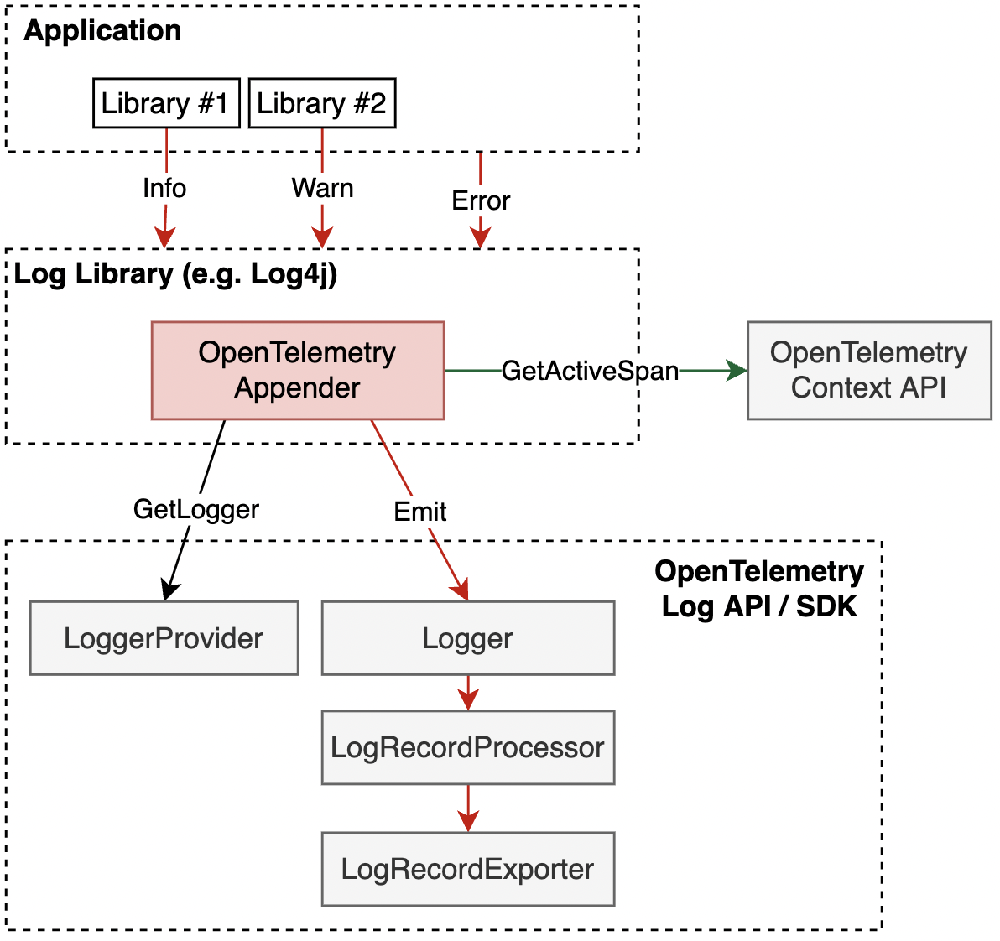

# Events and Logs API Interface

**Status**: [Experimental](../document-status.md)

Table of Contents

<!-- Re-generate TOC with `markdown-toc --no-first-h1 -i` -->

<!-- toc -->

- [LoggerProvider](#loggerprovider)
  * [LoggerProvider operations](#loggerprovider-operations)
    + [Get a Logger](#get-a-logger)
- [Logger](#logger)
  * [Logger operations](#logger-operations)
    + [Emit Event](#emit-event)
    + [Emit LogRecord](#emit-logrecord)
- [LogRecord](#logrecord)
- [Usage](#usage)
  * [How to Create Log4J Style Appender](#how-to-create-log4j-style-appender)
  * [Implicit Context Injection](#implicit-context-injection)
  * [Explicit Context Injection](#explicit-context-injection)

<!-- tocstop -->

The Events and Logs API consist of these main classes:

* LoggerProvider is the entry point of the API. It provides access to Loggers.
* Logger is the class responsible for
  creating [Events](./semantic_conventions/events.md)
  and [Logs](./data-model.md#log-and-event-record-definition) as LogRecords.

LoggerProvider/Logger are analogous to TracerProvider/Tracer.

## LoggerProvider

`Logger`s can be accessed with a `LoggerProvider`.

In implementations of the API, the LoggerProvider is expected to be the stateful
object that holds any configuration.

Normally, the LoggerProvider is expected to be accessed from a central place.
Thus, the API SHOULD provide a way to set/register and access a global default
LoggerProvider.

Notwithstanding any global LoggerProvider, some applications may want to or have
to use multiple LoggerProvider instances, e.g. to have different configuration
(like [LogRecordProcessors](sdk.md#logrecordprocessor)) for each (and
consequently for the Loggers obtained from them), or because it's easier with
dependency injection frameworks. Thus, implementations of LoggerProvider SHOULD
allow creating an arbitrary number of instances.

### LoggerProvider operations

The LoggerProvider MUST provide the following functions:

* Get a Logger

#### Get a Logger

This API MUST accept the following parameters:

- `name` (required): This name SHOULD uniquely identify the [instrumentation scope](../glossary.md#instrumentation-scope),
such as the [instrumentation library](../glossary.md#instrumentation-library)
(e.g. `io.opentelemetry.contrib.mongodb`), package, module or class name.
If an application or library has built-in OpenTelemetry instrumentation, both
[Instrumented library](../glossary.md#instrumented-library) and
[Instrumentation library](../glossary.md#instrumentation-library) may refer to
the same library. In that scenario, the `name` denotes a module name or component
name within that library or application. In case an invalid name
(null or empty string) is specified, a working Logger implementation MUST be
returned as a fallback rather than returning null or throwing an exception, its
`name` property SHOULD be set to an empty string, and a message reporting that
the specified value is invalid SHOULD be logged. A library implementing the
OpenTelemetry API may also ignore this name and return a default instance for
all calls, if it does not support "named" functionality (e.g. an implementation
which is not even observability-related). A LoggerProvider could also return a
no-op Logger here if application owners configure the SDK to suppress telemetry
produced by this library.
- `version` (optional): Specifies the version of the instrumentation scope if
the scope has a version (e.g. a library version). Example value: 1.0.0.
- `schema_url` (optional): Specifies the Schema URL that should be recorded in
the emitted telemetry.
- `event_domain` (optional): Specifies the domain for the Events emitted, which
  MUST be added as an attribute with the key `event.domain`
  to [emitted Events](#emit-event).
- `include_trace_context` (optional): Specifies whether the Trace Context should
automatically be passed on to the Events and Logs emitted by the Logger. This
SHOULD be true by default.
- `attributes` (optional): Specifies the instrumentation scope attributes to
associate with emitted telemetry.

Loggers are identified by `name`, `version`, and `schema_url` fields.  When more
than one `Logger` of the same `name`, `version`, and `schema_url` is created, it
is unspecified whether or under which conditions the same or different `Logger`
instances are returned. It is a user error to create Loggers with different
attributes but the same identity.

The term *identical* applied to Loggers describes instances where all
identifying fields are equal. The term *distinct* applied to Loggers describes
instances where at least one identifying field has a different value.

Implementations MUST NOT require users to repeatedly obtain a Logger again with
the same name+version+schema_url+event_domain+include_trace_context+attributes
to pick up configuration changes. This can be achieved either by allowing to
work with an outdated configuration or by ensuring that new configuration
applies also to previously returned Loggers.

Note: This could, for example, be implemented by storing any mutable
configuration in the `LoggerProvider` and having `Logger` implementation objects
have a reference to the `LoggerProvider` from which they were obtained.
If configuration must be stored per-Logger (such as disabling a certain `Logger`),
the `Logger` could, for example, do a look-up with its name+version+schema_url+event_domain+include_trace_context+attributes
in a map in the `LoggerProvider`, or the `LoggerProvider` could maintain a registry
of all returned `Logger`s and actively update their configuration if it changes.

The effect of associating a Schema URL with a `Logger` MUST be that the telemetry
emitted using the `Logger` will be associated with the Schema URL, provided that
the emitted data format is capable of representing such association.

## Logger

The `Logger` is responsible for emitting Events and Logs.

Note that `Logger`s should not be responsible for configuration. This should be
the responsibility of the `LoggerProvider` instead.

### Logger operations

The Logger MUST provide functions to:

#### Emit Event

Emit a `LogRecord` representing an Event to the processing pipeline.

This function MAY be named `logEvent`.

**Parameters:**

* `name` - the Event name. This argument MUST be recorded as a `LogRecord`
  attribute with the key `event.name`. Care MUST be taken by the implementation
  to not override or delete this attribute while the Event is emitted to
  preserve its identity.
* `logRecord` - the [LogRecord](#logrecord) representing the Event.

Events require the `event.domain` attribute. The API MUST not allow creating an
Event if `event_domain` was not specified when
the [Logger was obtained](#get-a-logger).

#### Emit LogRecord

Emit a `LogRecord` to the processing pipeline.

This function MAY be named `logRecord`.

This API is intended for use
by [Log Appenders](#how-to-create-log4j-style-appender), and SHOULD not be used
by end users or other instrumentation.

**Parameters:**

* `logRecord` - the [LogRecord](#logrecord).

## LogRecord

The API emits [Events](#emit-event) and [LogRecords](#emit-logrecord) using
the `LogRecord` [data model](data-model.md).

A function receiving this as an argument MUST be able to set the following
fields:

- [Timestamp](./data-model.md#field-timestamp)
- [Observed Timestamp](./data-model.md#field-observedtimestamp)
- [Context](../context/README.md)
  including [TraceContext](./data-model.md#trace-context-fields)
- [Severity Number](./data-model.md#field-severitynumber)
- [Severity Text](./data-model.md#field-severitytext)
- [Body](./data-model.md#field-body)
- [Attributes](./data-model.md#field-attributes)

## Usage

### How to Create Log4J Style Appender

An Appender implementation can be used to allow emitting logs via
OpenTelemetry [LogRecordExporters](sdk.md#logrecordexporter). This approach is
typically used for applications which are fine with changing the log transport
and is [one of the supported](README.md#direct-to-collector) log collection
approaches.

The Appender implementation will typically acquire a [Logger](#logger) from the
global [LoggerProvider](#loggerprovider) at startup time, then
call [Emit LogRecord](#emit-logrecord) for `LogRecords` received from the
application.

[Implicit Context Injection](#implicit-context-injection)
and [Explicit Context Injection](#explicit-context-injection) describe how an
Appender injects `TraceContext` into `LogRecords`.

This same approach can be also used for example for:

- Python logging library by creating a Handler.
- Go zap logging library by implementing the Core interface. Note that since
  there is no implicit Context in Go it is not possible to get and use the
  active Span.

Appenders can be created in OpenTelemetry language libraries by OpenTelemetry
maintainers, or by 3rd parties for any logging library that supports a similar
extension mechanism. This specification recommends each OpenTelemetry language
library to include out-of-the-box Appender implementation for at least one
popular logging library.

### Implicit Context Injection

When Context is implicitly available (e.g. in Java) the log library extension
can rely on automatic context propagation
by [obtaining a Logger](#get-a-logger) with `include_trace_context=true`.

Some log libraries have mechanism specifically tailored for injecting contextual
information into logs, such as MDC in Log4j. When available such mechanisms may
be the preferable place to fetch the `TraceContext` and inject it into
the `LogRecord`, since it usually allows fetching of the context to work
correctly even when log records are emitted asynchronously which otherwise can
result in the incorrect implicit context being fetched.

TODO: clarify how works or doesn't work when the log statement call site and the
log appender are executed on different threads.

### Explicit Context Injection

In languages where the Context must be provided explicitly (e.g. Go) the end
user must capture the context and explicitly pass it to the logging subsystem in
order for `TraceContext` to be recorded in `LogRecords`

Support for OpenTelemetry for logging libraries in these languages typically can
be implemented in the form of logger wrappers that can capture the context once,
when the span is created and then use the wrapped logger to execute log
statements in a normal way. The wrapper will be responsible for injecting the
captured context in the `LogRecords`.

This specification does not define how exactly it is achieved since the actual
mechanism depends on the language and the particular logging library used. In
any case the wrappers are expected to make use of the Trace Context API to get
the current active span.

See
[an example](https://docs.google.com/document/d/15vR7D1x2tKd7u3zaTF0yH1WaHkUr2T4hhr7OyiZgmBg/edit#heading=h.4xuru5ljcups)
of how it can be done for zap logging library for Go.
