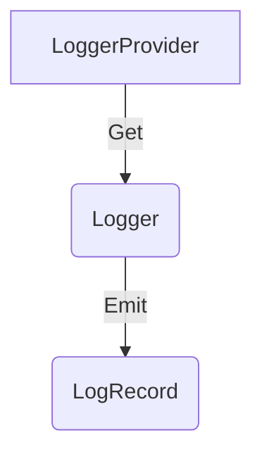

# Logs Bridge API

**Status**: [Stable](../document-status.md)

Table of Contents

<!-- Re-generate TOC with `markdown-toc --no-first-h1 -i` -->

<!-- toc -->

- [LoggerProvider](#loggerprovider)
  * [LoggerProvider operations](#loggerprovider-operations)
    + [Get a Logger](#get-a-logger)
- [Logger](#logger)
  * [Logger operations](#logger-operations)
    + [Emit a LogRecord](#emit-a-logrecord)
    + [Enabled](#enabled)
- [Optional and required parameters](#optional-and-required-parameters)
- [Concurrency requirements](#concurrency-requirements)
- [Artifact Naming](#artifact-naming)
- [References](#references)

<!-- tocstop -->

<b>Note: this document defines a log *backend* API. The API is not intended
to be called by application developers directly. It is provided for logging
library authors to build
[log appenders](./supplementary-guidelines.md#how-to-create-a-log4j-log-appender),
which use this API to bridge between existing logging libraries and the
OpenTelemetry log data model.</b>

The Logs Bridge API consist of these main components:

* [LoggerProvider](#loggerprovider) is the entry point of the API. It provides access to `Logger`s.
* [Logger](#logger) is responsible for emitting logs as
  [LogRecords](./data-model.md#log-and-event-record-definition).

## LoggerProvider

`Logger`s can be accessed with a `LoggerProvider`.

Normally, the `LoggerProvider` is expected to be accessed from a central place.
Thus, the API SHOULD provide a way to set/register and access a global default
`LoggerProvider`.

### LoggerProvider operations

The `LoggerProvider` MUST provide the following functions:

* Get a `Logger`

#### Get a Logger

This API MUST accept the following [instrumentation scope](data-model.md#field-instrumentationscope)
parameters:

* `name`: This name uniquely identifies the [instrumentation scope](../glossary.md#instrumentation-scope),
  such as the [instrumentation library](../glossary.md#instrumentation-library)
  (e.g. `io.opentelemetry.contrib.mongodb`), package, module or class name.
  If an application or library has built-in OpenTelemetry instrumentation, both
  [Instrumented library](../glossary.md#instrumented-library) and
  [Instrumentation library](../glossary.md#instrumentation-library) may refer to
  the same library. In that scenario, the `name` denotes a module name or component
  name within that library or application.
  For log sources which define a logger name (e.g. Java
  [Logger Name](https://docs.oracle.com/javase/7/docs/api/java/util/logging/Logger.html#getLogger(java.lang.String)))
  the Logger Name should be recorded as the instrumentation scope name.

* `version` (optional): Specifies the version of the instrumentation scope if
  the scope has a version (e.g. a library version). Example value: 1.0.0.

* `schema_url` (optional): Specifies the Schema URL that should be recorded in
  the emitted telemetry.

* `attributes` (optional): Specifies the instrumentation scope attributes to
  associate with emitted telemetry. This API MUST be structured to accept a
  variable number of attributes, including none.

`Logger`s are identified by `name`, `version`, and `schema_url` fields.  When more
than one `Logger` of the same `name`, `version`, and `schema_url` is created, it
is unspecified whether or under which conditions the same or different `Logger`
instances are returned. It is a user error to create Loggers with different
`attributes` but the same identity.

The term *identical* applied to `Logger`s describes instances where all
identifying fields are equal. The term *distinct* applied to `Logger`s describes
instances where at least one identifying field has a different value.

The effect of associating a Schema URL with a `Logger` MUST be that the telemetry
emitted using the `Logger` will be associated with the Schema URL, provided that
the emitted data format is capable of representing such association.

## Logger

The `Logger` is responsible for emitting `LogRecord`s.

### Logger operations

The `Logger` MUST provide functions to:

- Emit a `LogRecord`

The `Logger` SHOULD provide functions to:

- Report if `Enabled` for a `LogRecord`

#### Emit a LogRecord

The effect of calling this API is to emit a `LogRecord` to the processing pipeline.

The API MUST accept the following parameters:

- [Timestamp](./data-model.md#field-timestamp)
- [Observed Timestamp](./data-model.md#field-observedtimestamp). If unspecified the
  implementation SHOULD set it equal to the current time.
- The [Context](../context/README.md) associated with the `LogRecord`. The API
  MAY implicitly use the current Context as a default
  behavior.
- [Severity Number](./data-model.md#field-severitynumber)
- [Severity Text](./data-model.md#field-severitytext)
- [Body](./data-model.md#field-body)
- [Attributes](./data-model.md#field-attributes)

All parameters are optional.

#### Enabled

To help users avoid performing computationally expensive operations when
generating a `LogRecord`, a `Logger` SHOULD provide this `Enabled` API.

At a minimum, the API MUST accept the following parameters:

- [Context](../context/README.md) (optional): This is the Context associated
  with the `LogRecord`. The API MAY implicitly use the current Context as a
  default behavior.
- [Severity Number](./data-model.md#field-severitynumber)

Users of a language implementation community can have specific needs when using
this API. Therefore, additional parameters MAY be accepted.

This API MUST return a language idiomatic boolean type.

The returned value MUST be `true` when logging is enabled for the provided
arguments. The returned value can be `true` or `false` when logging is disabled
for the provided arguments. The ambiguity when disabled allows implementation
that want to optimize memory or handle indeterminable states the flexibility
they need. If an implementation does not need this flexibility, it SHOULD
return `false` when logging is disabled for the provided arguments.

## Optional and required parameters

The operations defined include various parameters, some of which are marked
optional. Parameters not marked optional are required.

For each optional parameter, the API MUST be structured to accept it, but MUST
NOT obligate a user to provide it.

For each required parameter, the API MUST be structured to obligate a user to
provide it.

## Concurrency requirements

For languages which support concurrent execution the Logs Bridge APIs provide
specific guarantees and safeties.

**LoggerProvider** - all methods are safe to be called concurrently.

**Logger** - all methods are safe to be called concurrently.

## Artifact Naming

The Logs Bridge API is not intended to be called by application developers
directly, and SHOULD include documentation that discourages direct use. However,
in the event OpenTelemetry were to add a user facing API, the Logs Bridge API would
be a natural starting point. Therefore, Log Bridge API artifact, package, and class
names MUST NOT include the terms "bridge", "appender", or any other qualifier
that would prevent evolution into a user facing API.

## References

- [OTEP0150 Logging Library SDK Prototype Specification](https://github.com/open-telemetry/oteps/blob/main/text/logs/0150-logging-library-sdk.md)
