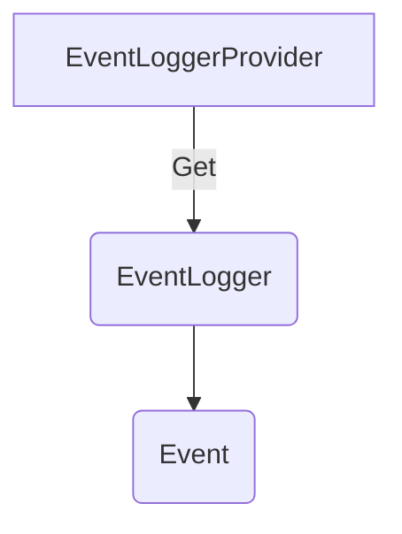

# Events API Interface

**Status**: [Experimental](../document-status.md)

Table of Contents

<!-- Re-generate TOC with `markdown-toc --no-first-h1 -i` -->

<!-- toc -->

- [Overview](#overview)
- [EventLogger](#eventlogger)
  * [EventLogger Operations](#eventlogger-operations)
    + [Create EventLogger](#create-eventlogger)
    + [Emit Event](#emit-event)

<!-- tocstop -->

## Overview

Wikipedia’s [definition of log file](https://en.wikipedia.org/wiki/Log_file):

>In computing, a log file is a file that records either events that occur in an
>operating system or other software runs.

From OpenTelemetry's perspective LogRecords and Events are both represented
using the same [data model](./data-model.md).

However, OpenTelemetry does recognize a subtle semantic difference between
LogRecords and Events: Events are LogRecords which have a `name` and `domain`.
Within a particular `domain`, the `name` uniquely defines a particular class or
type of event. Events with the same `domain` / `name` follow the same schema
which assists in analysis in observability platforms. Events are described in
more detail in the [semantic conventions](./semantic_conventions/events.md).

While the logging space has a diverse legacy with many existing logging
libraries in different languages, there is not ubiquitous alignment with
OpenTelemetry events. In some logging libraries, producing records shaped as
OpenTelemetry events is clunky or error-prone.

The Event API offers convenience methods
for [emitting LogRecords](./bridge-api.md#emit-logrecord) that conform
to the [semantic conventions for Events](./semantic_conventions/events.md).
Unlike the [Logs Bridge API](./bridge-api.md), application developers and
instrumentation authors are encouraged to call this API directly.

The Event API consist of these main classes:

* EventLoggerProvider is the entry point of the API. It provides access to Loggers.
* EventLogger is the class responsible for
  emitting [Events](./data-model.md#log-and-event-record-definition) as
  LogRecords.

EventLoggerProvider/EventLogger are analogous to TracerProvider/Tracer.

## EventLoggerProvider

`EventLogger`s can be accessed with a `EventLoggerProvider`.

In implementations of the API, the EventLoggerProvider is expected to be the stateful
object that holds any configuration.

Normally, the EventLoggerProvider is expected to be accessed from a central place.
Thus, the API SHOULD provide a way to set/register and access a global default
EventLoggerProvider.

Notwithstanding any global EventLoggerProvider, some applications may want to or have
to use multiple EventLoggerProvider instances, e.g. to have different configuration
(like [LogRecordProcessors](sdk.md#logrecordprocessor)) for each (and
consequently for the EventLoggers obtained from them), or because it's easier with
dependency injection frameworks. Thus, implementations of EventLoggerProvider SHOULD
allow creating an arbitrary number of instances.

### EventLoggerProvider operations

The EventLoggerProvider MUST provide the following functions:

* Get an EventLogger

#### Get a EventLogger

This API MUST accept the following parameters:

- `name` (required): This name SHOULD uniquely identify the [instrumentation scope](../glossary.md#instrumentation-scope),
such as the [instrumentation library](../glossary.md#instrumentation-library)
(e.g. `io.opentelemetry.contrib.mongodb`), package, module or class name.
If an application or library has built-in OpenTelemetry instrumentation, both
[Instrumented library](../glossary.md#instrumented-library) and
[Instrumentation library](../glossary.md#instrumentation-library) may refer to
the same library. In that scenario, the `name` denotes a module name or component
name within that library or application. In case an invalid name
(null or empty string) is specified, a working Logger implementation MUST be
returned as a fallback rather than returning null or throwing an exception, its
`name` property SHOULD be set to an empty string, and a message reporting that
the specified value is invalid SHOULD be logged. A library implementing the
OpenTelemetry API may also ignore this name and return a default instance for
all calls, if it does not support "named" functionality (e.g. an implementation
which is not even observability-related). A LoggerProvider could also return a
no-op Logger here if application owners configure the SDK to suppress telemetry
produced by this library.
- `event_domain` (required): Specifies the domain of emitted events, used to set the `event.domain`
  attribute.
- `version` (optional): Specifies the version of the instrumentation scope if
the scope has a version (e.g. a library version). Example value: 1.0.0.
- `schema_url` (optional): Specifies the Schema URL that should be recorded in
the emitted telemetry.
- `include_trace_context` (optional): Specifies whether the Trace Context should
  automatically be passed on to the events emitted by the EventLogger. This
  SHOULD be true by default.
- `attributes` (optional): Specifies the instrumentation scope attributes to
associate with emitted telemetry.

EventLoggers are identified by `name`, `event_domain`, `version`, and `schema_url` fields.  When more
than one `Logger` of the same `name`, `event_domain`, `version`, and `schema_url` is created, it
is unspecified whether or under which conditions the same or different `EventLogger`
instances are returned. It is a user error to create EventLoggers with different
attributes but the same identity.

The term *identical* applied to EventLoggers describes instances where all
identifying fields are equal. The term *distinct* applied to EventLoggers describes
instances where at least one identifying field has a different value.

Implementations MUST NOT require users to repeatedly obtain an EventLogger again with
the same name+event_domain+version+schema_url+include_trace_context+attributes
to pick up configuration changes. This can be achieved either by allowing to
work with an outdated configuration or by ensuring that new configuration
applies also to previously returned EventLoggers.

Note: This could, for example, be implemented by storing any mutable
configuration in the `EventLoggerProvider` and having `EventLogger` implementation objects
have a reference to the `EventLoggerProvider` from which they were obtained.
If configuration must be stored per-EventLogger (such as disabling a certain `EventLogger`),
the `EventLogger` could, for example, do a look-up with its name+event_domain+version+schema_url+include_trace_context+attributes
in a map in the `EventLoggerProvider`, or the `EventLoggerProvider` could maintain a registry
of all returned `EventLogger`s and actively update their configuration if it changes.

The effect of associating a Schema URL with a `EventLogger` MUST be that the telemetry
emitted using the `EventLogger` will be associated with the Schema URL, provided that
the emitted data format is capable of representing such association.

## EventLogger

The `EventLogger` is responsible for emitting `Event`s as `LogRecord`s

Note that `EventLogger`s should not be responsible for configuration. This should be
the responsibility of the `EventLoggerProvider` instead.

### EventLogger Operations

The `EventLogger` MUST provide functions to:

#### Emit Event

Emit a `LogRecord` representing an `Event`.

This function MAY be named `logEvent`.

**Parameters:**

* `event_name` - the Event name. This argument MUST be recorded as a `LogRecord`
  attribute with the key `event.name`. Care MUST be taken by the implementation
  to not override or delete this attribute while the Event is emitted to
  preserve its identity.
* `event` - the [LogRecord](./api.md#logrecord) representing the Event.

**Implementation Requirements:**

The implementation MUST [emit](./api.md#emit-logrecord) the event `LogRecord` after
making the following changes:

* The `event_domain` specified
  when [creating the EventLogger](#create-eventlogger) MUST be set as
  the `event.domain` attribute on the `logRecord`.
* The `event_name` MUST be set as the `event.name` attribute on the `logRecord`.
