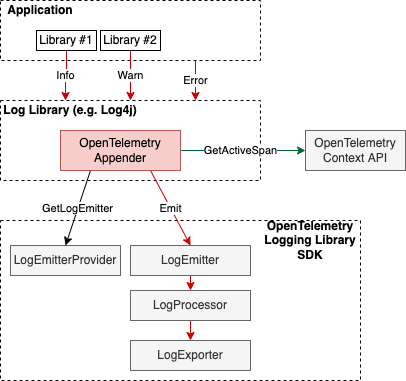
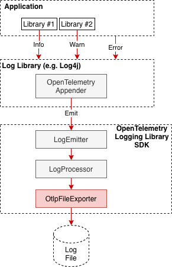
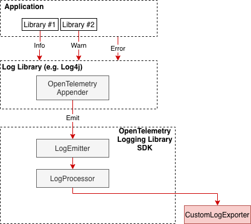

# Logging Library SDK Specification

**Status**: [Experimental](../document-status.md)

<!-- toc -->

- [Specification](#specification)
  * [LogEmitterProvider](#logemitterprovider)
    + [Get LogEmitter](#get-logemitter)
    + [Shutdown](#shutdown)
    + [ForceFlush](#forceflush)
  * [LogRecord Interfaces](#logrecord-interfaces)
    + [LogRecord](#logrecord)
    + [Readable LogRecord](#readable-logrecord)
    + [Read/write LogRecord](#readwrite-logrecord)
  * [LogEmitter](#logemitter)
    + [Emit](#emit)
  * [LogProcessor](#logprocessor)
    + [OnEmit](#onemit)
    + [ShutDown](#shutdown)
    + [ForceFlush](#forceflush-1)
  * [LogExporter](#logexporter)
    + [Export(batch)](#exportbatch)
    + [Shutdown](#shutdown-1)
    + [ForceFlush](#forceflush-2)
- [Usage](#usage)
  * [How to Create Log4J Style Appender](#how-to-create-log4j-style-appender)
  * [Logging to File](#logging-to-file)
  * [Logging Directly to OTLP Network Destination](#logging-directly-to-otlp-network-destination)
  * [Implicit Context Injection](#implicit-context-injection)
  * [Explicit Context](#explicit-context)
  * [Custom LogExporter](#custom-logexporter)
  * [Custom LogProcessor](#custom-logprocessor)

<!-- tocstop -->

This document contains the first cut from the
[OTEP0150](https://github.com/open-telemetry/oteps/blob/main/text/logs/0150-logging-library-sdk.md)

This specification defines how the OpenTelemetry Logging Library SDK exposes its
functionality to authors of extensions to language-specific 3rd party logging
libraries and to end users that want to produce logs in the
[OpenTelemetry manner](README.md).

The specification defines SDK elements that to some extent mirror the
OpenTelemetry [Trace SDK](../trace/sdk.md). This ensures uniformity and
consistency of the OpenTelemetry specification and of the implementations across
traces and logs. For additional clarity the definitions in this document refer
to the Trace analogs where appropriate.

## Specification

Many existing logging libraries have some sort of extension mechanism that
allows to customize how log records are encoded and delivered to their
destinations (for example Appender in Log4j or Core in zapcore). The
OpenTelemetry Logging Library SDK is intended to be used by such extensions to
emit logs in OpenTelemetry formats.

Note: The functionality that this document describes is an SDK package. A
logging-related API package may be added in the future if we decide to have an
end-user callable logging API. Until then the functions and methods callable
from this SDK package are intended to be used by Logging Libraries only and are
NOT intended to be used by the end user and will NOT be exposed in the
OpenTelemetry API package.

Logging Library SDK contains the following components:

### LogEmitterProvider

Methods:

#### Get LogEmitter

Accepts the following parameters: instrumentation scope name, optional version and
attributes. Returns a LogEmitter associated with the parameters.

Implementations MUST return different `LogEmitter` instances when called repeatedly
with different values of parameters. Note that always returning a new `LogEmitter` instance
is a valid implementation. The only exception to this rule is the no-op `LogEmitter`:
implementations MAY return the same instance regardless of parameter values.

It is unspecified whether or under which conditions the same or different
`LogEmitter` instances are returned from this functions when the same
(name,version,attributes) parameters are used.

#### Shutdown

TBD

#### ForceFlush

TBD

LogEmitterProvider can be configured at startup time, to be associated with a
Resource and with LogProcessor/LogExporter pipeline.

### LogRecord Interfaces

#### LogRecord

A function receiving this as an argument MUST be able to set the following
fields:

- [Timestamp](./data-model.md#field-timestamp)
- [Observed Timestamp](./data-model.md#field-observedtimestamp)
- [Trace Context](./data-model.md#trace-context-fields)
- [Severity Number](./data-model.md#field-severitynumber)
- [Severity Text](./data-model.md#field-severitytext)
- [Body](./data-model.md#field-body)
- [Attributes](./data-model.md#field-attributes)

#### Readable LogRecord

A function receiving this as an argument MUST be able to access all the
information added to [LogRecord](#logrecord). It MUST also be able to access
the [Instrumentation Scope](./data-model.md#field-instrumentationscope)
and [Resource](./data-model.md#field-resource) information (implicitly)
associated with the LogRecord.

Counts for attributes due to collection limits MUST be available for exporters
to report as described in the
[transformation to non-OTLP formats](../common/mapping-to-non-otlp.md#dropped-attributes-count)
specification.

Note: Typically this will be implemented with a new interface or (immutable)
value type. In some languages LogProcessors may have a different Readable
LogRecord type than exporters (e.g. a `LogData` type might contain an immutable
snapshot and a `ReadableLogRecord` interface might read information directly
from the same underlying data structure that the LogRecord interface
manipulates).

#### Read/write LogRecord

A function receiving this as an argument MUST have access to both the
full [LogRecord](#logrecord) and additionally MUST
be able to retrieve all information that was added to the LogRecord (as
with [Readable LogRecord](#readable-logrecord))

### LogEmitter

Methods:

#### Emit

Emits a log record to the SDK for processing.

It is expected that the caller will
populate [trace context](./data-model.md#trace-context-fields) if applicable
before making the call.

**Parameters:**

* `logRecord` - a [LogRecord](#logrecord).
  Note: some languages may opt to avoid having a LogRecord data type and instead
  use a more idiomatic builder pattern to prepare and emit a log record (see
  e.g.
  [Java discussion](https://github.com/open-telemetry/opentelemetry-java/pull/3759#discussion_r738019425)).

Open Question: do we need to also pass the Baggage so
that log processors and exporters can use it if they see the need (see
e.g.[Java issue](https://github.com/open-telemetry/opentelemetry-java/issues/4147)).

### LogProcessor

Plugin interface. Analog of SpanProcessor. Interface to hook into the [log record
emitting](#emit) action.

Built-in implementations: SimpleLogProcessor, BatchLogProcessor.

Methods:

#### OnEmit

`OnEmit` is called when a log record is [emitted](#emit). This
method is called synchronously on the thread that emitted the log record,
therefore it should not block or throw exceptions.

**Parameters:**

* `logRecord` - a [Read/write LogRecord](#readwrite-logrecord) for the
  emitted log record.

#### ShutDown

TODO

#### ForceFlush

TODO

### LogExporter

Plugin interface. Analog of SpanExporter. Allows to implement protocol-specific
exporters so that they can be plugged into OpenTelemetry SDK and support sending
of log data.

Methods:

#### Export(batch)

Export a batch of [Readable LogRecords](#readable-logrecord).

**Parameters:**

* `batch` - a batch of [Readable LogRecords](#readable-logrecord). The exact
  data type of the batch is language specific, typically it is some kind of
  list, e.g. for logs in Java it is `Collection<LogData>`.

#### Shutdown

TODO

#### ForceFlush

TODO

## Usage

### How to Create Log4J Style Appender

An Appender implementation can be used to allow emitting log records via
OpenTelemetry Logging Library exporters. This approach is typically used for
applications which are fine with changing the log transport and is
[one of the supported](README.md#direct-to-collector) log collection
approaches.

The Appender implementation will typically acquire a LogEmitter from the global
LogEmitterProvider at startup time, then call LogEmitter.Emit for log records
received from the application.

For languages with implicit Context, the Appender may call Context API to get
the currently [active Span](../trace/api.md#context-interaction) and populate
TraceId, SpanId, TraceFlags fields of the LogRecord before emitting it. The log
library may also have an alternate way to inject the context into log records
(e.g. MDC in Log4j).

This same approach can be also used for example for:

- Python logging library by creating a Handler.
- Go zap logging library by implementing the Core interface. Note that since
  there is no implicit Context in Go it is not possible to get and use the
  active Span.

Appenders can be created in OpenTelemetry language libraries by OpenTelemetry
maintainers, or by 3rd parties for any logging library that supports a similar
extension mechanism. This specification recommends each OpenTelemetry language
library to include out-of-the-box Appender implementation for at least one
popular logging library.

### Logging to File

One of the possible approaches to emit and collect logs that OpenTelemetry
supports is via intermediary files. When configuring the LogEmitterProvider,
OTLP File exporter should be used to write logs to a file or stdout in either
OTLP JSON or OTLP Protobuf binary format.

TODO: clarify how this functionality co-exists with the overlapping
functionality in logging libraries that allow specifying how logs are written to
a file.

### Logging Directly to OTLP Network Destination

The approach is the same as for logging to a file, except OTLP/gRPC or OTLP/HTTP
exporter implementation is used.

### Implicit Context Injection

When Context is implicitly available (e.g. in Java) it may be fetched by the log
library extension synchronously for every log record by calling the
OpenTelemetry Context API and injecting the span context fields into the
LogRecord before emitting it.

Some log libraries have mechanisms specifically tailored for injecting
contextual information into log records. An example of such a mechanism is Log4j
MDC. When available such mechanisms may be the preferable place to fetch the
span context and inject it into the log records, since it usually allows
fetching of the context to work correctly even when log records are emitted
asynchronously (which otherwise can result in the incorrect implicit context
being fetched.

TODO: clarify how works or doesn't work when the log statement call site and the
log appender are executed on different threads.

### Explicit Context

In languages where the Context must be provided explicitly (e.g. Go) the end
user must capture the context and explicitly pass it to the logging subsystem in
order for trace context to be recorded in Log records.

Support for OpenTelemetry for logging libraries in these languages typically can
be implemented in the form of logger wrappers that can capture the context once,
when the span is created and then use the wrapped logger to execute log
statements in a normal way. The wrapper will be responsible for injecting the
captured context in the log records.

This specification does not define how exactly it is achieved since the actual
mechanism depends on the language and the particular logging library used. In
any case the wrappers are expected to make use of the Trace Context API to get
the current active span.

See
[an example](https://docs.google.com/document/d/15vR7D1x2tKd7u3zaTF0yH1WaHkUr2T4hhr7OyiZgmBg/edit#heading=h.4xuru5ljcups)
of how it can be done for zap logging library for Go.

### Custom LogExporter

LogExporter implementations can be plugged into OpenTelemetry Logging Library to
send logs via custom protocols.

OTLP/gRPC, OTLP/HTTP, OTLP/File log exporters are provided with OpenTelemetry
Logging Library out of the box.

### Custom LogProcessor

LogProcessor implementations can be plugged into the OpenTelemetry Logging
Library to have custom processing of logs before they are exported.

Simple and Batch processors should be provided by the OpenTelemetry Logging
Library out of the box.

