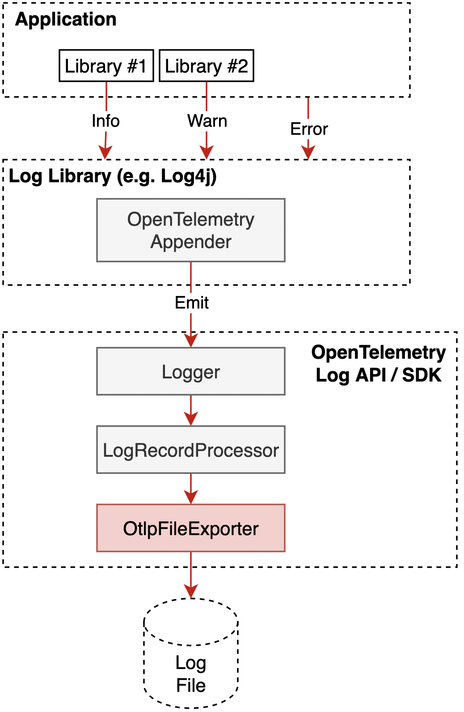

# Logging SDK

**Status**: [Experimental](../document-status.md)

<details>
<summary>Table of Contents</summary>

<!-- toc -->

- [LoggerProvider](#loggerprovider)
  * [Logger Creation](#logger-creation)
  * [Shutdown](#shutdown)
  * [ForceFlush](#forceflush)
- [Additional LogRecord interfaces](#additional-logrecord-interfaces)
  * [ReadableLogRecord](#readablelogrecord)
  * [ReadWriteLogRecord](#readwritelogrecord)
- [LogRecordProcessor](#logrecordprocessor)
  * [LogRecordProcessor operations](#logrecordprocessor-operations)
    + [OnEmit](#onemit)
    + [ShutDown](#shutdown)
    + [ForceFlush](#forceflush-1)
  * [Built-in processors](#built-in-processors)
    + [Simple processor](#simple-processor)
    + [Batching processor](#batching-processor)
- [LogRecordExporter](#logrecordexporter)
  * [LogRecordExporter operations](#logrecordexporter-operations)
    + [Export](#export)
    + [ForceFlush](#forceflush-2)
    + [Shutdown](#shutdown-1)
  * [Built-in exporters](#built-in-exporters)
    + [OTLP Exporter](#otlp-exporter)
    + [OTLP File exporter](#otlp-file-exporter)

<!-- tocstop -->

</details>

## LoggerProvider

A `LoggerProvider` MUST provide a way to allow a [Resource](../resource/sdk.md)
to be specified. If a `Resource` is specified, it SHOULD be associated with all
the `LogRecords` produced by any `Logger` from the `LoggerProvider`.

### Logger Creation

New `Logger` instances are always created through a `LoggerProvider`
(see [API](api.md)). The `name`, `version` (optional), and `attributes` (optional)
supplied to the `LoggerProvider` must be used to create
an [`InstrumentationScope`](../glossary.md#instrumentation-scope) instance which
is stored on the created `Logger`.

Configuration (i.e. [LogRecordProcessors](#logrecordprocessor)) MUST be managed
solely by the `LoggerProvider` and the SDK MUST provide some way to configure
all options that are implemented by the SDK. This MAY be done at the time
of `LoggerProvider` creation if appropriate.

The `LoggerProvider` MAY provide methods to update the configuration. If
configuration is updated (e.g., adding a `LogRecordProcessor`), the updated
configuration MUST also apply to all already returned `Loggers` (i.e. it MUST
NOT matter whether a `Logger` was obtained from the `LoggerProvider` before or
after the configuration change). Note: Implementation-wise, this could mean
that `Logger` instances have a reference to their `LoggerProvider` and access
configuration only via this reference.

### Shutdown

This method provides a way for provider to do any cleanup required.

`Shutdown` MUST be called only once for each `LoggerProvider` instance. After
the call to `Shutdown`, subsequent attempts to get a `Logger` are not allowed.
SDKs SHOULD return a valid no-op `Logger` for these calls, if possible.

`Shutdown` SHOULD provide a way to let the caller know whether it succeeded,
failed or timed out.

`Shutdown` SHOULD complete or abort within some timeout. `Shutdown` MAY be
implemented as a blocking API or an asynchronous API which notifies the caller
via a callback or an event. [OpenTelemetry SDK](../overview.md#sdk) authors MAY
decide if they want to make the shutdown timeout configurable.

`Shutdown` MUST be implemented at least by invoking `Shutdown` on all
registered [LogRecordProcessors](#logrecordprocessor).

### ForceFlush

This method provides a way for provider to notify the
registered [LogRecordProcessors](#logrecordprocessor) to immediately export all
`ReadableLogRecords` that have not yet been exported.

`ForceFlush` SHOULD provide a way to let the caller know whether it succeeded,
failed or timed out. `ForceFlush` SHOULD return some **ERROR** status if there
is an error condition; and if there is no error condition, it should return
some **NO ERROR** status, language implementations MAY decide how to model
**ERROR** and **NO ERROR**.

`ForceFlush` SHOULD complete or abort within some timeout. `ForceFlush` MAY be
implemented as a blocking API or an asynchronous API which notifies the caller
via a callback or an event. [OpenTelemetry SDK](../overview.md#sdk) authors MAY
decide if they want to make the flush timeout configurable.

`ForceFlush` MUST invoke `ForceFlush` on all
registered [LogRecordProcessors](#logrecordprocessor).

## Additional LogRecord interfaces

In addition to the [API-level definition for LogRecord](api.md#logrecord), the
following `LogRecord`-like interfaces are defined in the SDK:

### ReadableLogRecord

A function receiving this as an argument MUST be able to access all the
information added to the [LogRecord](api.md#logrecord). It MUST also be able to
access the [Instrumentation Scope](./data-model.md#field-instrumentationscope)
and [Resource](./data-model.md#field-resource) information (implicitly)
associated with the `LogRecord`.

Counts for attributes due to collection limits MUST be available for exporters
to report as described in
the [transformation to non-OTLP formats](../common/mapping-to-non-otlp.md#dropped-attributes-count)
specification.

Note: Typically this will be implemented with a new interface or (immutable)
value type.

### ReadWriteLogRecord

A function receiving this as an argument MUST be able to write to the
full [LogRecord](api.md#logrecord) and additionally MUST be able to retrieve all
information
that was added to the `LogRecord` (as with
[ReadableLogRecord](#readablelogrecord)).

## LogRecordProcessor

`LogRecordProcessor` is an interface which allows hooks for `LogRecord`
emitting.

Built-in processors are responsible for batching and conversion of `LogRecords`
to exportable representation and passing batches to exporters.

`LogRecordProcessors` can be registered directly on SDK `LoggerProvider` and
they are invoked in the same order as they were registered.

Each processor registered on `LoggerProvider` is part of a pipeline that
consists of a processor and optional [exporter](#logrecordexporter). The SDK
MUST allow each pipeline to end with an individual exporter.

The SDK MUST allow users to implement and configure custom processors and
decorate built-in processors for advanced scenarios such as enriching with
attributes or filtering.

The following diagram shows `LogRecordProcessor`'s relationship to other
components in the SDK:

```
  +-----+------------------------+   +------------------------------+   +-------------------------+
  |     |                        |   |                              |   |                         |
  |     |                        |   | Batching LogRecordProcessor  |   |    LogRecordExporter    |
  |     |                        +---> Simple LogRecordProcessor    +--->     (OtlpExporter)      |
  |     |                        |   |                              |   |                         |
  | SDK | Logger.emit(LogRecord) |   +------------------------------+   +-------------------------+
  |     |                        |
  |     |                        |
  |     |                        |
  |     |                        |
  |     |                        |
  +-----+------------------------+
```

### LogRecordProcessor operations

#### OnEmit

`OnEmit` is called when a `LogRecord` is [emitted](api.md#emit-logrecord). This
method is called synchronously on the thread that emitted the `LogRecord`,
therefore it SHOULD NOT block or throw exceptions.

**Parameters:**

* `logRecord` - a [ReadWriteLogRecord](#readwritelogrecord) for the
  emitted `LogRecord`.

**Returns:** `Void`

#### ShutDown

Shuts down the processor. Called when the SDK is shut down. This is an
opportunity for the processor to do any cleanup required.

`Shutdown` SHOULD be called only once for each `LogRecordProcessor` instance.
After the call to `Shutdown`, subsequent calls to `OnEmit` are not allowed. SDKs
SHOULD ignore these calls gracefully, if possible.

`Shutdown` SHOULD provide a way to let the caller know whether it succeeded,
failed or timed out.

`Shutdown` MUST include the effects of `ForceFlush`.

`Shutdown` SHOULD complete or abort within some timeout. `Shutdown` can be
implemented as a blocking API or an asynchronous API which notifies the caller
via a callback or an event. OpenTelemetry SDK authors can decide if they want
to make the shutdown timeout configurable.

#### ForceFlush

This is a hint to ensure that any tasks associated with `LogRecords` for which
the `LogRecordProcessor` had already received events prior to the call
to `ForceFlush` SHOULD be completed as soon as possible, preferably before
returning from this method.

In particular, if any `LogRecordProcessor` has any associated exporter, it
SHOULD try to call the exporter's `Export` with all `LogRecords` for which this
was not already done and then invoke `ForceFlush` on it.
The [built-in LogRecordProcessors](#built-in-processors) MUST do so. If a
timeout is specified (see below), the `LogRecordProcessor` MUST prioritize
honoring the timeout over
finishing all calls. It MAY skip or abort some or all Export or ForceFlush calls
it has made to achieve this goal.

`ForceFlush` SHOULD provide a way to let the caller know whether it succeeded,
failed or timed out.

`ForceFlush` SHOULD only be called in cases where it is absolutely necessary,
such as when using some FaaS providers that may suspend the process after an
invocation, but before the `LogRecordProcessor` exports the
completed `LogRecords`.

`ForceFlush` SHOULD complete or abort within some timeout. `ForceFlush` can be
implemented as a blocking API or an asynchronous API which notifies the caller
via a callback or an event. OpenTelemetry SDK authors can decide if they want to
make the flush timeout configurable.

### Built-in processors

The standard OpenTelemetry SDK MUST implement both simple and batch processors,
as described below. Other common processing scenarios should be first considered
for implementation out-of-process
in [OpenTelemetry Collector](../overview.md#collector).

#### Simple processor

This is an implementation of `LogRecordProcessor` which passes finished logs and
passes the export-friendly `ReadableLogRecord` representation to the
configured [LogRecordExporter](#logrecordexporter), as soon as they are
finished.

**Configurable parameters:**

* `exporter` - the exporter where the `LogRecords` are pushed.

#### Batching processor

This is an implementation of the `LogRecordProcessor` which create batches
of `LogRecords` and passes the export-friendly `ReadableLogRecord`
representations to the configured `LogRecordExporter`.

**Configurable parameters:**

* `exporter` - the exporter where the `LogRecords` are pushed.
* `maxQueueSize` - the maximum queue size. After the size is reached logs are
  dropped. The default value is TODO.
* `scheduledDelayMillis` - the delay interval in milliseconds between two
  consecutive exports. The default value is TODO.
* `exportTimeoutMillis` - how long the export can run before it is cancelled.
  The default value is TODO.
* `maxExportBatchSize` - the maximum batch size of every export. It must be
  smaller or equal to `maxQueueSize`. The default value is TODO.

## LogRecordExporter

`LogRecordExporter` defines the interface that protocol-specific exporters must
implement so that they can be plugged into OpenTelemetry SDK and support sending
of telemetry data.

The goal of the interface is to minimize burden of implementation for
protocol-dependent telemetry exporters. The protocol exporter is expected to be
primarily a simple telemetry data encoder and transmitter.

### LogRecordExporter operations

A `LogRecordExporter` MUST support the following functions:

#### Export

Exports a batch of [ReadableLogRecords](#readablelogrecord). Protocol exporters
that will implement this function are typically expected to serialize and
transmit the data to the destination.

`Export` will never be called concurrently for the same exporter instance.
Depending on the implementation the result of the export may be returned to the
Processor not in the return value of the call to `Export` but in a language
specific way for signaling completion of an asynchronous task. This means that
while an instance of an exporter will never have it `Export` called concurrently
it does not mean that the task of exporting can not be done concurrently. How
this is done is outside the scope of this specification. Each implementation
MUST document the concurrency characteristics the SDK requires of the exporter.

`Export` MUST NOT block indefinitely, there MUST be a reasonable upper limit
after which the call must time out with an error result (`Failure`).

Concurrent requests and retry logic is the responsibility of the exporter. The
default SDK's `LogRecordProcessors` SHOULD NOT implement retry logic, as the
required logic is likely to depend heavily on the specific protocol and backend
the logs are being sent to. For example,
the [OpenTelemetry Protocol (OTLP) specification](../protocol/otlp.md) defines
logic for both sending concurrent requests and retrying requests.

**Parameters:**

* `batch` - a batch of [ReadableLogRecords](#readablelogrecord). The exact data type
of the batch is language specific, typically it is some kind of list, e.g. for
logs in Java it will be typically `Collection<LogRecordData>`.

**Returns:** `ExportResult`

The return of `Export` is implementation specific. In what is idiomatic for the
language the Exporter must send an `ExportResult` to the
Processor. `ExportResult` has values of either `Success` or `Failure`:

* `Success` - The batch has been successfully exported. For protocol exporters
  this typically means that the data is sent over the wire and delivered to the
  destination server.
* `Failure` - exporting failed. The batch must be dropped. For example, this can
  happen when the batch contains bad data and cannot be serialized.

For example, in Java the return of `Export` would be a Future which when
completed returns the `ExportResult` object. While in Erlang the exporter sends
a message to the processor with the `ExportResult` for a particular batch.

#### ForceFlush

This is a hint to ensure that the export of any `ReadableLogRecords` the
exporter has received prior to the call to `ForceFlush` SHOULD be completed as
soon as possible, preferably before returning from this method.

`ForceFlush` SHOULD provide a way to let the caller know whether it succeeded,
failed or timed out.

`ForceFlush` SHOULD only be called in cases where it is absolutely necessary,
such as when using some FaaS providers that may suspend the process after an
invocation, but before the exporter exports the `ReadlableLogRecords`.

`ForceFlush` SHOULD complete or abort within some timeout. `ForceFlush` can be
implemented as a blocking API or an asynchronous API which notifies the caller
via a callback or an event. [OpenTelemetry SDK](../overview.md#sdk) authors MAY
decide if they want to make the flush timeout configurable.

#### Shutdown

Shuts down the exporter. Called when SDK is shut down. This is an opportunity
for exporter to do any cleanup required.

Shutdown SHOULD be called only once for each `LogRecordExporter` instance. After
the call to `Shutdown` subsequent calls to `Export` are not allowed and should
return a Failure result.

`Shutdown` SHOULD NOT block indefinitely (e.g. if it attempts to flush the data
and the destination is unavailable). [OpenTelemetry SDK](../overview.md#sdk)
authors MAY decide if they want to make the shutdown timeout configurable.

### Built-in exporters

TODO: Break out into files under `./sdk_exporters`.

#### OTLP Exporter

Exports to an OTLP network destination via OTLP/gRPC or OTLP/HTTP.

#### OTLP File exporter

Writes to a file or stdout in either OTLP JSON or OTLP Protobuf binary format.



TODO: clarify how this functionality co-exists with the overlapping
functionality in logging libraries that allow specifying how logs are written to
a file.
