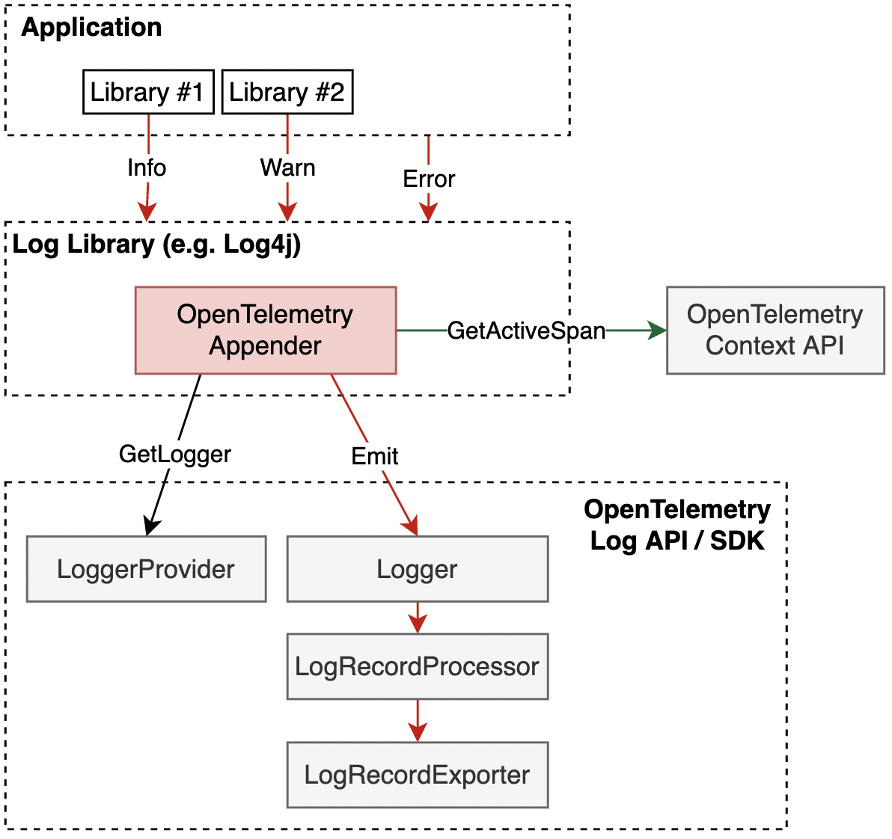

# Supplementary Guidelines

Note: this document is NOT a spec, it is provided to support the Logs
[API](./api.md) and [SDK](./sdk.md) specifications, it does NOT add any
extra requirements to the existing specifications.

<details>
<summary>Table of Contents</summary>

<!-- Re-generate TOC with `markdown-toc --no-first-h1 -i` -->

<!-- toc -->

- [Usage](#usage)
  * [How to Create a Log4J Log Appender](#how-to-create-a-log4j-log-appender)
  * [Logger Name](#logger-name)
  * [Context](#context)
    + [Implicit Context Injection](#implicit-context-injection)
    + [Explicit Context Injection](#explicit-context-injection)
  * [Complex Processing](#complex-processing)

<!-- tocstop -->

</details>

## Usage

### How to Create a Log4J Log Appender

A [log appender](../glossary.md#log-appender--bridge) implementation can be used
to bridge logs into the [Log SDK](./sdk.md)
OpenTelemetry [LogRecordExporters](sdk.md#logrecordexporter). This approach is
typically used for applications which are fine with changing the log transport
and is [one of the supported](README.md#direct-to-collector) log collection
approaches.

The log appender implementation will typically acquire a
[Logger](./api.md#logger), then
call [Emit LogRecord](./api.md#emit-a-logrecord) for `LogRecord`s
received from the application.

[Implicit Context Injection](#implicit-context-injection)
and [Explicit Context Injection](#explicit-context-injection) describe how an
Appender injects `TraceContext` into `LogRecord`s.



This same approach can be also used for example for:

- Python logging library by creating a Handler.
- Go zap logging library by implementing the Core interface. Note that since
  there is no implicit Context in Go it is not possible to get and use the
  active Span.

Log appenders can be created in OpenTelemetry language libraries by OpenTelemetry
maintainers, or by 3rd parties for any logging library that supports a similar
extension mechanism. This specification recommends each OpenTelemetry language
library to include out-of-the-box Appender implementation for at least one
popular logging library.

### Logger Name

If the logging library has a concept that is similar to OpenTelemetry's
definition of the [Instrumentation Scope's](../glossary.md#instrumentation-scope)
name, then the appender's implementation should use that value as the
name parameter when [obtaining the Logger](./api.md#get-a-logger).

This is for example applicable to:

- Logger name in [Log4J](https://javadoc.io/doc/org.apache.logging.log4j/log4j-api/latest/org.apache.logging.log4j/org/apache/logging/log4j/Logger.html)
- Channel name in [Monolog](https://github.com/Seldaek/monolog/blob/3.4.0/doc/01-usage.md#leveraging-channels)

Appenders should avoid setting any attributes of the Instrumentation Scope.
Doing so may result in different appenders setting different attributes on the
same Instrumentation Scope, obtained with the same identity of the
[Logger](./api.md#get-a-logger), which, according to the specification,
is an error.

### Context

#### Implicit Context Injection

When Context is implicitly available (e.g. in Java) the Appender can rely on
automatic context propagation by NOT explicitly setting `Context` when
calling [emit a LogRecord](./api.md#emit-a-logrecord).

Some log libraries have mechanisms specifically tailored for injecting
contextual information into logs, such as MDC in Log4j. When available, it may
be preferable to use these mechanisms to set the Context. A log appender can
then fetch the Context and explicitly set it when
calling [emit a LogRecord](./api.md#emit-a-logrecord). This allows the correct Context
to be included even when log records are emitted asynchronously, which can
otherwise lead the Context to be incorrect.

TODO: clarify how works or doesn't work when the log statement call site and the
log appender are executed on different threads.

#### Explicit Context Injection

In order for `TraceContext` to be recorded in `LogRecord`s in languages where
the Context must be provided explicitly (e.g. Go), the end user must capture the
Context and explicitly pass it to the logging subsystem. The log appender must
take this Context and explicitly set it when
calling [emit a LogRecord](./api.md#emit-a-logrecord).

Support for OpenTelemetry for logging libraries in these languages typically can
be implemented in the form of logger wrappers that can capture the context once,
when the span is created and then use the wrapped logger to execute log
statements in a normal way. The wrapper will be responsible for injecting the
captured context in the logs.

This specification does not define how exactly it is achieved since the actual
mechanism depends on the language and the particular logging library used. In
any case the wrappers are expected to make use of the Trace Context API to get
the current active span.

See
[an example](https://github.com/open-telemetry/opentelemetry-go-contrib/blob/aeb198d6de25588afef49545cfa06533d0e67f1d/bridges/otelzap/core.go#L194-L244)
of how it can be done for zap logging library for Go.

### Complex Processing

There are many ways and places of implementing log processing like:

1. The OpenTelemetry Collector.
2. The [OpenTelemetry Logs SDK](sdk.md).
3. A bridged logging library.
4. A backend.

Each of the approaches has different benefits and drawbacks.

Here are some examples on how to build custom log processing using the
[Logs SDK](sdk.md). These examples use the [Go Logs SDK](https://pkg.go.dev/go.opentelemetry.io/otel/sdk/log)
and are shown for illustration. Consult the language specific documentation
to see if this feasible to be implemented in a different language.

<!-- markdownlint-disable no-hard-tabs -->

Log record altering can be simply done by mutating the log record passed to the 
processor. Here is an example of processor that tries to redact tokens from log
record attributes:

```go
package demo

import (
	"context"
	"strings"

	"go.opentelemetry.io/otel/log"
	sdklog "go.opentelemetry.io/otel/sdk/log"
)

// RedactTokensProcessor redacts values
// from attributes containing "token" in the key.
type RedactTokensProcessor struct{}

// OnEmit redacts values from attributes containing "token" in the key
// by replacing them with a REDACTED value.
func (p *RedactTokensProcessor) OnEmit(ctx context.Context, record *sdklog.Record) error {
	record.WalkAttributes(func(kv log.KeyValue) bool {
		if strings.Contains(strings.ToLower(kv.Key), "token") {
			record.AddAttributes(log.String(kv.Key, "REDACTED"))
		}
		return true
	})
	return nil
}

// Implementation of ForceFlush and Shutdown is left for the reader.
```

Filtering can be achieved by [decorating](https://refactoring.guru/design-patterns/decorator)
a processor. For example, here's how filtering based on Severity can be achieved.

```go
package demo

import (
	"context"

	"go.opentelemetry.io/otel/log"
	sdklog "go.opentelemetry.io/otel/sdk/log"
)

// SeverityProcessor decorates a processor to filter out log records
// that severity is below given threshold.
type SeverityProcessor struct {
	sdklog.Processor
	Min log.Severity
}

// OnEmit passes ctx and record to the sdklog.Processor that p wraps if the
// severity of record is greater than or equal to p.Min. Otherwise, record is
// dropped.
func (p *SeverityProcessor) OnEmit(ctx context.Context, record *sdklog.Record) error {
	if record.Severity() < p.Min {
		return nil
	}
	return p.Processor.OnEmit(ctx, record)
}

// Implementation of ForceFlush and Shutdown is left for the reader.
```

> [!NOTE]
> As noted before, the examples are shown for illustration.
> Go developers can use take advantage of the
> [`go.opentelemetry.io/contrib/processors/minsev`](https://pkg.go.dev/go.opentelemetry.io/contrib/processors/minsev)
> module.

Supporting multiple processing pipelines can be achieved by
[composing](https://refactoring.guru/design-patterns/composite) processors.
Below is an example of an isolated processor. It makes sure that the passed
processors operate on a copy of a log record.

```go
package demo

import (
	"context"
	"errors"

	sdklog "go.opentelemetry.io/otel/sdk/log"
)

// IsolatedProcessor composes multiple processors so that they are isolated.
type IsolatedProcessor struct {
	Processors []sdklog.Processor
}

// OnEmit passes ctx and a clone of record to the each wrapped sdklog.Processor.
func (p *IsolatedProcessor) OnEmit(ctx context.Context, record *sdklog.Record) error {
	var rErr error
	r := record.Clone()
	for _, proc := range p.Processors {
		if err := proc.OnEmit(ctx, &r); err != nil {
			rErr = errors.Join(rErr, err)
		}
	}
	return rErr
}

// Implementation of ForceFlush and Shutdown is left for the reader.
```

Other capabilities, such as routing, can be implemented using different
combinations of wrapping and composing of processors. Here's an example
of a processor which splits the processing of event records from (non-event)
log records.

```go
package demo

import (
	"context"

	sdklog "go.opentelemetry.io/otel/sdk/log"
)

// LogEventRouteProcessor splits the log record processing from event record processing.
type LogEventRouteProcessor struct {
	LogProcessor sdklog.Processor
	EventProcessor sdklog.Processor
}

// OnEmit calls EventProcessor if record has non-empty event name.
// Otherwise, it calls LogProcessor.
func (p *LogEventRouteProcessor) OnEmit(ctx context.Context, record *sdklog.Record) error {
	if record.EventName() != "" {
		return p.EventProcessor.OnEmit(ctx, record)
	}
	return p.LogProcessor.OnEmit(ctx, record)
}

// Implementation of ForceFlush and Shutdown is left for the reader.
```

Below is an example of log processing setup which uses all of the processors
described above.

```go
package play // import "go.opentelemetry.io/otel/sdk/play"

import (
	"context"

	"go.opentelemetry.io/otel/exporters/otlp/otlplog/otlploghttp"
	"go.opentelemetry.io/otel/exporters/stdout/stdoutlog"
	"go.opentelemetry.io/otel/log"
	sdklog "go.opentelemetry.io/otel/sdk/log"
)

// NewLoggerProvider creates a new logger provider.
// Event records with severity not lower than Info are exported via OTLP.
// Event records have the token attributes redacted.
// Non-event log records with severity not lower than Debug are synchronously emitted to stdout.
func NewLoggerProvider() (*sdklog.LoggerProvider, error) {
	// Events processing setup.
	otlpExp, err := otlploghttp.New(context.Background()
	if err != nil {
		return nil, err
	}
	evtProc := &SeverityProcessor{
		Processor: &IsolatedProcessor{
			Processors: []sdklog.Processor{
				&RedactTokensProcessor{},
				sdklog.NewBatchProcessor(otlpExp),
			},
		},
		Min: log.SeverityInfo,
	}

	// Logs processing setup.
	stdoutExp, err := stdoutlog.New()
	if err != nil {
		return nil, err
	}
	logProc := &SeverityProcessor{
		Processor: sdklog.NewSimpleProcessor(stdoutExp),
		Min:       log.SeverityDebug,
	}

	// Create logs provider with log/event routing.
	provider := sdklog.NewLoggerProvider(
		sdklog.WithProcessor(&LogEventRouteProcessor{
			LogProcessor:   logProc,
			EventProcessor: evtProc,
		}),
	)
	return provider, nil
}
```

<!-- markdownlint-enable no-hard-tabs -->

- [OTEP0150 Logging Library SDK Prototype Specification](../../oteps/logs/0150-logging-library-sdk.md)
