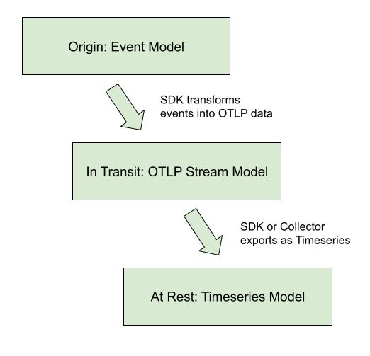
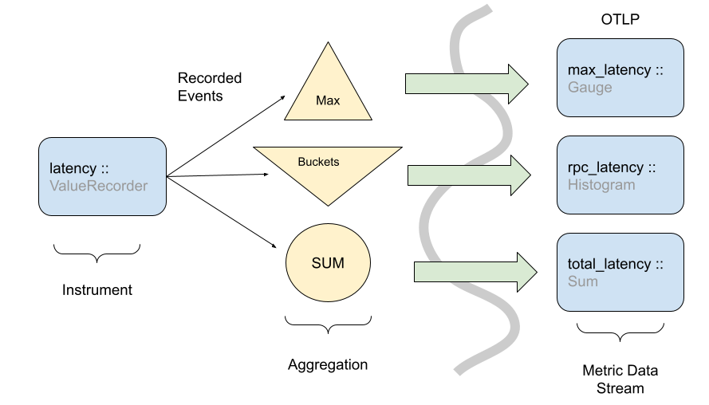
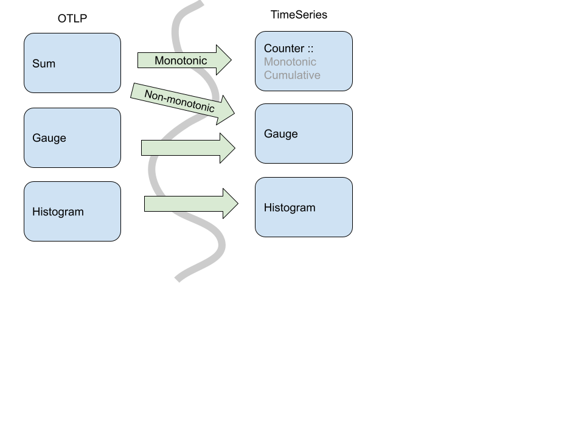
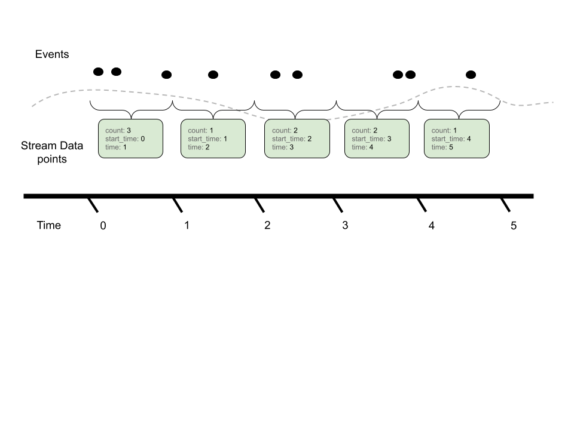
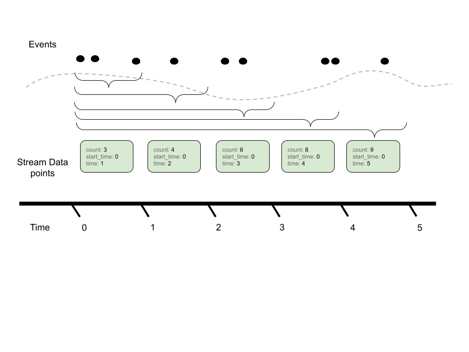
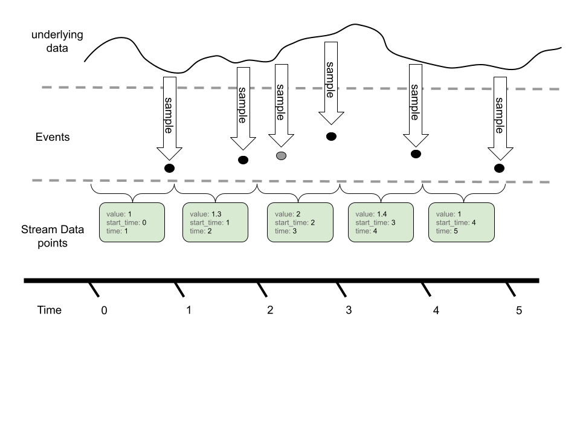
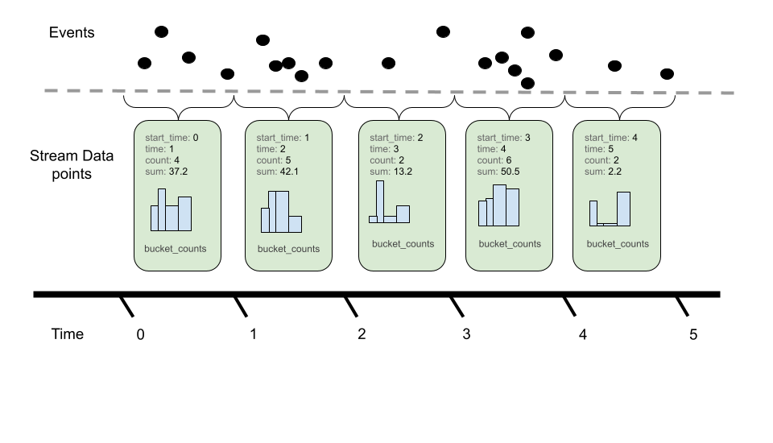

<!--- Hugo front matter used to generate the website version of this page:
linkTitle: Data Model
aliases: [/docs/reference/specification/metrics/datamodel]
weight: 2
--->

# Metrics Data Model

**Status**: [Mixed](../document-status.md)

<details>
<summary>Table of Contents</summary>

<!-- toc -->

- [Overview](#overview)
- [Events => Data Stream => Timeseries](#events--data-stream--timeseries)
  * [Example Use-cases](#example-use-cases)
  * [Out of Scope Use-cases](#out-of-scope-use-cases)
- [Model Details](#model-details)
  * [Event Model](#event-model)
  * [Timeseries Model](#timeseries-model)
  * [OpenTelemetry Protocol data model](#opentelemetry-protocol-data-model)
    + [OpenTelemetry Protocol data model: Producer recommendations](#opentelemetry-protocol-data-model-producer-recommendations)
    + [OpenTelemetry Protocol data model: Consumer recommendations](#opentelemetry-protocol-data-model-consumer-recommendations)
    + [Point kinds](#point-kinds)
- [Metric Points](#metric-points)
  * [Sums](#sums)
  * [Gauge](#gauge)
  * [Histogram](#histogram)
    + [Histogram: Bucket inclusivity](#histogram-bucket-inclusivity)
  * [ExponentialHistogram](#exponentialhistogram)
    + [Exponential Scale](#exponential-scale)
    + [Exponential Buckets](#exponential-buckets)
    + [Zero Count and Zero Threshold](#zero-count-and-zero-threshold)
    + [Producer Expectations](#producer-expectations)
      - [Scale Zero: Extract the Exponent](#scale-zero-extract-the-exponent)
      - [Negative Scale: Extract and Shift the Exponent](#negative-scale-extract-and-shift-the-exponent)
      - [All Scales: Use the Logarithm Function](#all-scales-use-the-logarithm-function)
    + [ExponentialHistogram: Producer Recommendations](#exponentialhistogram-producer-recommendations)
    + [ExponentialHistogram: Consumer Recommendations](#exponentialhistogram-consumer-recommendations)
    + [ExponentialHistogram: Bucket inclusivity](#exponentialhistogram-bucket-inclusivity)
  * [Summary (Legacy)](#summary-legacy)
- [Exemplars](#exemplars)
- [Data point flags](#data-point-flags)
  * [No recorded value](#no-recorded-value)
- [Single-Writer](#single-writer)
- [Temporality](#temporality)
- [Resets and Gaps](#resets-and-gaps)
  * [Cumulative streams: handling unknown start time](#cumulative-streams-handling-unknown-start-time)
  * [Cumulative streams: inserting true reset points](#cumulative-streams-inserting-true-reset-points)
- [Overlap](#overlap)
  * [Overlap resolution](#overlap-resolution)
  * [Overlap observability](#overlap-observability)
  * [Overlap interpolation](#overlap-interpolation)
- [Stream Manipulations](#stream-manipulations)
  * [Sums: Delta-to-Cumulative](#sums-delta-to-cumulative)
    + [Sums: detecting alignment issues](#sums-detecting-alignment-issues)
    + [Sums: Missing Timestamps](#sums-missing-timestamps)
- [References](#references)
- [Footnotes](#footnotes)

<!-- tocstop -->

</details>

## Overview

**Status**: [Stable](../document-status.md)

The OpenTelemetry data model for metrics consists of a protocol specification
and semantic conventions for delivery of pre-aggregated metric timeseries data.
The data model is designed for importing data from existing systems and
exporting data into existing systems, as well as to support internal
OpenTelemetry use-cases for generating Metrics from streams of Spans or Logs.

Popular existing metrics data formats can be unambiguously translated into the
OpenTelemetry data model for metrics, without loss of semantics or fidelity.
Translation from the Prometheus and Statsd exposition formats is explicitly
specified.

The data model specifies a number of semantics-preserving data transformations
for use on the collection path, supporting flexible system configuration. The
model supports reliability and statelessness controls, through the choice of
cumulative and delta transport. The model supports cost controls, through
spatial and temporal reaggregation.

The OpenTelemetry collector is designed to accept metrics data in a number of
formats, transport data using the OpenTelemetry data model, and then export into
existing systems. The data model can be unambiguously translated into the
Prometheus Remote Write protocol without loss of features or semantics, through
well-defined translations of the data, including the ability to automatically
remove attributes and lower histogram resolution.

## Events => Data Stream => Timeseries

**Status**: [Stable](../document-status.md)

The OTLP Metrics protocol is designed as a standard for transporting metric
data. To describe the intended use of this data and the associated semantic
meaning, OpenTelemetry metric data stream types will be linked into a framework
containing a higher-level model, about Metrics APIs and discrete input values,
and a lower-level model, defining the Timeseries and discrete output values.
The relationship between models is displayed in the diagram below.



This protocol was designed to meet the requirements of the OpenCensus Metrics
system, particularly to meet its concept of Metrics Views. Views are
accomplished in the OpenTelemetry Metrics data model through support for data
transformation on the collection path.

OpenTelemetry has identified three kinds of semantics-preserving Metric data
transformation that are useful in building metrics collection systems as ways of
controlling cost, reliability, and resource allocation. The OpenTelemetry
Metrics data model is designed to support these transformations both inside an
SDK as the data originates, or as a reprocessing stage inside the OpenTelemetry
collector. These transformations are:

1. Temporal reaggregation: Metrics that are collected at a high-frequency can be
   re-aggregated into longer intervals, allowing low-resolution timeseries to be
   pre-calculated or used in place of the original metric data.
2. Spatial reaggregation: Metrics that are produced with unwanted attributes can
   be re-aggregated into metrics having fewer attributes.
3. Delta-to-Cumulative: Metrics that are input and output with Delta temporality
   unburden the client from keeping high-cardinality state. The use of deltas
   allows downstream services to bear the cost of conversion into cumulative
   timeseries, or to forego the cost and calculate rates directly.

OpenTelemetry Metrics data streams are designed so that these transformations
can be applied automatically to streams of the same type, subject to conditions
outlined below. Every OTLP data stream has an intrinsic
[decomposable aggregate function](https://en.wikipedia.org/wiki/Aggregate_function#Decomposable_aggregate_functions)
making it semantically well-defined to merge data points across both temporal
and spatial attributes. Every OTLP data point also has two meaningful timestamps
which, combined with intrinsic aggregation, make it possible to carry out the
standard metric data transformations for each of the model’s basic points while
ensuring that the result carries the intended meaning.

As in OpenCensus Metrics, metrics data can be transformed into one or more
Views, just by selecting the aggregation interval and the desired attributes.
One stream of OTLP data can be transformed into multiple timeseries outputs by
configuring different Views, and the required Views processing may be applied
inside the SDK or by an external collector.

### Example Use-cases

The metric data model is designed around a series of "core" use cases.  While
this list is not exhaustive, it is meant to be representative of the scope and
breadth of OTel metrics usage.

1. OTel SDK exports 10 second resolution to a single OTel collector, using
  cumulative temporality for a stateful client, stateless server:
    - Collector passes-through original data to an OTLP destination
    - Collector re-aggregates into longer intervals without changing attributes
    - Collector re-aggregates into several distinct views, each with a subset of
      the available attributes, outputs to the same destination
2. OTel SDK exports 10 second resolution to a single OTel collector, using delta
  temporality for a stateless client, stateful server:
    - Collector re-aggregates into 60 second resolution
    - Collector converts delta to cumulative temporality
3. OTel SDK exports both 10 seconds resolution (e.g. CPU, request latency) and
  15 minutes resolution (e.g. room temperature) to a single OTel Collector.
  The collector exports streams upstream with or without aggregation.
4. A number of OTel SDKs running locally each exports 10 second resolution, each
  reports to a single (local) OTel collector.
    - Collector re-aggregates into 60 second resolution
    - Collector re-aggregates to eliminate the identity of individual SDKs (e.g.,
      distinct `service.instance.id` values)
    - Collector outputs to an OTLP destination
5. Pool of OTel collectors receive OTLP and export Prometheus Remote Write
    - Collector joins service discovery with metric resources
    - Collector computes “up”, staleness marker
    - Collector applies a distinct external label
6. OTel collector receives Statsd and exports OTLP
    - With delta temporality: stateless collector
    - With cumulative temporality: stateful collector
7. OTel SDK exports directly to 3P backend

These are considered the "core" use-cases used to analyze tradeoffs and design
decisions within the metrics data model.

### Out of Scope Use-cases

The metrics data model is NOT designed to be a perfect Rosetta Stone of metrics.
Here are a set of use cases that, while won't be outright unsupported, are not
in scope for key design decisions:

- Using OTLP as an intermediary format between two non-compatible formats
  - Importing [statsd](https://github.com/statsd/statsd) => Prometheus PRW
  - Importing [collectd](https://github.com/collectd/collectd/wiki/Binary-protocol)
    => Prometheus PRW
  - Importing Prometheus endpoint scrape => [statsd push | collectd | opencensus]
  - Importing OpenCensus "oca" => any non OC or OTel format
- TODO: define others.

## Model Details

**Status**: [Stable](../document-status.md)

OpenTelemetry fragments metrics into three interacting models:

<!--- cSpell:ignore emetry --->
- An Event model, representing how instrumentation reports metric data.
- A Timeseries model, representing how backends store metric data.
- A Metric Stream model, defining the *O*pen*T*e*L*emetry *P*rotocol (OTLP)
  representing how metric data streams are manipulated and transmitted between
  the Event model and the Timeseries storage.  This is the model specified
  in this document.

### Event Model

The event model is where recording of data happens. Its foundation is made of
[Instruments](api.md#instrument), which are used to record data observations via events.
These raw events are then transformed in some fashion before being sent to some
other system.  OpenTelemetry metrics are designed such that the same instrument
and events can be used in different ways to generate metric streams.



Even though observation events could be reported directly to a backend, in
practice this would be infeasible due to the sheer volume of data used in
observability systems, and the limited amount of network/CPU resources available
for telemetry collection purposes. The best example of this is the Histogram
metric where raw events are recorded in a compressed format rather than
individual timeseries.

> [!NOTE]
> The above picture shows how one instrument can transform events into
> more than one type of metric stream. There are caveats and nuances for when
> and how to do this.  Instrument and metric configuration are outlined
> in the [metrics API specification](api.md).

While OpenTelemetry provides flexibility in how instruments can be transformed
into metric streams, the instruments are defined such that a reasonable default
mapping can be provided. The exact
[OpenTelemetry instruments](api.md#instrument) are detailed in the API
specification.

In the Event model, the primary data are (instrument, number) points, originally
observed in real time or on demand (for the synchronous and asynchronous cases,
respectively).

### Timeseries Model

In this low-level metrics data model, a Timeseries is defined by an entity
consisting of several metadata properties:

- Metric name
- Attributes (dimensions)
- Value type of the point (integer, floating point, etc)
- Unit of measurement

The primary data of each timeseries are ordered (timestamp, value) points, with
one of the following value types:

1. Counter (Monotonic, Cumulative)
2. Gauge
3. Histogram
4. Exponential Histogram

This model may be viewed as an idealization of
[Prometheus Remote Write](https://docs.google.com/document/d/1LPhVRSFkGNSuU1fBd81ulhsCPR4hkSZyyBj1SZ8fWOM/edit#heading=h.3p42p5s8n0ui).
Like that protocol, we are additionally concerned with knowing when a point
value is defined, as compared with being implicitly or explicitly absent. A
metric stream of delta data points defines time-interval values, not
point-in-time values.  To precisely define presence and absence of data requires
further development of the correspondence between these models.

Note: Prometheus is not the only possible timeseries model for OpenTelemetry
to map into, but is used as a reference throughout this document.

### OpenTelemetry Protocol data model

The OpenTelemetry protocol (OTLP) data model is composed of Metric data
streams.  These streams are in turn composed of metric data points.
Metric data streams can be converted directly into Timeseries.

Metric streams are grouped into individual `Metric` objects,
identified by:

- The originating `Resource` attributes
- The instrumentation `Scope` (e.g., instrumentation library name, version)
- The metric stream's `name`

Including `name`, the `Metric` object is defined by the following
properties:

- The data point type (e.g. `Sum`, `Gauge`, `Histogram` `ExponentialHistogram`, `Summary`)
- The metric stream's `unit`
- The metric stream's `description`
- Intrinsic data point properties, where applicable: `AggregationTemporality`, `Monotonic`

The data point type, `unit`, and intrinsic properties are considered
identifying, whereas the `description` field is explicitly not
identifying in nature.

Extrinsic properties of specific points are not considered
identifying; these include but are not limited to:

- Bucket boundaries of a `Histogram` data point
- Scale or bucket count of a `ExponentialHistogram` data point.

The `Metric` object contains individual streams, identified by the set
of `Attributes`.  Within the individual streams, points are identified
by one or two timestamps, details vary by data point type.

Within certain data point types (e.g., `Sum` and `Gauge`) there is
variation permitted in the numeric point value; in this case, the
associated variation (i.e., floating-point vs. integer) is not
considered identifying.

#### OpenTelemetry Protocol data model: Producer recommendations

Producers SHOULD prevent the presence of multiple `Metric` identities
for a given `name` with the same `Resource` and `Scope` attributes.
Producers are expected to aggregate data for identical `Metric`
objects as a basic feature, so the appearance of multiple `Metric`,
considered a "semantic error", generally requires duplicate
conflicting instrument registration to have occurred somewhere.

Producers MAY be able to remediate the problem, depending on whether
they are an SDK or a downstream processor:

1. If the potential conflict involves a non-identifying property (i.e.,
   `description`), the producer SHOULD choose the longer string.
2. If the potential conflict involves similar but disagreeing units
   (e.g., "ms" and "s"), an implementation MAY convert units to avoid
   semantic errors; otherwise an implementation SHOULD inform the user
   of a semantic error and pass through conflicting data.
3. If the potential conflict involves an `AggregationTemporality`
   property, an implementation MAY convert temporality using a
   Cumulative-to-Delta or a Delta-to-Cumulative transformation;
   otherwise, an implementation SHOULD inform the user of a semantic
   error and pass through conflicting data.
4. Generally, for potential conflicts involving an identifying
   property (i.e., all properties except `description`), the producer
   SHOULD inform the user of a semantic error and pass through
   conflicting data.

When semantic errors such as these occur inside an implementation of
the OpenTelemetry API, there is an presumption of a fixed `Resource`
value.  Consequently, SDKs implementing the OpenTelemetry API have
complete information about the origin of duplicate instrument
registration conflicts and are sometimes able to help users avoid
semantic errors.  See the SDK specification for specific details.

#### OpenTelemetry Protocol data model: Consumer recommendations

Consumers MAY reject OpenTelemetry Metrics data containing semantic
errors (i.e., more than one `Metric` identity for a given `name`,
`Resource`, and `Scope`).

OpenTelemetry does not specify any means for conveying such an outcome
to the end user, although this subject deserves attention.

#### Point kinds

A metric stream can use one of these basic point kinds, all of
which satisfy the requirements above, meaning they define a decomposable
aggregate function (also known as a “natural merge” function) for points of the
same kind. <sup>[1](#footnotes)</sup>

The basic point kinds are:

1. [Sum](https://github.com/open-telemetry/opentelemetry-proto/blob/c5c8b28012583fda55b0cb16f73a820722171d49/opentelemetry/proto/metrics/v1/metrics.proto#L247)
2. [Gauge](https://github.com/open-telemetry/opentelemetry-proto/blob/c5c8b28012583fda55b0cb16f73a820722171d49/opentelemetry/proto/metrics/v1/metrics.proto#L241)
3. [Histogram](https://github.com/open-telemetry/opentelemetry-proto/blob/c5c8b28012583fda55b0cb16f73a820722171d49/opentelemetry/proto/metrics/v1/metrics.proto#L260)
4. [Exponential Histogram](https://github.com/open-telemetry/opentelemetry-proto/blob/c5c8b28012583fda55b0cb16f73a820722171d49/opentelemetry/proto/metrics/v1/metrics.proto#L270)

Comparing the OTLP Metric Data Stream and Timeseries data models, OTLP does
not map 1:1 from its point types into timeseries points. In OTLP, a Sum point
can represent a monotonic count or a non-monotonic count. This means an OTLP Sum
is either translated into a Timeseries Counter, when the sum is monotonic, or
a Gauge when the sum is not monotonic.



Specifically, in OpenTelemetry Sums always have an aggregate function where
you can combine via addition. So, for non-monotonic sums in OpenTelemetry we
can aggregate (naturally) via addition.  In the timeseries model, you cannot
assume that any particular Gauge is a sum, so the default aggregation would not
be addition.

In addition to the core point kinds used in OTLP, there are also data types
designed for compatibility with existing metric formats.

- [Summary](#summary-legacy)

## Metric Points

**Status**: [Stable](../document-status.md)

Metric points are the basic building blocks of metrics. Depending on the [point
kind](#point-kinds), a metric point may have different fields. The following
sections describe the fields for each point kind and how these points form
metrics.

### Sums

[Sum](https://github.com/open-telemetry/opentelemetry-proto/blob/v0.9.0/opentelemetry/proto/metrics/v1/metrics.proto#L230)s
in OTLP consist of the following:

- An *Aggregation Temporality* of delta or cumulative.
- A flag denoting whether the Sum is
  [monotonic](https://en.wikipedia.org/wiki/Monotonic_function). In this case of
  metrics, this means the sum is nominally increasing, which we assume without
  loss of generality.
  - For delta monotonic sums, this means the reader SHOULD expect non-negative
    values.
  - For cumulative monotonic sums, this means the reader SHOULD expect values
    that are not less than the previous value.
- A set of data points, each containing:
  - An independent set of Attribute name-value pairs.
  - A time window (of `(start, end]`) time for which the Sum was calculated.
    - The time interval is inclusive of the end time.
    - Times are specified in Value is UNIX Epoch time in nanoseconds since
      `00:00:00 UTC on 1 January 1970`
    - The `start` timestamp best represents the first possible moment a
      measurement for this timeseries could have been recorded.
  - (optional) a set of exemplars (see [Exemplars](#exemplars)).
  - (optional) Data point flags (see [Data point flags](#data-point-flags)).

The aggregation temporality is used to understand the context in which the sum
was calculated. When the aggregation temporality is "delta", we expect to have
no overlap in time windows for metric streams, e.g.



Contrast with cumulative aggregation temporality where we expect to report the
full sum since 'start' (where start is often close to the process/application
start):



There are various tradeoffs between using Delta vs. Cumulative aggregation, in
various use cases, e.g.:

- Detecting process restarts
- Calculating rates
- Push vs. Pull based metric reporting

OTLP supports both models, and allows APIs, SDKs and users to determine the
best tradeoff for their use case.

### Gauge

A [Gauge](https://github.com/open-telemetry/opentelemetry-proto/blob/v0.9.0/opentelemetry/proto/metrics/v1/metrics.proto#L200)
in OTLP represents a sampled value at a given time.  A Gauge stream consists of:

- A set of data points, each containing:
  - An independent set of Attribute name-value pairs.
  - A sampled value (e.g. current CPU temperature)
  - A timestamp when the value was sampled (`time_unix_nano`)
  - (optional) A timestamp (`start_time_unix_nano`) which best represents the
    first possible moment a measurement for this timeseries could have been
    recorded.
  - (optional) a set of examplars (see [Exemplars](#exemplars)).
  - (optional) Data point flags (see [Data point flags](#data-point-flags)).

In OTLP, a point within a Gauge stream represents the last-sampled event for a
given time window.



In this example, we can see an underlying timeseries we are sampling with our
Gauge.  While the event model *can* sample more than once for a given metric
reporting interval, only the last value is reported in the metric stream via
OTLP.

Gauges do not provide an aggregation semantic, instead "last sample value" is
used when performing operations like temporal alignment or adjusting resolution.

Gauges can be aggregated through transformation into histograms, or other
metric types. These operations are not done by default, and require direct
user configuration.

### Histogram

[Histogram](https://github.com/open-telemetry/opentelemetry-proto/blob/v0.9.0/opentelemetry/proto/metrics/v1/metrics.proto#L258)
metric data points convey a population of recorded measurements in a compressed
format. A histogram bundles a set of events into divided populations with an
overall event count and aggregate sum for all events.



Histograms consist of the following:

- An *Aggregation Temporality* of delta or cumulative.
- A set of data points, each containing:
  - An independent set of Attribute name-value pairs.
  - A time window (of `(start, end]`) time for which the Histogram was bundled.
    - The time interval is inclusive of the end time.
    - Time values are specified as nanoseconds since the UNIX Epoch
      (00:00:00 UTC on 1 January 1970).
    - The `start` timestamp best represents the first possible moment a
      measurement for this timeseries could have been recorded.
  - A count (`count`) of the total population of points in the histogram.
  - A sum (`sum`) of all the values in the histogram.
  - (optional) The min (`min`) of all values in the histogram.
  - (optional) The max (`max`) of all values in the histogram.
  - (optional) A series of buckets with:
    - Explicit boundary values.  These values denote the lower and upper bounds
      for buckets and whether not a given observation would be recorded in this
      bucket.
    - A count of the number of observations that fell within this bucket.
  - (optional) a set of exemplars (see [Exemplars](#exemplars)).
  - (optional) Data point flags (see [Data point flags](#data-point-flags)).

Like Sums, Histograms also define an aggregation temporality.  The picture above
denotes Delta temporality where accumulated event counts are reset to zero after reporting
and a new aggregation occurs. Cumulative, on the other hand, continues to
aggregate events, resetting with the use of a new start time.

The aggregation temporality also has implications on the min and max fields. Min
and max are more useful for Delta temporality, since the values represented by
Cumulative min and max will stabilize as more events are recorded. Additionally,
it is possible to convert min and max from Delta to Cumulative, but not from
Cumulative to Delta. When converting from Cumulative to Delta, min and max can
be dropped, or captured in an alternative representation such as a gauge.

Bucket counts are optional.  A Histogram without buckets conveys a
population in terms of only the sum and count, and may be interpreted
as a histogram with single bucket covering `(-Inf, +Inf)`.

#### Histogram: Bucket inclusivity

Bucket upper-bounds are inclusive (except for the case where the
upper-bound is +Inf) while bucket lower-bounds are exclusive. That is,
buckets express the number of values that are greater than their lower
bound and less than or equal to their upper bound.  Importers and
exporters working with OpenTelemetry Metrics data are meant to
disregard this specification when translating to and from histogram
formats that use inclusive lower bounds and exclusive upper bounds.
Changing the inclusivity and exclusivity of bounds is an example of
worst-case Histogram error; users should choose Histogram boundaries
so that worst-case error is within their error tolerance.

### ExponentialHistogram

**Status**: [Stable](../document-status.md)

[ExponentialHistogram](https://github.com/open-telemetry/opentelemetry-proto/blob/cfbf9357c03bf4ac150a3ab3bcbe4cc4ed087362/opentelemetry/proto/metrics/v1/metrics.proto#L222)
data points are an alternate representation to the
[Histogram](#histogram) data point, used to convey a population of
recorded measurements in a compressed format.  ExponentialHistogram
compresses bucket boundaries using an exponential formula, making it
suitable for conveying high dynamic range data with small relative
error, compared with alternative representations of similar size.

Statements about `Histogram` that refer to aggregation temporality,
attributes, and timestamps, as well as the `sum`, `count`, `min`, `max` and
`exemplars` fields, are the same for `ExponentialHistogram`.  These
fields all share identical interpretation as for `Histogram`, only the
bucket structure differs between these two types.

#### Exponential Scale

The resolution of the ExponentialHistogram is characterized by a
parameter known as `scale`, with larger values of `scale` offering
greater precision.  Bucket boundaries of the ExponentialHistogram are
located at integer powers of the `base`, also known as the "growth
factor", where:

```
base = 2**(2**(-scale))
```

The symbol `**` in these formulas represents exponentiation, thus
`2**x` is read "Two to the power of `x`", typically computed by an
expression like `math.Pow(2.0, x)`.  Calculated `base` values for
selected scales are shown below:

| Scale | Base    | Expression  |
| --    | --      | --          |
| 10    | 1.00068 | 2**(1/1024) |
| 9     | 1.00135 | 2**(1/512)  |
| 8     | 1.00271 | 2**(1/256)  |
| 7     | 1.00543 | 2**(1/128)  |
| 6     | 1.01089 | 2**(1/64)   |
| 5     | 1.02190 | 2**(1/32)   |
| 4     | 1.04427 | 2**(1/16)   |
| 3     | 1.09051 | 2**(1/8)    |
| 2     | 1.18921 | 2**(1/4)    |
| 1     | 1.41421 | 2**(1/2)    |
| 0     | 2       | 2**1        |
| -1    | 4       | 2**2        |
| -2    | 16      | 2**4        |
| -3    | 256     | 2**8        |
| -4    | 65536   | 2**16       |

An important property of this design is described as "perfect
subsetting".  Buckets of an exponential Histogram with a given scale
map exactly into buckets of exponential Histograms with lesser scales,
which allows consumers to lower the resolution of a histogram (i.e.,
downscale) without introducing error.

#### Exponential Buckets

The ExponentialHistogram bucket identified by `index`, a signed
integer, represents values in the population that are greater than
`base**index` and less than or equal to `base**(index+1)`.

The positive and negative ranges of the histogram are expressed
separately.  Negative values are mapped by their absolute value into
the negative range using the same scale as the positive range.  Note
that in the negative range, therefore, histogram buckets use
lower-inclusive boundaries.

Each range of the ExponentialHistogram data point uses a dense
representation of the buckets, where a range of buckets is expressed
as a single `offset` value, a signed integer, and an array of count
values, where array element `i` represents the bucket count for bucket
index `offset+i`.

For a given range, positive or negative:

- Bucket index `0` counts measurements in the range `(1, base]`
- Positive indexes correspond with absolute values greater than `base`
- Negative indexes correspond with absolute values less than or equal to 1
- There are `2**scale` buckets between successive powers of 2.

For example, with `scale=3` there are `2**3` buckets between 1 and 2.
Note that the lower boundary for bucket index 4 in a `scale=3`
histogram maps into the lower boundary for bucket index 2 in a
`scale=2` histogram and maps into the lower boundary for bucket index
1 (i.e., the `base`) in a `scale=1` histogram—these are examples of
perfect subsetting.

| `scale=3` bucket index | lower boundary | equation                     |
| --                     | --             | --                           |
| 0                      | 1              | 2**(0/8)                     |
| 1                      | 1.09051        | 2**(1/8)                     |
| 2                      | 1.18921        | 2**(2/8), 2**(1/4)           |
| 3                      | 1.29684        | 2**(3/8)                     |
| 4                      | 1.41421        | 2**(4/8), 2**(2/4), 2**(1/2) |
| 5                      | 1.54221        | 2**(5/8)                     |
| 6                      | 1.68179        | 2**(6/8)                     |
| 7                      | 1.83401        | 2**(7/8)                     |

#### Zero Count and Zero Threshold

The ExponentialHistogram contains a special `zero_count` bucket and an optional
`zero_threshold` field where `zero_count` contains the count of values whose
absolute value is less than or equal to `zero_threshold`. The precise value
for the `zero_threshold` is arbitrary and not related to the scale.

When `zero_threshold` is unset or `0`, this bucket stores values that cannot
be expressed using the standard exponential formula as well as values that
have been rounded to zero.

Histograms with different `zero_threshold` can still be merged easily by
taking the largest `zero_threshold` of all involved Histograms and merge the
lower buckets of Histograms with a smaller `zero_threshold` into the common
wider zero bucket. If a merged `zero_threshold` is in the middle of a populated
bucket, it needs to be increased to match the upper boundary of the bucket.

In special cases, a wider zero bucket could be used to limit the total number
of populated buckets.

#### Producer Expectations

Producers MAY use an inexact mapping function because in the general
case:

1. Exact mapping functions are substantially more complex to implement.
2. Boundaries cannot be exactly represented as floating point numbers for all scales.

Generally, producers SHOULD use a mapping function with an expected
difference of at most 1 from the correct result for all inputs.

The ExponentialHistogram design makes it possible to express values
that are too large or small to be represented in the 64 bit "double"
floating point format.  Certain values for `scale`, while meaningful,
are not necessarily useful.

The range of data represented by an ExponentialHistogram determines
which scales can be usefully applied.  Regardless of scale, producers
SHOULD ensure that the index of any encoded bucket falls within the
range of a signed 32-bit integer.  This recommendation is applied to
limit the width of integers used in standard processing pipelines such
as the OpenTelemetry collector.  The wire-level protocol could be
extended for 64-bit bucket indices in a future release.

Producers use a mapping function to compute bucket indices.  Producers
are presumed to support IEEE double-width floating-point numbers with
11-bit exponent and 52-bit significand.  The pseudo-code below for
mapping values to exponents refers to the following constants:

```golang
const (
    // SignificandWidth is the size of an IEEE 754 double-precision
    // floating-point significand.
    SignificandWidth = 52
    // ExponentWidth is the size of an IEEE 754 double-precision
    // floating-point exponent.
    ExponentWidth = 11

    // SignificandMask is the mask for the significand of an IEEE 754
    // double-precision floating-point value: 0xFFFFFFFFFFFFF.
    SignificandMask = 1 << SignificandWidth - 1

    // ExponentBias is the exponent bias specified for encoding
    // the IEEE 754 double-precision floating point exponent: 1023.
    ExponentBias = 1 << (ExponentWidth-1) - 1

    // ExponentMask are set to 1 for the bits of an IEEE 754
    // floating point exponent: 0x7FF0000000000000.
    ExponentMask = ((1 << ExponentWidth) - 1) << SignificandWidth
)
```

The following choices of mapping function have been validated through
reference implementations.

##### Scale Zero: Extract the Exponent

For scale zero, the index of a value equals its normalized base-2
exponent, meaning the value of *exponent* in the base-2 fractional
representation `1._significand_ * 2**_exponent_`.  Normal IEEE 754
double-width floating point values have indices in the range
`[-1022, +1023]` and subnormal values have indices in the range
`[-1074, -1023]`.  This may be written as:

```golang
// MapToIndexScale0 computes a bucket index at scale 0.
func MapToIndexScale0(value float64) int32 {
    rawBits := math.Float64bits(value)

    // rawExponent is an 11-bit biased representation of the base-2
    // exponent:
    // - value 0 indicates a subnormal representation or a zero value
    // - value 2047 indicates an Inf or NaN value
    // - value [1, 2046] are offset by ExponentBias (1023)
    rawExponent := (int64(rawBits) & ExponentMask) >> SignificandWidth

    // rawFragment represents (significand-1) for normal numbers,
    // where significand is in the range [1, 2).
    rawFragment := rawBits & SignificandMask

    // Check for subnormal values:
    if rawExponent == 0 {
        // Handle subnormal values: rawFragment cannot be zero
        // unless value is zero.  Subnormal values have up to 52 bits
        // set, so for example greatest subnormal power of two, 0x1p-1023, has
        // rawFragment = 0x8000000000000.  Expressed in 64 bits, the value
        // (rawFragment-1) = 0x0007ffffffffffff has 13 leading zeros.
        rawExponent -= int64(bits.LeadingZeros64(rawFragment - 1) - 12)

        // In the example with 0x1p-1023, the preceding expression subtracts
        // (13-12)=1, leaving the rawExponent equal to -1.  The next statement
        // below subtracts `ExponentBias` (1023), leaving `ieeeExponent` equal
        // to -1024, which is the correct upper-inclusive bucket index for
        // the value 0x1p-1023.
    }
    ieeeExponent := int32(rawExponent - ExponentBias)
    // Note that rawFragment and rawExponent cannot both be zero,
    // or else the value is exactly zero, in which case the the ZeroCount
    // bucket is used.
    if rawFragment == 0 {
        // Special case for normal power-of-two values: subtract one.
        return ieeeExponent - 1
    }
    return ieeeExponent
}
```

Implementations are permitted to round subnormal values up to the
smallest normal value, which may permit the use of a built-in function:

```golang
// MapToIndexScale0 computes a bucket index at scale 0.
func MapToIndexScale0(value float64) int {
    // Note: Frexp() rounds submnormal values to the smallest normal
    // value and returns an exponent corresponding to fractions in the
    // range [0.5, 1), whereas an exponent for the range [1, 2), so
    // subtract 1 from the exponent immediately.
    frac, exp := math.Frexp(value)
    exp--

    if frac == 0.5 {
        // Special case for powers of two: they fall into the bucket
        // numbered one less.
        exp--
    }
    return exp
}
```

##### Negative Scale: Extract and Shift the Exponent

For negative scales, the index of a value equals the normalized
base-2 exponent (as by `MapToIndexScale0()` above) shifted to the right
by `-scale`.  Note that because of sign extension, this shift performs
correct rounding for the negative indices.  This may be written as:

```golang
// MapToIndexNegativeScale computes a bucket index for scales <= 0.
func MapToIndexNegativeScale(value float64) int {
    return MapToIndexScale0(value) >> -scale
}
```

The reverse mapping function is:

```golang
// LowerBoundaryNegativeScale computes the lower boundary for index
// with scales <= 0.
func LowerBoundaryNegativeScale(index int) {
    return math.Ldexp(1, index << -scale)
}
```

Note that the reverse mapping function is expected to produce
subnormal values even when the mapping function rounds them into
normal values, since the lower boundary of the bucket containing the
smallest normal value may be subnormal.  For example, at scale -4 the
smallest normal value `0x1p-1022` falls into a bucket with lower
boundary `0x1p-1024`.

##### All Scales: Use the Logarithm Function

The mapping and reverse-mapping functions for scale zero and negative
scales above are recommended because they are exact.  At these scales,
`math.Log()` could be inaccurate and more expensive than directly
calculating the bucket index.  The methods in this section MAY be used
at all scales, although they are definitely useful for positive
scales.

The built-in natural logarithm function can be used to compute the
bucket index by applying a scaling factor, derived as follows.

1. The exponential base is defined as `base == 2**(2**(-scale))`
2. We want `index` where `base**index < value <= base**(index+1)`.
3. Apply the base-`base` logarithm, i.e.,
   `log_base(base**index) < log_base(value) <= log_base(base**(index+1))` (where `log_X(Y)` indicates the base-`X` logarithm of `Y`)
4. Rewrite using `log_X(X**Y) == Y`:
5. Thus, `index < log_base(value) <= index+1`
6. Using the `Ceiling()` function to simplify the equation: `Ceiling(log_base(value)) == index+1`
7. Subtract one from each side: `index == Ceiling(log_base(value)) - 1`
8. Rewrite using `log_X(Y) == log_N(Y) / log_N(X)` to allow use of the natural logarithm
9. Thus, `index == Ceiling(log(value)/log(base)) - 1`
10. The scaling factor `1/log(base)` can be derived using the formulas in (1), (4), and (8).

The scaling factor equals `2**scale / log(2)` can be written as
`math.Ldexp(math.Log2E, scale)` since the constant `math.Log2E` is
defined as `1/log(2)`.  Putting this together:

```golang
// MapToIndex for any scale.
func MapToIndex(value float64) int {
    scaleFactor := math.Ldexp(math.Log2E, scale)
    return math.Ceil(math.Log(value) * scaleFactor) - 1
}
```

The use of `math.Log()` to calculate the bucket index is not
guaranteed to be exactly correct near powers of two.  Values near a
boundary could be mapped into the incorrect bucket due to inaccuracy.
Defining an exact mapping function is out of scope for this document.

However, when inputs are an exact power of two, it is possible to
calculate the exactly correct bucket index.  Since it is relatively
simple to check for exact powers of two, implementations SHOULD
apply such a special case:

```golang
// MapToIndex for any scale, exact for powers of two.
func MapToIndex(value float64) int {
    // Special case for power-of-two values.
    if frac, exp := math.Frexp(value); frac == 0.5 {
        return ((exp - 1) << scale) - 1
    }
    scaleFactor := math.Ldexp(math.Log2E, scale)
    // Note: math.Floor(value) equals math.Ceil(value)-1 when value
    // is not a power of two, which is checked above.
    return math.Floor(math.Log(value) * scaleFactor)
}
```

The reverse mapping function for positive scales is:

```golang
// LowerBoundary computes the bucket boundary for positive scales.
func LowerBoundary(index, scale int) float64 {
    inverseFactor := math.Ldexp(math.Ln2, -scale)
    return math.Exp(index * inverseFactor)
}
```

Implementations are expected to verify that their mapping function and
inverse mapping function are correct near the lowest and highest IEEE
floating point values.  A mathematically correct formula may produce
the wrong result, because of accumulated floating point calculation error
or underflow/overflow of intermediate results.  In the Golang
reference implementation, for example, the above formula computes
`+Inf` for the maximum-index bucket.  In this case, it is appropriate
to subtract `1<<scale` from the index and multiply the result by `2`.

```golang
func LowerBoundary(index, scale int) float64 {
    // Use this form in case the equation above computes +Inf
    // as the lower boundary of a valid bucket.
    inverseFactor := math.Ldexp(math.Ln2, -scale)
    return 2.0 * math.Exp((index - (1 << scale)) * inverseFactor)
}
```

In the Golang reference implementation, for example, the above formula
does not accurately compute the lower boundary of the minimum-index
bucket (it is a subnormal value).  In this case, it is appropriate to
add `1<<scale` to the index and divide the result by `2`.

*Note that floating-point to integer type conversions have been
omitted from the code fragments above, to improve readability.*

#### ExponentialHistogram: Producer Recommendations

At the lowest or highest end of the 64 bit IEEE floating point, a
bucket's range may only be partially representable by the floating
point number format.  When mapping a number in these buckets, a
producer may correctly return the index of such a partially
representable bucket.  This is considered a normal condition.

For positive scales, the logarithm method is preferred because it
requires very little code, is easy to validate and is nearly as fast
and accurate as the lookup table approach.  For zero scale and
negative scales, directly calculating the index from the
floating-point representation is more efficient.

The use of a built-in logarithm function could lead to results that
differ from the bucket index that would be computed using arbitrary
precision or a lookup table, however producers are not required to
perform an exact computation.  As a result, ExponentialHistogram
exemplars could map into buckets with zero count.  We expect to find
such values counted in the adjacent buckets.

#### ExponentialHistogram: Consumer Recommendations

ExponentialHistogram bucket indices are expected to map into buckets
where both the upper and lower boundaries can be represented
using IEEE 754 double-width floating point values.  Consumers MAY
round the unrepresentable boundary of a partially representable bucket
index to the nearest representable value.

Consumers SHOULD reject ExponentialHistogram data with `scale` and
bucket indices that overflow or underflow this representation.
Consumers that reject such data SHOULD warn the user through error
logging that out-of-range data was received.

#### ExponentialHistogram: Bucket inclusivity

The [specification on bucket inclusivity made for explicit-boundary
Histogram data](#histogram-bucket-inclusivity) applies equally to
ExponentialHistogram data.

### Summary (Legacy)

[Summary](https://github.com/open-telemetry/opentelemetry-proto/blob/v0.9.0/opentelemetry/proto/metrics/v1/metrics.proto#L268)
metric data points convey quantile summaries, e.g. What is the 99-th
percentile latency of my HTTP server.  Unlike other point types in
OpenTelemetry, Summary points cannot always be merged in a meaningful
way. This point type is not recommended for new applications and
exists for compatibility with other formats.

Summary consists of the following:

- A set of data points, each containing:
  - An independent set of Attribute name-value pairs.
  - A timestamp when the value was sampled (`time_unix_nano`)
  - (optional) A timestamp (`start_time_unix_nano`) which best represents the
    first possible moment a measurement for this timeseries could have been
    recorded.
  - A count of the number of observations in the population of the data point.
  - A sum of the values in the population.
  - A set of quantile values (in strictly increasing order) consisting of:
    - The quantile of a distribution, within the interval `[0.0, 1.0]`.  For
      example, the value `0.9` would represent the 90th-percentile.
    - The value of the quantile.  This MUST be non-negative.

Quantile values 0.0 and 1.0 are defined to be equal to the minimum and maximum values, respectively.

Quantile values do not need to represent values observed between
`start_time_unix_nano` and `time_unix_nano` and are expected to be calculated
against recent time windows, typically the last 5-10 minutes.

## Exemplars

**Status**: [Stable](../document-status.md)

An exemplar is a recorded value that associates OpenTelemetry context to
a metric event within a Metric. One use case is to allow users to link
Trace signals w/ Metrics.

Exemplars consist of:

- (optional) The trace associated with a recording (`trace_id`, `span_id`)
- The time of the observation (`time_unix_nano`)
- The recorded value (`value`)
- A set of filtered attributes (`filtered_attributes`) which provide
  additional insight into the Context when the observation was made.

For Histograms, when an exemplar exists, its value already participates
in `bucket_counts`, `count` and `sum` reported by the histogram point.

For Sums, when an exemplar exists, its value is already included in the overall
sum.

For Gauges, when an exemplar exists, its value was seen at some point within
the gauge interval for the same source.

## Data point flags

**Status**: [Stable](../document-status.md)

Certain flags can be applied to denote special data points. A flag is a
boolean property which can either be set to `true` or `false`. Currently the
following flag is supported.

### No recorded value

If this flag is set on a data point, then this data point reflects explicitly
missing data in a series. It serves as an indicator that a previously present
timeseries was removed and that this timeseries SHOULD NOT be returned in
queries after such an indicator was received. It is an equivalent of the
[Prometheus staleness marker](https://prometheus.io/docs/prometheus/latest/querying/basics/#staleness).

If this flag is set, all other data point properties except attributes, time
stamps, or time windows, SHOULD be ignored.

This flag defaults to `false`.

## Single-Writer

**Status**: [Stable](../document-status.md)

All metric data streams within OTLP MUST have one logical writer.  This means,
conceptually, that any Timeseries created from the Protocol MUST have one
originating source of truth.  In practical terms, this implies the following:

- All metric data streams produced by OTel SDKs SHOULD have globally
  unique identity at any given point in time. [`Metric` identity is defined
  above.](#opentelemetry-protocol-data-model-producer-recommendations)
- Aggregations of metric streams MUST only be written from a single logical
  source at any given point time.
  **Note: This implies aggregated metric streams must reach one destination**.

In systems, there is the possibility of multiple writers sending data for the
same metric stream (duplication).  For example, if an SDK implementation fails
to find uniquely identifying Resource attributes for a component, then all
instances of that component could be reporting metrics as if they are from the
same resource.  In this case, metrics will be reported at inconsistent time
intervals.  For metrics like cumulative sums, this could cause issues where
pairs of points appear to reset the cumulative sum leading to unusable metrics.

Multiple writers for a metric stream is considered an error state, or
misbehaving system. Receivers SHOULD presume a single writer was intended and
eliminate overlap / deduplicate.

Note: Identity is an important concept in most metrics systems.  For example,
[Prometheus directly calls out uniqueness](https://prometheus.io/docs/prometheus/latest/configuration/configuration/#metric_relabel_configs):

> Take care with `labeldrop` and `labelkeep` to ensure that metrics
> are still uniquely labeled once the labels are removed.

For OTLP, the Single-Writer principle grants a way to reason over error
scenarios and take corrective actions.  Additionally, it ensures that
well-behaved systems can perform metric stream manipulation without undesired
degradation or loss of visibility.

Note that violations of the Single-Writer principle are not semantic
errors, generally they result from misconfiguration.  Whereas semantic
errors can sometimes be corrected by configuring Views, violations of
the Single-Writer principle can be corrected by differentiating the
`Resource` used or by ensuring that streams for a given `Resource` and
`Attribute` set do not overlap in time.

## Temporality

**Status**: [Stable](../document-status.md)

The notion of temporality refers to the way additive quantities are
expressed, in relation to time, indicating whether reported values
incorporate previous measurements or not.  Sum, Histogram, and
ExponentialHistogram data points, in particular, support a choice of aggregation
temporality.

Every OTLP metric data point has two associated timestamps.  The
first, mandatory timestamp is the one associated with the observation,
the moment when the measurement became current or took effect, and is
referred to as `TimeUnixNano`. The second, optional timestamp is used
to indicate when a sequence of points is unbroken and to inidcate when a
timeseries began accumulating measurements. The second timestamp is referred to
as `StartTimeUnixNano`.

The second timestamp is strongly recommended for Sum, Histogram, and
ExponentialHistogram points, as it is necessary to correctly interpret the rate
from an OTLP stream, in a manner that is aware of restarts.  The use of
`StartTimeUnixNano` to indicate the start of an unbroken sequence of points
means it can also be used to encode implicit gaps in the stream.

- *Cumulative temporality* means that successive data points repeat the starting
  timestamp. For example, from start time T<sub>0</sub>, cumulative data points cover time
  ranges (T<sub>0</sub>, T<sub>1</sub>], (T<sub>0</sub>, T<sub>2</sub>],
  (T<sub>0</sub>, T<sub>3</sub>], and so on.
- *Delta temporality* means that successive data points advance the starting
  timestamp. For example, from start time T<sub>0</sub>, delta data points cover time
  ranges (T<sub>0</sub>, T<sub>1</sub>], (T<sub>1</sub>, T<sub>2</sub>],
  (T<sub>2</sub>, T<sub>3</sub>], and so on.

The use of cumulative temporality for monotonic sums is common, exemplified by
Prometheus. Systems based in cumulative monotonic sums are naturally simpler, in
terms of the cost of adding reliability. When collection fails intermittently,
gaps in the data are naturally averaged from cumulative measurements.
Cumulative data requires the sender to remember all previous measurements, an
“up-front” memory cost proportional to cardinality.

The use of delta temporality for metric sums is also common, exemplified by
Statsd. There is a connection between OpenTelemetry tracing, in which a Span
event commonly is translated into two metric events (a 1-count and a timing
measurement). Delta temporality enables sampling and supports shifting the cost
of cardinality outside of the process.

## Resets and Gaps

**Status**: [Development](../document-status.md)

When the `StartTimeUnixNano` field is present, it allows the consumer
to observe when there are gaps and overlapping writers in a stream.
Correctly used, the consumer can observe both transient and ongoing
violations of the single-writer principle as well as reset events.  In
an unbroken sequence of observations, the `StartTimeUnixNano` always
matches either the `TimeUnixNano` or the `StartTimeUnixNano` of other
points in the same sequence.  For the initial points in an unbroken
sequence:

- When `StartTimeUnixNano` is less than `TimeUnixNano`, a new unbroken sequence
  of observations begins with a "true" reset at a known start time. The zero
  value is implicit, it is not necessary to record the starting point.
- When `StartTimeUnixNano` equals `TimeUnixNano`, a new unbroken sequence of
  observations begins with a reset at an unknown start time. The initial
  observed value is recorded to indicate that an unbroken sequence of
  observations resumes. These points have zero duration, and indicate that
  nothing is known about previously-reported points and that data may have been
  lost.

For subsequent points in an unbroken sequence:

- For points with delta aggregation temporality, the `StartTimeUnixNano` of
  each point matches the `TimeUnixNano` of the preceding point
- Otherwise, the `StartTimeUnixNano` of each point matches the
  `StartTimeUnixNano` of the initial observation.

A metric stream has a gap, where it is implicitly undefined, anywhere
there is a range of time such that no point covers that range range
with its `StartTimeUnixNano` and `TimeUnixNano` fields.

### Cumulative streams: handling unknown start time

An unbroken stream of observations is resumed with a zero-duration
point and non-zero value, as described above.  For points with
cumulative aggregation temporality, the rate contributed to the
timeseries by each point depends on the prior point value in the
stream.

To correctly compute the rate contribution of the first point in an
unbroken sequence requires knowing whether it is the first point.
Unknown start-time reset points appear with `TimeUnixNano` equal to
the `StartTimeUnixNano` of a stream of points, in which case the rate
contribution of the first point is considered zero.  An earlier
sequence of observations is expected to have reported the same
cumulative state prior to a gap in observations.

The presence or absence of a point with `TimeUnixNano` equal to the
`StartTimeUnixNano` indicates how to count rate contribution from the
first point in a sequence.  If the first point in an unknown
start-time reset sequence is lost, the consumer of this data might
overcount the rate contribution of the second point, as it then appears
like a "true" reset.

Various approaches can be taken to avoid overcounting.  A system could
use state from earlier in the stream to resolve start-time ambiguity,
for example.

### Cumulative streams: inserting true reset points

The absolute value of the cumulative counter is often considered
meaningful, but when the cumulative value is only used to calculate a
rate function, it is possible to drop the initial unknown start-time
reset point, but remember the initially observed value in order to
modify subsequent observations.  Later in the cumulative sequence are
output relative to the initial value, thus appears as a true reset
offset by an unknown constant.

This process is known as inserting true reset points, a special case
of reaggregation for cumulative series.

## Overlap

**Status**: [Development](../document-status.md)

Overlap occurs when more than one metric data point is defined for a
metric stream within a time window.  Overlap is usually caused through
mis-configuration, and it can lead to serious mis-interpretation of
the data.  `StartTimeUnixNano` is recommended so that consumers can
recognize and response to overlapping points.

We define three principles for handling overlap:

- Resolution (correction via dropping points)
- Observability (allowing the data to flow to backends)
- Interpolation (correction via data manipulation)

### Overlap resolution

When more than one process writes the same metric data stream, OTLP data points
may appear to overlap. This condition typically results from misconfiguration, but
can also result from running identical processes (indicative of operating system
or SDK bugs, like missing
[process attributes](https://github.com/open-telemetry/semantic-conventions/blob/main/docs/resource/process.md#process)). When there
are overlapping points, receivers SHOULD eliminate points so that there are no
overlaps. Which data to select in overlapping cases is not specified.

### Overlap observability

OpenTelemetry collectors SHOULD export telemetry when they observe overlapping
points in data streams, so that the user can monitor for erroneous
configurations.

### Overlap interpolation

When one process starts just as another exits, the appearance of overlapping
points may be expected. In this case, OpenTelemetry collectors SHOULD modify
points at the change-over using interpolation for Sum data points, to reduce
gaps to zero width in these cases, without any overlap.

## Stream Manipulations

**Status**: [Development](../document-status.md)

Pending introduction.

### Sums: Delta-to-Cumulative

While OpenTelemetry (and some metric backends) allows both Delta and Cumulative
sums to be reported, the timeseries model we target does not support delta
counters.  To this end, converting from delta to cumulative needs to be defined
so that backends can use this mechanism.

> [!NOTE]
> This is not the only possible Delta to Cumulative algorithm.  It is
> just one possible implementation that fits the OTel Data Model.

Converting from delta points to cumulative point is inherently a stateful
operation.  To successfully translate, we need all incoming delta points to
reach one destination which can keep the current counter state and generate
a new cumulative stream of data (see [single writer principle](#single-writer)).

The algorithm is scheduled out as follows:

- Upon receiving the first Delta point for a given counter we set up the
  following:
  - A new counter which stores the cumulative sum, set to the initial counter.
  - A start time that aligns with the start time of the first point.
  - A "last seen" time that aligns with the time of the first point.
- Upon receiving future Delta points, we do the following:
  - If the next point aligns with the expected next-time window
    (see [detecting delta restarts](#sums-detecting-alignment-issues))
    - Update the "last seen" time to align with the time of the current point.
    - Add the current value to the cumulative counter
    - Output a new cumulative point with the original start time and current
      last seen time and count.
  - if the current point precedes the start time, then drop this point.
    Note: there are algorithms which can deal with late arriving points.
  - if the next point does NOT align with the expected next-time window, then
    reset the counter following the same steps performed as if the current point
    was the first point seen.

#### Sums: detecting alignment issues

When the next delta sum reported for a given metric stream does not align with
where we expect it, one of several things could have occurred:

- The process reporting metrics was rebooted, leading to a new reporting
  interval for the metric.
- A Single-Writer principle violation where multiple processes are reporting the
  same metric stream.
- There was a lost data point, or dropped information.

In all of these scenarios we do our best to give any cumulative metric knowledge
that some data was lost, and reset the counter.

We detect alignment via two mechanisms:

- If the incoming delta time interval has significant overlap with the previous
  time interval, we assume a violation of the single-writer principle and can be handled with one of the following options:
  - Simply report the inconsistencies in time intervals, as the error condition could be caused by a misconfiguration.
  - Eliminate the overlap / deduplicate on the receiver side.
  - Correct the inconsistent time intervals by differentiating the given `Resource` and `Attribute` set used from overlapping time.
- If the incoming delta time interval has a significant gap from the last seen
  time, we assume some kind of reboot/restart and reset the cumulative counter.

#### Sums: Missing Timestamps

One degenerate case for the delta-to-cumulative algorithm is when timestamps
are missing from metric data points. While this shouldn't be the case when
using OpenTelemetry generated metrics, it can occur when adapting other metric
formats, e.g.
[StatsD counts](https://github.com/statsd/statsd/blob/master/docs/metric_types.md#counting).

In this scenario, the algorithm listed above would reset the cumulative sum on
every data point due to not being able to determine alignment or point overlap.
For comparison, see the simple logic used in
[statsd sums](https://github.com/statsd/statsd/blob/master/stats.js#L281)
where all points are added, and lost points are ignored.

## References

- [OTEP0049 Metric `LabelSet` specification](../../oteps/metrics/0049-metric-label-set.md)
- [OTEP0113 Integrate Exemplars with Metrics](../../oteps/metrics/0113-exemplars.md)
- [OTEP0146 Scenarios for Metrics API/SDK Prototyping](../../oteps/metrics/0146-metrics-prototype-scenarios.md)

## Footnotes

\[1\] OTLP supports data point kinds that do not satisfy these conditions; they are
well-defined but do not support standard metric data transformations.
