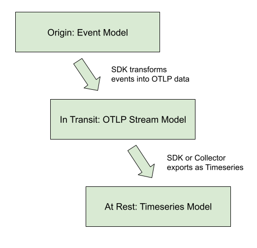

# Metrics Data Model

**Status**: [Experimental](../document-status.md)

<!-- Re-generate TOC with `markdown-toc --no-first-h1 -i` -->

<!-- toc -->

<!-- tocstop -->

## Overview

The OpenTelemetry data model for metrics consists of a protocol specification
and semantic conventions for delivery of pre-aggregated metric timeseries data.
The data model is designed for importing data from existing systems and
exporting data into existing systems, as well as to support internal
OpenTelemetry use-cases for generating Metrics from streams of Spans or Logs.

Popular existing metrics data formats can be unambiguously translated into the
OpenTelemetry data model for metrics, without loss of semantics or fidelity.
Translation from the Prometheus and Statsd exposition formats is explicitly
specified.

The data model specifies a number of semantics-preserving data transformations
for use on the collection path, supporting flexible system configuration. The
model supports reliability and statelessness controls, through the choice of
cumulative and delta transport. The model supports cost controls, through
spatial and temporal reaggregation.

The OpenTelemetry collector is designed to accept metrics data in a number of
formats, transport data using the OpenTelemetry data model, and then export into
existing systems. The data model can be unambiguously translated into the
Prometheus Remote Write protocol without loss of features or semantics, through
well-defined translations of the data, including the ability to automatically
remove attributes and lower histogram resolution.

## Events → Data Stream → Timeseries

The OTLP Metrics protocol is designed as a standard for transporting metric
data. To describe the intended use of this data and the associated semantic
meaning, OpenTelemetry metric data stream types will be linked into a framework
containing a higher-level model, about Metrics APIs and discrete input values,
and a lower-level model, defining the Timeseries and discrete output values.
The relationship between models is displayed in the diagram below.

This protocol was designed to meet the requirements of the OpenCensus Metrics
system, particularly to meet its concept of Metrics Views. Views are
accomplished in the OpenTelemetry Metrics data model through support for data
transformation on the collection path.

OpenTelemetry has identified three kinds of semantics-preserving Metric data
transformation that are useful in building metrics collection systems as ways of
controlling cost, reliability, and resource allocation. The OpenTelemetry
Metrics data model is designed to support these transformations both inside an
SDK as the data originates, or as a reprocessing stage inside the OpenTelemetry
collector. These transformations are:

1. Temporal reaggregation: Metrics that are collected at a high-frequency can be
   re-aggregated into longer intervals, allowing low-resolution timeseries to be
   pre-calculated or used in place of the original metric data.
2. Spatial reaggregation: Metrics that are produced with unwanted dimensions can
   be re-aggregated into metrics having fewer dimensions.
3. Delta-to-Cumulative: Metrics that are input and output with Delta temporality
   unburden the client from keeping high-cardinality state. The use of deltas
   allows downstream services to bear the cost of conversion into cumulative
   timeseries, or to forego the cost and calculate rates directly.

OpenTelemetry Metrics data streams are designed so that these transformations
can be applied automatically to streams of the same type, subject to conditions
outlined below. Every OTLP data stream has an intrinsic
[decomposable aggregate function](https://en.wikipedia.org/wiki/Aggregate_function#Decomposable_aggregate_functions)
making it semantically well-defined to merge data points across both temporal
and spatial dimensions. Every OTLP data point also has two meaningful timestamps
which, combined with intrinsic aggregation, make it possible to carry out the
standard metric data transformations for each of the model’s basic points while
ensuring that the result carries the intended meaning.

As in OpenCensus Metrics, metrics data can be transformed into one or more
Views, just by selecting the aggregation interval and the desired dimensions.
One stream of OTLP data can be transformed into multiple timeseries outputs by
configuring different Views, and the required Views processing may be applied
inside the SDK or by an external collector.

### Example Use-cases

The metric data model is designed around a series of "core" use cases.  While
this list is not exhaustive, it is meant to be representative of the scope and
breadth of OTel metrics usage.

1. OTel SDK exports 10 second resolution to a single OTel collector, using
  cumulative temporality for a stateful client, stateless server:
    - Collector passes-through original data to an OTLP destination
    - Collector re-aggregates into longer intervals without changing dimensions
    - Collector re-aggregates into several distinct views, each with a subset of
      the available dimensions, outputs to the same destination
2. OTel SDK exports 10 second resolution to a single OTel collector, using delta
  temporality for a stateless client, stateful server:
    - Collector re-aggregates into 60 second resolution
    - Collector converts delta to cumulative temporality
3. OTel SDK exports both 10 seconds resolution (e.g. CPU, request latency) and
  15 minutes resolution (e.g. room temperature) to a single OTel Collector.
  The collector exports streams upstream with or without aggregation.
4. A number of OTel SDKs running locally each exports 10 second resolution, each
  reports to a single (local) OTel collector.
    - Collector re-aggregates into 60 second resolution
    - Collector re-aggregates to eliminate the identity of individual SDKs (e.g.,
      distinct `service.instance.id` values)
    - Collector outputs to an OTLP destination
5. Pool of OTel collectors receive OTLP and export Prometheus Remote Write
    - Collector joins service discovery with metric resources
    - Collector computes “up”, staleness marker
    - Collector applies a distinct external label
6. OTel collector receives Statsd and exports OTLP
    - With delta temporality: stateless collector
    - With cumulative temporality: stateful collector
7. OTel SDK exports directly to 3P backend

These are considered the "core" use-cases used to analyze tradeoffs and design
decisions within the metrics data model.

### Out of Scope Use-cases

The metrics data model is NOT designed to be a perfect rosetta stone of metrics.
Here are a set of use cases that, while won't be outright unsupported, are not
in scope for key design decisions:

- Using OTLP as an intermediary format between two non-compatible formats
  - Importing [statsd](https://github.com/statsd/statsd) => Prometheus PRW
  - Importing [collectd](https://collectd.org/wiki/index.php/Binary_protocol#:~:text=The%20binary%20protocol%20is%20the,some%20documentation%20to%20reimplement%20it)
    => Prometheus PRW
  - Importing Prometheus endpoint scrape => [statsd push | collectd | opencensus]
  - Importing OpenCensus "oca" => any non OC or OTel format
- TODO: define others.

## Model Details

OpenTelemetry fragments metrics into three interacting models:

- An Event model, representing how instrumentation reports metric data.
- A Timeseries model, representing how backends store metric data.
- A Metric Stream model, defining the *O*pen*T*e*L*emetry *P*rotocol (OTLP)
  representing how metric data streams are manipulated and transmitted between
  the Event model and the Timeseries storage.

### Event Model

The event model is where recording of data happens. Its foundation is made of
[Instruments](api.md), which are used to record data observations via events.
These raw events are then transformed in some fashion before being sent to some
other system.  OpenTelemetry metrics are designed such that the same instrument
and events can be used in different ways to generate metric streams.

Even though observation events could be reported directly to a backend, in
practice this would be infeasible due to the sheer volume of data used in
observability systems, and the limited amount of network/cpu telemetry
collection resources available for telemetry collection purposes. The best
example of this is the Histogram metric where raw events are recorded in a
compressed format rather than individual timeseries.

> Note: The above picture shows how one instrument can transform events into
> more than one type of metric stream. There are caveats and nuances for when
> and how to do this.  Instrument and metric configuration are outlined
> in the [metrics API specification](api.md).

While OpenTelemetry provides flexibility in how instruments can be transformed
into metric streams, the instruments are defined such that a reasonable default
mapping can be provided. The exact
[OpenTelemetry instruments](api.md##metric-instruments) are more fully
detailed in the API specification.

In the Event model, the primary data are (instrument, number) points, originally
observed in real time or on demand (for the synchronous and asynchronous cases,
respectively).

### Timeseries Model

In this low-level metrics data model, a Timeseries is defined by an entity
consisting of several metadata properties:

- Metric name
- Label set
- Kind of point (integer, floating point, etc)
- Unit of measurement

The primary data of each timeseries are ordered (timestamp, value) points, for
three value types:

1. Counter (Monotonic, cumulative)
2. Gauge
3. Histogram

This model may be viewed as an idealization of
[Prometheus Remote Write](https://docs.google.com/document/d/1LPhVRSFkGNSuU1fBd81ulhsCPR4hkSZyyBj1SZ8fWOM/edit#heading=h.3p42p5s8n0ui).
Like that protocol, we are additionally concerned with knowing when a point
value is defined, as compared with being implicitly or explicitly absent. A
metric stream of delta data points defines time-interval values, not
point-in-time values.  To precisely define presence and absence of data requires
further development of the correspondence between these models.

### OpenTelemetry Protocol data model

The OpenTelmetry protocol data model is composed of Metric data streams. These
streams are in turn composed of metric data points. Metric data streams
can be converted directly into Timeseries, and share the same identity
characteristics for a Timeseries. A metric stream is identified by:

- The originating `Resource`
- The metric stream's `name`.
- The attached `Attribute`s
- The metric stream's point kind.

It is possible (and likely) that more than one metric stream is created per
`Instrument` in the event model.

__Note: The same `Resource`, `name` and `Attribute`s but differing point kind
coming out of an OpenTelemetry SDK is considered an "error state" that should
be handled by an SDK.__

A metric stream can use one of three basic point kinds, all of
which satisfy the requirements above, meaning they define a decomposable
aggregate function (also known as a “natural merge” function) for points of the
same kind. [1](#otlpdatapointfn)

The basic point kinds are:

1. [Sum](https://github.com/open-telemetry/opentelemetry-proto/blob/main/opentelemetry/proto/metrics/v1/metrics.proto#L200)
2. [Gauge](https://github.com/open-telemetry/opentelemetry-proto/blob/main/opentelemetry/proto/metrics/v1/metrics.proto#L170)
3. [Histogram](https://github.com/open-telemetry/opentelemetry-proto/blob/main/opentelemetry/proto/metrics/v1/metrics.proto#L228)

Comparing the OTLP Metric Data Stream and Timeseries data models, OTLP does
not map 1:1 from its point types into timeseries points. In OTLP, a Sum point
can represent a monotonic count or a non-monotonic count. This means an OTLP Sum
is either translated into a Timeseries Counter, when the sum is monotonic, or
a Gauge when the sum is not monotonic.

Specifically, in OpenTelemetry Sums always have an aggregate function where
you can combine via addition. So, for non-monotonic sums in OpenTelemetry we
can aggregate (naturally) via addition.  In the timeseries model, you cannot
assume that any particular Gauge is a sum, so the default aggregation would not
be addition.

In addition to the core point kinds used in OTLP, there are also data types
designed for compatibility with existing metric formats.

- [Summary](#summary-legacy)

## Metric points

### Sums

[Sum](https://github.com/open-telemetry/opentelemetry-proto/blob/main/opentelemetry/proto/metrics/v1/metrics.proto#L202)s
in OTLP consist of the following:

- An *Aggregation Temporality* of delta or cumulative.
- A flag denoting whether the Sum is
  [monotonic](https://en.wikipedia.org/wiki/Monotonic_function). In this case of
  metrics, this means the sum is nominally increasing, which we assume without
  loss of generality.
  - For delta monotonic sums, this means the reader should expect non-negative
    values.
  - For cumulative monotonic sums, this means the reader should expect values
    that are not less than the previous value.
- A set of data points, each containing:
  - An independent set of Attribute name-value pairs.
  - A time window (of `(start, end]`) time for which the Sum was calculated.
    - The time interval is inclusive of the end time.
    - Times are specified in Value is UNIX Epoch time in nanoseconds since
      `00:00:00 UTC on 1 January`

The aggregation temporality is used to understand the context in which the sum
was calculated. When the aggregation temporality is "delta", we expect to have
no overlap in time windows for metric streams, e.g.

Contrast with cumulative aggregation temporality where we expect to report the
full sum since 'start' (where usually start means a process/application start):

There are various tradeoffs between using Delta vs. Cumulative aggregation, in
various use cases, e.g.:

- Detecting process restarts
- Calculating rates
- Push vs. Pull based metric reporting

OTLP supports both models, and allows APIs, SDKs and users to determine the
best tradeoff for their use case.

### Gauge

Pending

### Histogram

Pending

### Summary (Legacy)

[Summary](https://github.com/open-telemetry/opentelemetry-proto/blob/main/opentelemetry/proto/metrics/v1/metrics.proto#L244)
metric data points convey quantile summaries, e.g. What is the 99-th percentile
latency of my HTTP server.  Unlike other point types in OpenTelemetry, Summary
points cannot always be merged in a meaningful way. This point type is not
recommended for new applications and exists for compatibility with other
formats.

## Single-Writer

All metric data streams within OTLP must have one logical writer.  This means,
conceptually, that any Timeseries created from the Protocol must have one
originating source of truth.  In practical terms, this implies the following:

- All metric data streams produced by OTel SDKs must be globally uniquely
  produced and free from duplicates.   All metric data streams can be uniquely
  identified in some way.
- Aggregations of metric streams must only be written from a single logical
  source.
  __Note: This implies aggregated metric streams must reach one destination__.

In systems, there is the possibility of multiple writers sending data for the
same metric stream (duplication).  For example, if an SDK implementation fails
to find uniquely identifying Resource attributes for a component, then all
instances of that component could be reporting metrics as if they are from the
same resource.  In this case, metrics will be reported at inconsistent time
intervals.  For metrics like cumulative sums, this could cause issues where
pairs of points appear to reset the cumulative sum leading to unusable metrics.

Multiple writers for a metric stream is considered an error state, or
misbehaving system. Receivers SHOULD presume a single writer was intended and
eliminate overlap / deduplicate.

Note: Identity is an important concept in most metrics systems.  For example,
[Prometheus directly calls out uniqueness](https://prometheus.io/docs/prometheus/latest/configuration/configuration/#metric_relabel_configs):

> Care must be taken with `labeldrop` and `labelkeep` to ensure that metrics
> are still uniquely labeled once the labels are removed.

For OTLP, the Single-Writer principle grants a way to reason over error
scenarios and take corrective actions.  Additionally, it ensures that
well-behaved systems can perform metric stream manipulation without undesired
degradation or loss of visibility.

## Temporality

Every OTLP point has two associated timestamps. For OTLP Sum and Histogram
points, the two timestamps indicate when the point was reset and when the sum
was captured. For OTLP Gauge points, the two timestamps indicate when the
measurement was taken and when it was reported as being still the last value.

The notion of temporality refers to a configuration choice made in the system
as a whole, indicating whether reported values incorporate previous
measurements, or not.

- *Cumulative temporality* means that successive data points repeat the starting
  timestamp. For example, from start time T0, cumulative data points cover time
  ranges (T0, T1), (T0, T2),
  (T0, T3), and so on.
- *Delta temporality* means that successive data points advance the starting
  timestamp. For example, from start time T0, delta data points cover time
  ranges (T0, T1), (T1, T2),
  (T2, T3), and so on.

The use of cumulative temporality for monotonic sums is common, exemplified by
Prometheus. Systems based in cumulative monotonic sums are naturally simpler, in
terms of the cost of adding reliability. When collection fails intermittently,
gaps in the data are naturally averaged from cumulative measurements.
Cumulative data requires the sender to remember all previous measurements, an
“up-front” memory cost proportional to cardinality.

The use of delta temporality for metric sums is also common, exemplified by
Statsd. There is a connection between OpenTelemetry tracing, in which a Span
event commonly is translated into two metric events (a 1-count and a timing
measurement). Delta temporality enables sampling and supports shifting the cost
of cardinality outside of the process.

## Overlap

Overlap occurs when more than one metric data point occurs for a data stream
within a time window.   This is particularly problematic for data points meant
to represent an entire time window, e.g. a Histogram reporting population
density of collected metric data points for a time window.  If two of these show
up with overlapping time windows, how do backends handle this situation?

We define three principles for handling overlap:

- Resolution (correction via dropping points)
- Observability (allowing the data to flow to backends)
- Interpolation (correction via data manipulation)

### Overlap resolution

When more than one process writes the same metric data stream, OTLP data points
may appear to overlap. This condition typically results from misconfiguration, but
can also result from running identical processes (indicative of operating system
or SDK bugs, like missing
[process attributes](../resource/semantic_conventions/process.md)). When there
are overlapping points, receivers SHOULD eliminate points so that there are no
overlaps. Which data to select in overlapping cases is not specified.

### Overlap observability

OpenTelemetry collectors SHOULD export telemetry when they observe overlapping
points in data streams, so that the user can monitor for erroneous
configurations.

### Overlap interpolation

When one process starts just as another exits, the appearance of overlapping
points may be expected. In this case, OpenTelemetry collectors SHOULD modify
points at the change-over using interpolation for Sum data points, to reduce
gaps to zero width in these cases, without any overlap.

## Resources

Pending

## Temporal Alignment

Pending

## External Labels

Pending

## Stream Manipulations

Pending introduction.

### Sums: Delta-to-Cumulative

While OpenTelemetry (and some metric backends) allows both Delta and Cumulative
sums to be reported, the timeseries model we target does not support delta
counters.  To this end, converting from delta to cumulative needs to be defined
so that backends can use this mechanism.

> Note: This is not the only possible Delta to Cumulative algorithm.  It is
> just one possible implementation that fits the OTel Data Model.

Converting from delta points to cumulative point is inherently a stateful
operation.  To successfully translate, we need all incoming delta points to
reach one destination which can keep the current counter state and generate
a new cumulative stream of data (see [single writer princple](#single-writer)).

The algorithm is scheduled out as follows:

- Upon receiving the first Delta point for a given counter we set up the
  following:
  - A new counter which stores the cumulative sum, set to the initial counter.
  - A start time that aligns with the start time of the first point.
  - A "last seen" time that aligns with the time of the first point.
- Upon receiving future Delta points, we do the following:
  - If the next point aligns with the expected next-time window
    (see [detecting delta restarts](#sums-detecting-alignment-issues))
    - Update the "last seen" time to align with the time of the current point.
    - Add the current value to the cumulative counter
    - Output a new cumulative point with the original start time and current
      last seen time and count.
  - if the current point precedes the start time, then drop this point.
    Note: there are algorithms which can deal with late arriving points.
  - if the next point does NOT align with the expected next-time window, then
    reset the counter following the same steps performed as if the current point
    was the first point seen.

#### Sums: detecting alignment issues

When the next delta sum reported for a given metric stream does not align with
where we expect it, one of several things could have occurred:

- the process reporting metrics was rebooted, leading to a new reporting
  interval for the metric.
- A Single-Writer principle violation where multiple processes are reporting the
  same metric stream.
- There was a lost data point, or dropped information.

In all of these scenarios we do our best to give any cumulative metric knowledge
that some data was lost, and reset the counter.

We detect alignment via two mechanisms:

- If the incoming delta time interval has significant overlap with the previous
  time interval, we must assume a violation of the single-writer principle.
- If the incoming delta time interval has a significant gap from the last seen
  time, we assume some kind of reboot/restart and reset the cumulative counter.

#### Sums: Missing Timestamps

One degenerate case for the delta-to-cumulative algorithm is when timestamps
are missing from metric data points. While this shouldn't be the case when
using OpenTelemetry generated metrics, it can occur when adapting other metric
formats, e.g.
[StatsD counts](https://github.com/statsd/statsd/blob/master/docs/metric_types.md#counting).

In this scenario, the algorithm listed above would reset the cumulative sum on
every data point due to not being able to deterimine alignment or point overlap.
For comparison, see the simple logic used in
[statsd sums](https://github.com/statsd/statsd/blob/master/stats.js#L281)
where all points are added, and lost points are ignored.

## Footnotes

<a name="otlpdatapointfn">[1]</a>: OTLP supports data point kinds that do not
satisfy these conditions; they are well-defined but do not support standard
metric data transformations.
