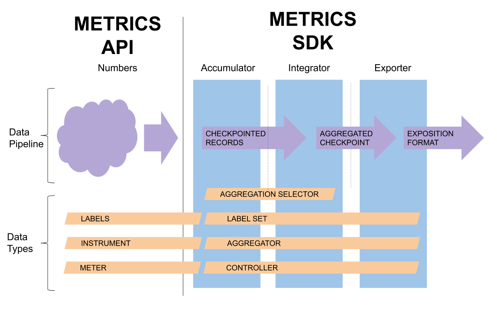

# Metric SDK

Note: This document assumes you are familiar with the (Metrics
API)[api.md] specification.

TODO: TOC

## Purpose

This document describes a model implementation of the OpenTelemetry
Metrics SDK.  The architectural details of the model SDK described
here are meant to offer guidance to implementors, not to mandate an
exact reproduction of the model architecture across languages.

## Expectations

The SDK implementors are expected to follow the best practices for the
language and runtime environment when implementing the OpenTelemetry
API.  Implementors SHOULD follow the general prescriptions on safety
and performance given in [OpenTelemetry library
guidelines](../library-guidelines.md).

## Export Pipeline Terminology

*Export Pipeline* is used to describe a whole assembly of SDK parts.
There are three major components of the Metric SDK that data flows
through, in order:

1. *Accumulator*: Receives metric events from the API, computes one Aggregator per active (Instrument, Label Set)
2. *Processor*: Receives Accumulations from the Accumulator, transforms into CheckpointSet
3. *Exporter*: Receives CheckpointSet, transforms into some protocol and sends it somewhere.

These terms are defined in the API specification:

- *Metric Instrument*: the API object used by a developer for instrumentation
- *Synchronous Instrument*: a metric instrument called by the user with application context
- *Asynchronous Instrument*: a metric instrument invoked through a callback from the SDK
- *Metric Descriptor*: describes a metric instrument
- *Metric Event*: a single recorded or observed (Instrument, Label Set, Measurement)
- *Collection Interval*: the period between calls to Accumulator.Collect()
- *Label*: a key-value describing a property of the metric event
- *Label Set*: a set of key-values with unique keys
- *Measurement*: an integer or floating point number
- *Resource*: a set of key-values with unique keys describing the process

These are the significant Key data types used in the model architecture

- *Aggregator*: aggregates one or more measurements in a useful way
- *AggregatorSelector*: chooses which Aggregator to assign to a metric instrument
- *Aggregation*: the result of aggregating one or more events by a specific aggregator
- *AggregationKind*: describes the kind of read API the Aggregation supports (e.g., Sum)
- *Accumulation*: consists of Instrument, Label Set, Resource, and Aggregator snapshot
- *CheckpointSet*: a set of export records
- *Controller*: coordinates the Accumulator, Processor, and Exporter components in an export pipeline.
- *Export Record*: consists of Instrument, Label Set, Resource, Timestamp(s), and Aggregation
- *ExportKind*: one of Delta, Cumulative, or Pass-Through
- *ExportKindSelector*: chooses which ExportKind to use for a metric instrument

## Dataflow Diagram

## Accumulator Detail

## Basic Processor Detail

## Exporter Detail

## Controller Detail

## Reducing Processor

## Aggregator implementations

The Aggregator interface supports combining multiple metric events
into a single aggregated state.  Different concrete aggregator types
provide different functionality and levels of concurrent performance.

Aggregators MUST support `Update()`, `Checkpoint()`, and `Merge()`
operations.  `Update()` is called directly from the Meter in response
to a metric event, and may be called concurrently.  `Update()` is also
passed the caller's distributed context, which allows it to access the
current span context and distributed correlations, however none of the
built-in aggregators use span context or distributed correlations.

The `Checkpoint()` operation is called to atomically save a snapshot
of the Aggregator, since `Checkpoint()` may be called concurrently
with `Update()`.  The `Merge()` operation supports dimensionality
reduction by combining state from multiple aggregators into a single
Aggregator state.

The Metric SDK SHOULD include six built-in aggregator types.  Two
standard aggregators MUST be included that implement standard counter
and gauge aggregations.

1. Counter: This aggregator MUST maintain a Sum.  In languages with
support for atomic operations, the Counter aggregator SHOULD be
implemented using only a single word of memory for the current state
and a single word of memory for its checkpoint.
1. Gauge: This aggregator MUST maintain the last value and its
timestamp.  In languages with support for atomic operations, this
aggregator's update operation SHOULD be implemented by a single memory
allocation--to store the value and timestamp--followed by an atomic
pointer swap; if the gauge is defined as monotonic, it should use
atomic compare-and-swap to ensure monotonicity.

Aggregators for [Measure metric instruments](api-metrics.md#measure)
are more challenging in nature than the Counter and Gauge aggregators,
since their task is to aggregate a series of individual measurements.
To perform this duty exactly requires storing the entire set of
measurements, which may be cost-prohibitive.  The common mechanisms
for exporting recorded measurements from a Measure metric instrument
are: as a series of raw measurements, as a summary of pre-determined
quantiles, and as a histogram with pre-determined boundaries.  A
definition for _Quantile_ is given below.

Four aggregators SHOULD be provided for use with Measure metric
instruments that support the common mechanisms for exporting recorded
measurements with a range of performance options.

1. MinMaxSumCount: This aggregator is intended as an inexpensive
alternative to the Sketch, Histogram, and Exact aggregators for
Measure instruments.  This aggregator MUST compute the min, max, sum,
and count of recorded measurements.  In languages with support for
atomic operations, this aggregator's update operation SHOULD maintain
its state using four independent atomic updates.  In this case, the
aggregator's update operation SHOULD NOT be atomic with respect to its
checkpoint operation, implying that a checkpoint could witness an
inconsistent state; that is intentional given the inexpensive nature
of this aggregator.
1. Sketch: This aggregator computes an approximate data structure that
MUST estimate quantiles of the distribution of recorded measurements.
Example algorithms that could be used to implement this aggregator are
include: GK-Sketch, DDSketch, Q-Digest, T-Digest, and HDR-Histogram.
The choice of algorithm should be made based on available libraries in
each language, but implementations with well-defined error bounds
SHOULD be preferred.
1. Histogram: This aggregator MUST compute a histogram with
pre-determined boundaries.  This aggregator MAY support quantile
estimation, but is generally intended for cases where a histogram will
be exported directly and the exporter wants explicit control over
histogram boundaries.
1. Exact: This aggregator MUST store an array of all recorded
measurements.  This aggregator MUST support exact quantile
computations and it MUST support exporting raw values in the order
they were recorded, however it is not required to support both of
these modes simultaneously (since computing quantiles requires sorting
the measurements).

### Quantile definition

When exporting a summary of recorded measurements for a Measure metric
instrument, it is common to report _quantiles_ of the distribution.
When computing quantiles from an exact aggregation (i.e., the complete
data set), the "nearest rank" definition of quantile SHOULD be used.
The nearest-rank definition ensures that the resulting value belongs
to the original data set.  Interpolation is not used in this method.

The definition for the nearest-rank quantile given here makes use of
the _cumulative distribution function_, a standard concept from
probability theory.  Quantiles are parameterized by `q`, where `0 <= q
<= 1`.  The value for quantile `q` is the least element of the
original data set at or above the point where the cumulative
distribution function equals `q`.

For example, taking a data set of five values `{10, 20, 30, 40, 50}`,
the `q=0.5` quantile (i.e., the median) equals 30, which is precisely
the point where the cumulative distribution function equals 0.5.

With an even-sized data set, for example `{10, 20, 30, 40}`, the
`q=0.5` quantile equals 30.  In this case, the cumulative distribution
function equals 0.5 halfway between 20 and 30 and the greater value is
selected as the nearest rank.

When using an approximate aggregator to compute estimated quantile
values, the nearest-rank quantile definition does not apply.
