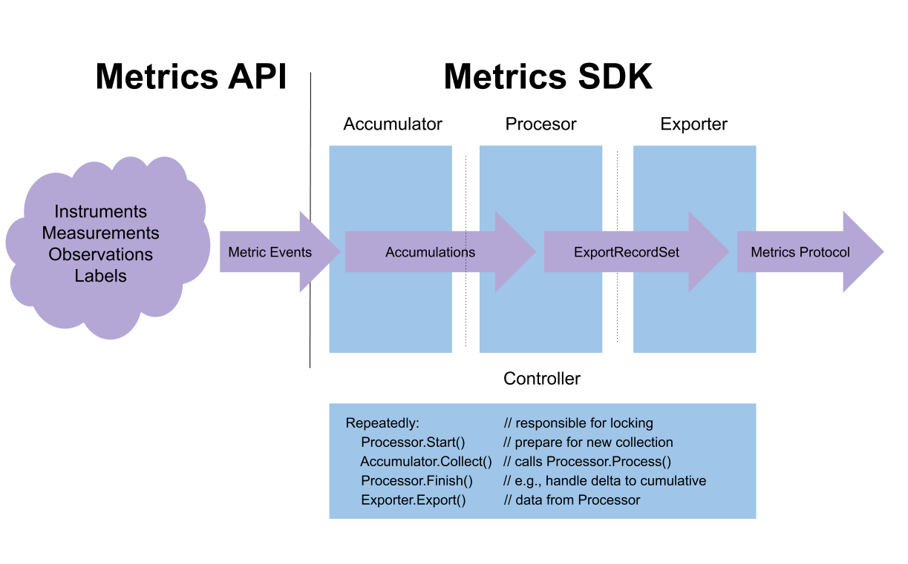
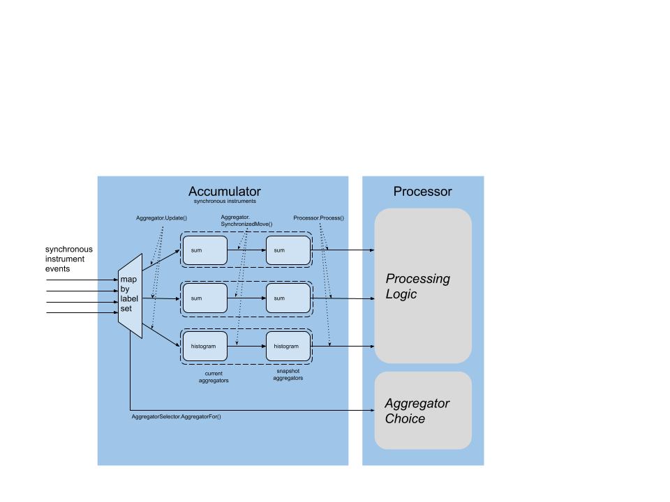

# Metrics SDK

TODO: TOC

## Purpose

This document has two parts.  In the first part, the requirements of
the default OpenTelemetry Metric SDK are listed.  These are rules for
language implementors to follow in any approach to implementing the
OpenTelemetry API.

In the second part, the architectural details of a model SDK
implementation are described, using the OpenTelemetry-Go Metric SDK as
an example.  This is meant to show how the requirements can be
implemented, as guidance for implementors, not to mandate an exact
reproduction of the model architecture across languages.
OpenTelemetry SDKs are of course free to use any idiomatic approach.

## Expectations

This document assumes you are familiar with the OpenTelemetry [Metrics
API specification](api.md).

The SDK implementors are expected to follow the best practices for the
language and runtime environment when implementing the OpenTelemetry
API.  Implementors SHOULD follow the general prescriptions on safety
and performance given in [OpenTelemetry library
guidelines](../library-guidelines.md).

## SDK Terminology

The Metrics SDK provides an implementation of the Metrics API, which
has terms that it uses to refer to the SDK:

- **Meter**: An interface that supplies the OpenTelemetry Metric API, bound together with Resources and the Instrumentation Library
- **MeterProvider**: An interface for obtaining **Meter** instances given the Instrumentation Library.

These terms are useful to describe the boundary between the API and
the SDK, but they are API-level constructs.  We can use API-level
terms to describe the boundary between the SDK and the API, but from
the API's perspective the SDK is opaque and without structure.

This document specifies the internal structure of the default
OpenTelemetry SDK in terms of its major components, with terminology
chosen to explain each component's role in exporting metric data from the
input (API-level events) to the output (a metric exposition format).
We use the term **Export Pipeline** as a functional description of the
SDK at this level.

There are three major components of the export pipeline that data
flows through, in order:

1. **Accumulator**: Receives metric events from the API through Instruments, computes one Accumulation per active Instrument and Label Set pair
2. **Processor**: Receives Accumulations from the Accumulator, transforms into ExportRecordSet
3. **Exporter**: Receives ExportRecordSet, transforms into some protocol and sends it somewhere.

The **Controller** component coordinates the Accumulator, Processor,
and Exporter in an export pipeline.

These terms are defined in the Metrics API specification:

- **Metric Instrument**: the API object used by a developer for instrumentation
- **Synchronous Instrument**: a metric instrument called by the user with application context
- **Asynchronous Instrument**: a metric instrument invoked through a callback from the SDK
- **Metric Descriptor**: describes a metric instrument
- **Metric Event**: a single recorded or observed (Instrument, Label Set, Measurement)
- **Collection Interval**: the period between calls to Accumulator.Collect()
- **Label**: a key-value describing a property of the metric event
- **Label Set**: a set of key-values with unique keys
- **Measurement**: an integer or floating point number from a synchronous instrument
- **Observation**: an integer or floating point number from an asynchronous instrument.

Defined in the [Resource SDK](../resource/sdk.md) specification:

- **Resource**: a set of key-values with unique keys describing the process
- **Instrumentation Library**: the name and version associated with a package of instrumentation.

These are the significant data types used in the model architecture:

- **Aggregator**: aggregates one or more measurements in a useful way
- **Aggregator snapshot**: copy of an synchronous instrument aggregator taken during collection
- **AggregatorSelector**: chooses which Aggregator to assign to a metric instrument
- **Accumulation**: consists of Instrument, Label Set, Resource, and Aggregator snapshot, output by Accumulator
- **Aggregation**: the result of aggregating one or more events by a specific aggregator, output by Processor
- **AggregationKind**: describes the kind of read API the Aggregation supports (e.g., Sum)
- **ExportKind**: one of Delta, Cumulative, or Pass-Through
- **ExportKindSelector**: chooses which ExportKind to use for a metric instrument.
- **ExportRecord**: consists of Instrument, Label Set, Resource, Timestamp(s), and Aggregation
- **ExportRecordSet**: a set of export records.

The term **SDK instrument** refers to the underlying implementation of
an instrument.

## Dataflow Diagram

From an external perspective, the Metrics SDK implements the `Meter`
and `MeterProvider` interfaces described in the [Metrics API](api.md).
From an internal perspective, the Metrics SDK encapsulates an export
pipeline for metric data consisting of four major components.



The Accumulator component is where metric events are concurrently
passed to an Aggregator, and it is this component that is most
responsible for SDK performance.  The Accumulator is responsible for
organizing bound and unbound instruments, updating and synchronized
copying of Aggregator state, invoking Observer instruments, and the
collection cycle.

The Processor component is intended as the most customizable component
in the export pipeline.  The Processor is responsible for selecting
Aggregators to use for specific instruments, via an independent
`AggregationSelector` interface, for reducing dimensionality, and for
conversion between DELTA and CUMULATIVE data point representation.
The Processor interface supports arbitrary protocol-independent data
transformation, and Processors can be chained together to form more
complex export pipelines.

The Exporter component converts processed data into a specific
protocol and exports it somewhere.  Following the [library
guidelines](../library-guidelines.md), exporters are expected to
contain contain minimal functionality and customization is preferably
expressed through Processors.

The Controller component coordinates the sequence of actions to
collect, process, and export metric data over a collection interval,
ensuring that access to the export pipeline is properly synchronized.

## Requirements

Requirements are listed below for the major components of the
OpenTelemetry using the terminology outlined above.

The data flow diagram above is meant as an abstraction, for
understanding how the standard component names used in this document
map into a data path.  The diagram is not meant to prescribe an
overall architecture for the SDK, just to name the stages of an export
pipeline and place them in context.

SDKs are required to use the standard names for these components, as
this helps build consistency across OpenTelemetry.  Every SDK SHOULD
include these components and the interfaces detailed below, although
the actual organization of each SDK may differ depending on the
available libraries and performance characteristics of the source
language.  For example, an SDK could be implemented using one
Accumulator per instrument or it could be implemented using one
Accumulator per collection period (assuming support for multiple
collection periods): these are considered implementation details.

### SDK

The SDK is the start an OpenTelemetry Metric export pipeline,
implementing the instrument-related APIs of the [`Meter`
interface](api.md#meter-interface) and providing the SDK instrument,
the Resource, and managing Instrumentation Library metadata.

An SDK is assembled with one or more Accumulators and other
components, detailed below.  The diagram below shows the relationship
between the API and the accumulator, with detail shown for synchronous
instruments.

#### SDK: Instrument Registration

The OpenTelemetry SDK is responsible for ensuring that an individual
Meter implementation cannot report multiple instruments with the same
name and different definitions.  To accomplish this, SDKs MUST reject
duplicate registration of an instrument when another instrument has
already been registered with same metric name to the same named Meter.
The requirement applies even for attempts to register an identical
instrument definition.  We assume that a single instrumentation
library can arrange to use a single instrument definition rather than
rely on the SDK to support duplicate registration.

Separate Meters, characterized by different instrumentation library
names, are permitted to register instruments by the same name as used
in different instrumentation libraries, in which case the SDK MUST
consider these as separate instruments.

The SDK is responsible for implementing any syntactic requirements for
metric names included in the API specification.  TODO: link to this
after [OTEP
108](https://github.com/open-telemetry/oteps/blob/master/text/metrics/0108-naming-guidelines.md)
is written into the API specification.

#### SDK: RecordBatch() function

TODO: _Add functional requirements for RecordBatch()_.

#### SDK: Collect() function

The SDK is responsible for implementing a `Collect()` function that
calls through to one or more Accumulators.  This specification
deliberately avoids requiring a specific relationship between the SDK
and Accumulator; it is considered an implementation detail whether a
the SDK maintains one Accumulator, one Accumulator per instrument, or
some configuration in between.

The SDK `Collect()` function MUST call through to the Processor with
Accumulations from the active synchronous instruments as well as all
the registered asynchronous instruments.

The SDK MUST permit synchronous metric instruments to be used during
evaluation of asynchronous instrument callbacks.  The use of
synchronous instruments from asynchronous instrument callbacks is
considered a side-effect, in this case.  SDKs SHOULD process
synchronous instruments after asynchronous instruments, so that
side-effect synchronous measurements are processed as part of the same
collection interval that contains the corresponding asynchronous
observations.

### Accumulator

For a synchronous instrument, the accumulator will:

1. Map each active Label Set to a record, consisting of two instances of the same type Aggregator
2. Enter new records into the mapping, calling the AggregationSelector if needed
3. Update the current Aggregator instance, responding to concurrent API events
4. Call Aggregator.SynchronizedMove on the current Aggregator instance to: (a) copy its value into the snapshot Aggregator instance and (b) reset the current Aggregator to the zero state
5. Call Processor.Process for every resulting Accumulation (i.e., Instrument, Label Set, Resource, and Aggregator snapshot)



The Accumulator MUST provide the option to associate a
[`Resource`](../resource/sdk.md) with the Accumulations that it
produces.

Synchronous metric instruments are expected to be used concurrently.
Unless concurrency is not a feature of the source language, the SDK
Accumulator component SHOULD be designed with concurrent performance
in mind.

The Accumulator MAY use exclusive locking to maintain a map of
synchronous instrument updates.  The Accumulator SHOULD NOT hold an
exclusive lock while calling an Aggregator (see below), since some
Aggregators may have higher concurrency expectations.

#### Accumulator: Collect() function

The Accumulator MUST implement a Collect method that builds and
processes current Accumulation values for active instruments, meaning
those that were updated since the prior collection.  The Collect
method MUST call the Processor to process Accumulations corresponding
to all metric events that happened before the call.

Accumulations MUST be computed during Collect using a _synchronized
move_ operation on the Aggregator.  This operation, using some kind of synchronization, copies
the current Aggregator and resets it to the zero state, so that each
Aggregator immediately begins accumulating events for the next
collection period while the current one is processed.  An Accumulation
is defined as the synchronously-copied Aggregator combined with the
LabelSet, Resource, and metric Descriptor.

TODO: _Are there more Accumulator functional requirements?_

### Processor

TODO _Processor functional requirements_

### Controller

TODO _Controller functional requirements_

### Aggregator

TODO _Aggregator functional requirements_

The Sum Aggregator SHOULD use atomic operations, if possible and where
there is concurrency.

## Model Implementation

The model implementation is based on the [OpenTelemetry-Go
SDK](https://github.com/open-telemetry/opentelemetry-go).  This
section is meant as guidance for implementors, SDK implementors are of
course recommended to use an idiomatic approach in their source
language.

### Accumulator: Meter Implementation

To construct a new Accumulator, provide the Processor and options.

```go
// NewAccumulator constructs a new Accumulator for the given
// Processor and options.
func NewAccumulator(processor export.Processor, opts ...Option) *Accumulator

// WithResource sets the Resource configuration option of a Config.
func WithResource(res *resource.Resource) Option
```

The Accumulator is called by the Controller (see below) to coordinate
collection using a `Collect()` method.

```go
// Collect traverses the list of active instruments and exports
// data.  Collect() may not be called concurrently.
//
// During the collection pass, the Processor will receive
// one Process(Accumulation) call per current aggregation.
//
// Returns the number of accumulations that were exported.
func (m *Accumulator) Collect(ctx context.Context) int
```

#### Implement the SDK-level API matching the user-level Metric API

This interface sits at the boundary of the SDK and the API, with three
core methods:

```go
// MeterImpl is the interface an SDK must implement to supply a Meter
// implementation.
type MeterImpl interface {
        // RecordBatch atomically records a batch of measurements.
        RecordBatch(context.Context, []label.KeyValue, ...Measurement)

        // NewSyncInstrument returns a newly constructed
        // synchronous instrument implementation or an error, should
        // one occur.
        NewSyncInstrument(descriptor Descriptor) (SyncImpl, error)

        // NewAsyncInstrument returns a newly constructed
        // asynchronous instrument implementation or an error, should
        // one occur.
        NewAsyncInstrument(
                descriptor Descriptor,
                runner AsyncRunner,
        ) (AsyncImpl, error)
}
```

These methods cover all the necessary entry points for implementing
the OpenTelemetry Metric API.

[`RecordBatch`](api.md#recordbatch-calling-convention) is a user-level API
implemented directly by the Accumulator.

The two instrument constructors build [_synchronous_
and _asynchronous_](api.md#synchronous-and-asynchronous-instruments-compared)
SDK instruments.

The user is generally interested in the [Metric API `Meter`
interface](api.md#meter-interface), obtained through a [Metric API
`MeterProvider` interface](api.md#meter-provider).  The `Meter` interface can be
constructed by wrapping the SDK `Meter` implementation:

```go
// WrapMeterImpl constructs a named `Meter` implementation from a
// `MeterImpl` implementation.  The `instrumentationName` is the
// name of the instrumentation library.
func WrapMeterImpl(impl MeterImpl, instrumentationName string, opts ...MeterOption) Meter
```

Optional to this method:

- the instrumentation library version of the named Meter in use.

To help with instrumentat registration:

```go
// NewUniqueInstrumentMeterImpl returns a wrapped metric.MeterImpl with
// the addition of uniqueness checking.
func NewUniqueInstrumentMeterImpl(impl metric.MeterImpl) metric.MeterImpl {
```

#### Provide access to the instrument descriptor

The API `Descriptor` method defines the instrument in terms of
API-level constructs including name, instrument kind, description, and
units of measure.  The SDK instrument MUST provide access to the
`Descriptor` that was passed to its constructor.

```go
// InstrumentImpl is a common interface for synchronous and
// asynchronous instruments.
type InstrumentImpl interface {
        // Descriptor returns a copy of the instrument's Descriptor.
        Descriptor() Descriptor
}
```

##### Synchronous SDK instrument

The [synchronous SDK instrument](api.md#synchronous-instrument-details)
supports both direct and bound calling conventions.

```go
// SyncImpl is the implementation-level interface to a generic
// synchronous instrument (e.g., ValueRecorder and Counter instruments).
type SyncImpl interface {
        // InstrumentImpl provides Descriptor().
        InstrumentImpl

        // Bind creates an implementation-level bound instrument,
        // binding a label set with this instrument implementation.
        Bind(labels []label.KeyValue) BoundSyncImpl

        // RecordOne captures a single synchronous metric event.
        RecordOne(ctx context.Context, number Number, labels []label.KeyValue)
}

// BoundSyncImpl is the implementation-level interface to a
// generic bound synchronous instrument
type BoundSyncImpl interface {

        // RecordOne captures a single synchronous metric event.
        RecordOne(ctx context.Context, number Number)

        // Unbind frees the resources associated with this bound instrument.
        Unbind()
}
```

##### Asynchronous SDK instrument

The [asynchronous SDK instrument](api.md#asynchronous-instrument-details)
supports both single-observer and batch-observer calling conventions.
The interface used for running Observer callbacks is passed at the
constructor, so there are no other API-level access methods for
asynchronous instruments.

```go
// AsyncImpl is an implementation-level interface to an
// asynchronous instrument (e.g., Observer instruments).
type AsyncImpl interface {
        // InstrumentImpl provides Descriptor().
        InstrumentImpl
}
```

The asynchronous "runner" interface (`AsyncRunner`) passed in the
asynchronous SDK instrument constructor supports both
[single](api.md#single-instrument-observer) and
[batch](api.md#batch-observer) calling conventions.  These are
considered language-specific details.

### Export pipeline detail

TODO: define AggregatorSelector, Aggregator, Accumulation, ExportKind,
ExportKindSelector, Aggregation, AggregationKind ExportRecord,
ExportRecordSet

### Processor Detail

TODO: define the Processor interface

#### Basic Processor

TODO: define how ExportKind conversion works (delta->cumulative
required, cumulative->delta optional), Memory option (to not forget
prior collection state).

#### Reducing Processor

TODO: Label filter, LabelFilterSelector

### Controller Detail

TODO: Push, Pull

### Aggregator Implementations

TODO: Sum, LastValue, Histogram, MinMaxSumCount, Exact, and Sketch.

### Pending issues

#### ValueRecorder instrument default aggregation

TODO: The default SDK behavior for `ValueRecorder` instruments is
still in question.  Options are: LastValue, Histogram, MinMaxSumCount,
and Sketch.

[Spec issue 636](https://github.com/open-telemetry/opentelemetry-specification/issues/636)
[OTEP 117](https://github.com/open-telemetry/oteps/pull/117)
[OTEP 118](https://github.com/open-telemetry/oteps/pull/118)

#### Standard sketch histogram aggregation

TODO: T.B.D.: DDSketch considered a good choice for ValueRecorder
instrument default aggregation.
