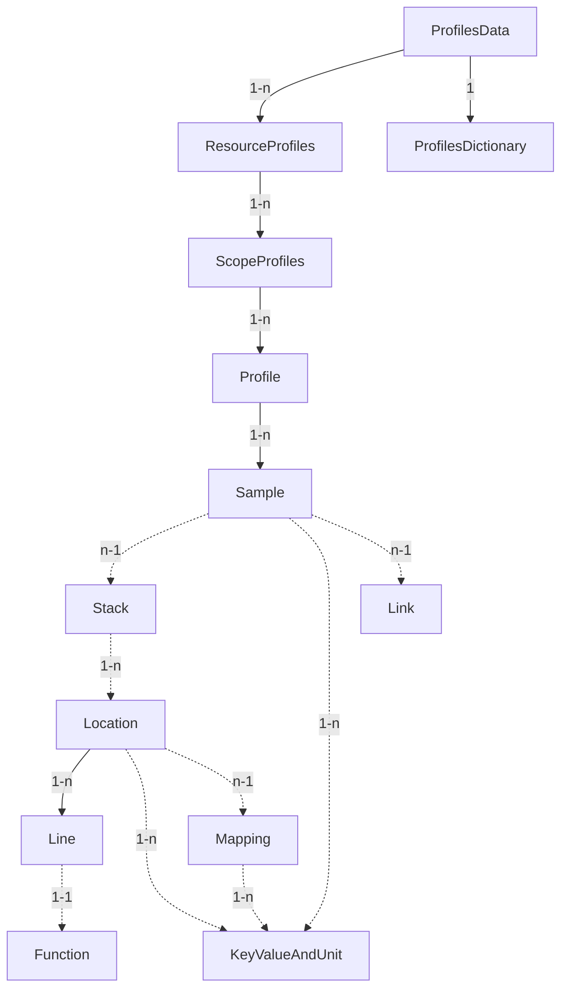

# Profiles Data Format

**Status**: [Alpha](../document-status.md)

<details>
<summary>Table of Contents</summary>

<!-- toc -->

- [Overview](#overview)
- [Notable differences compared to other signals](#notable-differences-compared-to-other-signals)
  * [Message referencing](#message-referencing)
  * [Dictionary](#dictionary)
  * [Attributes](#attributes)
  * [Dictionary use in KeyValue](#dictionary-use-in-keyvalue)
- [Message descriptions](#message-descriptions)
  * [Message: `ProfilesData`](#message-profilesdata)
  * [Message: `ProfilesDictionary`](#message-profilesdictionary)
  * [Message: `ResourceProfiles`](#message-resourceprofiles)
  * [Message: `ScopeProfiles`](#message-scopeprofiles)
  * [Message: `Profile`](#message-profile)
  * [Message: `Sample`](#message-sample)
  * [Message: `Link`](#message-link)
  * [Message: `Stack`](#message-stack)
  * [Message: `Location`](#message-location)
  * [Message: `Line`](#message-line)
  * [Message: `Mapping`](#message-mapping)
  * [Message: `Function`](#message-function)
  * [Message: `ValueType`](#message-valuetype)
  * [Message: `KeyValueAndUnit`](#message-keyvalueandunit)
- [Relationships with other signals](#relationships-with-other-signals)
  * [From profiles to other signals](#from-profiles-to-other-signals)
  * [From other signals to profiles](#from-other-signals-to-profiles)
- [Example payloads](#example-payloads)
  * [Simple CPU profile](#simple-cpu-profile)
  * [CPU profile with resource attributes and span link](#cpu-profile-with-resource-attributes-and-span-link)
- [References](#references)

<!-- tocstop -->

</details>

## Overview

The OpenTelemetry data format for Profiles consists of a protocol specification
and [semantic conventions](https://opentelemetry.io/docs/specs/semconv/general/profiles/)
for encoding and delivery of aggregated stack traces and associated metadata.

The protocol specification is defined in the
[profiles.proto](https://github.com/open-telemetry/opentelemetry-proto/blob/main/opentelemetry/proto/profiles/v1development/profiles.proto)
protobuf file and is based on the [pprof](https://github.com/google/pprof/tree/main/proto) format.
This means that pprof and other established profiling formats can, in most cases,
be unambiguously mapped to this data format. Reverse mapping from this data format is
also possible to the extent that the target profiling format has equivalent capabilities.

The following diagram shows the relationships between messages. Solid arrows represent
embedded relationships whilst dashed arrows represent references by index into a dictionary
table.



## Notable differences compared to other signals

### Message referencing

Most OpenTelemetry signals use direct embedding: a span in a trace embeds
its events and links. A log record contains its attributes inline.

Profiles use a two-level referencing scheme instead:

1. **Embedding** is used for the outer hierarchy
   (`ProfilesData` &#x2192; `ResourceProfiles` &#x2192; `ScopeProfiles`
   &#x2192; `Profile` &#x2192; `Sample`).
2. **Index-based referencing** into a shared [dictionary](#message-profilesdictionary)
   is used for all other relationships. Samples reference stacks, attributes and links
   by index rather than embedding them directly.

### Dictionary

The Profiles data format uses a top-level dictionary message
([`ProfilesDictionary`](#message-profilesdictionary)) to deduplicate data
that is shared across the entire [`ProfilesData`](#message-profilesdata)
message. Unlike other OpenTelemetry signals where each record is largely
self-contained, profiles contain a high volume of repetitive data that
benefits from deduplication. By referencing the shared dictionary instead
of inlining this data, producers avoid repeatedly storing and transmitting
the same bytes, which substantially reduces on-the-wire size of profiles
payloads.

The top-level dictionary embeds additional dictionary tables, one for each
type of deduplicated data with each embedded dictionary table encoded as
an array whose elements are referenced by index.

The following rules apply to all embedded dictionary tables:

- The element at index 0 MUST be the zero value for the table's element type
  (e.g. `""` for `string_table`, `Location{}` for `location_table`). This
  allows other `_index` fields pointing into the dictionary to use `0` to
  indicate "null" / "not set".
- There SHOULD NOT be duplicate items in the dictionary. The identity of a
  dictionary item is based on its value, recursively as needed. If a particular
  implementation does emit duplicate items, it MUST NOT attempt to give them
  meaning based on the index or order. A processor MAY remove duplicates,
  and this MUST NOT have any observable effects for consumers.
- There SHOULD NOT be orphaned (unreferenced) entries. A processor MAY remove
  orphaned entries and this MUST NOT have any observable effects for consumers.

### Attributes

The data format uses two kinds of attributes:

1. **Standard `KeyValue` attributes**: the same
   [`KeyValue`](https://github.com/open-telemetry/opentelemetry-proto/blob/main/opentelemetry/proto/common/v1/common.proto)
   pairs used by other signals. These appear on [`Resource`](../resource/README.md) and
   [`InstrumentationScope`](../common/instrumentation-scope.md) messages
   and follow the usual OpenTelemetry attribute semantics (unique keys, no unit)
   with the profiles-specific extension of string reference fields for keys and values
   (see [next section](#dictionary-use-in-keyvalue)).

2. **[`KeyValueAndUnit`](#message-keyvalueandunit) attributes**:
   a Profiles-specific encoding inherited from pprof (where it is known
   as `Label`). These are stored in the [`ProfilesDictionary.attribute_table`](#message-profilesdictionary)
   and referenced by index from [`Profile`](#message-profile),
   [`Sample`](#message-sample), [`Mapping`](#message-mapping) and [`Location`](#message-location)
   messages. In addition to a key and value they carry an optional unit
   field, allowing attributes such as `"allocation_size": 128 bytes` to
   express their unit explicitly rather than relying solely on semantic
   conventions.

### Dictionary use in KeyValue

To minimize payload size, the data format extends the standard
OpenTelemetry [`KeyValue`](https://github.com/open-telemetry/opentelemetry-proto/blob/main/opentelemetry/proto/common/v1/common.proto)
and [`AnyValue`](https://github.com/open-telemetry/opentelemetry-proto/blob/main/opentelemetry/proto/common/v1/common.proto)
messages with string reference fields that point into [`ProfilesDictionary.string_table`](#message-profilesdictionary):

- `KeyValue.key_strindex`: an index into the string table, used in place of
  the inline `key` field. Exactly one of `key` or `key_strindex` MUST be set.
- `AnyValue.string_value_strindex`: an index into the string table, used in
  place of the inline `string_value` field. Exactly one of `string_value` or
  `string_value_strindex` MUST be set when the value is a string.

This is done because [`Resource`](../resource/README.md) attributes
frequently repeat the same string values across many profiles or samples
in a single [`ProfilesData`](#message-profilesdata) message (e.g. `service.name`, `host.name`).

## Message descriptions

### Message `ProfilesData`

`ProfilesData` is the top-level message and encapsulates data that can be stored
in persistent storage or embedded by other protocols that transfer OTLP Profiles
but do not implement the OTLP protocol.

| Field | Type | Description |
| ----- | ---- | ----------- |
| resource_profiles | repeated [`ResourceProfiles`](#message-resourceprofiles) | An array of `ResourceProfiles`.<br><br>For data coming from an SDK profiler this array will typically contain one element. Host-level profilers will usually create one `ResourceProfiles` per container, as well as an additional one grouping all samples from non-containerized processes. Other resource groupings are possible as well and clarified via [`Resource`](../resource/README.md) attributes and semantic conventions.<br><br>Tools that visualize profiles SHOULD prefer displaying `resource_profiles[0].scope_profiles[0].profiles[0]` by default. |
| dictionary | [`ProfilesDictionary`](#message-profilesdictionary) | A single dictionary instance shared across the entire message. |

### Message `ProfilesDictionary`

`ProfilesDictionary` contains all the dictionary tables that are shared
across the entire [`ProfilesData`](#message-profilesdata) message.

| Field | Type | Description |
| ----- | ---- | ----------- |
| mapping_table | repeated [`Mapping`](#message-mapping) | Mappings from address ranges to the image/binary/library mapped into that address range. Referenced by [`Location.mapping_index`](#message-location). Element 0 MUST be the zero value (`Mapping{}`) and present. |
| location_table | repeated [`Location`](#message-location) | Locations referenced by [`Stack.location_indices`](#message-stack). Element 0 MUST be the zero value (`Location{}`) and present. |
| function_table | repeated [`Function`](#message-function) | Functions referenced by locations via [`Line.function_index`](#message-line). Element 0 MUST be the zero value (`Function{}`) and present. |
| link_table | repeated [`Link`](#message-link) | Links referenced by [`Sample.link_index`](#message-sample). Element 0 MUST be the zero value (`Link{}`) and present.|
| string_table | repeated string | A common table for strings referenced by various messages. Element 0 MUST be `""` and present. |
| attribute_table | repeated [`KeyValueAndUnit`](#message-keyvalueandunit) | A common table for attributes referenced by [`Profile`](#message-profile), [`Sample`](#message-sample), [`Mapping`](#message-mapping), and [`Location`](#message-location) through their `attribute_indices` field. Each entry is a key/value pair with an optional unit. Since this is a dictionary table, multiple entries with the same key MAY be present. However, the referencing `attribute_indices` fields MUST maintain the key uniqueness requirement.<br><br>It's recommended to use attributes for variables with bounded cardinality, such as [categorical variables](https://en.wikipedia.org/wiki/Categorical_variable). Using an attribute with high cardinality (e.g. a floating point type) can quickly make every attribute value unique, defeating the purpose of the dictionary and drastically increasing profile size.<br><br>Element 0 MUST be the zero value (`KeyValueAndUnit{}`) and present. |
| stack_table | repeated [`Stack`](#message-stack) | Stacks referenced by [`Sample.stack_index`](#message-sample). Element 0 MUST be the zero value (`Stack{}`) and present. |

### Message `ResourceProfiles`

A collection of `ScopeProfiles` from a [Resource](../resource/README.md).

| Field | Type | Description |
| ----- | ---- | ----------- |
| resource | [`Resource`](../resource/README.md) | The resource for the profiles in this message. If not set, no resource info is known. |
| scope_profiles | repeated [`ScopeProfiles`](#message-scopeprofiles) | A list of `ScopeProfiles` that originate from this resource. |
| schema_url | string | The [Schema URL](https://opentelemetry.io/docs/specs/otel/schemas/#schema-url), if known. This is the identifier of the Schema that the resource data is recorded in. It does not apply to the `scope_profiles` field, which has its own `schema_url` field. |

### Message `ScopeProfiles`

A collection of `Profile` messages produced by an
[InstrumentationScope](../common/instrumentation-scope.md).

| Field | Type | Description |
| ----- | ---- | ----------- |
| scope | [`InstrumentationScope`](../common/instrumentation-scope.md) | The instrumentation scope information. When not set, equivalent to an empty (unknown) scope name. |
| profiles | repeated [`Profile`](#message-profile) | A list of profiles that originate from this instrumentation scope. |
| schema_url | string | The [Schema URL](https://opentelemetry.io/docs/specs/otel/schemas/#schema-url) for the data in the `scope` field and all profiles in the `profiles` field. |

### Message `Profile`

Represents a complete profile: sample types, samples, mappings to binaries,
stacks, locations, functions and associated metadata. It modifies and annotates
pprof Profile with OpenTelemetry specific fields.

Note that whilst some fields in this message retain the name and field id from pprof
(for ease of understanding data migration), it is not intended that pprof:Profile and
OpenTelemetry:Profile encoding be wire compatible.

Measurements encoded in this format should follow the following conventions:

- Consumers should treat unset optional fields as if they had been
  set with their default value.
- When possible, measurements should be stored in "unsampled" form
  that is most useful to humans.  There should be enough
  information present to determine the original sampled values.
- The profile is represented as a set of samples, where each sample
  references a stack trace which is a list of locations, each belonging
  to a mapping.
- There is a N&#x2192;1 relationship from [`Stack.location_indices`](#message-stack)
  entries to locations. For every `Stack.location_indices` entry there must be a
  unique [`Location`](#message-location) with that index.
- There is an optional N&#x2192;1 relationship from locations to
  mappings. For every non-zero `Location.mapping_index` there must be a
  unique [`Mapping`](#message-mapping) with that index.

| Field | Type | Description |
| ----- | ---- | ----------- |
| sample_type | [`ValueType`](#message-valuetype) | The type and unit of all [`Sample.values`](#message-sample) in this profile. For example, `["cpu", "nanoseconds"]` for a CPU profile or `["allocated_space", "bytes"]` for a heap profile. |
| samples | repeated [`Sample`](#message-sample) | The set of samples recorded in this profile. |
| time_unix_nano | fixed64 | Time of collection (UTC) as nanoseconds since the Unix epoch. |
| duration_nano | uint64 | Duration of the profile in nanoseconds. For instant profiles like live heap snapshot the duration can be zero. However, it may be preferable to set `time_unix_nano` to the process start time and `duration_nano` to the relative time when the profile was gathered so that `Sample.timestamps_unix_nano` values fall within the profile time range. |
| period_type | [`ValueType`](#message-valuetype) | The kind of events between sampled occurrences. For example `["cpu", "cycles"]` or `["heap", "bytes"]`. |
| period | int64 | The number of events between sampled occurrences. |
| profile_id | bytes | A globally unique identifier for the profile (16-byte array) that MAY be used for deduplication and signal correlation. An ID with all zeroes is considered invalid. This field is optional; an ID may be assigned to an ID-less profile in a later step. |
| dropped_attributes_count | uint32 | The number of attributes that were discarded. Attributes can be discarded because their keys are too long or because there are too many attributes. If 0, no attributes were dropped. |
| original_payload_format | string | The original payload format. See [Known values](./README.md#known-values) for allowed formats. It MUST be set together with `original_payload` or both left unset. [optional] |
| original_payload | bytes | The original payload bytes. It MUST be set together with `original_payload_format` or both left unset. [optional] |
| attribute_indices | repeated int32 | References to attributes in [`ProfilesDictionary.attribute_table`](#message-profilesdictionary). [optional] |

### Message `Sample`

Each `Sample` records values encountered in a program context (typically a
stack trace) possibly augmented with auxiliary information such as thread ID
or higher-level request context.

A `Sample` MUST have at least one entry in `values` or `timestamps_unix_nano`.
If both fields are populated, they MUST contain the same number of elements,
and elements at the same index MUST refer to the same event.

For the purposes of efficiently representing aggregated data observations,
a `Sample` is regarded as having a shared identity and an associated collection
of per-observation data points. A `Sample`'s identity (i.e. primary key) is the
tuple of `{stack_index, set_of(attribute_indices), link_index}`. Samples with the
same identity SHOULD be combined by appending timestamps and values to the data
arrays.

Examples of different ways ('shapes') of representing a sample with the total value of 10:

- Timestamps only (consumers MUST assume a value is 1 for each timestamp):
  `values: [], timestamps_unix_nano: [1, 2, 3, 4, 5, 6, 7, 8, 9, 10]`
- Aggregated value without timestamps:
  `values: [10], timestamps_unix_nano: []`
- Per-timestamp values (each point in time records a specific value):
  `values: [2, 2, 3, 3], timestamps_unix_nano: [1, 2, 3, 4]`

All samples for a [`Profile`](#message-profile) SHOULD have the same shape,
i.e. all data observation series should consistently adopt the same
data recording style.

| Field | Type | Description |
| ----- | ---- | ----------- |
| stack_index | int32 | Reference to a [`Stack`](#message-stack) in [`ProfilesDictionary.stack_table`](#message-profilesdictionary). |
| attribute_indices | repeated int32 | References to attributes in [`ProfilesDictionary.attribute_table`](#message-profilesdictionary). [optional] |
| link_index | int32 | Reference to a [`Link`](#message-link) in [`ProfilesDictionary.link_table`](#message-profilesdictionary). 0 means no link exists. |
| values | repeated int64 | Measured values. The type and unit of each value is defined by [`Profile.sample_type`](#message-profile). |
| timestamps_unix_nano | repeated fixed64 | Timestamps (UTC) as nanoseconds since the Unix epoch. The timestamps SHOULD fall within the `[Profile.time_unix_nano, Profile.time_unix_nano + Profile.duration_nano)` interval. |

### Message `Link`

A pointer from a profile [`Sample`](#message-sample) to a trace span, identified
by unique trace and span IDs.

| Field | Type | Description |
| ----- | ---- | ----------- |
| trace_id | bytes | A unique identifier of the trace that the linked span is part of (16-byte array). |
| span_id | bytes | A unique identifier for the linked span (8-byte array). |

### Message `Stack`

A stack trace encoded as a list of locations (leaf first).

| Field | Type | Description |
| ----- | ---- | ----------- |
| location_indices | repeated int32 | [`Location`](#message-location) references in [`ProfilesDictionary.location_table`](#message-profilesdictionary). The first element is the leaf frame. |

### Message `Location`

Contains function and line table debug information for a single frame.

| Field | Type | Description |
| ----- | ---- | ----------- |
| mapping_index | int32 | Reference to a [`Mapping`](#message-mapping) in [`ProfilesDictionary.mapping_table`](#message-profilesdictionary). 0 means unknown or not applicable. |
| address | uint64 | The instruction address for this location, if available, SHOULD be within `[Mapping.memory_start, Mapping.memory_limit]` for the corresponding mapping. A non-leaf address may be in the middle of a call instruction. It is up to display tools to find the beginning of the instruction if necessary. [optional] |
| lines | repeated [`Line`](#message-line) | Multiple lines indicate inlined functions, where the last entry represents the caller into which the preceding entries were inlined. For example, if `memcpy()` is inlined into `printf`: `lines[0].function_name == "memcpy"`, `lines[1].function_name == "printf"`. |
| attribute_indices | repeated int32 | References to attributes in [`ProfilesDictionary.attribute_table`](#message-profilesdictionary). [optional] |

### Message `Line`

Details a specific line in source code, linked to a function.

| Field | Type | Description |
| ----- | ---- | ----------- |
| function_index | int32 | Reference to a [`Function`](#message-function) in [`ProfilesDictionary.function_table`](#message-profilesdictionary). |
| line | int64 | Line number in source code. 0 means unset. |
| column | int64 | Column number in source code. 0 means unset. |

### Message `Mapping`

Describes the mapping of a binary in memory, including its address range,
file offset, and metadata like build ID. For required attributes on
`Mapping` messages please see [Mappings](./mappings.md).

| Field | Type | Description |
| ----- | ---- | ----------- |
| memory_start | uint64 | Address at which the binary (or DLL) is loaded into memory. |
| memory_limit | uint64 | The limit of the address range occupied by this mapping. |
| file_offset | uint64 | Offset in the binary that corresponds to the first mapped address. |
| filename_strindex | int32 | The object this entry is loaded from (e.g. a filename on disk or a virtual abstraction like `"[vdso]"`). Index into [`ProfilesDictionary.string_table`](#message-profilesdictionary). |
| attribute_indices | repeated int32 | References to attributes in [`ProfilesDictionary.attribute_table`](#message-profilesdictionary). [optional] |

### Message `Function`

Describes a function, including its human-readable name, system name, source
file and starting line number. At least one of
`{name_strindex, system_name_strindex, filename_strindex}` MUST be present.

| Field | Type | Description |
| ----- | ---- | ----------- |
| name_strindex | int32 | The function name. Empty string if not available. Index into [`ProfilesDictionary.string_table`](#message-profilesdictionary). |
| system_name_strindex | int32 | Function name as identified by the system (e.g. a C++ mangled name). Empty string if not available. Index into [`ProfilesDictionary.string_table`](#message-profilesdictionary). |
| filename_strindex | int32 | Source file containing the function. Empty string if not available. Index into [`ProfilesDictionary.string_table`](#message-profilesdictionary). |
| start_line | int64 | Line number in source file. 0 means unset. |

### Message `ValueType`

Describes the type and units of a value.

| Field | Type | Description |
| ----- | ---- | ----------- |
| type_strindex | int32 | Index into [`ProfilesDictionary.string_table`](#message-profilesdictionary). |
| unit_strindex | int32 | Index into [`ProfilesDictionary.string_table`](#message-profilesdictionary). |

### Message `KeyValueAndUnit`

A custom dictionary-native encoding of attributes which uses the [`ProfilesDictionary.string_table`](#message-profilesdictionary)
for keys and allows encoding optional unit information.

| Field | Type | Description |
| ----- | ---- | ----------- |
| key_strindex | int32 | Index into [`ProfilesDictionary.string_table`](#message-profilesdictionary). |
| value | [`AnyValue`](../common/README.md) | The value of the attribute. |
| unit_strindex | int32 | Index into [`ProfilesDictionary.string_table`](#message-profilesdictionary). 0 indicates implicit (by semantic convention) or undefined unit. |

## Relationships with other signals

OpenTelemetry Profiles support bi-directional links with other signals across
two dimensions:

* Correlation by resource context
* Correlation by direct reference

Correlation by resource context is simply linking profile data to the same
[Resource](../resource/README.md) that emitted the associated logs, metrics or
traces, such as the same service instance.

There are two types of direct reference relationships between profiles and other
signals:

* from profiles to other signals
* from other signals to profiles

### From profiles to other signals

[`Link`](#message-link) connects a profile [`Sample`](#message-sample) to a
trace span via `trace_id` and `span_id`. Because other signals such as logs
and metrics may use the same trace/span identifiers, profiles can be correlated
with those signals through this shared trace context.

### From other signals to profiles

Other signals can reference a profile using the `profile_id` field on the
[`Profile`](#message-profile) message. For example, a log record may carry a
`profile_id` attribute to reference the profile that was collected at the time
the log record was generated.

Moreover, `trace_id` and `span_id` can be used to reference groups of
[`Sample`](#message-sample) (but not individual) messages in a profile,
since samples are linked to traces using [`Link`](#message-link) messages.

## Example payloads

### Simple CPU profile

The following example shows an On-CPU profile collected by a sampling profiler
running at 20Hz (one sample every 50ms of actual CPU execution time). Two
unique stack traces were observed: One (seen 3 times) has the call stack
`main -> foo -> bar` and the other (seen 2 times) has the call stack `main -> baz`.

String and dictionary indices are shown inline for clarity.

```
ProfilesData {
  dictionary: ProfilesDictionary {
    string_table: ["", "samples", "count", "cpu", "nanoseconds",
                   "main", "foo", "bar", "baz",
                   "main.go", "foo.go", "bar.go", "baz.go"]
    function_table: [
      Function {},                                          // index 0: null
      Function { name_strindex: 5, filename_strindex: 9 },  // index 1: main
      Function { name_strindex: 6, filename_strindex: 10 }, // index 2: foo
      Function { name_strindex: 7, filename_strindex: 11 }, // index 3: bar
      Function { name_strindex: 8, filename_strindex: 12 }, // index 4: baz
    ]
    location_table: [
      Location {},                                                // index 0: null
      Location { lines: [Line { function_index: 1, line: 10 }] }, // index 1: main
      Location { lines: [Line { function_index: 2, line: 20 }] }, // index 2: foo
      Location { lines: [Line { function_index: 3, line: 30 }] }, // index 3: bar
      Location { lines: [Line { function_index: 4, line: 40 }] }, // index 4: baz
    ]
    stack_table: [
      Stack {},                              // index 0: null
      Stack { location_indices: [3, 2, 1] }, // index 1: bar <- foo <- main
      Stack { location_indices: [4, 1] },    // index 2: baz <- main
    ]
    mapping_table:   [Mapping {}]
    link_table:      [Link {}]
    attribute_table: [KeyValueAndUnit {}]
  }
  resource_profiles: [ResourceProfiles {
    scope_profiles: [ScopeProfiles {
      profiles: [Profile {
        sample_type: ValueType { type_strindex: 1, unit_strindex: 2 } // "samples", "count"
        samples: [
          Sample { stack_index: 1, values: [3] },
          Sample { stack_index: 2, values: [2] },
        ]
        time_unix_nano: 1234567890000000000
        duration_nano:  1000000000
        period_type: ValueType { type_strindex: 3, unit_strindex: 4 } // "cpu", "nanoseconds"
        period: 50000000 // 50ms = 20Hz
      }]
    }]
  }]
}
```

### CPU profile with resource attributes and span link

This example shows a profile with resource attributes (`service.name`, `process.executable.name`)
and a span link on one of the samples, demonstrating correlation with traces.

The resource attributes (which are not profiles-specific
[`KeyValueAndUnit`](#message-keyvalueandunit) attributes, but standard [`KeyValue`](https://github.com/open-telemetry/opentelemetry-proto/blob/main/opentelemetry/proto/common/v1/common.proto)
attributes), are using string references to [`ProfilesDictionary`](#message-profilesdictionary).

```
ProfilesData {
  dictionary: ProfilesDictionary {
    string_table: ["", "samples", "count", "cpu", "nanoseconds",
                   "handleRequest", "db.Query", "server.go", "db.go",
                   "service.name", "process.executable.name",
                   "my-service", "my-service.bin"]
    function_table: [
      Function {},                                         // index 0: null
      Function { name_strindex: 5, filename_strindex: 7 }, // index 1: handleRequest
      Function { name_strindex: 6, filename_strindex: 8 }, // index 2: db.Query
    ]
    location_table: [
      Location {},                                                 // index 0: null
      Location { lines: [Line { function_index: 1, line: 45 }] },  // index 1: handleRequest
      Location { lines: [Line { function_index: 2, line: 112 }] }, // index 2: db.Query
    ]
    stack_table: [
      Stack {},                           // index 0: null
      Stack { location_indices: [2, 1] }, // index 1: db.Query <- handleRequest
      Stack { location_indices: [1] },    // index 2: handleRequest
    ]
    link_table: [
      Link {},                                     // index 0: null
      Link {                                       // index 1
        trace_id: 1122aabbccddeeff0000000000000000
        span_id:  ff01020304050607
      },
    ]
    mapping_table:   [Mapping {}]
    attribute_table: [KeyValueAndUnit {}]
  }
  resource_profiles: [ResourceProfiles {
    resource: Resource {
      attributes: [
        { key_strindex: 9, string_value_strindex: 11 }, // "service.name", "my-service"
        { key_strindex: 10, string_value_strindex: 12 }, // "process.executable.name", "my-service.bin"
      ]
    }
    scope_profiles: [ScopeProfiles {
      profiles: [Profile {
        sample_type: ValueType { type_strindex: 1, unit_strindex: 2 } // "samples", "count"
        samples: [
          Sample { stack_index: 1, values: [5], link_index: 1 }, // Linked to trace span
          Sample { stack_index: 2, values: [3] },                // No span link
        ]
        time_unix_nano: 2000000000000000000
        duration_nano:  1000000000
        period_type: ValueType { type_strindex: 3, unit_strindex: 4 } // "cpu", "nanoseconds"
        period: 50000000 // 50ms = 20Hz
      }]
    }]
  }]
}
```

## References

- [Profiles Proto](https://github.com/open-telemetry/opentelemetry-proto/blob/main/opentelemetry/proto/profiles/v1development/profiles.proto): Contains the current version of the data format
- [Profiles Semantic Conventions](https://opentelemetry.io/docs/specs/semconv/general/profiles/)
