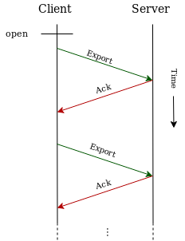
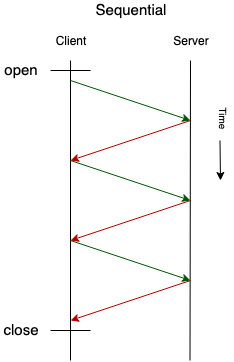
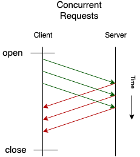
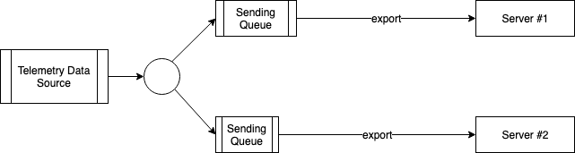

# OpenTelemetry Protocol Specification

**Status**: [Mixed](../document-status.md)

OpenTelemetry Protocol (OTLP) specification describes the encoding, transport,
and delivery mechanism of telemetry data between telemetry sources, intermediate
nodes such as collectors and telemetry backends.

<details>
<summary>Table of Contents</summary>

<!-- toc -->

- [Signals Maturity Level](#signals-maturity-level)
- [Protocol Details](#protocol-details)
  * [OTLP/gRPC](#otlpgrpc)
    + [OTLP/gRPC Concurrent Requests](#otlpgrpc-concurrent-requests)
    + [OTLP/gRPC Response](#otlpgrpc-response)
      - [Full Success](#full-success)
      - [Partial Success](#partial-success)
      - [Failures](#failures)
    + [OTLP/gRPC Throttling](#otlpgrpc-throttling)
    + [OTLP/gRPC Service and Protobuf Definitions](#otlpgrpc-service-and-protobuf-definitions)
    + [OTLP/gRPC Default Port](#otlpgrpc-default-port)
  * [OTLP/HTTP](#otlphttp)
    + [Binary Protobuf Encoding](#binary-protobuf-encoding)
    + [JSON Protobuf Encoding](#json-protobuf-encoding)
    + [OTLP/HTTP Request](#otlphttp-request)
    + [OTLP/HTTP Response](#otlphttp-response)
      - [Full Success](#full-success-1)
      - [Partial Success](#partial-success-1)
      - [Failures](#failures-1)
      - [Bad Data](#bad-data)
      - [OTLP/HTTP Throttling](#otlphttp-throttling)
      - [All Other Responses](#all-other-responses)
    + [OTLP/HTTP Connection](#otlphttp-connection)
    + [OTLP/HTTP Concurrent Requests](#otlphttp-concurrent-requests)
    + [OTLP/HTTP Default Port](#otlphttp-default-port)
- [Implementation Recommendations](#implementation-recommendations)
  * [Multi-Destination Exporting](#multi-destination-exporting)
- [Known Limitations](#known-limitations)
  * [Request Acknowledgements](#request-acknowledgements)
    + [Duplicate Data](#duplicate-data)
- [Future Versions and Interoperability](#future-versions-and-interoperability)
- [Glossary](#glossary)
- [References](#references)

<!-- tocstop -->

</details>

OTLP is a general-purpose telemetry data delivery protocol designed in the scope
of OpenTelemetry project.

## Signals Maturity Level

Each signal has different support and stability in OTLP, described through its
own maturity level, which in turn applies to **all** the OTLP Transports listed below.

* Tracing: **Stable**
* Metrics: **Stable**
* Logs: **Stable**

See [OTLP Maturity Level](https://github.com/open-telemetry/opentelemetry-proto#maturity-level).

## Protocol Details

OTLP defines the encoding of telemetry data and the protocol used to exchange
data between the client and the server.

This specification defines how OTLP is implemented over
[gRPC](https://grpc.io/) and HTTP 1.1 transports and specifies
[Protocol Buffers schema](https://developers.google.com/protocol-buffers/docs/overview)
that is used for the payloads.

OTLP is a request/response style protocols: the clients send requests, the
server replies with corresponding responses. This document defines one requests
and response type: `Export`.

All server components MUST support the following transport compression options:

* No compression, denotated by `none`.
* Gzip compression, denoted by `gzip`.

### OTLP/gRPC

**Status**: [Stable](../document-status.md)

After establishing the underlying gRPC transport the client starts sending
telemetry data using unary requests using
[Export*ServiceRequest](https://github.com/open-telemetry/opentelemetry-proto)
messages ([ExportLogsServiceRequest](https://github.com/open-telemetry/opentelemetry-proto/blob/main/opentelemetry/proto/collector/logs/v1/logs_service.proto) for logs,
[ExportMetricsServiceRequest](https://github.com/open-telemetry/opentelemetry-proto/blob/main/opentelemetry/proto/collector/metrics/v1/metrics_service.proto) for metrics,
[ExportTraceServiceRequest](https://github.com/open-telemetry/opentelemetry-proto/blob/main/opentelemetry/proto/collector/trace/v1/trace_service.proto) for traces).
The client continuously sends a sequence of requests to the server and expects
to receive a response to each request:



_Note: this protocol is concerned with reliability of delivery between one pair
of client/server nodes and aims to ensure that no data is lost in-transit
between the client and the server. Many telemetry collection systems have
intermediary nodes that the data must travel across until reaching the final
destination (e.g. application -> agent -> collector -> backend). End-to-end
delivery guarantees in such systems is outside of the scope of OTLP. The
acknowledgements described in this protocol happen between a single
client/server pair and do not span intermediary nodes in multi-hop delivery
paths._

#### OTLP/gRPC Concurrent Requests

After sending the request the client MAY wait until the response is received
from the server. In that case there will be at most only one request in flight
that is not yet acknowledged by the server.



Sequential operation is recommended when simplicity of implementation is
desirable and when the client and the server are connected via very low-latency
network, such as for example when the client is an instrumented application and
the server is an OpenTelemetry Collector running as a local daemon (agent).

The implementations that need to achieve high throughput SHOULD support
concurrent Unary calls to achieve higher throughput. The client SHOULD send new
requests without waiting for the response to the earlier sent requests,
essentially creating a pipeline of requests that are currently in flight that
are not acknowledged.



The number of concurrent requests SHOULD be configurable.

The maximum achievable throughput is
`max_concurrent_requests * max_request_size / (network_latency + server_response_time)`.
For example if the request can contain at most 100 spans, network roundtrip
latency is 200ms and server response time is 300 ms, then the maximum achievable
throughput with one concurrent request is `100 spans / (200ms+300ms)` or 200
spans per second. It is easy to see that in high latency networks or when the
server response time is high to achieve good throughput the requests need to be
very big or a lot concurrent requests must be done.

If the client is shutting down (e.g. when the containing process wants to exit)
the client will optionally wait until all pending acknowledgements are received
or until an implementation specific timeout expires. This ensures reliable
delivery of telemetry data. The client implementation SHOULD expose an option to
turn on and off the waiting during shutdown.

If the client is unable to deliver a certain request (e.g. a timer expired while
waiting for acknowledgements) the client SHOULD record the fact that the data
was not delivered.

#### OTLP/gRPC Response

The response MUST be the appropriate message (see below for
the specific message to use in the [Full Success](#full-success),
[Partial Success](#partial-success) and [Failure](#failures) cases).

##### Full Success

The success response indicates telemetry data is successfully accepted by the
server.

If the server receives an empty request (a request that does not carry
any telemetry data) the server SHOULD respond with success.

On success, the server response MUST be a
[Export<signal>ServiceResponse](https://github.com/open-telemetry/opentelemetry-proto/tree/main/opentelemetry/proto/collector)
message (`ExportTraceServiceResponse` for traces,
`ExportMetricsServiceResponse` for metrics and
`ExportLogsServiceResponse` for logs).

The server MUST leave the `partial_success` field unset
in case of a successful response.

##### Partial Success

If the request is only partially accepted
(i.e. when the server accepts only parts of the data and rejects the rest), the
server response MUST be the same
[Export<signal>ServiceResponse](https://github.com/open-telemetry/opentelemetry-proto/tree/main/opentelemetry/proto/collector)
message as in the [Full Success](#full-success) case.

Additionally, the server MUST initialize the `partial_success` field
(`ExportTracePartialSuccess` message for traces,
`ExportMetricsPartialSuccess` message for metrics and
`ExportLogsPartialSuccess` message for logs), and it MUST set the respective
`rejected_spans`, `rejected_data_points` or `rejected_log_records` field with
the number of spans/data points/log records it rejected.

The server SHOULD populate the `error_message` field with a human-readable
error message in English. The message should explain why the
server rejected parts of the data, and might offer guidance on how users
can address the issues.
The protocol does not attempt to define the structure of the error message.

Servers MAY also make use of the `partial_success` field to convey
warnings/suggestions to clients even when the request was fully accepted.
In such cases, the `rejected_<signal>` field MUST have a value of `0` and
the `error_message` field MUST be non-empty.

The client MUST NOT retry the request when it receives a partial success
response where the `partial_success` is populated.

##### Failures

When an error is returned by the server it falls into 2 broad categories:
retryable and not-retryable:

- Retryable errors indicate that processing of telemetry data failed and the
  client SHOULD record the error and may retry exporting the same data. This can
  happen when the server is temporarily unable to process the data.

- Not-retryable errors indicate that processing of telemetry data failed and the
  client MUST NOT retry sending the same telemetry data. The telemetry data MUST
  be dropped. This can happen, for example, when the request contains bad data
  and cannot be deserialized or otherwise processed by the server. The client
  SHOULD maintain a counter of such dropped data.

The server MUST indicate retryable errors using code
[Unavailable](https://godoc.org/google.golang.org/grpc/codes) and MAY supply
additional
[details via status](https://godoc.org/google.golang.org/grpc/status#Status.WithDetails)
using
[RetryInfo](https://github.com/googleapis/googleapis/blob/6a8c7914d1b79bd832b5157a09a9332e8cbd16d4/google/rpc/error_details.proto#L40)
containing 0 value of RetryDelay. Here is a sample Go code to illustrate:

```go
  // Do this on server side.
  st, err := status.New(codes.Unavailable, "Server is unavailable").
    WithDetails(&errdetails.RetryInfo{RetryDelay: &duration.Duration{Seconds: 0}})
  if err != nil {
    log.Fatal(err)
  }

  return st.Err()
```

To indicate not-retryable errors the server is recommended to use code
[InvalidArgument](https://godoc.org/google.golang.org/grpc/codes) and MAY supply
additional
[details via status](https://godoc.org/google.golang.org/grpc/status#Status.WithDetails)
using
[BadRequest](https://github.com/googleapis/googleapis/blob/6a8c7914d1b79bd832b5157a09a9332e8cbd16d4/google/rpc/error_details.proto#L119).
Other gRPC status code may be used if it is more appropriate. Here is a sample
Go code to illustrate:

```go
  // Do this on server side.
  st, err := status.New(codes.InvalidArgument, "Invalid Argument").
    WithDetails(&errdetails.BadRequest{})
  if err != nil {
    log.Fatal(err)
  }

  return st.Err()
```

The server MAY use other gRPC codes to indicate retryable and not-retryable
errors if those other gRPC codes are more appropriate for a particular erroneous
situation. The client SHOULD interpret gRPC status codes as retryable or
not-retryable according to the following table:

|gRPC Code|Retryable?|
|---------|----------|
|CANCELLED|Yes|
|UNKNOWN|No|
|INVALID_ARGUMENT|No|
|DEADLINE_EXCEEDED|Yes|
|NOT_FOUND|No|
|ALREADY_EXISTS|No|
|PERMISSION_DENIED|No|
|UNAUTHENTICATED|No|
|RESOURCE_EXHAUSTED|Only if the server can recover (see below)|
|FAILED_PRECONDITION|No|
|ABORTED|Yes|
|OUT_OF_RANGE|Yes|
|UNIMPLEMENTED|No|
|INTERNAL|No|
|UNAVAILABLE|Yes|
|DATA_LOSS|Yes|

When retrying, the client SHOULD implement an exponential backoff strategy. An
exception to this is the Throttling case explained below, which provides
explicit instructions about retrying interval.

The client SHOULD interpret `RESOURCE_EXHAUSTED` code as retryable only if the server signals that the recovery from resource exhaustion is possible. This is signalled by the server by returning [a status](https://godoc.org/google.golang.org/grpc/status#Status.WithDetails)
containing
[RetryInfo](https://github.com/googleapis/googleapis/blob/6a8c7914d1b79bd832b5157a09a9332e8cbd16d4/google/rpc/error_details.proto#L40). In this case the behavior of the server and the client is exactly as described in [OTLP/gRPC Throttling](#otlpgrpc-throttling) section.
If no such status is returned then the `RESOURCE_EXHAUSTED` code SHOULD be treated as non-retryable.

#### OTLP/gRPC Throttling

OTLP allows backpressure signalling.

If the server is unable to keep up with the pace of data it receives from the
client then it SHOULD signal that fact to the client. The client MUST then
throttle itself to avoid overwhelming the server.

To signal backpressure when using gRPC transport, the server MUST return an
error with code [Unavailable](https://godoc.org/google.golang.org/grpc/codes)
and MAY supply additional
[details via status](https://godoc.org/google.golang.org/grpc/status#Status.WithDetails)
using
[RetryInfo](https://github.com/googleapis/googleapis/blob/6a8c7914d1b79bd832b5157a09a9332e8cbd16d4/google/rpc/error_details.proto#L40).
Here is a sample Go code to illustrate:

```go
  // Do this on server side.
  st, err := status.New(codes.Unavailable, "Server is unavailable").
    WithDetails(&errdetails.RetryInfo{RetryDelay: &duration.Duration{Seconds: 30}})
  if err != nil {
    log.Fatal(err)
  }

  return st.Err()

  ...

  // Do this on client side.
  st := status.Convert(err)
  for _, detail := range st.Details() {
    switch t := detail.(type) {
    case *errdetails.RetryInfo:
      if t.RetryDelay.Seconds > 0 || t.RetryDelay.Nanos > 0 {
        // Wait before retrying.
      }
    }
  }
```

When the client receives this signal it SHOULD follow the recommendations
outlined in documentation for
[RetryInfo](https://github.com/googleapis/googleapis/blob/6a8c7914d1b79bd832b5157a09a9332e8cbd16d4/google/rpc/error_details.proto#L40):

```
// Describes when the clients can retry a failed request. Clients could ignore
// the recommendation here or retry when this information is missing from error
// responses.
//
// It's always recommended that clients should use exponential backoff when
// retrying.
//
// Clients should wait until `retry_delay` amount of time has passed since
// receiving the error response before retrying.  If retrying requests also
// fail, clients should use an exponential backoff scheme to gradually increase
// the delay between retries based on `retry_delay`, until either a maximum
// number of retires have been reached or a maximum retry delay cap has been
// reached.
```

The value of `retry_delay` is determined by the server and is implementation
dependant. The server SHOULD choose a `retry_delay` value that is big enough to
give the server time to recover, yet is not too big to cause the client to drop
data while it is throttled.

#### OTLP/gRPC Service and Protobuf Definitions

gRPC service definitions
[are here](https://github.com/open-telemetry/opentelemetry-proto/tree/master/opentelemetry/proto/collector).

Protobuf definitions for requests and responses
[are here](https://github.com/open-telemetry/opentelemetry-proto/tree/master/opentelemetry/proto).

Please make sure to check the proto version and
[maturity level](https://github.com/open-telemetry/opentelemetry-proto/#maturity-level).
Schemas for different signals may be at different maturity level - some stable,
some in beta.

#### OTLP/gRPC Default Port

The default network port for OTLP/gRPC is 4317.

### OTLP/HTTP

OTLP/HTTP uses Protobuf payloads encoded either in
[binary format](#binary-protobuf-encoding) or in [JSON format](#json-protobuf-encoding).
Regardless of the encoding the Protobuf schema of the messages is the same for
OTLP/HTTP and OTLP/gRPC as
[defined here](https://github.com/open-telemetry/opentelemetry-proto/tree/master/opentelemetry/proto).

OTLP/HTTP uses HTTP POST requests to send telemetry data from clients to
servers. Implementations MAY use HTTP/1.1 or HTTP/2 transports. Implementations
that use HTTP/2 transport SHOULD fallback to HTTP/1.1 transport if HTTP/2
connection cannot be established.

#### Binary Protobuf Encoding

**Status**: [Stable](../document-status.md)

Binary Protobuf encoded payloads use proto3
[encoding standard](https://developers.google.com/protocol-buffers/docs/encoding).

The client and the server MUST set "Content-Type: application/x-protobuf" request and
response headers when sending binary Protobuf encoded payload.

#### JSON Protobuf Encoding

**Status**: [Experimental](../document-status.md)

JSON Protobuf encoded payloads use proto3 standard defined
[JSON Mapping](https://developers.google.com/protocol-buffers/docs/proto3#json)
for mapping between Protobuf and JSON, with the following deviations from that mapping:

- The `trace_id` and `span_id` byte arrays are represented as
  [case-insensitive hex-encoded strings](https://tools.ietf.org/html/rfc4648#section-8);
  they are not base64-encoded like as it is defined in the standard
  [Protobuf JSON Mapping](https://developers.google.com/protocol-buffers/docs/proto3#json).
  The hex encoding is used for `trace_id` and `span_id` fields in all OTLP
  Protobuf messages, e.g. the `Span`, `Link`, `LogRecord`, etc. messages.
  For example, the `trace_id` field in a Span can be represented like this:
  { "trace_id": "5B8EFFF798038103D269B633813FC60C", ... }

- Values of enum fields MUST be encoded as integer values. Unlike the standard
  [Protobuf JSON Mapping](https://developers.google.com/protocol-buffers/docs/proto3#json),
  which allows values of enum fields to be encoded as either integer values or as enum
  name strings, only integer enum values are allowed in OTLP JSON Protobuf Encoding;
  the enum name strings MUST NOT be used.
  For example, the `kind` field with a value of SPAN_KIND_SERVER in a Span can be
  represented like this:
  { "kind": 2, ... }

- OTLP/JSON receivers MUST ignore message fields with unknown names and MUST unmarshal the
  message as if the unknown field was not present in the payload.
  This aligns with the behavior of the Binary Protobuf unmarshaler and ensures that adding
  new fields to OTLP messages does not break existing receivers.

Note that according to [Protobuf specs](
https://developers.google.com/protocol-buffers/docs/proto3#json) 64-bit integer
numbers in JSON-encoded payloads are encoded as decimal strings, and either
numbers or strings are accepted when decoding.

The client and the server MUST set "Content-Type: application/json" request and
response headers when sending JSON Protobuf encoded payload.

#### OTLP/HTTP Request

Telemetry data is sent via HTTP POST request. The body of the POST request is a
payload either in binary-encoded Protobuf format or in JSON-encoded Protobuf
format.

The default URL path for requests that carry trace data is `/v1/traces` (for
example the full URL when connecting to "example.com" server will be
`https://example.com/v1/traces`). The request body is a Protobuf-encoded
`ExportTraceServiceRequest` message.

The default URL path for requests that carry metric data is `/v1/metrics` and
the request body is a Protobuf-encoded `ExportMetricsServiceRequest` message.

The default URL path for requests that carry log data is `/v1/logs` and the
request body is a Protobuf-encoded `ExportLogsServiceRequest` message.

The client MAY gzip the content and in that case MUST include
"Content-Encoding: gzip" request header. The client MAY include
"Accept-Encoding: gzip" request header if it can receive gzip-encoded responses.

Non-default URL paths for requests MAY be configured on the client and server
sides.

#### OTLP/HTTP Response

The response body MUST be the appropriate serialized Protobuf message (see below for
the specific message to use in the [Full Success](#full-success-1),
[Partial Success](#partial-success-1) and [Failure](#failures-1) cases).

The server MUST set "Content-Type: application/x-protobuf" header if the
response body is binary-encoded Protobuf payload. The server MUST set
"Content-Type: application/json" if the response is JSON-encoded Protobuf
payload. The server MUST use the same "Content-Type" in the response as it
received in the request.

If the request header "Accept-Encoding: gzip" is present in the request the
server MAY gzip-encode the response and set "Content-Encoding: gzip" response
header.

##### Full Success

The success response indicates telemetry data is successfully accepted by the
server.

If the server receives an empty request (a request that does not carry
any telemetry data) the server SHOULD respond with success.

On success, the server MUST respond with `HTTP 200 OK`. The response body MUST be
a Protobuf-encoded
[Export<signal>ServiceResponse](https://github.com/open-telemetry/opentelemetry-proto/tree/main/opentelemetry/proto/collector)
message (`ExportTraceServiceResponse` for traces,
`ExportMetricsServiceResponse` for metrics and
`ExportLogsServiceResponse` for logs).

The server MUST leave the `partial_success` field unset
in case of a successful response.

##### Partial Success

If the request is only partially accepted
(i.e. when the server accepts only parts of the data and rejects the rest), the
server MUST respond with `HTTP 200 OK`. The response body MUST be the same
[Export<signal>ServiceResponse](https://github.com/open-telemetry/opentelemetry-proto/tree/main/opentelemetry/proto/collector)
message as in the [Full Success](#full-success-1) case.

Additionally, the server MUST initialize the `partial_success` field
(`ExportTracePartialSuccess` message for traces,
`ExportMetricsPartialSuccess` message for metrics and
`ExportLogsPartialSuccess` message for logs), and it MUST set the respective
`rejected_spans`, `rejected_data_points` or `rejected_log_records` field with
the number of spans/data points/log records it rejected.

The server SHOULD populate the `error_message` field with a human-readable
error message in English. The message should explain why the
server rejected parts of the data, and might offer guidance on how users
can address the issues.
The protocol does not attempt to define the structure of the error message.

Servers MAY also make use of the `partial_success` field to convey
warnings/suggestions to clients even when the request was fully accepted.
In such cases, the `rejected_<signal>` field MUST have a value of `0` and
the `error_message` field MUST be non-empty.

The client MUST NOT retry the request when it receives a partial success
response where the `partial_success` is populated.

##### Failures

If the processing of the request fails the server MUST respond with appropriate
`HTTP 4xx` or `HTTP 5xx` status code. See sections below for more details about
specific failure cases and HTTP status codes that should be used.

Response body for all `HTTP 4xx` and `HTTP 5xx` responses MUST be a
Protobuf-encoded
[Status](https://godoc.org/google.golang.org/genproto/googleapis/rpc/status#Status)
message that describes the problem.

This specification does not use `Status.code` field and the server MAY omit
`Status.code` field. The clients are not expected to alter their behavior based
on `Status.code` field but MAY record it for troubleshooting purposes.

The `Status.message` field SHOULD contain a developer-facing error message as
defined in `Status` message schema.

The server MAY include `Status.details` field with additional details. Read
below about what this field can contain in each specific failure case.

##### Bad Data

If the processing of the request fails because the request contains data that
cannot be decoded or is otherwise invalid and such failure is permanent then the
server MUST respond with `HTTP 400 Bad Request`. The `Status.details` field in
the response SHOULD contain a
[BadRequest](https://github.com/googleapis/googleapis/blob/d14bf59a446c14ef16e9931ebfc8e63ab549bf07/google/rpc/error_details.proto#L166)
that describes the bad data.

The client MUST NOT retry the request when it receives `HTTP 400 Bad Request`
response.

##### OTLP/HTTP Throttling

If the server receives more requests than the client is allowed or the server is
overloaded the server SHOULD respond with `HTTP 429 Too Many Requests` or
`HTTP 503 Service Unavailable` and MAY include
["Retry-After"](https://tools.ietf.org/html/rfc7231#section-7.1.3) header with a
recommended time interval in seconds to wait before retrying.

The client SHOULD honour the waiting interval specified in "Retry-After" header
if it is present. If the client receives `HTTP 429` or `HTTP 503` response and
"Retry-After" header is not present in the response then the client SHOULD
implement an exponential backoff strategy between retries.

##### All Other Responses

All other HTTP responses that are not explicitly listed in this document should
be treated according to HTTP specification.

If the server disconnects without returning a response the client SHOULD retry
and send the same request. The client SHOULD implement an exponential backoff
strategy between retries to avoid overwhelming the server.

#### OTLP/HTTP Connection

If the client is unable to connect to the server the client SHOULD retry the
connection using exponential backoff strategy between retries. The interval
between retries must have a random jitter.

The client SHOULD keep the connection alive between requests.

Server implementations SHOULD accept OTLP/HTTP with binary-encoded Protobuf
payload and OTLP/HTTP with JSON-encoded Protobuf payload requests on the same
port and multiplex the requests to the corresponding payload decoder based on
the "Content-Type" request header.

Server implementations MAY accept OTLP/gRPC and OTLP/HTTP requests on the same
port and multiplex the connections to the corresponding transport handler based
on the "Content-Type" request header.

#### OTLP/HTTP Concurrent Requests

To achieve higher total throughput the client MAY send requests using several
parallel HTTP connections. In that case the maximum number of parallel
connections SHOULD be configurable.

#### OTLP/HTTP Default Port

The default network port for OTLP/HTTP is 4318.

## Implementation Recommendations

### Multi-Destination Exporting

When the telemetry data from one client must be sent to more than one
destination server there is an additional complication that must be accounted
for. When one of the servers acknowledges the data and the other server does not
(yet) acknowledges the client needs to make a decision about how to move
forward.

In such situation the client SHOULD implement queuing, acknowledgement
handling and retrying logic per destination. This ensures that servers do not
block each other. The queues SHOULD reference shared, immutable data to be sent,
thus minimizing the memory overhead caused by having multiple queues.



This ensures that all destination servers receive the data regardless of their
speed of reception (within the available limits imposed by the size of the
client-side queue).

## Known Limitations

### Request Acknowledgements

#### Duplicate Data

In edge cases (e.g. on reconnections, network interruptions, etc) the client has
no way of knowing if recently sent data was delivered if no acknowledgement was
received yet. The client will typically choose to re-send such data to guarantee
delivery, which may result in duplicate data on the server side. This is a
deliberate choice and is considered to be the right tradeoff for telemetry data.

## Future Versions and Interoperability

OTLP will evolve and change over time. Future versions of OTLP must be designed
and implemented in a way that ensures that clients and servers that implement
different versions of OTLP can interoperate and exchange telemetry data. Old
clients must be able to talk to new servers and vice versa. If new versions of
OTLP introduce new functionality that cannot be understood and supported by
nodes implementing the old versions of OTLP the protocol must regress to the
lowest common denominator from functional perspective.

When possible the interoperability MUST be ensured between all versions of
OTLP that are not declared obsolete.

OTLP does not use explicit protocol version numbering. OTLP's interoperability
of clients and servers of different versions is based on the following concepts:

1. OTLP (current and future versions) defines a set of capabilities, some of
   which are mandatory, others are optional. Clients and servers must implement
   mandatory capabilities and can choose implement only a subset of optional
   capabilities.

2. For minor changes to the protocol future versions and extension of OTLP are
   encouraged to use the ability of Protobufs to evolve message schema in
   backwards compatible manner. Newer versions of OTLP may add new fields to
   messages that will be ignored by clients and servers that do not understand
   these fields. In many cases careful design of such schema changes and correct
   choice of default values for new fields is enough to ensure interoperability
   of different versions without nodes explicitly detecting that their peer node
   has different capabilities.

3. More significant changes must be explicitly defined as new optional
   capabilities in future OTEPs. Such capabilities SHOULD be discovered by
   client and server implementations after establishing the underlying
   transport. The exact discovery mechanism SHOULD be described in future OTEPs
   which define the new capabilities and typically can be implemented by making
   a discovery request/response message exchange from the client to server. The
   mandatory capabilities defined by this specification are implied and do not
   require a discovery. The implementation which supports a new, optional
   capability MUST adjust its behavior to match the expectation of a peer that
   does not support a particular capability.

## Glossary

There are 2 parties involved in telemetry data exchange. In this document the
party that is the source of telemetry data is called the `Client`, the party
that is the destination of telemetry data is called the `Server`.


Examples of a Client are instrumented applications or sending side of telemetry
collectors, examples of Servers are telemetry backends or receiving side of
telemetry collectors (so a Collector is typically both a Client and a Server
depending on which side you look from).

Both the Client and the Server are also a `Node`. This term is used in the
document when referring to either one.

## References

- [OTEP 0035](https://github.com/open-telemetry/oteps/blob/main/text/0035-opentelemetry-protocol.md) OpenTelemetry Protocol Specification
- [OTEP 0099](https://github.com/open-telemetry/oteps/blob/main/text/0099-otlp-http.md) OTLP/HTTP: HTTP Transport Extension for OTLP
- [OTEP 0122](https://github.com/open-telemetry/oteps/blob/main/text/0122-otlp-http-json.md) OTLP: JSON Encoding for OTLP/HTTP
