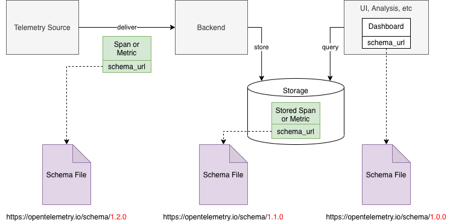
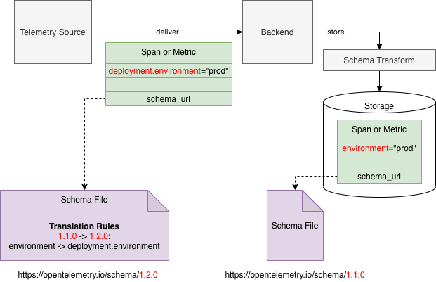
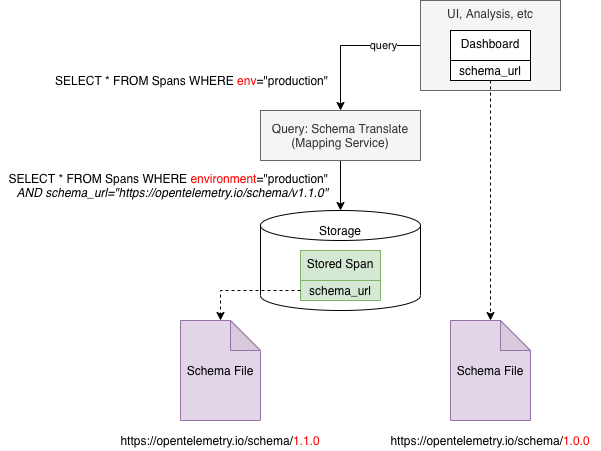
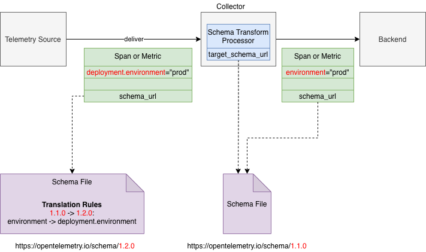

<!--- Hugo front matter used to generate the website version of this page:
linkTitle: Schemas
aliases: [/docs/reference/specification/schemas/overview]
path_base_for_github_subdir:
  from: tmp/otel/specification/schemas/_index.md
  to: schemas/README.md
--->

# Telemetry Schemas

**Status**: [Stable](../document-status.md)

<details>
<summary>Table of Contents</summary>

<!-- toc -->

- [Motivation](#motivation)
- [How Schemas Work](#how-schemas-work)
- [What is Out of Scope](#what-is-out-of-scope)
- [Use Cases](#use-cases)
  * [Full Schema-Aware](#full-schema-aware)
  * [Collector-Assisted Schema Transformation](#collector-assisted-schema-transformation)
- [Schema URL](#schema-url)
- [Schema Version Number](#schema-version-number)
- [OTLP Support](#otlp-support)
- [API Support](#api-support)
- [OpenTelemetry Schema](#opentelemetry-schema)

<!-- tocstop -->

</details>

## Motivation

Telemetry sources such as instrumented applications and consumers of telemetry
such as observability backends sometimes make implicit assumptions about the
emitted telemetry. They assume that the telemetry will contain certain
attributes or otherwise have a certain shape and composition of data (this is
referred to as "telemetry schema" throughout this document).

This makes it difficult or impossible to change the composition of the emitted
telemetry data without breaking the consumers. For example changing the name of
an attribute of a span created by an instrumentation library can break the
backend if the backend expects to find that attribute by its name.

Semantic conventions are an important part of this problem. These conventions
define what names and values to use for span attributes, metric names and other
fields. If semantic conventions are changed the existing implementations
(telemetry source or consumers) need to be also changed correspondingly.
Furthermore, to make things worse, the implementations of telemetry sources and
implementations of telemetry consumers that work together and that depend on the
changed semantic convention need to be changed simultaneously, otherwise such
implementations will no longer work correctly together.

Essentially there is a coupling between 3 parties: 1) OpenTelemetry semantic
conventions, 2) telemetry sources and 3) telemetry consumers. The coupling
complicates the independent evolution of these 3 parties.

We recognize the following needs:

- OpenTelemetry semantic conventions need to evolve over time. When conventions
  are first defined, mistakes are possible and we may want to fix the mistakes
  over time. We may also want to change conventions to re-group the attributes
  into different namespaces as our understanding of the attribute taxonomy
  improves.

- Telemetry sources over time may want to change the schema of the telemetry
  they emit. This may be because for example the semantic conventions evolved
  and we want to make our telemetry match the newly introduced conventions.

- In an observability system there may simultaneously exist telemetry sources
  that produce data that conforms to different telemetry schemas because
  different sources evolve at a different pace and are implemented and
  controlled by different entities.

- Telemetry consumers have a need to understand what schema a particular piece
  of received telemetry confirms to. The consumers also need a way to be able to
  interpret the telemetry data that uses different telemetry schemas.

Telemetry Schemas that were proposed and accepted in
[OTEP0152](../../oteps/0152-telemetry-schemas.md)
address these needs.

## How Schemas Work

We believe that the 3 parties described above are able to evolve
independently over time, while continuously retaining the ability to correctly
work together.

Telemetry Schemas are central to how we make this possible. Here is a summary of
how the schemas work:

- OpenTelemetry defines a [file format](file_format_v1.1.0.md) for defining
  telemetry schemas.

- Telemetry schemas are versioned. Over time the schema may evolve and telemetry
  sources may emit data conforming to newer versions of the schema.

- Telemetry schemas explicitly define transformations that are necessary to
  convert telemetry data between different versions of the schema, provided that
  such conversions are possible. When conversions are not possible it
  constitutes a breaking change between versions.

- Telemetry schemas are identified by Schema URLs, that are unique for each
  schema version.

- Telemetry sources (e.g. instrumentation libraries) will include a schema URL
  in the emitted telemetry.

- Telemetry consumers will pay attention to the schema of the received
  telemetry. If necessary, telemetry consumers may transform the telemetry data
  from the received schema version to the target schema version as expected at
  the point of use (e.g. a dashboard may define which schema version it
  expects).

- OpenTelemetry publishes a telemetry schema as part of the specification. The
  schema contains the list of transformations that semantic conventions undergo.
  The schema is to be available, to be referred and downloaded at a well known URL:
  `https://opentelemetry.io/schemas/<version>` (where `<version>` matches the
  specification version number).

- OpenTelemetry instrumentation libraries include the OpenTelemetry Schema URL
  in all emitted telemetry. This is currently work-in-progress,
  [here is an example](https://github.com/open-telemetry/opentelemetry-go/blob/8ba6da8f3e5380629fcd72057fe0f827a9e23493/sdk/resource/os.go#L50)
  of how it is done in Go SDK's Resource detectors.

- OTLP allows inclusion of a schema URL in the emitted telemetry.

- Third-party libraries, instrumentation or applications are advised to define
  and publish their own telemetry schema if it is completely different from
  OpenTelemetry schema (or use OpenTelemetry schema) and include the schema URL
  in the emitted telemetry.

## What is Out of Scope

- The concept of schema does not attempt to fully describe the shape of
  telemetry. The schema for example does not define all possible valid values
  for attributes or expected data types for metrics, etc. It is not a goal. Our
  goal is narrowly defined to solve the following problem only: to allow
  OpenTelemetry Semantic Conventions to evolve over time. For that reason this
  document is concerned with _changes_ to the schema as opposed to the _full
  state_ of the schema. We do not preclude this though: the schema file format
  is extensible and in the future may allow defining the full state of the
  schema.

- We intentionally limit the types of transformations of schemas to the bare
  minimum that is necessary to handle the most common changes that we believe
  OpenTelemetry Semantic Conventions will require in the near future. More types
  of transformations may be proposed in the future. This proposal does not
  attempt to support a comprehensive set of possible transformation types that
  can handle all possible changes to schemas that we can imagine. That would be
  too complicated and very likely superfluous. Any new transformation types
  MUST be proposed and added in the future to the schema file format when
  there is an evidence that they are necessary for the evolution of
  OpenTelemetry.

## Use Cases

This section shows a couple interesting use-cases for the telemetry schemas
(other uses-cases are also possible, this is not an exhaustive list).

### Full Schema-Aware

Here is an example on a schema-aware observability system:



Let's have a closer look at what happens with the Telemetry Source and Backend
pair as the telemetry data is emitted, delivered and stored:



In this example the telemetry source produces spans that comply with version
1.2.0 of OpenTelemetry schema, where the "deployment.environment" attribute is used
to record that the span is coming from production.

The telemetry consumer desires to store the telemetry in version 1.1.0 of
OpenTelemetry schema. The schema translator compares the schema_url in the
received span with the desired schema and sees that a version conversion is
needed. It then applies the change that is described in the schema file and
renames the attribute from "deployment.environment" to "environment" before
storing the span.

And here is for example how the schemas can be used to query stored data:



### Collector-Assisted Schema Transformation

Here is a somewhat different use case, where the backend is not aware of schemas
and we rely on OpenTelemetry Collector to translate the telemetry to a schema
that the backend expects to receive. The "Schema Translate Processor" is
configured, the target schema_url is specified and all telemetry data that
passes through the Collector is converted to that target schema:



## Schema URL

Schema URL is an identifier of a Schema. The URL specifies a location of a
[Schema File](file_format_v1.1.0.md) that can be retrieved (so it is a URL and
not just a URI) using HTTP or HTTPS protocol.

Fetching the specified URL may return an HTTP redirect status code. The fetcher
MUST follow the HTTP standard and honour the redirect response and fetch the
file from the redirected URL.

The last part of the URL path is the version number of the schema.

```
http[s]://server[:port]/path/<version>
```

The part of the URL preceding the `<version>` is called Schema Family
identifier. All schemas in one Schema Family have identical Schema Family
identifiers.

To create a new version of the schema copy the schema file for the last version
in the schema family and add the definition of the new version. The schema file
that corresponds to the new version MUST be retrievable at a new URL.

Important: schema files are immutable once they are published. Once the schema
file is retrieved it is recommended to be cached permanently. Schema files may
be also packaged at build time with the software that anticipates it may need
the schema (e.g. the latest OpenTelemetry schema file can be packaged at build
time with OpenTelemetry Collector's schema translation processor).

## Schema Version Number

Version number follows the MAJOR.MINOR.PATCH format, similar to SemVer 2.0.

Version numbers use the [ordering rules](https://semver.org/#spec-item-11)
defined by SemVer 2.0 specification. See how ordering is used in the
[Order of Transformations](file_format_v1.1.0.md#order-of-transformations). Other than the ordering
rules the schema version numbers do not carry any other semantic meaning.

OpenTelemetry schema version numbers match OpenTelemetry
[Semantic Conventions](/specification/semantic-conventions.md) version
numbers, see more details [here](#opentelemetry-schema).

## OTLP Support

To allow carrying the Schema URL in emitted telemetry OTLP includes a schema_url
field in the messages:

- The schema_url field in the ResourceSpans, ResourceMetrics, ResourceLogs
  messages applies to the contained Resource, Span, SpanEvent, Metric, LogRecord
  messages.

- The schema_url field in the InstrumentationLibrarySpans message applies to the
  contained Span and SpanEvent messages.

- The schema_url field in the InstrumentationLibraryMetrics message applies to
  the contained Metric messages.

- The schema_url field in the InstrumentationLibraryLogs message applies to the
  contained LogRecord messages.

- If schema_url field is non-empty both in Resource\* message and in the
  contained InstrumentationLibrary\* message then the value in
  InstrumentationLibrary\* message takes the precedence.

## API Support

The OpenTelemetry API allows getting a
[Tracer](../trace/api.md#get-a-tracer)/[Meter](../metrics/api.md#get-a-meter) that
is associated with a Schema URL.

## OpenTelemetry Schema

OpenTelemetry publishes it own schema at
[opentelemetry.io/](https://opentelemetry.io/)schemas/<_version_>.
The version number of the schema
is the same as the semantic-conventions version number which publishes the schema.
Every time a new semantic-conventions version is released a corresponding new schema
MUST be released simultaneously. If the semantic-conventions release did not introduce
any change the "changes" section of the corresponding version in the schema file
will be empty.
