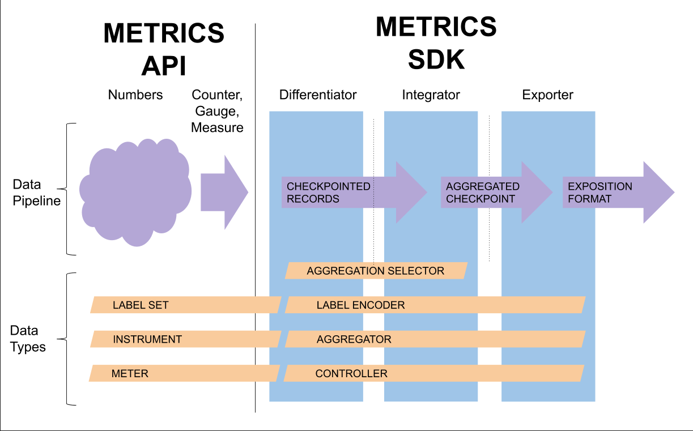

# Metric SDK

The purpose of this document is to define the _standard_ Metrics SDK
provided with OpenTelemetry libraries in each language.

Note: This document assumes you have read both the (Metrics API
overview)[api-metrics.md] and the (Metrics User-Facing
API)[api-metrics-user.md] specification documents.

_This document is derived from the Golang Metrics SDK prototype._

## Overview



## Glossary

__Metric update__: The term _metric update_ refers to any single
operation on a metric instrument; each bound-instrument or direct call
imply a single metric update, whereas each RecordBatch operation
implies a batch of metric updates.  See the user-facing API
specification for definitions of the three [calling
conventions](api-metrics-user.md).

__Aggregator__: The term _aggregator_ refers to an implementation that
can combine multiple metric updates into a single, combined state for
a specific function.  For example, a Sum aggregator combines multiple
`Add()` updates into single sum.  Aggregators must support concurrent
updates.  Aggregators support a `Checkpoint()` operation, which saves
a snapshot of the current aggregate state for collection, and a
`Merge()` operation, which combines state from two aggregators into
one.

__Incremental aggregation__: An _incremental aggregation_ computes an
aggregation over a single collection interval.  The result of
incremental aggregation describes the updates since the beginning of
a collection interval, not since the beginning of the process.

__Change of dimensions__: The user-facing metric API allows users to
supply LabelSets containing an unlimited number of labels for any
metric update.  Some metric exporters will restrict the set of labels
when exporting metric data, either to reduce cost or because of
system-imposed requirements.  A _change of dimensions_ maps input
LabelSets with potentially many labels into a LabelSet with an fixed
set of label keys.  A change of dimensions eliminates labels with keys
not in the output LabelSet and fills in empty values for label keys
that are not in the input LabelSet.

__Export record__: The _Export record_ is an exporter-independent
in-memory representation combining the metric instrument, the LabelSet
for export, and the associated aggregate state.  Metric instruments
are described by a metric descriptor.

__Metric descriptor__: A _metric descriptor_ is an in-memory
representation of the metric instrument, including all the information
provided in when it was defined, such as the metric name and instrument
kind.

__Collection__: _Collection_ refers to the process of gathering the
current state from all active metric instruments for the exporter.

## Differentiator

The Meter API provides methods to create metric instruments, bound 
instruments, and label sets.  This document describes the
standard Differentiator and supporting packages used to build
a complete metric export pipeline.

The Differentiator stands at the start of the export pipeline,
where it interfaces with the user-facing API and receives metric
updates.  The Meter's primary job is to maintain active state about
pending metric updates.  The most important requirement placed on the
Differentiator is that it be able to "forget" state about metric
updates after they are collected, so that the Differentiator
does not have unbounded memory growth.  To support forgetting metrics
that do not receive updates, the Differentiator itself manages
incremental Aggregation as opposed to maintaining state for the
process lifetime.

The Differentiator SHOULD ensure that operations on bound
instruments be fast, because the API specification promises users that
the bound-instrument calls are the fastest possible calling
convention.  Metric updates made via a bound instrument, when used
with an Aggregator defined by simple atomic operations, should follow
a very short code path.

The Differentiator MUST provide a `Collect()` method to initiate
collection, which involves sweeping through metric instruments with
un-exported metric updates, checkpointing their Aggregators, and
submitting them to the Integrator.  Integrator and Exporter MUST be called
in a single-threaded context; consequently the Differentiator
MUST ensure that concurrent `Collect()` calls do not violate the
single-threaded nature of the Integrator and Exporter, whether through
locking or other avoidance techniques.

This document does not specify how to coordinate synchronization
between user-facing metric updates and metric collection activity,
however Differentiators SHOULD make efforts to avoid lock
contention by holding locks only briefly or using lock-free
techniques.  Differentiators MUST ensure that there are no lost
updates.

### Meter aggregation preserves LabelSet dimensions

The Differentiator MUST maintain Aggregators for active metric
instruments for each complete, distinct LabelSet.  This ensures that
the Integrator has access to the complete set of labels when performing
its task.

In this design, changing LabelSet dimensions for export is the
responsibility of the Integrator.  As a consequence, the cost and
complexity of changing dimensions affect only the collection pass.  As
a secondary benefit, this ensures a relatively simple code path for
entering metric updates into the Differentiator.

#### Alternatives considered

There is an alternative to maintaining aggregators for active metric
instruments for each complete, distinct LabelSet.  Instead of
aggregating by each distinct LabelSet in the Differentiator and
changing dimensionality in the Integrator, the Differentiator could
change dimensionality "up front".  In this alternative, the
Differentiator would apply a change of dimension to LabelSets on the
instrumentation code path as opposed to the collection code path.

This alternative was not selected because it puts a relatively
complicated decision--and potentially additional synchronization--into
the instrumentation code path.

### Recommended implementation

The Differentiator supports the three metric [calling
conventions](api-metrics-user.md): bound-instrument calls, direct
calls, and RecordBatch calls.  Although not a requirement, we
recommend the following approach for organizing the Differentiator.

Of the three calling conventions, direct calls and RecordBatch calls
can be easily converted into bound-instrument calls using short-lived
bound instruments.  For example, a direct call can be implemented by
binding the instrument and label set, operating on the bound
instrument, and immediately releasing it.

```golang
// RecordOne converts a direct call into a bound-instrument call by allocating
// a short-lived bound instrument.
func (inst *instrument) RecordOne(ctx context.Context, number core.Number, labelSet api.LabelSet) {
	h := inst.Bind(labelSet)
	defer h.Release()
	h.RecordOne(ctx, number)
}
```

The Differentiator tracks an internal set of records, where every
record either: (1) has a current, un-released bound instrument pinning
it in memory, (2) has pending updates that have not been collected,
(3) is a candidate for removing from memory.  The Differentiator
maintains a mapping from the pair (Instrument, LabelSet) to an active
record.  Each active record contains an Aggregator implementation,
which is responsible for incorporating a series of metric updates into
the current incremental state.

The Differentiator provides a facility to remove records from
memory when they have been inactive for at least a full collection
period.  The Differentiator MUST not lose updates when removing
records from memory; it is safe to remove records that have received
no updates because Aggregators maintain incremental state.

#### Monotonic gauge limitations

As described, the Differentiator is permitted to forget state about
metric records that have not been updated for a full collection
interval.  This creates a potential conflict when implementing
monotonic gauges.  The Differentiator is not required to implement a
monotonicity test when it has no current state.  The Differentiator
SHOULD implement a monotonicity test for monotonic gauges when it has
prior state.

The Differentiator SHOULD prefer to forget monotonic gauges that
have not received updates the same as it would for any other metric
instrument.  However, the user can be assured that their monotonic
gauge updates are being checked if they acquire and use a bound
instrument, since bound instruments pin a record in the Differentiator.

## Aggregator implementations

The Aggregator interface supports combining multiple metric events
into a single aggregated state.  Different concrete aggregator types
provide different functionality and levels of concurrent performance.

Aggregators MUST support `Update()`, `Checkpoint()`, and `Merge()`
operations.  `Update()` is called directly from the Meter in response
to a metric event, and may be called concurrently.  `Update()` is also
passed the caller's distributed context, which allows it to access the
current span context and distributed correlations, however none of the
built-in aggregators use span context or distributed correlations.

The `Checkpoint()` operation is called to atomically save a snapshot
of the Aggregator, since `Checkpoint()` may be called concurrently
with `Update()`.  The `Merge()` operation supports dimensionality
reduction by combining state from multiple aggregators into a single
Aggregator state.

The Metric SDK SHOULD include six built-in aggregator types.  Two
standard aggregators MUST be included that implement standard counter
and gauge aggregations.

1. Counter: This aggregator MUST maintain a Sum.  In languages with
support for atomic operations, the Counter aggregator SHOULD be
implemented using only a single word of memory for the current state
and a single word of memory for its checkpoint.
1. Gauge: This aggregator MUST maintain the last value and its
timestamp.  In languages with support for atomic operations, this
aggregator's update operation SHOULD be implemented by a single memory
allocation--to store the value and timestamp--followed by an atomic
pointer swap; if the gauge is defined as monotonic, it should use
atomic compare-and-swap to ensure monotonicity.

Aggregators for [Measure metric instruments](api-metrics.md#measure)
are more challenging in nature than the Counter and Gauge aggregators,
since their task is to aggregate a series of individual measurements.
To perform this duty exactly requires storing the entire set of
measurements, which may be cost-prohibitive.  The common mechanisms
for exporting recorded measurements from a Measure metric instrument
are: as a series of raw measurements, as a summary of pre-determined
quantiles, and as a histogram with pre-determined boundaries.  A
definition for _Quantile_ is given below.

Four aggregators SHOULD be provided for use with Measure metric
instruments that support the common mechanisms for exporting recorded
measurements with a range of performance options.

1. MinMaxSumCount: This aggregator is intended as an inexpensive
alternative to the Sketch, Histogram, and Exact aggregators for
Measure instruments.  This aggregator MUST compute the min, max, sum,
and count of recorded measurements.  In languages with support for
atomic operations, this aggregator's update operation SHOULD maintain
its state using four independent atomic updates.  In this case, the
aggregator's update operation SHOULD NOT be atomic with respect to its
checkpoint operation, implying that a checkpoint could witness an
inconsistent state; that is intentional given the inexpensive nature
of this aggregator.
1. Sketch: This aggregator computes an approximate data structure that
MUST estimate quantiles of the distribution of recorded measurements.
Example algorithms that could be used to implement this aggregator are
include: GK-Sketch, DDSketch, Q-Digest, T-Digest, and HDR-Histogram.
The choice of algorithm should be made based on available libraries in
each language, but implementations with well-defined error bounds
SHOULD be preferred.
1. Histogram: This aggregator MUST compute a histogram with
pre-determined boundaries.  This aggregator MAY support quantile
estimation, but is generally intended for cases where a histogram will
be exported directly and the exporter wants explicit control over
histogram boundaries.
1. Exact: This aggregator MUST store an array of all recorded
measurements.  This aggregator MUST support exact quantile
computations and it MUST support exporting raw values in the order
they were recorded, however it is not required to support both of
these modes simultaneously (since computing quantiles requires sorting
the measurements).

### Quantile definition

When exporting a summary of recorded measurements for a Measure metric
instrument, it is common to report _quantiles_ of the distribution.
When computing quantiles from an exact aggregation (i.e., the complete
data set), the "nearest rank" definition of quantile SHOULD be used.
The nearest-rank definition ensures that the resulting value belongs
to the original data set.  Interpolation is not used in this method.

The definition for the nearest-rank quantile given here makes use of
the _cumulative distribution function_, a standard concept from
probability theory.  Quantiles are parameterized by `q`, where `0 <= q
<= 1`.  The value for quantile `q` is the least element of the
original data set at or above the point where the cumulative
distribution function equals `q`.

For example, taking a data set of five values `{10, 20, 30, 40, 50}`,
the `q=0.5` quantile (i.e., the median) equals 30, which is precisely
the point where the cumulative distribution function equals 0.5.

With an even-sized data set, for example `{10, 20, 30, 40}`, the
`q=0.5` quantile equals 30.  In this case, the cumulative distribution
function equals 0.5 halfway between 20 and 30 and the greater value is
selected as the nearest rank.

When using an approximate aggregator to compute estimated quantile
values, the nearest-rank quantile definition does not apply.

## Integrator implementation

The Integrator acts as the primary source of configuration for exporting
metrics from the SDK.  The two kinds of configuration are:

1. Given a metric instrument, choose which concrete aggregator type to apply for in-process aggregation.
1. Given a metric instrument, choose which dimensions to export by (i.e., the "grouping" function).

The first choice--which concrete aggregator type to apply--is made
whenever the Differentiator encounters a new (Instrument,
LabelSet) pair.  Each concrete type of aggregator will perform a
different function.  Aggregators for counter and gauge instruments are
relatively straightforward, but many concrete aggregators are possible
for measure metric instruments.  The Integrator has an opportunity to
disable instruments at this point simply by returning a `nil`
aggregator.

The second choice--which dimensions to export by--affects how the
batcher processes records emitted by the Differentiator during
collection.  During collection, the Differentiator emits an
export record for each metric instrument with pending updates to the
Integrator.

During the collection pass, the Integrator receives a full set of
checkpointed aggregators corresponding to each (Instrument, LabelSet)
pair with an active record managed by the Differentiator.
According to its own configuration, the Integrator at this point
determines which dimensions to aggregate for export; it computes a
checkpoint of (possibly) reduced-dimension export records ready for
export.

Integrator implementations support the option of being stateless or
stateful.  Stateless Integrators compute checkpoints which describe the
updates of a single collection period (i.e., deltas).  Stateful
Integrators compute checkpoints from over the process lifetime; these may
be useful for simple exporters but are prone to consuming a large and
ever-growing amount of memory, depending on LabelSet cardinality.

One standard Integrator implementation is provided.

1. The "ungrouped" Integrator exports metric instruments at full
dimensionality; each LabelSet is exported without reducing dimensions.

## Controller implementation

A controller is needed to coordinate the decision to begin collection.
Controllers generally are responsible for binding the Differentiator,
the Integrator, and the Exporter.

Once the decision has been made, the controller's job is to call
`Collect()` on the Differentiator, then read the checkpoint from
the Integrator, then invoke the Exporter.

One standard "push" controller is provided, which triggers collection
using a fixed period.  The controller is responsible for flushing
metric events prior to shutting down the process.

Metric exporters that wish to pull metric updates are likely to
integrate a controller directly into the exporter itself.

## Exporter implementations

The exporter is called with a checkpoint of finished export records.
Most configuration decisions have been made before the exporter is
invoked, including which instruments are enabled, which concrete
aggregator types to use, and which dimensions to aggegate by.

There is very little left for the exporter to do other than format the
metric updates into the desired format and send them on their way.

## Multiple exporter support

The metric export pipeline specified here does not include explicit
support for multiple export pipelines.  In principle, the Integrator and
Exporter interfaces specified here could be satisfied by a
multiplexing implementation, but in practice, it will be costly to run
multiple Integrators in parallel, particularly if they do not share the
same Aggregator selection logic.

If multiple exporters are required, therefore, it is best if they can
share a single Integrator configuration.  The SDK is not required to
provide multiplexing implementations of the Integrator or Exporter
interfaces.

## LabelEncoder optimizations

The Differentiator and some Integrator implementations are required
to compute a unique key corresponding to a LabelSet, for the purposes
of locating an aggregator to use for metric updates.  Where possible,
Exporters can avoid a duplicate computation by providing a
LabelEncoder to the Differentiator.

This optimization applies for any Exporter that will internally
compute a unique encoding for a set of labels, whether using a text or
a binary encoding.  For example, a dogstatsd Exporter will benefit by
providing its specific LabelEncoder implementation to the
Differentiator; consequently, the export records it sees will be
accompanied by a pre-computed encoding of the export LabelSet.

## Metric descriptors

The metric descriptor contains a complete description of the metric
instrument, including the kind of metric (Counter, Gauge, or Measure)
and all arguments passed to the instrument's constructor.

Exporters MUST have a mechanism to lookup internal state based on the
metric descriptor.  This requirement could be satisfied by exposing
descriptors as reference objects (i.e., their memory address is
unique, can be used to lookup Exporter-specific state).  Another way
to meet this requirement is to give each distinct metric instrument a
unique identifier that is included in the export record.
