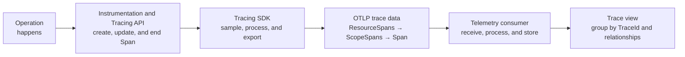
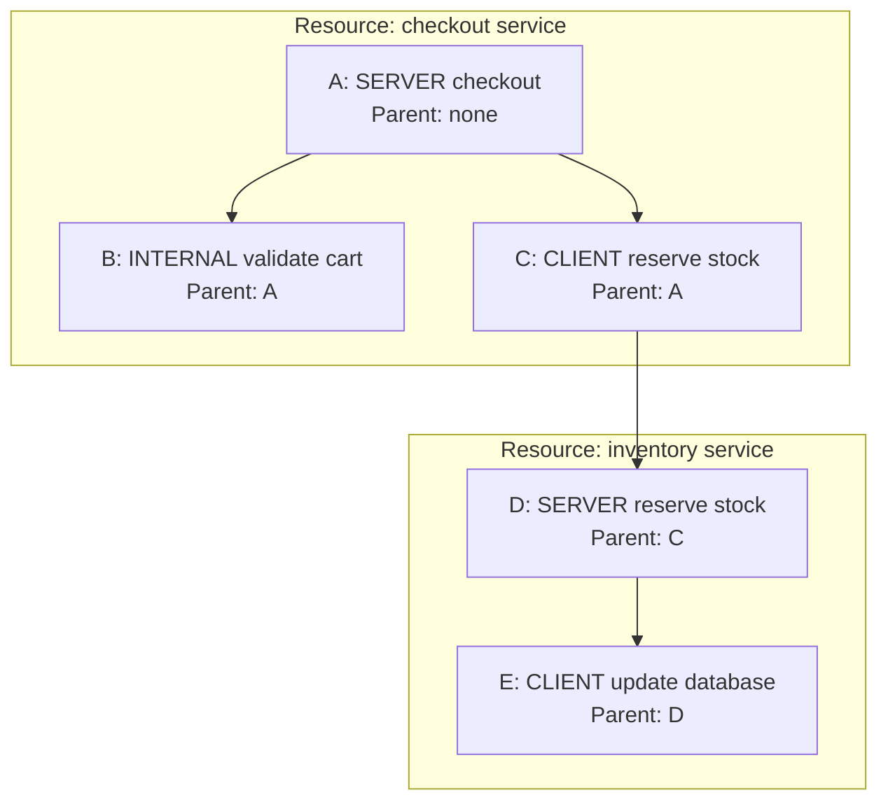
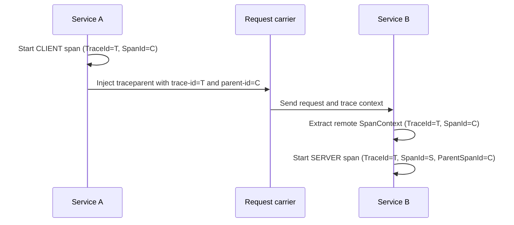
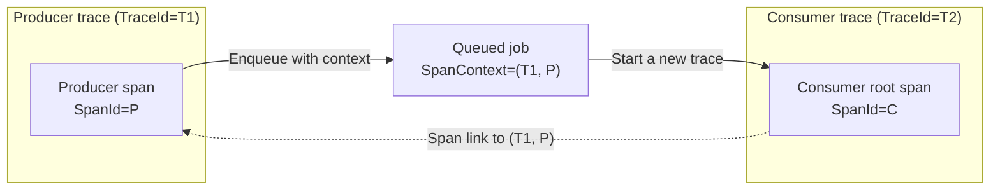

<!--- Hugo front matter used to generate the website version of this page:
linkTitle: Data Model
weight: 2
--->

# Traces Data Model

**Status**: [Stable](../document-status.md)

<details>
<summary>Table of Contents</summary>

<!-- START DOCTOC -->

- [Overview](#overview)
- [Operations => Spans => Traces](#operations--spans--traces)
- [Span](#span)
  * [Identity and parent](#identity-and-parent)
  * [Operation and time](#operation-and-time)
  * [Descriptive data](#descriptive-data)
  * [Origin](#origin)
- [Trace](#trace)
  * [Forming a trace from spans](#forming-a-trace-from-spans)
  * [Root span](#root-span)
  * [Causal and temporal relationships](#causal-and-temporal-relationships)
  * [Partial and incomplete traces](#partial-and-incomplete-traces)
- [Relationships between spans](#relationships-between-spans)
  * [Parent-child relationship](#parent-child-relationship)
  * [Links](#links)
- [Distributed context propagation](#distributed-context-propagation)
  * [In-process propagation](#in-process-propagation)
  * [Propagation across process boundaries](#propagation-across-process-boundaries)
  * [Propagation example](#propagation-example)
  * [Trace boundaries](#trace-boundaries)
- [Transporting and reconstructing traces](#transporting-and-reconstructing-traces)
- [References](#references)

<!-- END DOCTOC -->

</details>

## Overview

A distributed trace describes the path of a logical operation through a
distributed system. The operation can cross execution units, processes,
services, and network boundaries. A trace is represented by a collection of
`Span`s.

A `Span` represents one operation in that path. It records the operation's
identity, parent, timing, and descriptive data. Spans from the same trace share
a `TraceId`; each span has its own `SpanId`. The parent-child relationships
recorded on the spans describe causality and allow the collection to be
assembled into a trace.

The trace data model described in this document is logical. It is independent
of the API used to create spans, the protocol used to transport them, and the
storage model used by a tracing backend. The [Tracing API](api.md) is
authoritative for creating and updating spans. The [Tracing SDK](sdk.md)
defines sampling, processing, and exporting. [OTLP trace
data][otlp-trace-data] defines the protocol representation.

## Operations => Spans => Traces

Instrumentation represents an operation performed by an application or library
with a `Span`. When the operation starts, the instrumentation uses the
[Tracing API](api.md) to create the span. It updates the span as the operation
proceeds and ends the span when the operation completes. The span records the
observed operation but does not control its execution.

The [Tracing SDK](sdk.md) makes a sampling decision when the span is created
and invokes configured span processors during the span's lifecycle. For a
recorded span selected for export, ending the span makes its readable data
available to a span exporter. An OTLP exporter encodes the span with its
resource and instrumentation scope and sends it directly to a telemetry
consumer or through one or more Collectors.



Consumers receive spans independently of the operations that produced them.
They can validate, transform, store, and analyze those spans. By grouping spans
with the same `TraceId` and interpreting their parent-child relationships and
links, a consumer can assemble them into a trace. A trace is therefore not a
single object exported by the instrumentation; it is a view constructed from
the received spans.

## Span

A span represents a single operation performed by a component of a system. An
operation can be a server handling a request, a client making a request, a
function call, a database query, or a stage of an asynchronous workflow.

The main parts of a span are:

| Part | Purpose                                                                                                                                 |
| ---- |-----------------------------------------------------------------------------------------------------------------------------------------|
| `SpanContext` | Span identifier. Carries information used for propagation. Its components are listed below.                                             |
| ↳ `TraceId` | Identifies the trace and is shared by every span in that trace.                                                                         |
| ↳ `SpanId` | Identifies the span within the trace.                                                                                                   |
| ↳ `TraceFlags` | Carries flags associated with the trace context, including sampling and trace-ID randomness.                                            |
| ↳ `TraceState` | Immutable ordered list of tracing-system-specific key-value pairs that can accompany the standard identifiers across process boundaries. |
| ↳ `IsRemote` | Indicates locally whether the `SpanContext` was received from a remote source or generated locally.                                     |
| Parent | Identifies the operation that directly caused this operation, if any.                                                                   |
| Name and kind | Classify the operation and its role in a communication.                                                                                 |
| Start and end timestamps | Describe when the operation took place.                                                                                                 |
| Attributes | Describe properties of this occurrence of the operation.                                                                                |
| Events | Describe timestamped occurrences during the operation.                                                                                  |
| Links | Reference other causally related spans.                                                                                                 |
| Status | Records the operation's final status when it is explicitly known.                                                                       |
| Resource | Describes the entity for which the span was produced.                                                                                   |
| Instrumentation scope | Identifies the instrumentation that produced the span.                                                                                  |

A `Span` in a process is mutable while its operation is being recorded and becomes
non-recording when it is ended. An exported span is a readable representation
of the data captured during that lifetime. The [Span API](api.md#span) defines
the complete set of span properties and their behavior.

### Identity and parent

The identity and relationship fields are:

- `TraceId`: the 16-byte identifier shared by every span in the trace.
- `SpanId`: the 8-byte identifier of this span.
- `TraceFlags`: flags associated with the trace context, including the
  `Sampled` and `Random` flags.
- `TraceState`: an immutable ordered list of tracing-system-specific key-value
  pairs that accompanies the trace context.
- `ParentSpanId`: the `SpanId` of the parent span, or empty for a root span.
  The SDK's parent `SpanContext` also indicates through
  [`IsRemote`](api.md#isremote) whether it was extracted from a remote source.

The tuple (`TraceId`, `SpanId`) references a span. A `SpanId` alone is not
enough to uniquely identify a span.

`TraceFlags` and `TraceState` are carried by each `SpanContext`. `TraceFlags`
are standardized bits that tracing participants interpret consistently.
`TraceState`, by contrast, gives multiple tracing systems separate entries for
information not represented by `TraceId` and `SpanId`, such as
system-specific trace identifiers or sampling information. A participant can
preserve entries it does not interpret, allowing multiple tracing systems to
participate in the same trace. OpenTelemetry-specific values in the `ot` entry
are described in [TraceState Handling](tracestate-handling.md).

A `TraceState` value is a snapshot associated with one `SpanContext`. Within the
same trace a tracing participant can derive a new
`TraceState` when creating a child span or serializing context for propagation or
export, without changing the existing immutable `SpanContext`. Consequently,
spans in the same trace can carry different `TraceState` snapshots.

### Operation and time

The span name identifies a class of operations. For example, `GET /users/{id}`
identifies a class of server requests, while a user identifier belongs in an
attribute. The [span name guidance](api.md#span) describes how names avoid
unbounded cardinality.

`SpanKind` describes the span's role:

- `SERVER` and `CLIENT` represent the receiving and sending sides of
  request-response communication.
- `PRODUCER` and `CONSUMER` represent the initiating and processing sides of
  asynchronous execution, such message processing via a broker.
- `INTERNAL` represents an operation internal to an application.

The start and end timestamps measure the elapsed real time of the operation.
The span duration is the difference between them. Timestamps come from the
clock of the process that records the span, so timestamps from different
processes do not by themselves establish causality or a precise global order.

### Descriptive data

Span attributes are an [Attribute Collection](../common/README.md#attribute-collections) describing this
occurrence of the operation. Semantic conventions give common attributes
consistent meanings across implementations and languages.

An event is a timestamped annotation on a span. Each event has a name and its
own attribute collection. Events describe occurrences within the operation.

A link references another span through its `SpanContext` and can have its own
attributes. Links express causal relationships that do not fit the single-parent
model.

Status has a code of `Unset`, `Ok`, or `Error`, and can include a description
for `Error`. Status is distinct from protocol-specific result codes, which are
represented according to semantic conventions.

Exportable span representations also include counts of attributes, events,
and links dropped because of configured limits. These
counts indicate data loss even though the dropped values
are no longer available.

### Origin

Every span is associated with a [Resource](../resource/README.md) and an
[Instrumentation Scope](../common/instrumentation-scope.md).

The resource identifies the entity for which the span was produced, such as a
service instance, process, container, or host. A single trace commonly contains
spans from several resources.

The instrumentation scope identifies the logical unit of software that emitted
the span, such as an instrumentation library or application component. A
single resource can produce spans from several instrumentation scopes.

## Trace

A trace is defined implicitly by its spans; it is not a separate data item that
has to be created or exported. A trace consists of the spans that share a
`TraceId`, together with the relationships recorded by their parent IDs and
links.

### Forming a trace from spans

The diagram below uses abbreviated IDs. Every node has `TraceId=T`; each node's
`ParentSpanId` identifies the node at the incoming solid arrow.



The five spans can be exported by different processes, in different batches,
and can arrive to a consumer in any order. A consumer groups them by 
`TraceId=T` and matches each non-empty `ParentSpanId` to a `SpanId` in the same trace. 
The edge from C to D crosses a process boundary, while the other edges represent
execution flow within the same process (the same resource).

A span does not contain its children. The relationship is recorded from child
to parent. Consequently, a span can be observed before its parent arrives,
and a parent does not reveal whether an unobserved child exists.

### Root span

A root span has no parent. Creating a root span starts a new trace and generates
a new `TraceId`. Descendants use the same `TraceId`, so a complete,
well-formed trace created through the OpenTelemetry API has one root span that
is the shared ancestor of its other spans.

Collected data does not always contain the root span. Sampling, data loss,
delayed arrival, or a query over only part of a trace can produce a trace
fragment whose root is absent. A span whose `ParentSpanId` refers to an absent
span remains a non-root span in that fragment.

### Causal and temporal relationships

Parent-child relationships describe direct causality, not necessarily lexical
or temporal containment. A child can outlive its parent, siblings can overlap,
and asynchronous work can begin after the initiating operation has ended.
Spans can also have gaps between them.

For example, the same parent-child structure can have these temporal
relationships:

```text
time ------------------------------------------------------------------------>

A  [checkout request.........................................................]
B     [validate cart.....]
C          [reserve stock client................]
D               [reserve stock server........................]
E                    [database update........]
```

Clock skew between processes can make a remote child appear to start before its
parent. Trace analysis therefore uses parent IDs and links for causal structure,
with timestamps describing each locally observed interval.

### Partial and incomplete traces

A trace is complete when all spans that belong to it have been collected. A
trace is incomplete when at least one span is available but one or more
belonging spans are not.

Common causes of incomplete trace data include:

- Sampling decisions that do not select every span.
- Failed or delayed export.
- Configured span, queue, or backend limits.
- Queries that intentionally select only part of a trace.

A non-root span whose referenced parent is absent proves that the available
trace is incomplete. The converse is not true: the presence of every referenced
parent does not prove completeness because spans do not record a list of
expected children.

Propagating trace context and exporting span data are separate operations. A
participant can propagate a valid `SpanContext` even when it does not record or
export the corresponding span. Downstream participants can therefore retain the
same `TraceId` and create causally connected spans, while the collected trace
has a gap.

For example:

```text
Service A exports span A:
  TraceId=T, SpanId=A

Service B creates but does not export span B:
  TraceId=T, SpanId=B, ParentSpanId=A

Service C exports span C:
  TraceId=T, SpanId=C, ParentSpanId=B
```

Service B propagates B's `SpanContext` to Service C even though it does not
export B's complete span data. A trace consumer groups A and C together because
they have the same `TraceId`, but it cannot connect them directly because C
identifies the unavailable span B as its parent:

```text
A --> [B missing] --> C
```

The propagated `SpanContext` contains the trace and span identifiers, trace
flags, and `TraceState`; it does not contain the complete span with its
timestamps, attributes, events, and status. The `Sampled` flag communicates a
recording decision in the propagated context, but it does not guarantee that
every span in the trace is successfully exported and available to a consumer.

## Relationships between spans

### Parent-child relationship

Each span has zero or one parent and zero or more children. A child:

- Has the same `TraceId` as its parent.
- Has a new `SpanId`.
- Records its parent's `SpanId` as `ParentSpanId`.

This relationship represents the single operation that directly caused the
child. Parent-child edges within a well-formed trace are acyclic. They form the
primary structure used for trace waterfalls, critical-path analysis, and
service dependency analysis.

### Links

A span can link to zero or more other `SpanContext`s. The linked spans can
belong to the same trace or to different traces. Unlike a parent-child
relationship, a link:

- Does not determine trace membership.
- Does not replace `ParentSpanId`.
- Can represent multiple causes.
- Can carry attributes describing the relationship.

Links are useful for batch processing, scatter-gather operations, message
processing, and continuing causality across an intentional trace boundary.
For example, a consumer span that processes a batch can link to the producer
span for every message in the batch.

A link between spans in different traces does not merge those traces. Each span
remains a member of the trace identified by its own `TraceId`; the link adds an
edge to the wider causal graph.

## Distributed context propagation

Context propagation carries the information needed to create span
relationships while an operation moves through a distributed system.
Propagation is separate from exporting telemetry:

- Propagation sends a small amount of correlation data in-band with a request
  or message.
- Export sends recorded spans out-of-band to a telemetry consumer.

Only the `SpanContext` portion of a span is propagated. Span names, timestamps,
attributes, events, links, status, resource, and instrumentation scope are not
transferred as trace context.

### In-process propagation

The OpenTelemetry [`Context`](../context/README.md) carries execution-scoped
values between logically associated execution units. The Tracing API stores a
span in that context.

When an operation creates a child span, it obtains the parent span from the
provided or current `Context`. The child copies the parent's `TraceId`, records
the parent's `SpanId` as its `ParentSpanId`, and generates a new `SpanId`.
Making the child's context current allows deeper operations to repeat this
process without passing span identifiers directly.

`Context` and `SpanContext` have different roles:

- `Context` is the in-process carrier shared by tracing and other cross-cutting
  concerns.
- `SpanContext` is the immutable tracing value that identifies a span and can
  be serialized for propagation.

Note that [Baggage](../baggage/api.md) can also travel alongside trace context, but it 
is a separate concern and does not determine trace membership or span parentage.

### Propagation across process boundaries

A [Propagator](../context/api-propagators.md) injects a `SpanContext` into a
carrier alongside application payload and extracts it on the receiving side. A carrier 
can be HTTP headers, RPC metadata, message metadata, or another transport-specific medium.

With W3C Trace Context, a `traceparent` field carries:

```text
<version>-<trace-id>-<parent-id>-<trace-flags>
```

The `parent-id` field is the `SpanId` of the operation whose context is being
propagated. On extraction, that span becomes the remote parent of the new
local span, if one is created.

Extraction marks the received `SpanContext` as remote. A child span created from
that context records a remote parent, while the child's own `SpanContext` is
local to the process that created it.

The optional `tracestate` field serializes the ordered `TraceState` entries
alongside `traceparent`. Its contents and ordering can change as the context
passes through tracing participants while the `TraceId` continues to identify
the same trace.

Propagation is not limited to request-response communication. For asynchronous
messaging, trace context can travel in message metadata and be extracted long
after the producer operation ends. Parent-child relationships or links then
correlate the producer and consumer operations according to the applicable
semantic conventions.

### Propagation example

In this example, service A creates a client span with `TraceId=T` and
`SpanId=C`. It injects that context into the request. Service B extracts the
remote context and creates a server span with `TraceId=T`, a new `SpanId=S`,
and `ParentSpanId=C`.



For example, the injected W3C header can be:

```text
traceparent: 00-4bf92f3577b34da6a3ce929d0e0e4736-00f067aa0ba902b7-01
```

The receiver preserves the 16-byte trace ID, treats
`00f067aa0ba902b7` as the remote parent's span ID, and generates a new
8-byte span ID for its server span. When the server calls another service, it
injects the server span's context, so the `parent-id` changes again while the
`trace-id` remains the same.

### Trace boundaries

If no valid parent context is available, span creation produces a root span
with a new `TraceId`. This happens at the natural start of a trace and can also
happen when context was not propagated or could not be extracted.

A system can intentionally start a new trace at a trust or lifecycle boundary.
When the incoming operation is still causally relevant, a link from the new
root span to the incoming `SpanContext` preserves that relationship without
continuing the incoming trace. For example, a consumer can treat a queued job
as a lifecycle boundary. The producer includes its `SpanContext` in the job
metadata, and the consumer starts a root span with a new `TraceId` and links it
to the producer's `SpanContext`:



The producer and consumer spans belong to different traces, while the link
records their causal relationship.

Propagation crosses trust boundaries and accepts externally supplied
identifiers and state. The [W3C Trace Context security
considerations][w3c-security] describe risks including information exposure,
forged identifiers, and denial of service.

## Transporting and reconstructing traces

Recorded spans are sent to telemetry consumers for processing and storage, and
the OpenTelemetry Protocol (OTLP) defines their standard transport
representation.

OTLP organizes spans for efficient transport by resource and instrumentation
scope:

```text
TracesData
└── ResourceSpans
    └── ScopeSpans
        └── Span
```

These containers do not represent a whole trace. One OTLP request can contain
spans from multiple traces, and spans from one trace can appear in multiple
requests, resources, and scopes.

A trace consumer reconstructs traces from individual spans by:

1. Grouping spans with the same `TraceId`,
2. Indexing each span by `SpanId`,
3. Connecting a span with a non-empty `ParentSpanId` to the matching span in
   that trace, when available,
4. Retaining links as additional edges within or across traces.

The reconstruction does not depend on export batch boundaries or arrival
order. A consumer can incrementally update a trace as more spans arrive.
Retention windows, sampling, and data loss mean that a consumer also needs to
handle trace fragments whose referenced spans are unavailable.

## References

- [Tracing API](api.md)
- [Tracing SDK](sdk.md)
- [Context](../context/README.md)
- [Propagators API](../context/api-propagators.md)
- [OTLP Trace Data][otlp-trace-data]
- [W3C Trace Context Level 2][w3c-trace-context]
- [OTLP Trace Data Format OTEP](../../oteps/trace/0059-otlp-trace-data-format.md)
- [Context Propagation OTEP](../../oteps/0066-separate-context-propagation.md)
- [Remote Parent OTEP](../../oteps/0182-otlp-remote-parent.md)
- [Messaging Context Propagation
  OTEP](../../oteps/trace/0205-messaging-semantic-conventions-context-propagation.md)
- [Messaging Span Structure
  OTEP](../../oteps/trace/0220-messaging-semantic-conventions-span-structure.md)
- [Dapper: a Large-Scale Distributed Systems Tracing
  Infrastructure][dapper]

[dapper]: https://research.google/pubs/dapper-a-large-scale-distributed-systems-tracing-infrastructure/
[otlp-trace-data]: https://github.com/open-telemetry/opentelemetry-proto/blob/main/opentelemetry/proto/trace/v1/trace.proto
[w3c-security]: https://www.w3.org/TR/trace-context-2/#security-considerations
[w3c-trace-context]: https://www.w3.org/TR/trace-context-2/
