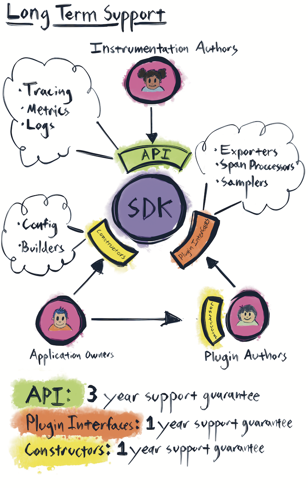

# Versioning and stability for OpenTelemetry clients
<!-- Re-generate TOC with `markdown-toc --no-first-h1 -i` -->

<!-- toc -->

- [Design goals](#design-goals)
- [Signal lifecycle](#signal-lifecycle)
  * [Lifecycle stages](#lifecycle-stages)
  * [Stability](#stability)
  * [Deprecation](#deprecation)
  * [Removal](#removal)
  * [A note on replacing signals](#a-note-on-replacing-signals)
- [Version numbers](#version-numbers)
  * [Major version bump](#major-version-bump)
  * [Minor version bump](#minor-version-bump)
  * [Patch version bump](#patch-version-bump)
- [Long Term Support](#long-term-support)
  * [API support](#api-support)
  * [SDK Support](#sdk-support)
  * [Contrib Support](#contrib-support)
- [OpenTelemetry GA](#opentelemetry-ga)

<!-- tocstop -->

This document defines the stability guarantees offered by the OpenTelemetry clients, along with the rules and procedures for meeting those guarantees.

In this document, the terms "OpenTelemetry" and "language implementations" both specifically refer to the OpenTelemetry clients. These terms do not refer to the specification or the Collector in this document.

Each language implementation MUST take these versioning and stability requirements, and produce a language-specific document which details how these requirements will be met. This document SHALL be placed in the root of each repo and named `VERSIONING.MD`.

## Design goals

Versioning and stability procedures are designed to meet the following goals.

**Ensure that application owners stay up to date with the latest release of the SDK.**
We want all users to stay up to date with the latest version of OpenTelemetry. We do not want to create hard breaks in support, of any kind, which leave users stranded on older versions. It must always be possible to upgrade to the latest minor version of OpenTelemetry, without creating compilation or runtime errors.

**Never create a dependency conflict between packages which rely on different versions of OpenTelemetry. Avoid breaking all stable public APIs.**
Backwards compatibility is a strict requirement. Instrumentation APIs cannot create a version conflict, ever. Otherwise, OpenTelemetry cannot be embedded in widely shared libraries, such as web frameworks. Code written against older versions of the API must work with all newer versions of the API. Transitive dependencies of the API cannot create a version conflict. The OpenTelemetry API cannot depend on "foo" if there is any chance that any library or application may require a different, incompatible version of "foo." A library using OpenTelemetry should never become incompatible with other libraries due to a version conflict in one of OpenTelemetry's dependencies. Theoretically, APIs can be deprecated and eventually removed, but this is a process measured in years and we have no plans to do so.

**Allow for multiple levels of package stability within the same release.**
Provide maintainers a clear process for developing new, experimental APIs alongside stable APIs. DIfferent packages within the same release may have different levels of stability. This means that an implementation wishing to release stable tracing today must ensure that experimental metrics are factored out in such a way that breaking changes to metrics API do not destabilize the trace API packages.

## Signal lifecycle

OpenTelemetry is structured around signals. Each signal represents a coherent, stand-alone set of functionality. Each signal follows a lifecycle.

### Lifecycle stages

**Experimental –** Breaking changes and performance issues MAY occur. Components may not be feature-complete. The experiment MAY be discarded and removed.

**Stable –** Stability guarantees, as defined by component type below, MUST now apply to all changes within this signal. Long-term dependencies MAY now be taken against this signal.

**Deprecated –** this signal has been replaced, but MUST maintain the same stability guarantees.

**Removed -** a deprecated signal is no longer supported, and MUST be removed from the release.

All signal components MAY become stable together, or MAY transition to stability component-by-component in the following order: API, Semantic Conventions, API Contrib, SDK, SDK Contrib.

When transitioning from experimental to stable to deprecated, signals MUST NOT move or otherwise break how they are imported by users. Terms which denote stability, such as "experimental," MUST NOT be used as part of a directory or import name.

Package **version numbers** MAY include a suffix, such as -alpha, -beta, -rc, or -experimental, to differentiate stable and experimental packages.

### Stability

Once a signal component is marked as stable, the following rules MUST apply until the end of that signal’s existence.

**API Stability -**
Backward-incompatible changes to API packages MUST NOT be made unless the major version number is incremented. All existing API calls MUST continue to compile and function against all future minor versions of the same major version.

Languages which ship binary artifacts SHOULD offer ABI compatibility for the API.

**SDK Stability -**
Public portions of SDK packages MUST remain backwards compatible. There are two categories of public features: **plugin interfaces** and **constructors**. Examples of plugins include the SpanProcessor, Exporter, and Sampler interfaces. Examples of constructors include configuration objects, environment variables, and SDK builders.

Languages which ship binary artifacts SHOULD offer ABI compatibility for public portions of the SDK.

**Semantic Conventions Stability -**
Semantic Conventions MUST NOT be removed once they are stable. New conventions MAY be added to replace usage of older conventions, but the older conventions MUST NOT be removed. Older conventions MUST be marked as deprecated when they are replaced by newer conventions.

**Contrib Stability -**
Plugins and instrumentation MUST be kept up to date, and MUST released simultaneously (or shortly after) the latest release of the API. The goal is to ensure users can update to the latest version of OpenTelemetry, and not be held back by the plugins that they depend on.

Public portions of contrib packages (constructors, configuration, interfaces) MUST remain backwards compatible.

Languages which ship binary artifacts SHOULD offer ABI compatibility for public portions of contrib packages.

Telemetry produced by contrib instrumentation MUST remain stable and backwards compatible, to avoid breaking alerts and dashboards. Existing telemetry MUST NOT be mutated or removed without a major version bump. Additional telemetry MAY be added. This includes additional spans, metrics, resources, attributes, events, and any other data types that OpenTelemetry emits.

**Exception:** Contrib packages MAY break stability when a required downstream dependency breaks stability. For example, a database integration may break stability if the required database client breaks stability. However, it is strongly RECOMMENDED that older contrib packages remain stable. A new, incompatible version of an integration SHOULD be released as separate contrib package, rather than break the existing contrib package.

### Deprecation

Signals MAY eventually be replaced. When this happens, they are marked as deprecated.

Signals SHALL only be marked as deprecated when the replacement becomes stable. Deprecated code MUST abide by the same support guarantees as stable code.

### Removal

Support is ended by the removal of a signal from the release. The release MUST make a major version bump when this happens.

### A note on replacing signals

Note that we currently have no plans for creating a major version of OpenTelemetry past v1.0.

For clarity, it is still possible to create new, backwards incompatible versions of existing signals without actually moving to v2.0 and breaking support.

For example, imagine we develop a new, better tracing API - let's call it AwesomeTrace. We will never mutate the current tracing API into AwesomeTrace. Instead, AwesomeTrace would be added as an entirely new signal which coexists and interoperates with the current tracing signal. This would make adding AwesomeTrace a minor version bump, *not* v2.0. v2.0 would mark the end of support for current tracing, not the addition of AwesomeTrace. And we don't want to ever end that support, if we can help it.

This is not actually a theoretical example. OpenTelemetry already supports two tracing APIs: OpenTelemetry and OpenTracing. We invented a new tracing API, but continue to support the old one.

## Version numbers

OpenTelemetry follows [semver 2.0](https://semver.org/) conventions, with the following distinctions.

OpenTelemetry clients have four components: API, SDK, Semantic Conventions, and Contrib.

For the purposes of versioning, all code within a component MUST treated as if it were part of a single package, and versioned with the same version number, except for Contrib, which may be a collection of packages versioned separately.

* API packages for all signals MUST version together, across all signals. Signals MUST NOT have separate version numbers. There is one version number that applies to all signals that are included in the API release that is labeled with that particular version number.
* SDK packages for all signals MUST version together, across all signals. Signals MUST NOT have separate version numbers. There is one version number that applies to all signals that are included in the SDK release that is labeled with that particular version number.
* Semantic Conventions are a single package with a single version number.
* Each contrib package MAY have it's own version number.
* The API, SDK, Semantic Conventions, and contrib components are NOT REQUIRED to share a version number. For example, the latest version of `opentelemetry-python-api` may be at v1.2.3, while the latest version of `opentelemetry-python-sdk` may be at v2.3.1.
* Different language implementations are NOT REQUIRED to have matching version numbers. For example, it is fine to have `opentelemetry-python-api` at v1.2.8 when `opentelemetry-java-api` is at v1.3.2.
* Language implementations are NOT REQUIRED to match the version of the specification they implement. For example, it is fine for v1.8.2 of `opentelemetry-python-api` to implement v1.1.1 of the specification.

**Exception:** in some languages, package managers may react poorly to experimental packages having a version higher than 0.X. In these cases, experimental signals MAY version independently from stable signals, in order to retain a 0.X version number. When a signal becomes stable, the version MUST be bumped to match the other stable signals in the release.

### Major version bump

Major version bumps MUST only occur when there is a breaking change to a stable interface, or the removal of a deprecated signal. Major version bumps MUST NOT occur for any other reason.

### Minor version bump

Most changes to OpenTelemetry result in a minor version bump.

* New backward-compatible functionality added to any component.
* Breaking changes to internal SDK components.
* Breaking changes to experimental signals.
* New experimental signals are added.
* Experimental signals become stable.
* Stable signals are deprecated.

### Patch version bump

Patch versions make no changes which would require recompilation or potentially break application code. The following are examples of patch fixes.

* Bug fixes which don't require minor version bump per rules above.
* Security fixes.
* Documentation.

Currently, OpenTelemetry does NOT have plans to backport bug and security fixes to prior minor versions. Security and bug fixes MAY only applied to the latest minor version. We are committed to making it feasible for end users to stay up to date with the latest version of OpenTelemetry.

## Long Term Support

### API support

Major versions of the API MUST be supported for a minimum of **three years** after the release of the next major API version. API support is defined as follows.

API stability, as defined above, MUST be maintained.

A version of the SDK which supports the latest minor version of the last major version of the API will continue to be maintained during LTS. Bug and security fixes MUST be backported. Additional feature development is NOT RECOMMENDED.

Contrib packages available when the API is versioned MUST continue to be maintained for the duration of LTS. Bug and security fixes will be backported. Additional feature development is NOT RECOMMENDED.

### SDK Support

SDK stability, as defined above, will be maintained for a minimum of **one year** after the release of the next major SDK version.

### Contrib Support

Contrib stability, as defined above, will be maintained for a minimum of **one year** after after the release of the next major version of a contrib package.

## OpenTelemetry GA

The term “OpenTelemetry GA” refers to the point at which OpenTracing and OpenCensus will be fully deprecated. The **minimum requirements** for declaring GA are as followed.

* A stable version of both tracing and metrics MUST be released in at least four languages.
* CI/CD, performance, and integration tests MUST be implemented for these languages.
